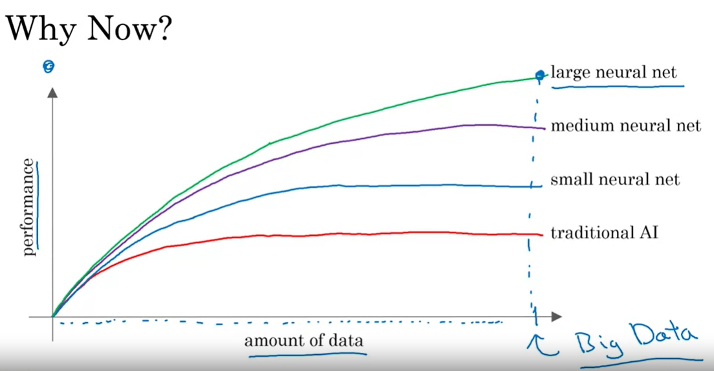

<h1 style="color: #ccc">AI for Everyone</h1>

# What is AI?

*Aug 26, 2023*

## Introduction

1. Demystifying AI

   * Artificial narrow intelligence (ANI)
   * Artificial general intelligence (AGI)

   There is a lot of excitement, but also a significant amount of unnecessary hype about AI. One of the reasons for this is that AI comprises two distinct ideas. Almost all the progress we witness in AI today is in the realm of **artificial narrow intelligence (ANI)**. These are AIs that perform specific tasks, such as self-driving cars, web searches, and AI applications in farming and factories. AI also refers to a second concept: **artificial general intelligence (AGI)**. This concept aims to build AI that can perform any task a human can do or even achieve superintelligence, surpassing human capabilities.

   There is substantial progress in ANI, but almost no progress in AGI. Both of these are worthy goals, and unfortunately, the rapid progress in ANI, which is incredibly valuable, has caused most people to conclude that there is a lot of progress in AI, which is true. However, it has also led people to falsely believe that there might be a lot of progress in AGI as well. This misconception is leading to irrational fears about evil, clever robots coming to take over humanity anytime soon.

2. What is AI?

   * Machine learning
   * Data
   * What makes an AI company
   * What machine learning can and cannot do
   * Intuitive explanation of deep learning

## Machine Learning

1. Supervised learning

   $$
   \underset{\text{input}}{A} \longrightarrow \underset{\text{output}}{B}
   $$

   The rise of AI has been largely driven by a key component within AI known as **machine learning**. The most common type of machine learning is the one that learns from $A$ to $B$, which is called **supervised learning**.

   Some examples:

   | Input (A)         | Output (B)             | Application         |
   |:------------------|:-----------------------|:--------------------|
   | email             | spam? (0/1)            | spam filtering      |
   | audio             | text transcript        | speech recognition  |
   | English           | Chinese                | machine translation |
   | ad, user info     | click? (0/1)           | online advertising  |
   | image, radar info | position of other cars | self-driving car    |
   | image of phone    | defeat? (0/1)          | visual inspection   |

2. Why now?

   > 

   In many industries, the amount of data to which you have access has grown significantly over the last couple of decades. Thanks to the internet and the proliferation of computers, much of what used to be on pieces of paper is now digitally recorded. Consequently, we have been accumulating an increasing volume of data.

   The performance of traditional AI systems improves as more data is fed into them, but it plateaus at a certain point. Beyond this point, providing more data does not lead to significant improvements. This stagnation observed in traditional AI systems can be overcome by utilising neural networks. Furthermore, increasing the size of the neural network can push the performance limit to even higher levels. As a result, the recent advent of faster computers and specialised processors such as GPUs has enabled many companies to train large neural networks on a large amount of data, yielding excellent performance.

   A key takeway from the figure above is that achieving optimal performance requires two main factors: big data and a large neural network.
