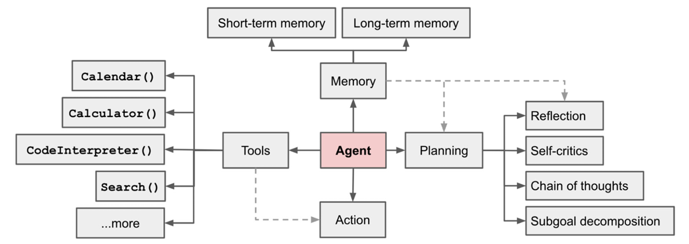

<h1 style="color: #ccc">Intelligent Reasoning System</h1>

# Large Language Models (LLMs)

    Type
    Course

    Instructor
    Fan Zhenzhen

    Institution
    NUS-ISS

    Note Updated
    2025-06-11

## Transformer Architecture

1.  Self-Attention 
    Mechanism that allows the model to weigh different words in a sequence based on their contextual importance.
2.  Architecture 
    Multiple decoder blocks with masked self-attention and feed-forward layers.
3.  Decoder-only models (e.g., GPT) 
    Trained to predict the next word using left-to-right context only (causal masking).

## Pretrained LLMs

1.  Examples: Claude 4, Gemini 2.5 Pro, GPT-4o
2.  Capabilities
    -   Language understanding and generation
    -   Text summarisation
    -   Machine translation
    -   Question answering (QA)
    -   Code generation

## Roles of LLMs in Cognitive Systems

1.  **NLU**: Interprets user input, identifying intent and extracting entities.
2.  **NLG**: Generates fluent, context-aware responses.
3.  **QA**: Answers questions based on context, supporting interactive reasoning.
4.  **RAG**: Combines external knowledge with generation for accurate, up-to-date answers.
5.  **Reasoning**: Performs multi-step logical inference, problem-solving and decision-making (e.g., Chain-of-Thought prompting).

## LLM-Powered Conversational AI

Conversational AI built on LLMs enables sustained, intelligent dialogue through two key capabilities: **memory** and **retrieval**.

## Memory

To maintain coherent conversations, the AI retains recent dialogue history within a limited context window.

Messages are tagged by role:

1.  **System**: instructions
2.  **User**: input
3.  **Assistant**: response

Typical memory strategies:

1.  Return the last $k$ messages
2.  Summarise recent exchanges
3.  Extract key information from history

## Retrieval-Augmented Generation (RAG)

Augments the LLM with an external retrieval mechanism to fetch relevant content before answering:

1.  **Document Preparation** 
    Splits documents into passages, vectorises them into embeddings, and stores in a vector database.
2.  **Query-Time Retrieval** 
    Given a user question, retrieves top-$k$ document splits with similar embeddings.
3.  **Answer Generation** 
    Feeds both the retrieved content and the user question to the LLM for answer generation.

## Zero-Shot Dense Retrieval

Semantic retrieval technique that uses embedding similarity (dense retrieval) to find relevant documents, even without labelled data (zero-shot).

1.  **Dense Retrieval** 
    Retrieves relevant content by comparing dense embeddings rather than keyword matches.
2.  **Fine-Tuning Option** 
    Performance can be improved by fine-tuning embeddings models on relevance-labelled data (e.g., with SentenceTransformer).
3.  **Zero-Shot Scenario** 
    Required when no relevance-labelled training data is available.

## Hypothetical Document Embeddings (HyDE)

**Motivation**

Improves zero-shot dense retrieval by generating hypothetical answer to the query before retrieving the relevant real content.

**Methodology**

1.  **Instruction + Query to LLM** 
    Generate a **hypothetical document** by prompting the LLM to "*write a passage that answers the question*".
2.  **Embedding Conversion** 
    Convert the generated text to an embedding vector.
3.  **Semantic Search** 
    Use this embedding to retrieve real documents from the vector database based on similarity.

**Strength**

1.  Leverages generative power of LLMs (e.g., GPT) to form semantically meaningful query proxies.
2.  Removes the need for direct query-document matching.
3.  Works in multilingual settings or scientific domains.

**Illustration**

1.  Query → "*How long does it take to remove wisdom tooth?*"
2.  Generated → "*It usually takes between between 30 minutes and two hours...*"
3.  Retrieved → "*Some removals take a few minutes, others over 20 minutes...*"

## Natural Language Interface (NLI) for Tools

**Concept**

LLMs can serve as **natural language interfaces (NLI)** to *invoke* and *orchestrate* **external tools**, such as:

1.  APIs
2.  Functions
3.  Databases

This transforms user questions into executable tool calls, producing actionable outputs.

**Workflow**

1.  **User Question** 
    Natural language input from user.
2.  **LLM** 
    Interprets the question and determines intent.
3.  **Parser** 
    Converts the LLM output into structured format (e.g., function all syntax, API query, database query).
4.  **Tool Execution** 
    Performs the requested operation (e.g., search, calculation, API request).
5.  **Observation** 
    Retrieves and analyses tool outputs.
6.  **Loop (if needed)** 
    LLM may revise the query and chain tool calls until it reaches a final response.
7.  **Output** 
    Final natural language response returned to user.

**Framework**

**LangChain** is a popular framework to implement this architecture by chaining LLM reasoning with tool use.

## LLM-Powered Autonomous Agents

>   

LLMs act as the **general problem solver**&mdash;the cognitive "brain" of autonomous agents. These agents can operate independently by leveraging:

1.  **Planning & Reasoning**

    -   Decompose goals into subgoals.
    -   Self-prompt, reflect, and self-criticise to refine steps.
    -   Support iteractive task execution with improvement loops.

2.  **Memory**

    -   **Short-Term** 
        Retains recent context for ongoing tasks.
    -   **Long-Term** 
        Stores experiences or facts over time for reuse.

3.  **Tool Use**

    -   Calls external APIs or functions.

4.  Example

    -   AutoGPT as a reference implementation.

## Challenges of LLM-Powered Applications

1.  **Data Privacy and Security**

    -   LLMs are usually **cloud-based**, raising concerns about data leakage, unauthorised access, and compliance (e.g., GDPR).

2.  **Computational Cost**

    -   Requires **expensive hardware**, energy, and infrastructure.
    -   High **API costs** for commercial usage.

3.  **Inference Speed**

    -   LLMs are **large and complex**, making them slow to respond.
    -   Causes **latency** in real-time systems, worsened by **network delays** for cloud-based models.

4.  **Bias and Fairness**

    -   LLMs can inherit and **amplify biases** from their training data.
    -   May lead to **unfair or discriminatory outputs**.

5.  **Hallucination**

    -   LLMs may generate **plausible-sounding but incorrect information**, especially without grounding in facts.

6.  **Security Risks**

    -   **Malicious use**: Generating harmful, toxic, or misleading content.
    -   Susceptibility to **prompt injection** or **adversarial attacks**.

7.  **Other Concerns**

    -   Interpretability, regulation, environment impact, etc.
