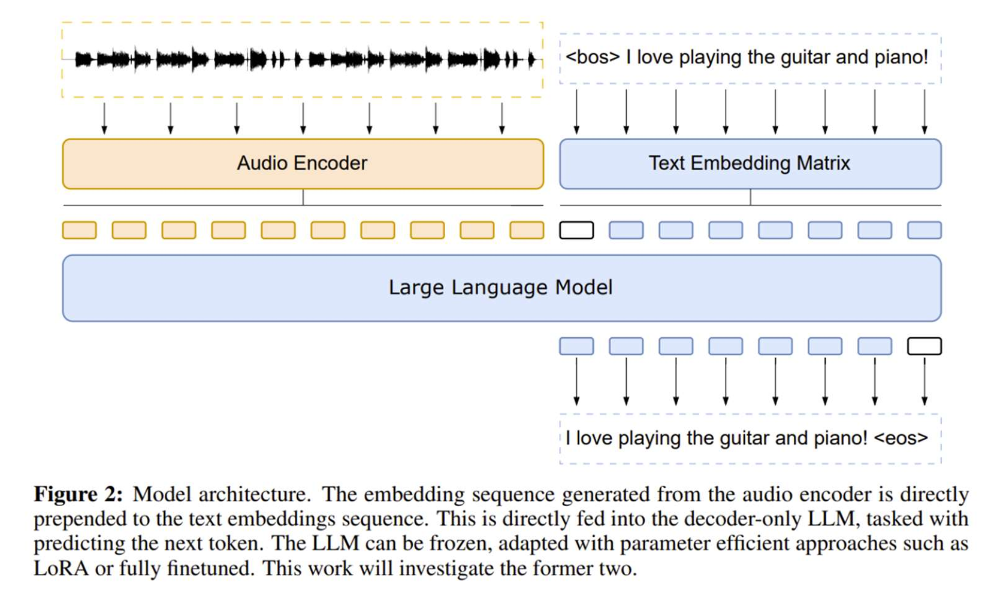

<h1 style="color: #ccc">Intelligent Reasoning System</h1>

# Audio Cognition

    Type
    Course

    Instructor
    Gary Leung

    Institution
    NUS-ISS

    Note Updated
    2025-07-25

## Learning Outcomes

By the end of this course, you will be able to:

1.  Explain how machines perceive, understand, and interpret auditory inputs such as *sound*, *speech*, and *music*.
2.  Describe the fundamental concepts of **audio signal processing**.
3.  Evaluate the performance of state-of-the-art models, including **audio foundation models**, in audio cognition tasks.

## Audio, Speech, and Music

1.  **Audio** 
    Vibrations that travel through a medium and are perceived by the ear. Includes speech, music, sound effects, and ambient noise.
2.  **Speech** 
    Vocal communication using vocal cords to produce meaningful sounds. Used for information exchange, emotional expression, and social interaction.
3.  **Music** 
    Artistic expression through organised sounds and rhythms.
    -   **Elements**: melody, harmony, rhythm, instrumentation, vocals, lyrics, arrangement.
    -   **Purpose**: aethetic enjoyment and emotional impact.

## Audio Applications

Machines can interpret and respond to auditory inputs in various real-world applications, including:

1.  **Voice Assistants and Smart Speakers**
    -   Used for hand-free queries, reminders, smart home control, and more.
    -   Examples: Amazon Alexa, Google Assistant, Apple Siri, Microsoft Cortana.
2.  **Interactive Voice Response (IVR) Systems**
    -   Deployed in customer service phone lines for banks, airlines, and utility providers.
    -   Allow automated call routing and self-service interactions via voice commands.
3.  **Voice Command Systems in Vehicles**
    -   Enable drivers to control GPS, music, and calls without taking hands off the wheel.
4.  **Voice-Activated Home Automation**
    -   Controls lighting, thermostats, appliances, and security systems using spoken commands.
5.  **Language Learning Apps**
    -   Provide interactive speaking and listening practice for learners.
    -   Offer pronouncation feedback and conversational simulations.
6.  **Speech Therapy Tools**
    -   Assist individuals with speech impairments through guided exercises and feedback.
    -   Used in clinical and at-home rehabilitation.

## Audio Signal Processing

### Sampling Rate

What is Sampling?

1.  **Analog audio** is a continuous waveform.
2.  **Sampling** converts this analog signal into a digital one by measuring it at regular time intervals.
3.  Each measurement is called a **sample**.
4.  The **sampling rate** is how many samples are taken per second (measured in **Hz**).

>   

Human Auditory Range

1.  The human ear typically hears frequencies from **50 Hz to 15 kHz**.
2.  To capture all these frequencies, a sufficiently high sampling rate is needed.

Nyquist Theorem

1.  To accurately reconstruct a signal, the sampling rate should be **at least twice the highest frequency** in the signal.
2.  For speech (~ 15 kHz max), at least **30 kHz** is required.

Common Sampling Rates

| Use Case | Sampling Rate |
|:---|:---|
| Telephone-grade audio | 8 kHz |
| Mobile/PC voice communication | 16 kHz |
| CD-quality audio | 44.1 kHz |

### Audio Coding

Quantisation

1.  Continuous signal levels are **quantised to discrete values**.
2.  Each sample is represented as a fixed-point number in computer. Example: 16-bit representation ranges from $-32,767$ to $32,767$.

Encoding Format

1.  **Linear Coding**
    -   **Pulse-Code Modulation (PCM)** is the basic method for digitally representing audio signals.
    -   16-bit PCM is widely used in **speech processing**.
2.  **Non-linear Coding**
    -   **A-law** (Europe) and **μ-law (mu-law)** (US and Japan) use only 256 levels with 8-bit encoding.
    -   Logarithmic encoding (A-law/μ-law) allocates more resolution to quieter sounds, where human hearing is more sensitive. Despite using fewer bits, non-linear coding preserves quality&mdash;making it efficient for bandwidth-limited systems like traditional telephony.

### File Formats

Popular Formats

1.  **WAV**: PCM-based, uncompressed, lossless. Developed by Microsoft and IBM.
2.  **MP3**: Lossy compression format.
3.  **FLAC**: Free Lossless Audio Codec, widely supported.
4.  **OGG**: Free multimedia container format, supports various codecs.

Speech Processing

1.  Usually uses *non-compressed PCM* format for audio input.
2.  Speech recognition models are often tailored for *specific sampling rates*.

### Spectrogram

To better understand how audio signals vary over time and frequency, we use **spectrograms**, which transform 1D waveforms into 2D representations.

1.  **Waveform** (1D): Represents amplitude over time.
2.  **Spectrogram** (2D): Represents how frequencies evolve over time.
    -   **X-axis** → Time
    -   **Y-axis** → Frequency
    -   **Colour Intensity** → Amplitude/Energy (e.g., yellow = strong signal, purple = weak signal)

The spectrogram shows which frequencies are active at each time slice and how strong they are.

## Speech and Audio Systems

**Evolution of Speech Recognition Systems**

| Era | Method | Characteristics |
|:---|:---|:---|
| Since 1952 | Pattern Matching | - Early systems for isolated word recognition - Uses templates and distance metrics |
| Since 1980 | HMM Models (GMM-HMM) | - Statistical modelling of speech sequences - Suitable for **continuous speech** - **Accuracy limited** by hand-crafted features |
| Since 2009 | Deep Learning (DNN-HMM) | - Replaces GMMs with DNNs for acoustic modelling - Improves robustness on **natural speech** - Language models were still largely n-gram-based, not LLMs |
| Since 2017 | End-to-End ASR | - Replaces pipeline with **unified neural architecture** (e.g., encoder-decoder, CTC loss function) - Requires **large speech datasets** - Better generalisation and latency

**Challenges in Automatic Speech Recognition (ASR)**

Common challenges affecting ASR accuracy:

1.  **Device and Channel Mismatch** 
    Different microphones and hardware cause signal variations.
2.  **Background Noise** 
    Environmental sounds reduce signal clarity.
3.  **Speaker Differences** 
    Variations in pitch, pace, gender, and style.
4.  **Similar Pronunciations** 
    Hard to disambiguate based on audio alone. E.g., "write" vs "right".
5.  **Accent and Dialect Variation** 
    Regional and cultural pronunciation differences.
6.  **Pronunciation Variation in Continuous Speech** 
    Words blend together; less clear articulation.
7.  **Prosody Differences** 
    Intonation, rhythm, and stress patterns impact recognition.
8.  **Homographs (Multiple Pronunciations)** 
    Words like "read":
    -   Present: /riːd/ (reed)
    -   Past: /rɛd/ (red)

Also consider challenges like reverberation, overlapping speech, and [spontaneous vs. read speech](https://languagelog.ldc.upenn.edu/nll/?p=60956).

**Evolution of Text-to-Speech (TTS) Systems**

| Era | Method | Description |
|:---|:---|:---|
| Since 1970s | Early Methods | - Based on **formant synthesis** and **PSOLA** - Fully rule-based and robotic sounding |
| Since 1990s | Concatenation Methods | - **Unit selection** from pre-recorded speech - Higher naturalness, less flexible |
| Since 2000 | HHM-Based Methods | - Models speech parameters using **HMMs** - Combines with **vocoder** for waveform generation |
| Since 2012 | Deep Learning | - Uses **DNNs** to model acoustic features - Improves prosody and expressiveness |
| Since 2017 | End-to-End Models | - Fully neural systems (e.g., Tacotron, WaveNet) - Learns mapping from text to waveform directly - High quality, human-like speech |

## Paradigm Shift

A paradigm shift in AI and audio development, transitioning through:

1.  **Machine Learning**
    -   Focus: "*how*" (methods)
    -   Emphasis: learning algorithms
    -   Trend: homogenisation of learning techniques
2.  **Deep Learning**
    -   Focus: features
    -   Emphasis: architectures
3.  **Foundational Models**
    -   Focus: functionalities
    -   Emphasis: models

## Audio Foundation Models

Foundation models, trained on large-scale **multimodal** data such as text, images, and speech, are adapted for specific tasks, transforming general-purpose models into specialised systems. With transformer-based architectures, these models have significantly advanced speech recognition by learning rich audio representations. These models scale up to billions of parameters and support tasks such as **automatic speech recognition (ASR)**, **speaker identification**, and **emotion detection**.

Source: Bommasani et al. (2021), *On the Opportunities and Risks of Foundation Models*

Categories of Tasks

1.  **Discriminative Tasks** 
    Make discrete decisions on continuous speech input (e.g., classification).
2.  **Generative Tasks** 
    Generate continuous speech from input sources (e.g., text-to-speech, music generation).

Examples

1.  **Speech Foundation Models**: Whisper, Wav2Vec 2.0
2.  **Audio/Music Generative Models**: AudioGen, AudioLDM2, MusicGen

Multi-Task Capability

1.  Supports different tasks using a single model.
2.  Supports multiple spoken languages.

Multimodality

1.  Mirrors human perception across senses.
2.  Enables more user-friendly and flexible interfaces.
3.  Facilitates comprehensive problem-solving through multi-modal inputs.

### Whisper Model

1.  Trained on 680k hours of multilingual and multitask supervised data.
2.  Supports three key tasks:
    -   Speech Recognition
    -   Speech Translation
    -   Language Recognition
3.  Model variants with parameter sizes: 39M, 74M, 244M, 769M, 1550M.

Architecture

1.  **Encoder-Decoder** structure with *positional encodings* and *cross-attention*.
2.  Input: **Log-Mel Spectrogram**.
3.  Uses multitask token formatting (e.g., SOT, language tag, transcription).

Processing Flow

1.  Language identification
2.  Trascribe or translate speech
3.  Output:
    -   Text-only transcription or
    -   Time-aligned transcript with token timestamps

### Wav2Vec 2.0

**Wav2Vec 2.0** is a state-of-the-art framework developed by Facebook AI for learning speech representations from raw waveforms using **self-supervised learning (SSL)**. It reduces reliance on large labelled datasets and enables effective training for **low-resource languages** (languages with scarce digital/audio data).

**Architecture and Training**

Wav2Vec 2.0 operates in two stages:

1.  **Pretraining** (Unsupervised)
    >   
    -   Uses *unlabelled* audio to train an **upstream model**.
    -   A **CNN encoder** transforms the raw waveform into **latent speech representations** ($Z$).
    -   Certain time steps in $Z$ are randomly **masked**.
    -   A **transformer** processes the full sequence, outputting **contextual representations** ($C$).
    -   The masked latent vectors are **quantised online** to form discrete targets ($q$).
    -   The model is trained to maximise similarity between $C$ and $q$ using **contrastive loss**.
2.  **Fine-tuning** (Supervised)
    -   The pretrained model is either:
        -   Frozen and used to extract features, or
        -   Fine-tuned with labelled data for **downstream tasks** such as:
            -   **ASR** (e.g., speech-to-text)
            -   **SID** (speaker identification)

**Strengths**

Achieves strong performance even with *limited labelled data*.

Demonstrated **Word Error Rate (WER)** results:

| Labelled Data | WER (Clean / Other) |
|:---|:---|
| 960 hours | 1.8% / 3.3% |
| 100 hours | 2.0% / 4.0% |
| 10 minutes | 4.8% / 8.2% |

This level of performance with just *10 minutes of labelled data* is typically only achieved with thousands of hours using traditional models.

**Summary**

1.  **Self-supervised learning** enables efficient use of *unlabelled data*.

2.  Supports **multilingual** and **low-resource languages**.

    After pretraining, only a small amount of labelled data (even as little as 10 minutes) is needed to adapt to a specific language. It learns **universal phonetic features** (shared representations) that generalise across languages, especially useful for languages with limited resources.

3.  Combines a **CNN** for acoustic encoding with a **transformer** for contextual reasoning.

4.  Used in **modern ASR pipelines**, and compatible with **foundational audio models** such as Whisper.

### Sample Representations and Applications

Many modern speech representations are generated via **self-supervised learning** and used across a wide range of downstream applications. A unified interface allows these upstream models to be applied easily to different tasks.

Source: https://github.com/s3prl/s3prl

### ChatGPT

OpenAI's ChatGPT has integrated **voice and image capabilities**, allowing natural voice conversations.

Key Technologies

1.  **Text-to-Speech (TTS)**: New model generates human-like speech from just text and a few seconds of sample speech.
2.  **Voice Acting**: Professional voice actors were used to provide natural samples.
3.  **Speech-to-Text (ASR)**: Powered by **Whisper**, OpenAI's open-source ASR system.

### LLMs with Speech Recognition Capabilities

**How it Works**

LLMs can be converted into ASR systems by prepending **audio embeddings** to the input text **token embeddings**, enabling them to process and generate output directly from auditory inputs.

**What is the Performance?**

Adding a **conformer encoder** to the LLaMA-7B allows it to outperform monolingual baselines by 18% and perform multilingual speech recognition despite LLaMA being only on English.

**Architecture Details**

Raw audio is first converted into filterbank features, which are then passed through a CNN followed by a conformer encoder. The encoder outputs are projected to match the LLM's embeddings dimensions, and embeddings are stacked (e.g., 3x stacking results in one embedding every 240 milliseconds).

>   

The output from the audio encoder is prepended to the text token embeddings, and the entire sequence is fed into a frozen or LoRA-adapted decoder-only LLM. This setup enables joint audio-text processing for speech-to-text tasks.

>   

Source: Yassir Fathullah et al., *Prompting Large Language Models with Speech Recognition Abilities*

### SALMONN

SALMONN (Speech Audio Language Music Open Neural Network) is a multimodal model designed for understanding and generating language grounded in speech, audio, and music inputs. It combines the Whisper speech encoder, the BEATs audio and music encoder, and a Q-Former module that fuses auditory features. The model then leverages a large language model (LLM) with LoRA adaptation to generate text responses based on prompts that may include audio, music, or language inputs.

>   

Source: https://github.com/bytedance/SALMONN

### Audio and Music Generative Models

**AudioGen**

1.  Supports text-to-audio generation.
2.  Trained on 4000 hours of 16 kHz audio data.
3.  Source: https://felixkreuk.github.io/audiogen/

**AudioLDM2**

1.  Supports text-to-audio, text-to-speech, and image-to-audio.
2.  Source: https://audioldm.github.io/audioldm2/

**MusicGen**

1.  State-of-the-art controllable text-to-music model.
2.  Source: https://ai.honu.io/papers/musicgen/

**MAGNeT**

1.  State-of-the-art non-autoregressive model for text-to-music and text-to-sound.
2.  Source: https://pages.cs.huji.ac.il/adiyoss-lab/MAGNeT/

**AudioCraft**

1.  PyTorch library to use AudioGen, MusicGen, and MAGNeT.
2.  Source: https://github.com/facebookresearch/audiocraft
