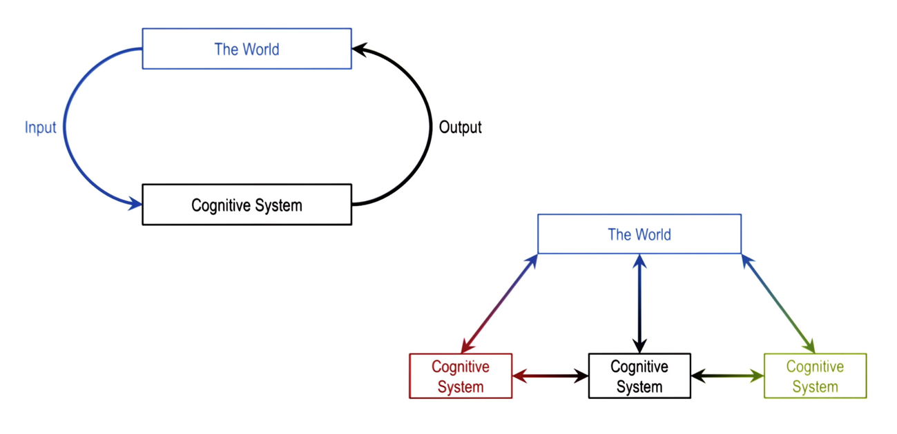
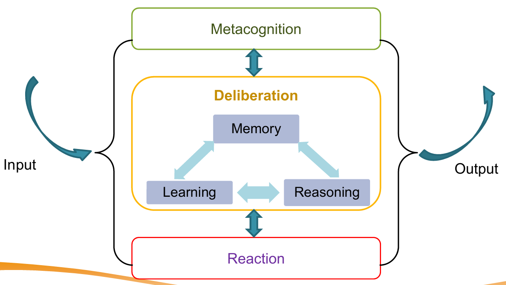
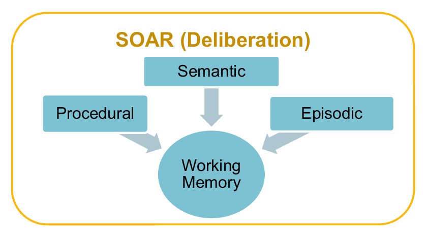
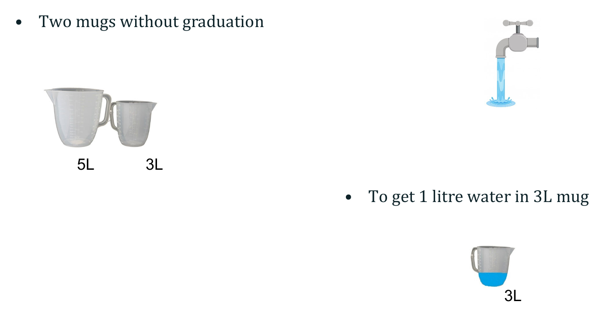
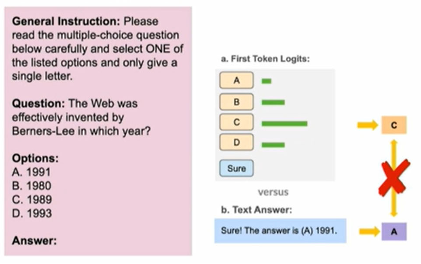

<h1 style="color: #ccc">Intelligent Reasoning System</h1>

# Knowledge Representation and Reasoning

    Type
    Course

    Instructor
    Wang Aobo

    Institution
    NUS-ISS

    Note Updated
    2025-08-22

## Introduction

Knowledge Representation and Reasoning (KRR) studies how to model information about the world in a way that enables a computer to solve complex tasks like diagnosis, planning, or question answering. The main goals are to represent **facts** and **rules** about a domain and enable systems to **reason** over them to draw conclusions.

## Forms of Knowledge Representation

1.  Logic-Based
    -   Propositional Logic: Statements that are true/false.
    -   First-Order Logic: Adds quantifiers, relations, and variables for richer representation.
2.  Semantic Networks
    -   Nodes = concepts, edges = relationships.
3.  Frames and Ontologies
    -   Structured templates with slots for attributes and relationships.
4.  Production Rules
    -   IF condition THEN action.
5.  Bayesian Networks
    -   Probabilistic representation of uncertain relationships.

## Reasoning Methods

1.  Deductive Reasoning: From general rules to specific facts.
2.  Inductive Reasoning: From specific examples to general rules.
3.  Abductive Reasoning: From observations to best explanations.
4.  Analogical Reasoning: Transfer knowledge from similar past cases (via similarity).
5.  Probabilistic Reasoning: Handling uncertainty with probability theory.

## Symbolic vs. Statistical Approaches

| Symbolic (Knowledge-Driven) | Statistical (Data-Driven) |
|:---|:---|
| Explicit rules & logic | Learnt patterns from data |
| Interpretable reasoning | Black-box decision-making |
| Relies on curated knowledge | Requires large datasets |
| Weak in noisy/ambiguous inputs | Can generalise from examples |

Hybrid systems combine both for better robustness.

## Limitation of Data-Driven Approaches

**Overconfidence in Solving Problems**

Benchmark success ≠ real-world readiness

Example&ndash;Car Navigation

1.  Path planning works in controlled settings.
2.  Minor changes in environment can cause failures.

**Adversarial Vulnerabilities in DNNs**

1.  Stop Sign Attack: Stickers on a stop sign cause misclassification as "Speed limit 45".
2.  Adversarial Apparel: Special T-shirt patterns fool object detectors, mislabelling or missing pedestrians entirely.

**Knowledge Awareness Gap**

1.  Purse statistical systems (e.g., DNNs) lack built-in commonsense or symbolic constraints.
2.  A KRR layer could reject absurd outputs by cross-checking it against known rules, map data, or context (e.g., the car's map says there is a stop sign at the junction, even though DNN interprets it as a speed limit).

**Driverless vs. Careless**

1.  Without safety-critical reasoning checks, "driverless" AI may become "careless" AI.
2.  KRR can add **guardrails** through explicit rules and logical consistency checks.

## Cognitive System Architecture

A **cognitive system** interacts with **The World** by receiving inputs, processing them, and producing outputs that affect the environment.

**Single System Loop**

1.  Input from the world is processed by the cognitive system.
2.  The system's output acts back on the world, closing the loop.

**Multiple Systems**

1.  Several cognitive systems can operate simultaneously, each exchaning information with the world and each other.
2.  Inter-system communication supports cooperation or competition.

### Internal of a Cognitive System

Intelligence can be understood as **selecting the right action** for a given state of the world. A cognitive system typically comprises the following components:

1.  **Metacognition**

    -   Oversees and monitors the system's reasoning processes.
    -   Adjusts strategies based on self-assessment and context.

2.  **Deliberation** &ndash; Core decision-making process integrating:

    -   **Memory**: Stores knowledge for immediate and long-term use.
    -   **Learning**: Acquires or updates knowledge from data and experience.
    -   **Reasoning**: Applies logic and inference to solve problems.
    -   Memory, learning, and reasoning are mutually connected to reinforce each other.

3.  **Reaction**

    -   Handles rapid, reflexive responses without extensive deliberation.

Flow:

1.  Input enters the system and may pass through reaction for fast responses or deliberation for considered actions.
2.  Output is returned to the world, potentially triggering further cycles.

### SOAR Cognitive Architecture

Developed by Newell & Laid (1983&ndash;present), SOAR is a **white box** architecture&mdash;its internal reasoning is explicit and interpretable, often as **graphs of objects and relations**.

Production System Structure

1.  **Working Memory**: Holds the current state and temporary information for ongoing tasks.
2.  **Long-Term Memory**
    -   **Procedural**: Rules and skills for performing actions.
    -   **Episodic**: Records of specific events or experiences (for analogy-based reasoning).
    -   **Semantic**: General facts and knowledge about the world.

In SOAR, **procedural**, **episodic**, and **semantic memories** feed into **working memory** to support **deliberation**, guiding **reasoning** and **learning** for **decision-making**.

## Applying SOAR with LLM Reasoning

The **SOAR cognitive architecture** provides a framework to simulate problem-solving through working memory, long-term memory, and production rules. When paired with large language models (LLMs), SOAR can appear to reason by chaining steps together in natural language form (e.g., Chain-of-Thought prompting).

**Example: The Water Jug Puzzle**

1.  Problem: Measure exactly 1L of water using 5L and 3L mug without graduation.
2.  LLM-Based Approach: The model can generate a plausible step-by-step plan (fill, transfer, empty, etc), mimicking human reasoning.
3.  Mechanism: This is not logical computation but next-token prediction conditioned on training examples and patterns.

**Chain-of-Thought Prompting**

1.  Standard prompting often produces direct but wrong answers.
2.  CoT prompting guides the model to break problems into smaller steps, often improving accuracy (e.g., arithmetic or counting apples).
3.  However, CoT remains **approximate reasoning**, vulnerable to **invalid inference** (e.g., marble-box logic puzzle: coherent steps but unsound conclusions).

**Limitations of LLM Reasoning in SOAR**

1.  Token Prediction ≠ True Reasoning
    -   LLMs generate "the most likely next word".
    -   They retrieve *surface-level correlations*, not guaranteed *deductive closure*.
    -   Example: Copilot retrieves plausible code snippets but does not plan or prove correctness.
2.  Vulnerabilities
    -   **Hijacking CoT (H-CoT)**: Attackers can reuse safe reasoning templates to generate unsafe outputs.
    -   **Hallucinations**: LLMs may fabricate steps that look logical but fail under scrutiny.
3.  Bias and Fragility
    -   Answer-Order Bias: Multiple-choice outputs are skewed towards "A" regardless of semantics.
    -   Extraction Mismatch: First-token logit vs. final text output may not agree.
        >   
    -   Data contamination: Success on tests like Wug Test may reflect memorisation, not generalisation.
4.  Unsound Reasoning
    -   Studies show CoT outputs often lack logical soundness: correct-looking chains may contain invalid inferences.
    -   Accuracy is not the same as valid reasoning (e.g., LLaMA, Mistral, Zephyr benchmarks show large gap between correct answers and sound reasoning).
5.  Approximation not Deduction
    -   Fine-tuning improves retrieval of known patterns, but does not give models the ability to compute new logical consequences.
    -   Thus, LLM reasoning remains brittle outside training distribution.
6.  Multimodal Extensions
    -   Models like Gemini extend reasoning across text, audio, vision, and video.
    -   While powerful, they inherit the same core limitions: prediction without guarenteed logical validity.

**Summary for SOAR with LLM Reasoning**

1.  Strengths
    -   Natural language reasoning simulation.
    -   Useful for exploration, brainstorming, and generating candidate solutions.
2.  Limitations
    -   Prone to bias, hallucination, adversarial hijacking, and unsound reasoning.
    -   Lacks interpretability, formal guarantees, and safety guardrails.
3.  Conclusion: LLM reasoning with SOAR demonstrates plausible reasoning but not reliable reasoning. Without symbolic grounding, LLMs in SOAR risk producing solutions that are fluent yet incorrect.

## Applying SOAR with Symbolic Reasoning

**Example: The Water Jug Problem**

The Water Jug Problem is a classic reasoning task: measure exactly 1 litre using a 5L jug and 3L jug.

**Problem Formalisation**

1.  **Initial State**: `[0, 0]` (both jugs empty).
2.  **Goal State**: `[*, 1]` (3L jug has 1L; 5L jug may contain any amount).
3.  **Operators**: Fill, Empty, or Pour betweeen jugs.
4.  States are expressed symbolically for Soar to manipulate.

**Working Memory**

1.  Stores the *current state* in the form `[x, y]`.
    -   $x$ is the amount in the 5L jug.
    -   $y$ is the amount in the 3L jug.
2.  Each operator applied procedures a new state → constructing *state space*.
3.  Example transitions:
    -   `[0, 0] → Fill(3L) → [0, 3]`
    -   `[0, 0] → Fill(5L) → [5, 0]`
