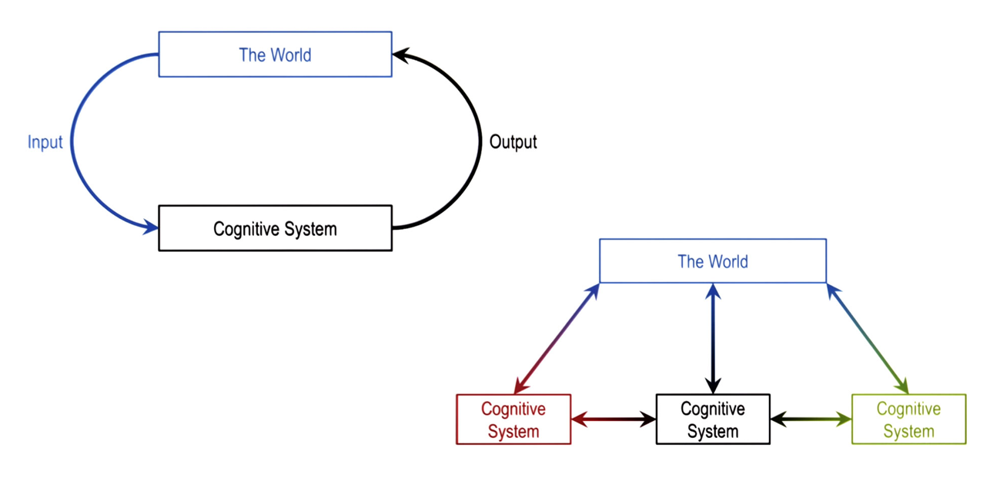
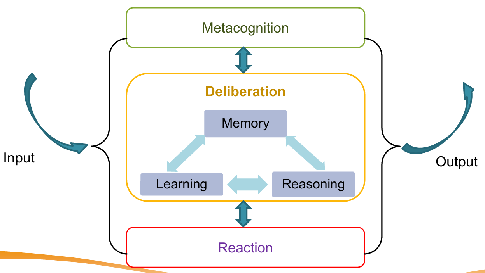
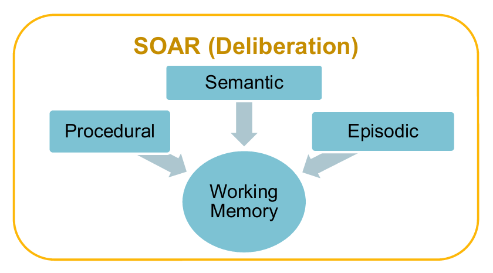
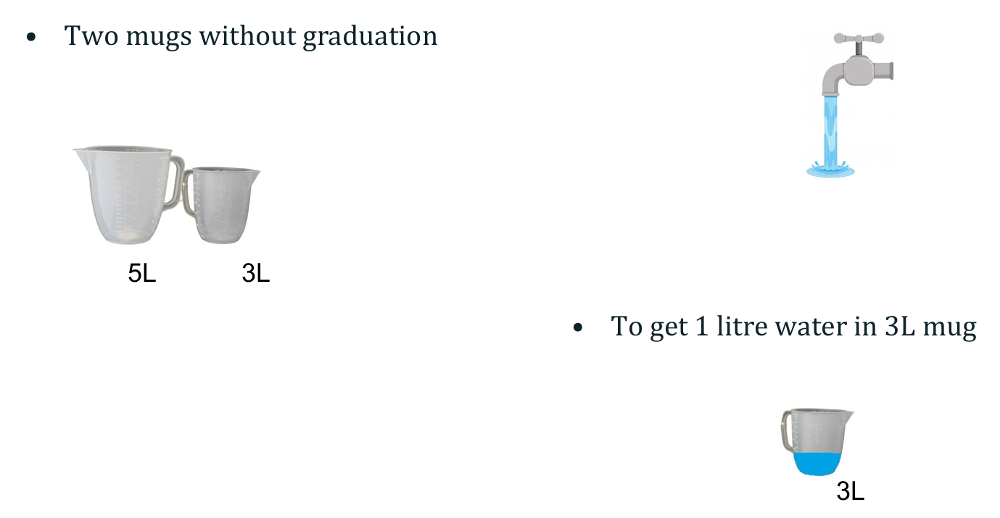
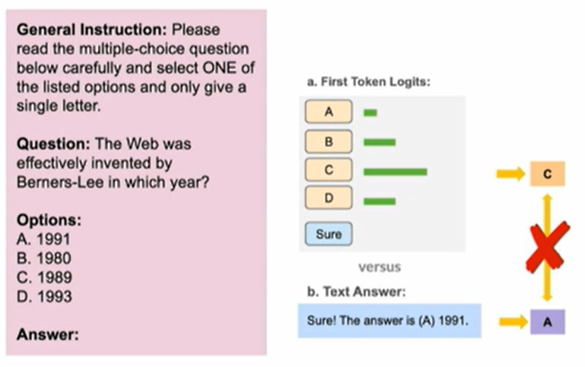

<h1 style="color: #ccc">Intelligent Reasoning System</h1>

# Reasoning in KRR

<div class="badge">
    <span class="key">Type</span>
    <span class="value">Course</span>
</div>
<div class="badge">
    <span class="key">Instructor</span>
    <span class="value">Wang Aobo</span>
</div>
<div class="badge">
    <span class="key">Institution</span>
    <span class="value">NUS-ISS</span>
</div>
<div class="badge">
    <span class="key">Note Updated</span>
    <span class="value">2025-09-04</span>
</div>

## Introduction

Knowledge Representation and Reasoning (KRR) studies how to model information about the world in a way that enables a computer to solve complex tasks like diagnosis, planning, or question answering. The main goals are to represent **facts** and **rules** about a domain and enable systems to **reason** over them to draw conclusions.

**Forms of Knowledge Representation**

1.  Logic-Based
    -   Propositional Logic: Statements that are true/false.
    -   First-Order Logic: Adds quantifiers, relations, and variables for richer representation.
2.  Semantic Networks
    -   Nodes = concepts, edges = relationships.
3.  Frames and Ontologies
    -   Structured templates with slots for attributes and relationships.
4.  Production Rules
    -   IF condition THEN action.
5.  Bayesian Networks
    -   Probabilistic representation of uncertain relationships.

**Reasoning Methods**

1.  Deductive Reasoning: From general rules to specific facts.
2.  Inductive Reasoning: From specific examples to general rules.
3.  Abductive Reasoning: From observations to best explanations.
4.  Analogical Reasoning: Transfer knowledge from similar past cases (via similarity).
5.  Probabilistic Reasoning: Handling uncertainty with probability theory.

## Symbolic vs. Statistical Approaches

| Symbolic (Knowledge-Driven) | Statistical (Data-Driven) |
|:---|:---|
| Explicit rules & logic | Learnt patterns from data |
| Interpretable reasoning | Black-box decision-making |
| Relies on curated knowledge | Requires large datasets |
| Weak in noisy/ambiguous inputs | Can generalise from examples |

Hybrid systems combine both for better robustness.

### Limitation of Data-Driven Approaches

**Overconfidence in Solving Problems**

Benchmark success ≠ real-world readiness

Example&ndash;Car Navigation

1.  Path planning works in controlled settings.
2.  Minor changes in environment can cause failures.

**Adversarial Vulnerabilities in DNNs**

1.  Stop Sign Attack: Stickers on a stop sign cause misclassification as "Speed limit 45".
2.  Adversarial Apparel: Special T-shirt patterns fool object detectors, mislabelling or missing pedestrians entirely.

**Knowledge Awareness Gap**

1.  Purse statistical systems (e.g., DNNs) lack built-in commonsense or symbolic constraints.
2.  A KRR layer could reject absurd outputs by cross-checking it against known rules, map data, or context (e.g., the car's map says there is a stop sign at the junction, even though DNN interprets it as a speed limit).

**Driverless vs. Careless**

1.  Without safety-critical reasoning checks, "driverless" AI may become "careless" AI.
2.  KRR can add **guardrails** through explicit rules and logical consistency checks.

## Cognitive System Architecture



A **cognitive system** interacts with **The World** by receiving inputs, processing them, and producing outputs that affect the environment.

**Single System Loop**

1.  Input from the world is processed by the cognitive system.
2.  The system's output acts back on the world, closing the loop.

**Multiple Systems**

1.  Several cognitive systems can operate simultaneously, each exchaning information with the world and each other.
2.  Inter-system communication supports cooperation or competition.

### Internal of a Cognitive System



Intelligence can be understood as **selecting the right action** for a given state of the world. A cognitive system typically comprises the following components:

1.  **Metacognition**

    -   Oversees and monitors the system's reasoning processes.
    -   Adjusts strategies based on self-assessment and context.

2.  **Deliberation** &ndash; Core decision-making process integrating:

    -   **Memory**: Stores knowledge for immediate and long-term use.
    -   **Learning**: Acquires or updates knowledge from data and experience.
    -   **Reasoning**: Applies logic and inference to solve problems.
    -   Memory, learning, and reasoning are mutually connected to reinforce each other.

3.  **Reaction**

    -   Handles rapid, reflexive responses without extensive deliberation.

Flow:

1.  Input enters the system and may pass through reaction for fast responses or deliberation for considered actions.
2.  Output is returned to the world, potentially triggering further cycles.

## SOAR Cognitive Architecture



Developed by Newell & Laid (1983&ndash;present), SOAR is a **white box** architecture&mdash;its internal reasoning is explicit and interpretable, often as **graphs of objects and relations**.

Production System Structure

1.  **Working Memory**: Holds the current state and temporary information for ongoing tasks.
2.  **Long-Term Memory**
    -   **Procedural**: Rules and skills for performing actions.
    -   **Episodic**: Records of specific events or experiences (for analogy-based reasoning).
    -   **Semantic**: General facts and knowledge about the world.

In SOAR, **procedural**, **episodic**, and **semantic memories** feed into **working memory** to support **deliberation**, guiding **reasoning** and **learning** for **decision-making**.

### SOAR with LLM Reasoning

The **SOAR cognitive architecture** provides a framework to simulate problem-solving through working memory, long-term memory, and production rules. When paired with large language models (LLMs), SOAR can appear to reason by chaining steps together in natural language form (e.g., Chain-of-Thought prompting).

**Example: The Water Jug Puzzle**



1.  Problem: Measure exactly 1L of water using 5L and 3L mug without graduation.
2.  LLM-Based Approach: The model can generate a plausible step-by-step plan (fill, transfer, empty, etc), mimicking human reasoning.
3.  Mechanism: This is not logical computation but next-token prediction conditioned on training examples and patterns.

**Chain-of-Thought Prompting**

1.  Standard prompting often produces direct but wrong answers.
2.  CoT prompting guides the model to break problems into smaller steps, often improving accuracy (e.g., arithmetic or counting apples).
3.  However, CoT remains **approximate reasoning**, vulnerable to **invalid inference** (e.g., marble-box logic puzzle: coherent steps but unsound conclusions).

**Limitations of LLM Reasoning in SOAR**

1.  Token Prediction ≠ True Reasoning
    -   LLMs generate "the most likely next word".
    -   They retrieve *surface-level correlations*, not guaranteed *deductive closure*.
    -   Example: Copilot retrieves plausible code snippets but does not plan or prove correctness.
2.  Vulnerabilities
    -   **Hijacking CoT (H-CoT)**: Attackers can reuse safe reasoning templates to generate unsafe outputs.
    -   **Hallucinations**: LLMs may fabricate steps that look logical but fail under scrutiny.
3.  Bias and Fragility
    -   Answer-Order Bias: Multiple-choice outputs are skewed towards "A" regardless of semantics.
    -   Extraction Mismatch: First-token logit vs. final text output may not agree.
        >   
    -   Data contamination: Success on tests like Wug Test may reflect memorisation, not generalisation.
4.  Unsound Reasoning
    -   Studies show CoT outputs often lack logical soundness: correct-looking chains may contain invalid inferences.
    -   Accuracy is not the same as valid reasoning (e.g., LLaMA, Mistral, Zephyr benchmarks show large gap between correct answers and sound reasoning).
5.  Approximation not Deduction
    -   Fine-tuning improves retrieval of known patterns, but does not give models the ability to compute new logical consequences.
    -   Thus, LLM reasoning remains brittle outside training distribution.
6.  Multimodal Extensions
    -   Models like Gemini extend reasoning across text, audio, vision, and video.
    -   While powerful, they inherit the same core limitions: prediction without guarenteed logical validity.

**Summary for SOAR with LLM Reasoning**

1.  Strengths
    -   Natural language reasoning simulation.
    -   Useful for exploration, brainstorming, and generating candidate solutions.
2.  Limitations
    -   Prone to bias, hallucination, adversarial hijacking, and unsound reasoning.
    -   Lacks interpretability, formal guarantees, and safety guardrails.
3.  Conclusion: LLM reasoning with SOAR demonstrates plausible reasoning but not reliable reasoning. Without symbolic grounding, LLMs in SOAR risk producing solutions that are fluent yet incorrect.

### SOAR with Symbolic Reasoning

**Example: The Water Jug Problem**

The Water Jug Problem is a classic reasoning task: measure exactly 1 litre using a 5L jug and 3L jug.

**Problem Formalisation**

1.  **Initial State**: `[0, 0]` (both jugs empty).
2.  **Goal State**: `[*, 1]` (3L jug has 1L; 5L jug may contain any amount).
3.  **Operators**: Fill, Empty, or Pour betweeen jugs.
4.  States are expressed symbolically for Soar to manipulate.

**Working Memory**

1.  Stores the *current state* in the form `[x, y]`.
    -   $x$ is the amount in the 5L jug.
    -   $y$ is the amount in the 3L jug.
2.  Each operator applied procedures a new state → constructing *state space*.
3.  Example transitions:
    -   `[0, 0] → Fill(3L) → [0, 3]`
    -   `[0, 0] → Fill(5L) → [5, 0]`

**Long-Term Memory**

1.  Encodes knowledge of actions as objects and relations.
2.  Examples:
    -   `Fill(3L)`, `Fill(5L)`
    -   `Empty(3L)`, `Empty(5L)`
    -   `Pour(5L, 3L)`, `Pour(3L, 5L)`

**Search and Reasoning**

1.  The system applies operators to expand possible states.
2.  SOAR's reasoning cycle evaluates these states against the goal condition.
3.  Once a path leads to `[*, 1]`, the problem is solved.
4.  This illustrates how symbolic reasoning and memory interact to achieve a goal.

### Application: SOAR in Robotics

SOAR principles are also applied in robotics to combine symbolic reasoning with sensor-based perception.

**Memory Structures**

1.  Wall Memory
    -   Built from ultrasonic sensor arrays.
    -   Integrates multiple sensor readings to improve confidence in detecting a nearby wall.
    -   Provides reliable context for wall-following behaviour.
2.  Action Memory
    -   Stores information about both:
        -   The environments (e.g., detected walls), and
        -   The robot's past actions.
    -   Uses a weighted average of past responses to bias immediate actions, ensuring smoother adjustments rather than erratic moves.

**Process Flow**

1.  Sonar readings → processed by a wall-detector algorithm.
2.  Output represented in a 24-element sector array, encoding spatial wall information.
3.  Knowledge in long-term memory specifies how to act (e.g., "if wall detected on left, steer right").
4.  Working memory holds the current context (wall position + last move).
5.  The wall-following behaviour produces the motor response.

**Significance**

1.  Demonstrates how symbolic reasoning (rules, states, operators) and reactive behaviour (sensor readings, immediate actions) are integrated.
2.  Bridges knowledge representation with real-world action control, enabling adaptive control.

## Symbolic Reasoning

Symbolic reasoning refers to the use of **structured knowledge representations** (rules, logic, frames, ontologies) to capture meaning and support reasoning. Unlike statistical methods, it provides interpretable and explicit processes for inference.

**Frame**

**Frames** are structured data representations for stereotypical situations. They contains **slots** (attributes) and **fillers** (values), and can include **default values** and **inheritance**.

Example

```yaml
Ate
    subject: Ashok
    object: a frog
    location:
    time:
    utensils:
    object-alive: false
    object-is: in-subject
    subject-mood: happy
```

Properties of Frames

1.  Slots and Fillers
2.  Provide default values
3.  Represent stereotypes
4.  Exhibit inheritance

*Complex Frames Systems* can connect multiple entities:

1.  Person: Angela Smith
2.  Restaurant: Olive Garden (Atlanta, $$)
3.  Event: Ate (lasagna)

This supports structured knowledge representation and richer reasoning.

**Thematic Role Systems**

A **thematic role system** is a type of frame system focusing on verbs. It defines semantic roles such as agent, beneficiary, thematic object, and instrument.

Example: *Ashok made pancakes for David with a griddle.*

```yaml
verb: make
agent: Ashok
beneficiary: David
thematic object: pancakes
instrument: griddle
```

These roles help in resolving ambiguity and understanding verb semantics.

**Common Sense Reasoning**

A central problem in AI since the 1950s is enabling machines to use **commonsense knowledge**.

Approach: Encode text into frames with the help of a knowledge base.

Example: *Sam went to the meeting with Bob by train.*

Initial shallow analysis (POS, NER):

```yaml
person: Sam
verb: go
noun: meeting
person: Bob
noun: train
```

Refined using KB for prepositions:

1.  *by* → conveyance/location
2.  *with* → co-agent/instrument
3.  *to* → destination/event

Final Thematic Role:

```yaml
agent: Sam
verb: go
event: meeting
co-agent: Bob
conveyance: train
```

**Resolving Verb Ambiguity with Primitive Actions**

Verbs can have multiple senses. Symbolic reasoning breaks them into **primitives actions**.

Example: *go*

1.  Move to another location: `go_1`
2.  Change in level: `go_2`
3.  Attend an event: `go_3`

Disambiguation allows refinement:

```yaml
agent: Sam
verb: go_3 (attend)
event: meeting
co-agent: Bob
conveyance: train
```

**Knowledge Graph**

**Knowledge graphs** represent **entities** and **relations** in a *network structure*. They support reasoning by linking concepts with semantic relations: `IsA`, `PartOf`, `UsedFor`, `CapableOf`.

Example: *Car*

1.  `IsA -> Vehicle`
2.  `PartOf -> Mobility`
3.  `CapableOf -> Travel`
4.  `LocationOf -> Garage`

ConceptNet and Google Knowledge Graph are large-scale implementations used in AI systems.

**Summary**

1.  **Frames**: Structured representations with slots, fillers, and inheritance.
2.  **Thematic Role**: Specialised frames for verbs, supporting ambiguity resolution.
3.  **Commonsense Reasoning**: Uses KBs and prepositions to refine interpretation.
4.  **Verb Disambiguation**: Primitive actions distinguish multiple senses.
5.  **Knowledge Graphs**: Connect concepts into network, enabling richer reasoning.

Symbolic reasoning complements statistical approaches by providing explainability, structure, and commonsense grounding.

## Case Study: Voice Assistant

Voice assistants (e.g., Alexa, Siri, Google Assistant) showcase how **reasoning in KRR and LLMs** integrates across multiple stages of natural language understanding, dialog management, knowledge retrieval, and natural language generation.

**End-to-End Architecture**

1.  Automatic Speech Recognition (ASR)
    -   Converts spoken input into text.
    -   Example: "*What is the weather in Seattle today?*" → words.
2.  Natural Language Understanding (NLU)
    -   Extracts **intent** (`WeatherForecast`) and **slots** (`location = Seattle`, `startDate = Today`).
    -   Produces a structured logical form or JSON-like representation.
        ```json
        {
            "type": "IntentRequest",
            "intent": {
                "name": "WeatherForecast",
                "slots": {
                    "location": "Seattle",
                    "startDate": "Today",
                }
            }
        }
        ```
3.  Dialog Manager
    -   Interfaces with **skills** (domain-specific modules).
    -   Map intent/slots to appropriate backend knowledge resources.
4.  Skill Execution
    -   Skill backend performs API calls or queries a **knowledge base**.
    -   Example: Query → `SearchAction(WeatherForecast(location=Seattle, startDate=Today))`
5.  Knowledge Base Reasoning
6.  Natural Language Generation (NLG)
7.  Text-to-Speech (TTS)
