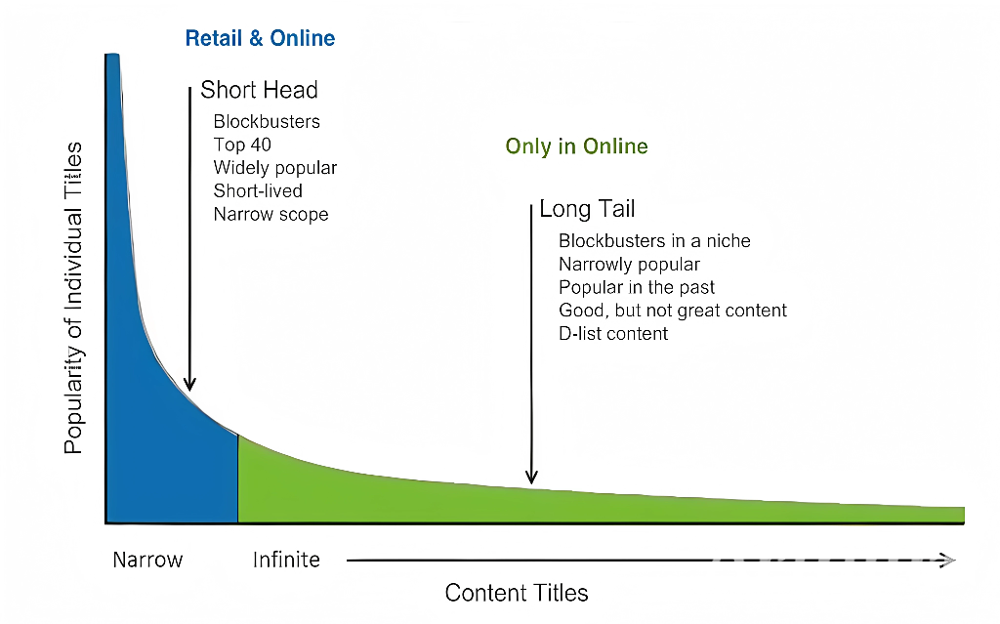

<h1 style="color: #ccc">Intelligent Reasoning System</h1>

# Introduction to Recommender Systems

>   Reduce choice overload by predicting what the user is most likely to prefer from a large set of options.

    Type
    Course

    Instructor
    Barry Shepherd

    Institution
    NUS-ISS

    Note Updated
    2025-08-02

## What Are Recommender Systems?

Recommender systems are designed to assist users in making choices when the number of options is vast.

1.  Key Challenges: How to reason effectively when there are millions of possible outcomes (e.g., Amazon has 12M+ products).
2.  These systems are core to platform like Netflix, Amazon, YouTube, Grab, LinkedIn, Spotify, Airbnb, and Lazada.
3.  They are **critical revenue drivers**, enhancing **user experience**, **engagement**, and **conversion rates**.

## Importance & Impact

Case Study: Netflix

1.  80% of viewing time is driven by Netflix's recommender system.
2.  Estimated $1B/year in savings due to improved retention and reduced churn.

Netflix Prize

1.  Launched: 2006 with a $1M prize.
2.  Data: 100M movie ratings from 500,000 users on 17,000+ movies.
3.  Goal: Predict 3M unseen ratings; improve **RMSE (Root Mean Square Error)** by 10%.
4.  Winner: BellKor's Pragmatic Chaos (2009).

## Data Sources for Recommender Systems

1.  **Items**
    -   Objects to be recommended (e.g., books, videos, products).
2.  **Users**
    -   Demographics, goals, preferences (explicit or inferred).
3.  **Ratings**: Interactions between users and items.
    -   **Explicit**: e.g., 1-5 star ratings, agree/neutral/disagree.
    -   **Implicit**: e.g., clicks, views, watch time, purchases.
    -   **Text Comments**: user feedback or reviews.
    -   **Tags**: labels like "boring", "inspiring", "too long".
4.  **Context**: Additional conditions.
    -   User expertise level (e.g., is the user a beginner or advanced camera user?)
    -   Location-based filters (e.g., is the user looking for restaurant near their current location?)
    -   Device type or time of day

## Diversity Matters

Recommender systems typically return a list of suggestions, not just one item. These suggestions span multiple categories&mdash;such as literature, fitness gear, video content, beverages, or biographies&mdash;to support both user satisfaction and content discovery.

While accuracy is important, it is not sufficient on its own. Effective recommender systems strike a balance between **relevance** and **diversity**.

| | Low Relevance | High Relevance |
|:---|:---|:---|
| **Low Diversity** | Unhelpful | Repetitive |
| **High Diversity** | Unfocused | Balanced and engaging |

Aim for the ideal zone: recommendations that are both **relevant** and **diverse**.

## Big Issues for Recommender Systems

1.  **Data Sparsity**

    Most user-item interactions are missing, making it difficult to learn meaningful patterns from sparse matrices.

    -   Netflix: 98.8% of ratings are unknown
    -   Movielens: 95.7% of ratings are unknown

2.  **Cold Start Problem**

    Occurs when new users or new items have no prior interactions:

    -   Collaborative filtering cannot be applied.
    -   No reliable signals are available for personalisation.

## Main Approaches

### Popularity-Based

Simple and non-personalised:

1.  Recommends trending or best-selling items.
2.  Works well for **cold-start** users or items.
3.  Examples: YouTube trending videos, Amazon bestsellers.

### Association Rule Mining

e.g., Market Basket Analysis

>   

1.  Recommends items that are frequently co-purchased or co-viewed.
2.  Based on broad transaction trends and **co-occurrence** in transactions or sessions, rather than individual preferences.
3.  Works well for **session-based recommendations**, where user intent changes frequently (e.g., browsing specific categories).
4.  Typically promotes **popular items** (**short head** of the distribution).
5.  Limitations:
    -   Not personalised to the user's past behaviour.
    -   Performs poorly on **long-tail** items that occur infrequently.
6.  Challenge:
    -   How to recommend less popular (long-tail) items effectively?

### Content-Based Filtering

1.  Recommends **similar items** to those a user liked or viewed previously.
2.  Matches users directly to item features (e.g., genre, keywords).
3.  Common in document and product recommendation.
4.  Risk: may reinforce narrow interests (filter bubbles).

### Collaborative Filtering

1.  Recommends items liked by **similar users** or **items similar** to those liked by the user (user-user or item-item).
2.  Enables **serendipitous discovery** beyond the user's past preferences.
3.  Common in e-retail and streaming platforms.
4.  **Latent Factor Models** (e.g., matrix factorisation) uncover hidden dimensions of user preferences and item characteristics (e.g., genre, mood, quality).

    The models learn compact user-item embeddings by factorising the interaction matrix into $(\text{user}\times\text{factor})$ and $(\text{item}\times\text{factor})$ matrices. These **latent factors** allow generalisation to unseen combinations and improve prediction from sparse data.

### Community-Based/Social Filtering

1.  Leverages friendship or social networks to suggest what users' social connections liked.
2.  Builds on trust in the preferences of known users.

### Knowledge-Based Filtering

1.  Suitable when user has **explicit constraints** (e.g., financial, regulatory, prerequisites)
2.  No need for prior user behaviour.
3.  Useful for high-involvement decisions like cars, loans, housing.
4.  Methods include **constraint-based reasoning** and **multi-criteria decision-making** (MCDM).
