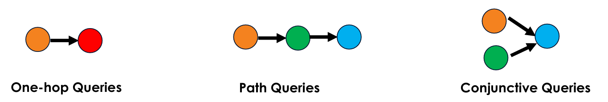
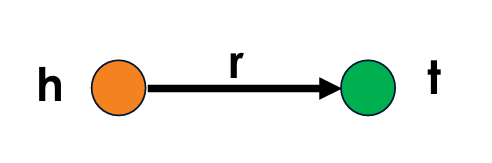
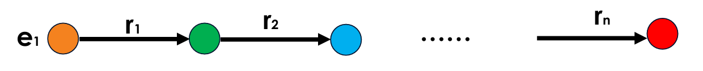

<h1 style="color: #ccc">Machine Reasoning</h1>

# Knowledge Graph

*Feb 2, 2025*

## What is Knowledge Graph?

1.  A knowledge graph (KG) is a structured data representation that models entities and their relationships as a graph, enabling efficient knowledge retrieval and reasoning.

    -   Nodes: Represent entities such as people, places, objects, or abstract concepts.
    -   Edges: Define the relationships between entities, labelled to indicate their nature, such as "work for", "located in", or "part of".

    This interconnected structure enhances the ability to store, retrieve, and infer new knowledge, making KGs valuable in search, recommendation, and artificial intelligence applications.

2.  Characteristics of Knowledge Graphs

    KGs exhibit several key characteristics that make them effective for knowledge representation, retrieval, and reasoning:

    -   **Semantic Structure**: KGs use **ontologies** and **schemas** to define and standardise relationships and attributes of entities, ensuring consistency in how information is structured and interpreted.
    -   **Graph Representation**: The graph-based format (nodes and edges) allows intuitive visualisation of relationships and supports graph traversal, semantic querying, and inference-based reasoning.
    -   **Interoperability**: KGs are often built using **semantic web standards**, such as **RDF** (Resource Description Framework) and **SPARQL** (query language), facilitating integration across diverse data sources and enabling structured querying.
    -   **Reasoning and Inference**: KGs enhance automated reasoning by enabling systems to infer new insights, detect hidden patterns, and establish connections based on existing structured knowledge.

## Querying Knowledge Graphs

1.  Types of Queries in Knowledge Graphs

    Queries in knowledge graphs (KGs) can be categorised based on their complexity and the number of relationships traversed. The three main types are:

    -   **One-Hop Queries**: Retrieve information from a direct relationship between two entities.
        -   Query: "Who is the head coach of the Memphis Grizzlies?"
        -   Representation: $e:\text{Memphis Grizzlies} ,\left( r:\text{is head coach}\right)$
    -   **Path Queries / Multi-Hop Queries**: Require multiple relationship traversals to reach the answer.
        -   Query: "Which person owns the team where Ja Morant is a star player?"
        -   Representation: $e:\text{Ja Morant},\left( r:\text{is star player}\right),\left( r:\text{owned by}\right)$
    -   **Conjunctive Queries**: Combine multiple relationships that must be satisfied simultaneously.
        -   Query: "Who is the player that played as a PG for Memphis Hustle and is also friends with Ja Morant?"
        -   Representation: $e:\text{Memphis Hustle} ,\left( r:\text{is PG}\right),e:\text{Ja Morant} ,\left( r:\text{is friend}\right)$

    >   

2.  Predictive one-hop queries

    A predictive one-hop query involves a single predicate that connects two entities (a head and a tail) via a direct relationship.

    >   

    Notation:

    -   $h$: Head (starting node)
    -   $t$: Tail (target node)
    -   $r$: Relationship connecting $h$ and $t$

    Query formulation:

    "Is $t$ an answer to the query $(h,r)$?"

    Example query:

    "What proteins are targeted by Drug A?"

    Formal representation:

    $$
    \text{Protein}( p)\leftarrow \text{Targets}\left(\text{Drug A} ,p\right)
    $$

3.  Predictive path queries

    Path queries (also referred to as multi-hop queries) involve a sequence of relationships, traversing multiple nodes in the KG.

    >   

    An n-hop path query is denoted as:

    $$
    q=(e_1,r_1,r_2,\cdots,r_n)
    $$

    Where:

    -   $e_1$: Anchor entity (starting point)
    -   $r_1,r_2,\cdots,r_n$: Sequence of relationships to traverse

    Example query:

    "Find drugs that target proteins associated with Alzheimer's disease."

    Path in the KG:

    $$
    \text{Disease}\xrightarrow{\text{Associated With}}\text{Protein}\xrightarrow{\text{Targeted By}}\text{Drug}
    $$

4.  Predictive conjunctive queries

    A conjunctive query retrieves entities or relationships that satisfy all specified conditions (or constraints) in the KG.

    General form:

    $$
    Q( x_{1} ,x_{2} ,\cdots ,x_{n})\leftarrow P_{1}( y_{1}) \land P_{2}( y_{2}) \land \cdots \land P_{m}( y_{m})
    $$**

    Where:

    -   $Q( x_{1} ,x_{2} ,\cdots ,x_{n})$: The output of the query (e.g., entities or attributes)
    -   $P_1,P_2,\cdots,P_m$: Predicates representing relationships or conditions in the KG
    -   $y_1,y_2,\cdots,y_m$: Variables or constants bound to graph entities

    Example query:

    "Find drugs that target proteins associated with Alzheimer's disease and are currently involved in clinical trials."

    Path in the KG:

    $$
    \text{Disease}\xrightarrow{\text{Associated With}}\text{Protein}\xrightarrow{\text{Targeted By}}\text{Drug}\xrightarrow{\text{Involved In}}\text{Phase II Clinical Trial}
    $$

    This combines multiple conditions, requiring relationships between diseases, proteins, drugs, and clinical trials to be simultaneously satisfied.

5.  Applications of conjunctive queries

    Conjunctive queries are widely used for complex reasoning tasks that require combining multiple constraints. They are particularly useful in domains such as biological networks, social graphs, and recommendation systems.

## Traversing Knowledge Graphs

1.  Traversing a KG involves navigating its nodes (entities) and edges (relationships) to answer queries, extract insights, or make inferences.

    -   Nodes 
        Represent entities, such as people, places, objects, or concepts.
    -   Edges 
        Represent the relationships between entities. These are labelled to describe the type of relationship, such as "is a friend of", "located in", or "part of".
    -   Paths 
        Represent sequences of nodes connected by edges that are explored during traversal. Paths are fundamental for understanding relationships and performing inferences.

2.  Types of traversals in KGs

    -   One-hop traversal 
        -   Explores the immediate neighbours of a node.
        -   Example: What drugs target Protein A?
    -   Path (multi-hop) traversal 
        -   Explores nodes connected by multiple relationships (edges).
        -   Example: Which drugs target proteins linked to Alzheimer's disease?
    -   Conjunctive query 
        -   Finds entities that satisfy multiple conditions (e.g., logical AND queries).
        -   Example: Find drugs that target Alzheimer's-related proteins and are in Phase II trials.
    -   Depth-first search (DFS) 
        -   Explores one branch deeply before backtracking to explore others.
        -   Example: Find all paths from Node A to Node B.
    -   Breadth-first search (BFS) 
        -   Explores all neighbours at the current depth before moving deeper.
        -   Example: List all nodes within two hops from Node A.
    -   Weighted traversal 
        -   Consider edge weights to prioritise paths during traversal.
        -   Example: Find the shortest path between Node A and Node B, prioritising higher confidence relationships.
    -   Random walk 
        -   Randomly explores paths and used for sampling or embeddings.
        -   Example: Generate node embeddings for a recommendation system using random walks.

3.  Challenges and limitations of traversing KGs

    Relationships in KGs are often incomplete, posing challenges across various applications:

    -   Drug discovery 
        Missing links between proteins and diseases can result in overlooked therapeutic targets.
    -   Cybersecurity 
        Incomplete knowledge of attack paths may hinder the identification of vulnerabilities.
    -   Recommendation systems 
        Gaps in knowledge about user preferences or item relationships may lead to suboptimal recommendations.

    Fully enumerating all facts in a KG is computationally expensive and often impractical, making the construction of complete KGs unrealistic. To address this limitation, methods such as link prediction and knowledge graph completion (KGC) are employed to infer missing edges and enhance the utility of KGs.

4.  Comparing traversal-based methods to embedding-based methods in KGs

    Traversing a KG to answer complex queries presents several limitations compared to embedding-based methods such as Query2Box.

    -   Scalability 
        Traversal becomes inefficient in large KGs due to the combinatorial explosion of possible paths.
    -   Limited generalisation 
        Traditional traversal struggles with unseen entities and incomplete graphs, whereas embeddings can infer missing links.
    -   Data sparsity 
        Missing or incomplete connections reduce the accuracy and reliability of traversal-based approaches.
    -   High computational cost 
        Multi-hop queries require substantial computational resources and can be slow to execute.

    Despite these challenges, traversal methods are generally more interpretable compared to embedding-based approaches, which sacrifice transparency for efficiency. By embedding KGs into vector spaces, methods like Query2Box enable more efficient reasoning, mitigating these limitations and improving performance on complex queries.

## Knowledge Graph Embeddings

Knowlege graph embedding (KGE) represents entities and relationships in a knowledge graph (KG) as low-dimensional vectors to capture semantic relationships and structural patterns for tasks like link prediction, entity classification, and reasoning.

### Translational Distance Models

These models treat relationships as translations in the embedding space.

1.  SE (Structured Embeddings) (Bordes et al., 2011)

    Represents entities as vectors and relations as matrices, optimising a margin-based ranking loss function.

2.  TransE* (Borders et al., 2013)

    Models relationships as vector translations but struggles with complex relations like one-to-many.

3.  TransH (Wang et al., 2014)

    Projects entities onto a relation-specific hyperplane to better handle one-to-many relations.

4.  TransR*/TransD (Lin et al., 2015; Ji et al., 2015)

    Uses separate entity and relation spaces to capture richer semantics.

5.  KG2E (He et al., 2015)

    Extends TransE by modelling entities and relations as Gaussian distributions to incorporate uncertainty.

6.  RotatE (Sun et al., 2019)

    Represents relations as rotations in complex space to capture symmetry, inversion, and composition.

### Semantic Matching Models

These models use similarity-based scoring functions.

1.  DistMult (Yang et al., 2014)

    Uses a bilinear diagonal matrix for entity interactions but fails to model asymmetric relations.

2.  ComplEx (Trouillon et al., 2016)

    Extends DistMult to complex numbers to capture asymmetric relations.

3.  HolE (Nickel et al., 2016)

    Uses circular correlation to encode compositional interactions between entities and relations.

4.  Analogy (Liu et al., 2017)

    Enforces analogical properties in KGEs.

5.  SimplE (Kazemi & Poole, 2018)

    Extends CP decomposition by explicitly modelling inverse relations.

### Neural Network-Based Models

These models use deep learning to learn embeddings.

-   Automatically learn features from data.

1.  GCN (Graph Convolutional Network) (Kipf & Welling, 2017)

    Generalises CNNs to graph-structured data for node classification and link prediction.

2.  GAT (Graph Attention Network) (Velickovic et al., 2018)

    Uses attention mechanisms to assign different weights to node neighbours.

3.  ConvE* (Dettmers et al., 2018)

    Applies convolutional layers to capture entity-relationship interactions.

4.  R-GCN (Relational Graph Convolutional Network) (Schlichtkrull et al., 2018)

    Aggregates information from neighbours using message passing in relational graphs.

5.  KBGAT (Knowledge Graph Attention Network) (Nathani et al., 2019)

    Enhances entity-relation modelling using attention-based graph neural networks.

6.  GraphSAGE (Hamilton et al., 2017)

    Uses inductive learning by sampling node neighbourhoods for scalable embedding learning.

7.  CompGCN (Compositional Graph Convolutional Network) (Vashishth et al., 2020)

    Integrates relational information directly into graph convolutions.

### Tensor Factorisation Models

These models decompose the adjacency tensor of the KG.

1.  RESCAL (Nickel et al., 2011)

    Uses matrix factorisation to capture pairwise entity interactions

2.  TuckER (Balazevic et al., 2019)

    Applies Tucker decomposition for expressive KGEs.

### Random Walk and Graph-Based Models

These methods exploit graph structures.

1.  DeepWalk (Perozzi et al., 2014)

    Uses random walks and Word2Vec to learn node embeddings.

2.  Node2Vec (Grover & Leskovec, 2016)

    Enhances DeepWalk with flexible BFS/DFS-like walk strategies.

3.  HOPE, LINE, PTransE

    Various methods using graph proximity and path-based relations.

### Transformer-Based Models

Recent methods leverage transformers for KGE.

1.  BERT-based KG Embeddings

    Uses transformer models like BERT to encode KG triples.

2.  KG-BERT (Yao et al., 2019)

    Fine-tunes BERT on triple classification tasks for KGs.

3.  KEPLER (Wang et al., 2021)

    Integrates KGEs into pretrained language models (PLMs).

4.  Graph-BERT, CoKE

    Leverages self-attention for KG representation learning.

### Hyperbolic and Geometric Models

These models use curved spaces to capture hierarchical structures.

1.  Poincare Embeddings (Nickel & Kiela, 2017)

    Embeds entities in hyperbolic space to model hierarchical structures.

2.  MuRP, RotE, RotH

    Extends hyperbolic embeddings with rotations and manifold techniques.

3.  BoxE (Abboud et al., 2020)

    Uses high-dimensional boxes to represent complex relational patterns.

### Summary of KGE Models

Transitional Distance Models

| Model | Symmetry | Asymmetry | Antisymmetry | Inversion | 1-N | N-1 | N-M | Composition | Transitivity |
|:---|:---|:---|:---|:---|:---|:---|:---|:---|:---|
|SE|✗|✗|✗|✗|✗|✗|✗|✗|✗|
|TransE|✗|✓|✓|✓|✓|✓|✓|✓|✗|
|TransH|✗|✓|✓|✓|✓|✓|✓|✓|✗|
|TransR|✓|✓|✓|✓|✓|✓|✓|✓|✗|
|RotatE|✓|✓|✓|✓|✓|✓|✓|✗|✓|

Semantic Matching Models

| Model | Symmetry | Asymmetry | Antisymmetry | Inversion | 1-N | N-1 | N-M | Composition | Transitivity |
|:---|:---|:---|:---|:---|:---|:---|:---|:---|:---|
|DistMult|✓|✗|✗|✓|✓|✓|✓|✓|✗|
|ComplEx|✓|✓|✓|✓|✓|✓|✓|✓|✗|

Neural Network-Based Models

| Model | Symmetry | Asymmetry | Antisymmetry | Inversion | 1-N | N-1 | N-M | Composition | Transitivity |
|:---|:---|:---|:---|:---|:---|:---|:---|:---|:---|
|R-GCN|✗|✗|✗|✗|✗|✗|✗|✗|✗|
|ConvE|✗|✓|✗|✗|✗|✗|✗|✓|✗|
|KBGAT|✓|✓|✓|✓|✓|✓|✓|✓|✗|
|CompGCN|✓|✓|✓|✓|✓|✓|✓|✓|✗|

Tensor Factorisation Models

| Model | Symmetry | Asymmetry | Antisymmetry | Inversion | 1-N | N-1 | N-M | Composition | Transitivity |
|:---|:---|:---|:---|:---|:---|:---|:---|:---|:---|
|TuckER|✓|✓|✓|✓|✓|✓|✓|✓|✗|

Transformer-Based Models

| Model | Symmetry | Asymmetry | Antisymmetry | Inversion | 1-N | N-1 | N-M | Composition | Transitivity |
|:---|:---|:---|:---|:---|:---|:---|:---|:---|:---|
|KG-BERT|✗|✓|✗|✗|✗|✗|✗|✓|✗|
|KEPLER|✗|✓|✗|✗|✗|✗|✗|✓|✗|

Hyperbolic and Geometric Models

| Model | Symmetry | Asymmetry | Antisymmetry | Inversion | 1-N | N-1 | N-M | Composition | Transitivity |
|:---|:---|:---|:---|:---|:---|:---|:---|:---|:---|
|Poincare|✓|✓|✓|✓|✗|✗|✗|✗|✗|
|MuRP|✓|✓|✓|✓|✗|✗|✗|✗|✗|
|BoxE|✓|✓|✓|✓|✗|✗|✗|✗|✗|

### Choosing the Right KGE Models

Selecting the appropriate KGE method depends on the structure of the knowledge graph, the types of relationships present, and the specific task requirements. Different models are optimized for different graph characteristics, as shown in the following table:

| Scenario | Recommended Models |
|:---|:---|
| Simple and Sparse Graphs | TransE, TransR |
| Asymmetric Relations | RotatE, ComplEx |
| Complex Relations | ConvE, RotatE |
| Multi-Relational Graphs | R-GCN, RESCAL |
| Hierarchical Graphs | Hyperbolic Embeddings, BoxE |
| Rich Semantics | KG-BERT, KEPLER |
| Small-scale Graphs | RESCAL, TransH |
| Large-scale Graphs | TransE, DistMult (efficient models) |

## Tools and Libraries

### Knowlege Graph Databases

| Tool/Framework | Description |
|:---|:---|
| Neo4j | A leading graph database with strong support for knowledge graph, Cypher query language, and efficient graph traversal. |
| ArangoDB | A multi-model database supporting graphs, documents, and key-value stores, useful for managing knowledge graphs. |

### Graph Query and Reasoning

### Machine Learning and Embedding

### Graph Neural Networks

## Decision Trees vs. Knowledge Graphs

1.  A summary of key differences

    -   Purpose
        -   DT: Predicts outcomes for classification or regression tasks.
        -   KG: Represents entities and their relationships to facilitate reasoning.
    -   Structure
        -   DT: A tree-like model with feature-based splits.
        -   KG: A graph composed of nodes (entities) and edges (relationships).
    -   Use cases
        -   DT: Used for prediction, segmentation, and diagnosis.
        -   KG: Applied in semantic search, question answering, and logical reasoning.
    -   Reasoning
        -   DT: Limited to feature-based decision splits.
        -   KG: Enables logical inference and knowledge-based reasoning.
    -   Scalability
        -   DT: Constrained by tree depth and data complexity.
        -   KG: Scales efficiently to large and complex knowledge bases.
    -   Explainability
        -   DT: Highly interpretable due to clear decision paths.
        -   KG: Can be interpretable, but complexity may affect transparency.
    -   Data dependency
        -   DT: Requires labelled data for supervised learning.
        -   KG: Supports both structured and unstructured data, accommodating supervised and unsupervised learning.
    -   Modelling approach
        -   DT: Employs rule-based hierarchical splitting.
        -   KG: Utilises semantic modelling with triples (head → relation → tail).
