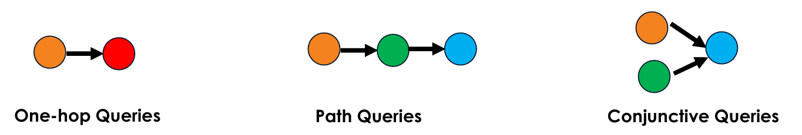
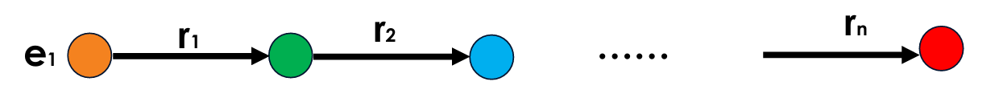

<h1 style="color: #ccc">Machine Reasoning</h1>

# Knowledge Graph

*Feb 7, 2025*

## What is Knowledge Graph?

1.  A **knowledge graph** (KG) is a structured data representation that models **entities** and their **relationships** as a graph, enabling efficient knowledge retrieval and reasoning.

    -   Nodes: Represent entities such as people, places, objects, or abstract concepts.
    -   Edges: Define the relationships between entities, labelled to indicate their nature, such as "*work for*", "*located in*", or "*part of*".

    This interconnected structure enhances the ability to store, retrieve, and infer new knowledge, making knowledge graphs valuable in search, recommendation, and artificial intelligence applications.

2.  Characteristics of Knowledge Graphs

    knowledge graphs exhibit several key characteristics that make them effective for knowledge representation, retrieval, and reasoning:

    -   **Semantic Structure**: Knowledge graphs use **ontologies** and **schemas** to define and standardise relationships and attributes of entities, ensuring consistency in how information is structured and interpreted.
    -   **Graph Representation**: The graph-based format (nodes and edges) allows intuitive visualisation of relationships and supports graph traversal, semantic querying, and inference-based reasoning.
    -   **Interoperability**: Knowledge graphs are often built using **semantic web standards**, such as **RDF** (Resource Description Framework) and **SPARQL** (query language), facilitating integration across diverse data sources and enabling structured querying.
    -   **Reasoning and Inference**: Knowledge graphs enhance automated reasoning by enabling systems to infer new insights, detect hidden patterns, and establish connections based on existing structured knowledge.

## Querying Knowledge Graphs

1.  Types of Queries in Knowledge Graphs

    >   

    Queries in knowledge graphs can be categorised based on their complexity and the number of relationships traversed. The three main types are:

    -   **One-Hop Queries**: Retrieve information from a direct relationship between two entities.
        -   Query: "*Who is the head coach of the Memphis Grizzlies?*"
        -   Representation: $e:\text{Memphis Grizzlies} ,\left( r:\text{is head coach}\right)$
    -   **Path Queries / Multi-Hop Queries**: Require multiple relationship traversals to reach the answer.
        -   Query: "*Which person owns the team where Ja Morant is a star player?*"
        -   Representation: $e:\text{Ja Morant},\left( r:\text{is star player}\right),\left( r:\text{owned by}\right)$
    -   **Conjunctive Queries**: Combine multiple relationships that must be satisfied simultaneously.
        -   Query: "*Who is the player that played as a PG for Memphis Hustle and is also friends with Ja Morant?*"
        -   Representation: $e:\text{Memphis Hustle} ,\left( r:\text{is PG}\right),e:\text{Ja Morant} ,\left( r:\text{is friend}\right)$

2.  Predictive One-Hop Queries

    A **one-hop query** retrieves information directly connected to a specified node through a single predicate. It does not require traversing multiple relationships. The standard format for such queries is $(h,r,t)$ where:

    -   $h$ is the **head entity** (starting node).
    -   $r$ is the **relationship** between entities.
    -   $t$ is the **tail entity** (target node).

    Example Query:

    "*What proteins are targeted by Drug A?*"

    Formal Representation:

    $$
    \text{Protein}( p)\leftarrow \text{Targets}\left(\text{Drug A} ,p\right)
    $$

3.  Predictive Path Queries / Multi-Hop Queries

    >   

    A **path query** extends one-hop queries by introducing additional relationships, requiring traversal through multiple intermediate nodes. These multi-hop queries take the form:

    $$
    q=(e_1,r_1,r_2,\cdots,r_n)
    $$

    where:

    -   $e_1$ is the **anchor entity** (starting node).
    -   $r_1,r_2,\cdots,r_n$ are **sequential relationships** leading to the answer.
    -   The query output includes all valid entities satisfying the path conditions.

    Example Query:

    "*Find drugs that target proteins associated with Alzheimer's disease.*"

    Path Representation:

    $$
    \text{Disease}\xrightarrow{\text{Associated With}}\text{Protein}\xrightarrow{\text{Targeted By}}\text{Drug}
    $$

4.  Predictive Conjunctive Queries

    A **conjunctive query** (CQ) combines multiple **constraints** using **logical conjunction** (AND) to retrieve entities or relationships that satisfy all specified conditions.

    General Form:

    $$
    Q( x_{1} ,x_{2} ,\cdots ,x_{n})\leftarrow P_{1}( y_{1}) \land P_{2}( y_{2}) \land \cdots \land P_{m}( y_{m})
    $$

    where:

    -   $Q( x_{1} ,x_{2} ,\cdots ,x_{n})$ is the query output (entities or attributes).
    -   $P_1,P_2,\cdots,P_m$ represent **predicates** describing relationships or constraints.
    -   $y_1,y_2,\cdots,y_m$ are variables or constants representing entities.

    Example Query:

    "*Find drugs that target proteins associated with Alzheimer's disease and are currently involved in clinical trials.*"

    Path Representation:

    $$
    \text{Disease}\xrightarrow{\text{Associated With}}\text{Protein}\xrightarrow{\text{Targeted By}}\text{Drug}\\
    \text{Phase II Clinical Trial}\xrightarrow{\text{Involves}}\text{\text{Drug}}
    $$

## Traversing Knowledge Graphs

1.  Traversing a knowledge graph refers to navigating through its nodes (entities) and edges (relationships) to retrieve information, derive insights, or make inferences. This process involves following connections between nodes based on specified queries or conditions. In a knowledge graph:

    -   Nodes represent entities (e.g., people, places, drugs, proteins).
    -   Edges represent relationships between entities (e.g., "*is a friend of*", "*targets*", "*located in*").
    -   Paths consist of a sequence of nodes connected by edges, which traversal methods explore to answer queries.

2.  Different Traversal Methods in Knowledge Graphs

    Different **traversal methods** are used in knowledge graphs depending on the complexity of the query and the relationships involved. The key traversal methods are:

    -   **One-Hop Traversal**
        -   Description: Explores the immediate neighbours of a node.
        -   Use Case Example: "*What drugs target Protein A?*"
    -   **Multi-Hop Traversal**
        -   Description: Explores nodes connected by multiple relationships.
        -   Use Case Example: "*Which drugs target proteins associated with Alzheimer's disease?*"
    -   **Conjunctive Query**
        -   Description: Combines multiple conditions using logical AND to retrieve entities that satisfy all constraints.
        -   Use Case Example: "*Find drugs targeting proteins associated with Alzheimer's disease and currently in Phase II trials.*"
    -   **Depth-First Search (DFS)**
        -   Description: Traverses as far along a branch as possible before backtracking.
        -   Use Case Example: "*Find all possible paths from Node A to Node B.*"
    -   **Breadth-First Search (BFS)**
        -   Description: Explores all neighbours at the current depth before moving deeper.
        -   Use Case Example: "*List all nodes within two hops from Node A.*"
    -   **Weighted Traversal**
        -   Description: Considers weights on edges to prioritise paths, such as finding the shortest or most optimal path.
        -   Use Case Example: "*Find the shortest path between Node A and Node B.*"
    -   **Random Walk**
        -   Description: Randomly selects paths to explore, often used in graph embeddings or sampling.
        -   Use Case Example: "*Generate embeddings for nodes based on random traversal patterns.*"

    Each of these traversal methods serves a unique purpose in knowledge graph querying, data retrieval and reasoning.

3.  Challenges and Limitations of Traversing Knowledge Graphs

    Many relationships between entities in knowledge graphs are either **absent** or **incomplete**, posing challenges across various applications.

    -   Drug Discovery: A knowledge graph might omit a key protein-disease link, missing a potential therapeutic target.
    -   Cybersecurity: Incomplete attack-path relationships could lead to gaps in identifying vulnerabilities.
    -   Recommendation Systems: Missing user preferences or product links could result in suboptimal recommendations.
    -   Enumerating all the facts in a knowledge graph takes **significant time and computational cost**, making it impractical to fully complete a knowledge graph.
    -   As a result, the incompleteness of knowledge graphs limits their ability to identify all relevant answer entities, affecting the accuracy and reliability of knowledge graph-based reasoning and decision-making.

4.  Comparing Traversal-Based Methods to Embedding-Based Methods

    **Traversal-based methods** explicitly follow relationships between entities, whereas **embedding-based methods** represent entities and relationships in a continuous vector space, enabling more efficient reasoning.

    | Aspect | Traversal-Based Methods | Embedding-Based Methods |
    |:---|:---|:---|
    | Scalability | Inefficient for large graphs due to **combinatorial explosion**. | Scales efficiently by resolving queries in a **lower-dimensional space**. |
    | Generalisation | **Does not generalise** well to unseen nodes or missing relationships. | **Learns patterns** and can infer missing links. |
    | Data Sparsity | Struggles with **incomplete** graphs, as missing edges disrupt paths. | Handles sparse data better by capturing **latent relationships**. |
    | Computational Complexity | **High computational cost**, especially for multi-hop queries. | **Lower computational cost**, as queries are performed in vector space. |
    | Interpretability | **More interpretable** as queries follow explicit paths. | **Less interpretable**, as reasoning happens in an abstract vector space. |

## Knowledge Graph Embeddings

**Knowledge graph embedding** (KGE) encodes entities and relationships from a knowledge graph into **low-dimensional, dense vectors in continuous vector spaces**. This preserves both structural and semantic information, enabling scalability for large datasets. These embeddings enhance machine learning tasks like **link prediction**, **entity classification**, and **clustering**.

### Translation-Based Models

1.  These models represent relationships as translation vectors in entity embedding spaces.

    -   **TransE**: Represents relations as translations in vector space, assuming $h+r\approx t$, where $h,r,t$ are the embeddings of the head, relation, and tail.
    -   **TransH**: Extends TransE by allowing relations to operate in specific hyperplanes, handling more complex relationships.
    -   **TransR/TransD**: Map entities and relations into separate vector spaces to accommodate diverse relation types.
    -   **RotatE**: Models relations as rotations in a complex vector space, improving relational modelling.

1.  **TransE**

    **Overview**

    -   TransE is a model that represents knowledge graph triples $(h,r,t)$ in an embedding space using vector translation.
    -   The model learns embeddings such that applying a relation $r$ to a head entity $h$ results in a vector close to the tail entity $t$.

    **Mechanisms**

    -   Entities and relations are mapped into a vector space where relationships are represented as translations between entities.
    -   TransE enables multi-hop reasoning by composing relations in vector space.

    **Mathematical Formulation**

    -   The scoring function for a triple is:

        $$
        f_r(h,t)=-\|h+r-t\|
        $$

        Lower values of $\|h+r-t\|$ indicate a better representation.

    **Advantages**

    -   **Handles Simple Relations**: Works well for one-to-one relationships.
    -   **Supports Multi-Hop Inference**: Enables reasoning across multiple relations.
    -   **Scalable**: Efficient for large-scale knowledge graphs.

    **Limitations**

    -   **Struggles with Complex Relations**: Cannot model one-to-many or many-to-many relationships.
    -   **Symmetric Relations**: Has difficulty with relations like "*similar to*".
    -   **Dimensional Overlap**: Can suffer from vector space constraints.

3.  **TransR**

    **Overview**

    -   In TransE, entities and relations share the same vector space, limiting representation for complex relationships.
    -   TransR introduces relation-specific spaces, addressing one-to-many, many-to-one, and many-to-many relations.

    **Mechanisms**

    -   Entities are first embedded in a general entity space.
    -   Relations have their own distinct vector space.
    -   When a relation is considered, entities are projected into the corresponding relation space before computing interactions.
    -   This enables better representation of complex relationships.

    **Mathematical Formulation**

    -   Entities $(h,t)$ are projected into the relation space using a projection matrix $M_r$:

        $$
        h_r=hM_r,\quad t_r=tM_r
        $$

    -   Scoring function is similar to TransE but applied in the relation space:

        $$
        f_r(h,t)=-\|h_r+r-t_r\|
        $$

        Lower values of $\|h_r+r-t_r\|$ indicate a better representation.

    **Limitations**

    -   **Increased model complexity** due to additional relation spaces.
    -   **Higher computational cost** for projections.
    -   **Limited interpretability** and scalability concerns.
    -   **Risk of overfitting** with many parameters.

### Factorisation-Based Models

1.  These models decompose a large matrix of triples into smaller embedding matrices for efficient representation.

    -   **RESCAL**: Captures pairwise interactions using bilinear formulation.
    -   **DistMult**: A simplified version of RESCAL with diagonal matrices, limiting it to symmetric relations.
    -   **ComplEx**: Extends DistMult by incorporating complex numbers, enabling the modelling of asymmetric relations.

2.  **RESCAL**

    **Overview**

    RESCAL is a **tensor factorisation model** designed for knowledge graph embeddings. Unlike simpler models like TransE or DistMult, RESCAL captures complex interactions by using a full relation-specific matrix instead of a vector for relations.

    -   Entities: Represented as vectors (like in other knowledge graph embedding models).
    -   Relations: Represented as full matrices $R_r$ rather than simple vectors or diagonal matrices.

    **Mathematical Formulation**

    The RESCAL model scores a triple $(h,r,t)$ using:

    $$
    f(h,r,t)=h^\top\cdot R_r\cdot t
    $$

    where:
    -   $h$: Head entity embedding (vector)
    -   $R_r$: Relation-specific full matrix
    -   $t$: Tail entity embedding (vector)

    The resulting score measures the strength of the relationship between $h$ and $t$ through $r$.

    **Advantages**

    -   **Captures Richer Interactions**: Uses full matrices for relations, unlike TransE or DistMult.
    -   **Encodes Latent Dependencies**: Stores complex interdependencies, allowing for expressive reasoning.
    -   **Handles Many-to-Many Relations**: Works well for large-scale knowledge graphs with proper optimisation.

    **Limitations**

    -   **High Memory Requirements**: Storing a full matrix for each relation is expensive compared to vector-based models.
    -   **Computationally Intensive**: Requires matrix multiplications, making it slower than simpler models.
    -   **Scalability Challenges**: Memory usage grows quadratically with the number of entities, impacting scalability.

    RESCAL provides expressive and powerful knowledge graph embeddings, but its practical use depends on memory constraints and computational efficiency.

3.  **DistMult**

    **Overview**

    -   Unlike models like RESCAL, DistMult constrains the relation matrix to be diagonal, reducing computational complexity.

    **Mathematical Formulation**

    Scoring function:

    $$
    f(h,r,t)=h^\top\cdot R_r\cdot t
    $$

    where $R_r$ is a diagonal matrix, ensuring element-wise multiplication.

    **Advantages**

    -   **Computational Efficiency**: The diagonal relation matrix reduces the complexity of matrix operations, making it much more efficient than models with full relation matrices (e.g., RESCAL).
    -   **Scalability**: The simplified computation allows it to scale efficiently for large knowledge graphs.

    **Limitations**

    -   **Symmetry Assumption**: Since the relation matrix is diagonal, it cannot differentiate between $f(h,r,t)$ and $f(t,r,h)$, making it unsuitable for asymmetric relations (e.g., "father of" or "greater than").
    -   **Limited Expressiveness**: Compared to models like TransE, RotatE, or ComplEx, DistMult is less effective in capturing complex relational structures.

3.  **ComplEx**

    **Overview**

    ComplEx extends DistMult by embedding entities and relations in the complex vector space, allowing it to model diverse relation patterns, including symmetric, antisymmetric, and inversion relations&mdash;limitations in simpler models like DistMult.

    **Mathematical Formulation**

    Scoring function:

    $$
    f(h,r,t)=\operatorname{Re}\left(\sum_{i=1}^{d}h_i\cdot r_i\cdot\bar{t}_i\right)
    $$

    **Advantages**

    -   **Handles Asymmetric Relations**: Unlike DistMult, ComplEx effectively models one-way relationships (e.g., "father of", "greater than").
    -   **Supports Diverse Relations**: Models symmetric, antisymmetric, and inversion relations, overcoming limitations of real-valued embeddings.
    -   **Expressive & Efficient**: More expressive than simpler models like TransE and DistMult while maintaining computational efficiency.

    **Limitations**

    -   **Reduced Interpretability**: Complex-valued embeddings make it harder to intuitively understand relationships compared to real-valued models.
    -   **Computational Cost**: Slightly more intensive than real-valued models due to operations in the complex space.

### Neural Network-Based Models

1.  These models automatically learn features from data, reducing human intervention in knowledge graph-based reasoning.

    -   **ConvE**: Uses **Convolutional Neural Networks (CNNs)** to model entity-relation interactions.
    -   **ConvKB**: Represents triples as **multi-channel feature maps**.
    -   **InteractE**: Enhances ConvE with feature interaction methods like **circular convolution and reshuffling**.
    -   **HypER**: Uses a **hypernetwork** to generate convolutional filters dynamically.

    **Advantages**

    -   **Expressive & Scalable**: Models complex, hierarchical, and asymmetric relationships efficiently.
    -   **Generalisation**: Learns from unseen entities without retraining.
    -   **Multi-Hop Reasoning**: Captures deeper semantic knowledge.
    -   **External Information**: Incorporates text, images, and metadata.
    -   **Efficient Training**: Uses deep learning for faster processing.

2.  **ConvE**

    **Overview**

    -   ConvE is a **link prediction model** for knowledge graphs that applies 2D convolution over entity and relation embeddings.
    -   It captures complex interactions between entities and relations using multiple layers of nonlinear transformations.

    **Mechanisms**

    -   **Input Representation**: Entity and relation embeddings are **reshaped and concatenated**.
    -   **Feature Extraction**: The combined embeddings are passed through a **convolutional layer**, generating **feature maps**.
    -   **Transformation and Projection**: The feature maps are vectorised and transformed into a **lower-dimensional space** using a fully connected projection layer.
    -   **Candidate Matching**: The projected embeddings are compared with all candidate entity embeddings to predict missing links.

    **Advantages**

    -   **Efficiency**: Uses fewer parameters, reducing memory and computation costs while enabling **fast 1-N scoring**.
    -   **Expressiveness**: Captures rich entity-relation interactions using multiple nonlinear layers.
    -   **Robustness**: Integrates batch normalisation and dropout, reducing overfitting.
    -   **Performance**: Achieves state-of-the-art results on multiple benchmark datasets, scaling effectively to large knowledge graphs.

### Geometric and Topological Models

1.  These models leverage geometric and topological properties for knowledge graph representation.

    -   **TuckER**: A tensor decomposition model that generalises RESCAL, DistMult, and ComplEx for efficient representation learning.
    -   **Hyperbolic Embeddings**: Embed entities and relations in hyperbolic space, making them well-suited for hierarchical data representation.

### Graph Neural Network (GNN)-Based Models

1.  **Graph Neural Networks (GNNs)** learn node embeddings by aggregating information from neighbouring nodes. Common GNN models include:

    -   **GCN (Graph Convolutional Networks)**: Uses convolutional operations to aggregate features from neighbouring nodes.
    -   **R-GCN (Relational GCN)**: Extends GCNs to handle multiple types of relationships in knowledge graphs.
    -   **CompGCN**: Integrates relational composition with graph convolution for richer embeddings.
    -   **GraphSAGE**: Uses inductive learning to generate node embeddings by sampling and aggregating features from local neighbourhoods, enabling generalisation to unseen nodes.

2.  **GCN**

    **Overview**

    **Graph convolutional networks (GCNs)** are neural networks designed for graph-structured data, generalising convolution from regular grids (e.g., images) to graphs. They enable learning on nodes, edges, and relationships.

    **Convolution and Pooling**

    GCNs for **graph classification** typically combine **graph convolution** and **hierarchical pooling** in an alternating manner:

    1.  **Graph convolutions** extract node features by aggregating neighbourhood information.
    2.  **Activation functions** (e.g., ReLU) introduce non-linearity to capture complex patterns.
    3.  **Dropout regularisation** prevents overfitting by randomly deactivating neurons during training.
    4.  **Graph pooling** reduces the number of nodes, creating a coarser but more abstract graph.
    5.  Steps 1-4 repeat across multiple layers, refining features while compressing graph size.
    6.  A **final pooling step** aggregates remaining features into a single vector for classification.

    This approach is similar to **CNNs**, where convolution, activation, dropout, and pooling alternate to capture multi-scale features.

    **Mechanisms**

    -   **Graph Convolution (Feature Extraction)**:
        -   Aggregates features using neighbouring nodes.
        -   Applying **activation functions** (e.g., ReLU) to introduce non-linearity.
        -   Use **dropout** to improve generalisation.
    -   **Graph Pooling (Graph Compression)**:
        -   Reduce graph size by clustering similar nodes.
        -   Helps retain essential structures while removing redundancy.
    -   **Graph Convolution (Refinement)**:
        -   Process the compressed graph using another GCN layer.
        -   Apply **activation** and **dropout** again.
    -   **Graph Pooling (Further Reduction)**:
        -   Further downsample the graph while preserving important relationships.
    -   **Final Aggregation & Classification**:
        -   **Global pooling** (sum, max, or mean) merges all remaining node features into a single representation.
        -   **Fully connected layers** classify the entire graph.

    This alternating **convolution-activation-dropout-pooling cycle** allows the model to learn both **local** and **global** graph structures efficiently.

    Mathematical Formulation

    -   **Aggregation**: A node updates its features by aggregating information from its neighbours using the adjacency matrix.
    -   **Layer-wise Propagation**:

        $$
        H^{(k+1)}=\sigma\left(\hat{A}H^{(k)}W^{(k)}\right)
        $$

    where:

    -   $H^{(k)}$: Node features at layer $k$.
    -   $\hat{A}$: Normalised adjacency matrix with self-loops.
    -   $W^{(k)}$: Trainable weight matrix.
    -   $\sigma$: Activation function (e.g., ReLU) for introducing non-linearity.

3.  **GraphSAGE**

    **Overview**

    **GraphSAGE (Graph Sample and Aggregation)** is a framework for **inductive representation learning** on graphs. Unlike traditional graph-based learning methods that require retraining when new nodes are introduced, GraphSAGE generates embeddings for unseen nodes by learning to aggregate and sample features from their local neighbourhoods.

    GraphSAGE is widely applied in social networks, recommendation systems, biological networks, and NLP tasks, as it enables learning from evolving graphs **without retraining on the entire dataset**.

    **Mechanisms**

    GraphSAGE follows the general structure of **Graph Neural Networks (GCNs)**:

    -   **Input Graph**: Nodes (entities) and edges (relationships).
    -   **Compute Graph**: Embeddings are generated through **recursive neighbourhood aggregation**.
    -   **Shared Parameters**: The model learns transformation functions that generalise across different graph structures.
    -   **Recursive Information Propagation**: Each node's representation is updated based on its own features and those of its neighbours.

    **Mathematical Formulation**

    The node embedding at layer $(k+1)$ is computed as:

    $$
    h_v^{(k+1)}=\sigma\left(W^{(k)}\cdot\operatorname{concat}\left(h_v^{(k)},\operatorname{agg}\left(h_u^{(k)}\mid u\in N(v)\right)\right)\right)
    $$

    where:

    -   $h_v^{(k+1)}$: Embedding of node $v$ at layer $(k+1)$.
    -   $h_v^{(k)}$: Embedding of node $v$ at layer $(k)$.
    -   $N(v)$: Set of neighbours of node $v$.
    -   $W^k$: Trainable weight matrix at layer $(k)$.
    -   $\sigma$: Non-linear activation function (e.g., ReLU).

    **Aggregation Methods in GraphSAGE**

    GraphSAGE enables node embeddings by aggregating information from neighbouring nodes. Three key **aggregation functions** are used:

    -   **Mean Aggregator**:

        $$
        h_v^{(k+1)}=\sigma\left(w^{(k)}\cdot\operatorname{concat}\left(h_v^{(k)},\operatorname{mean}\left(\{h_u^{(k)}\mid u\in n(v)\}\right)\right)\right)
        $$

        -   Computes the mean of neighbouring node embeddings.
        -   Efficient and simple.

    -   **LSTM Aggregator**:

        $$
        h_v^{(k+1)}=\sigma\left(w^{(k)}\cdot\operatorname{concat}\left(h_v^{(k)},\operatorname{lstm}\left(\{h_u^{(k)}\mid u\in n(v)\}\right)\right)\right)
        $$

        -   Uses an LSTM to process neighbour embeddings sequentially.
        -   Captures order-dependent patterns in node neighbourhoods.

    -   **Pooling Aggregator**:

        $$
        h_v^{(k+1)}=\sigma\left(w^{(k)}\cdot\operatorname{concat}\left(h_v^{(k)},\operatorname{pool}\left(\{\sigma(h_u^{(k)}+b)\mid u\in n(v)\}\right)\right)\right)
        $$

        -   Applies max-pooling or average-pooling over a neural transformation of neighbour embeddings.
        -   Highlights key node features while reducing dimensionality.

4.  GCN vs. GraphSAGE

    | Aspect | GraphSAGE | GCN |
    |:---|:---|:---|
    | Learning Type | Inductive (handles unseen nodes) | Transductive (requires full graph) |
    | Neighbour Handling | Samples a fixed number of neighbours | Uses all neighbours |
    | Scalability | Efficient for large graphs | Less scalable for large graphs |
    | Dynamic Graphs | Suitable for dynamic graphs | Requires retraining for changes |
    | Training | Supports mini-batches | Requires full-graph training |
    | Use Cases | Large-scale, dynamic graphs | Small-to-medium, static graphs |

### LLM-Based Models

1.  Recent advancements integrate **pretrained language models** with **knowledge graph embeddings**, enabling the representation of **both structured and unstructured knowledge**. Key models include:

    -   **KG-BERT**: Uses **BERT/GPT** to model **knowledge graph triples** as **text sequences**. Enables semantic reasoning over structured knowledge.
    -   **KEPLER**: Combines **knowledge graph embeddings** with **language models** to improve **generalisation**. Enhances entity representations and knowledge-driven tasks.
    -   **GAT (Graph Attention Network)**: Uses **transformers** with **self-attention** to capture **pairwise interactions** in graphs. Improves node representation learning and relation modelling in knowledge graphs.

### Knowledge Graph Relation Types

1.  **Symmetry**

    Definition: A relation $r$ is **symmetric** if:

    $$
    (h,r,t)\Rightarrow(t,r,h)
    $$

    This means if $h$ (head entity) is related to $t$ (tail entity) by $r$, then $t$ is also related to $h$ by $r$.

    Example: *Is married to*

    -   If Alice is married to Bob, then Bob is married to Alice.
    -   (Alice, married_to, Bob) → (Bob, married_to, Alice).

2.  **Asymmetry**

    Definition: A relation $r$ is **asymmetric** if:

    $$
    (h,r,t)\Rightarrow\neg(t,r,h)
    $$

    This means that if $h$ is related to $t$ by $r$, then $t$ is **not** related to $h$ by $r$.

    Example: *Is older than*

    -   If Alice is older than Bob, then Bob **cannot** be older than Alice.
    -   (Alice, older_than, Bob) → (Bob, older_than, Alice) is **false**.

3.  **Antisymmetry**

    Definition: A relation $r$ is **antisymmetric** if:

    $$
    (h,r,t)\Rightarrow\neg(t,r,h)\quad\text{unless}\quad h=t
    $$

    This means if $h$ is related to $t$ via $r$, then $t$ **cannot** be related to $h$ via $r$, unless $h=t$.

    Example: *Is greater than or equal to*

    -   If $a$ is greater than or equal to $b$, then $b$ is **not** greater than or equal to $a$, unless $a=b$.
    -   ($a$, $\geq$, $b$) → ($b$, $\geq$, $a$) is **false**, unless $a=b$.

4.  **Inversion**

    Definition: A relation $r$ is **invertible** if:

    $$
    (h,r,t)\Rightarrow(t,r^{-1},h)
    $$

    This means for a given relation $r$, there exists an inverse relation $r^{-1}$ that reverses the direction of the relation.

    Example: *Is child of* is the inverse of *Is parent of*

    -   If Alice is the parent of Bob, then Bob is the child of Alice.
    -   (Alice, parent_of, Bob) → (Bob, child_of, Alice)

5.  **Composition**

    Definition: A relation $r$ is **compositional** if:

    $$
    (h,r_1,m)\land(m,r_2,t)\Rightarrow(h,r_3,t)
    $$

    This means that if there is a relation $r_1$ between $h$ and $m$ and a relation $r_2$ between $m$ and $t$, then a new relation $r_3$ can be inferred between $h$ and $t$.

    Example: *Is grandparent of* is a composition of *Is parent of*

    -   If Alice is the parent of Bob and Bob is the parent of Charlie, then Alice is the grandparent of Charlie.
    -   (Alice, parent_of, Bob) ∧ (Bob, parent_of, Charlie) → (Alice, grandparent_of, Charlie)

6.  **1-N Relationships**

    Definition: A **1-to-N** relationship means a single entity $h$ can be linked to multiple entities $t$.

    Example: *Country has states*

    -   A country can have many states.
    -   (USA, has_state, California) ∧ (USA, has_state, Texas)

### Model Selection Guide

| Graph Type | Recommended Models |
|:---|:---|
| Simple Relational & Sparse Graphs | TransE |
| Asymmetric Graphs | ComplEx |
| Hierarchical Graphs | Hyperbolic Embeddings |
| Complex Graphs | RESCAL, ConvE, GCN, GraphSAGE |
| Multi-Relational Rraphs | TransR, RESCAL, DistMult, ComplEx |
| Small-Scale Graphs | RESCAL |
| Large-Scale Graphs | TransE, DistMult, GraphSAGE |
| Convolutional Graphs | ConvE, GCN, GraphSAGE |

## Tools and Libraries

### Knowledge Graph Construction

1.  Tools for Building Knowledge Graphs

    -   **Neo4j**: A graph database for creating, querying, and visualising knowledge graphs.
    -   **Stardog**: A knowledge graph platform supporting reasoning and SPARQL queries.
    -   **ArangoDB**: A multi-model database for graph data modeling.
    -   **OntoRefine**: Enhances data for building knowledge graphs.
    -   **GraphDB**: A semantic graph database with RDF and SPARQL support for reasoning.

### Graph Query and Reasoning

1.  Query Languages & Frameworks

    -   **SPARQL**: Query language for RDF-based semantic knowledge graphs.
    -   **Cypher**: Neo4j's query language for property graph queries and reasoning.
    -   **OWL API**: Works with OWL (Web Ontology Language) to support ontology-based reasoning.
    -   **RDF4J**: Java framework for querying and reasoning over RDF data.
    -   **Blazegraph**: A graph database supporting large-scale knowledge reasoning with SPARQL.
    -   **RDFlib** - Python library for RDF data and reasoning pipelines.

### Machine Learning and Embedding

1.  Libraries for Knowledge Graph Embeddings

    -   **Deep Graph Library (DGL)** - Deep learning on graphs, including embeddings.
    -   **PyKEEN** - Training and evaluating knowledge graph embeddings.
    -   **AmpliGraph** - TensorFlow-based embeddings and reasoning.
    -   **OpenKE** - Toolkit supporting models like TransE, DistMult, and ComplEx.

### Graph Neural Networks

1.  Deep Learning on Graphs

    -   **PyTorch Geometric (PyG)** - PyTorch-based deep learning for graph reasoning.
    -   **GraphSAGE** - Scalable graph embeddings for inductive reasoning.
    -   **Graph Nets (DeepMind)** - Builds graph neural networks for decision-making.
    -   **Spektral** - TensorFlow/Keras-based library for graph neural networks.

## Decision Trees vs. Knowledge Graphs

1.  A Summary of Key Differences

    | Aspect | Decision Tree | Knowledge Graph |
    |:---|:---|:---|
    | Purpose | Predict outcomes (classification or regression). | Represent and reason about relationships. |
    | Structure | Tree-like splits based on features. | Graph of nodes (entities) and edges (relations). |
    | Use Cases | Prediction, segmentation, diagnosis. | Question answering, semantic search, reasoning. |
    | Reasoning | Limited to feature-based splits. | Supports logical inference. |
    | Scalability | Limited by tree depth and data dimensionality. | Scales to large, complex knowledge bases. |
    | Explainability | Easy to interpret decision paths. | Can be explainable but depends on query complexity. |
    | Data Dependency | Requires labelled data for supervised training. | Works with structured and unstructured data. (supervised & unsupervised) |
    | Modelling Approach | Rule-based hierarchical splitting. | Semantic modelling with triples (head, relation, tail). |
