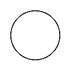
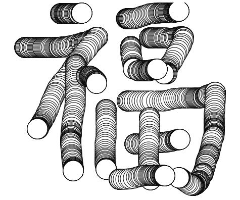

<h1 style="color: #ccc">p5.js 1</h1>

# Introduction

*Oct 1, 2019*

## What is p5.js?

p5.js is a JavaScript library that starts with the original goal of [Processing](https://processing.org/) -- to make coding accessible for artists, designers, educators, and beginners -- and reinterprets this for today's web. p5.js has add-on libraries that make it easy to interact with other HTML5 objects, including text, input, video, webcam, and sound.

## Getting Started

1. All versions of p5.js are stored in a CDN (Content Delivery Network). You can see a history of these versions here: [p5.js CDN](https://cdnjs.com/libraries/p5.js).

2. A sample HTML page might look like this:

    ```html
    <html>
        <head>
            <script src="https://cdnjs.cloudflare.com/ajax/libs/p5.js/1.0.0/p5.js"></script>
            <script src="sketch.js"></script>
        </head>
        <body></body>
    </html>
    ```

3. Edit `sketch.js`:

    ```javascript
    // sketch.js

    function setup() {

    }

    function draw() {
        ellipse(50, 50, 80, 80)
    }
    ```

    This line of code means "draw an ellipse, with the center 50 pixels over from the left and 50 pixels down from the top, with a width and height of 80 pixels".

    > 

4. Next, we will skip ahead to a sketch that is a little more exciting:

    ```javascript
    // sketch.js

    function setup() {
        createCanvas(640, 480)
    }

    function draw() {
        if (mouseIsPressed) {
            ellipse(mouseX, mouseY, 40, 40)
        }
    }
    ```

    This program creates a canvas that is 640 pixels wide and 480 pixels high. When a mouse button is pressed, it starts drawing white circles at the position of the mouse. 

    > 
