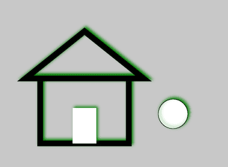

<h1 style="color: #ccc">p5.js 2</h1>

# p5.js Overview

*Apr 21, 2020*

## Basics

1. There are two main functions you will use in your program. The `setup()` block runs once, and is typically used for initialisation, or for creating a program that does not need a loop running code repeatedly. The `draw()` block runs repeatedly, and is used for animation.

2. By default, the drawing canvas has a size of 100x100. If you want to set a custom size, use the `createCanvas()` function. It is a good idea to always make this the first line in `setup()`.

    If you would like to specify a location for the canvas, rather than appending directly to the end, you can use the `parent()` method. In the `<body>` of your html file, create a container where you would like your canvas to get inserted, with ID of your choice:

    ```html
    <div id="myContainer"></div>
    ```

    Then use a variable to store a pointer to the canvas you create, and call `.parent()` on this variable:

    ```javascript
    function setup() {
        let myCanvas = createCanvas(600, 400)
        myCanvas.parent("myContainer")
    }
    ```

3. The p5.js API provides a lot of functionality for creating graphics, but there is some native HTML5 Canvas functionality that is not exposed. You can still call it directly using the variable `drawingContext` with [native canvas API](https://developer.mozilla.org/en-US/docs/Web/API/CanvasRenderingContext2D):

    ```javascript
    function setup() {
        const myCanvas = createCanvas(400, 300)
        myCanvas.parent("myContainer")

        const ctx = drawingContext

        // Shadow
        ctx.shadowOffsetX = 5
        ctx.shadowOffsetY = -5
        ctx.shadowBlur = 10
        ctx.shadowColor = "green"

        background(200)
        ellipse(300, 200, 50, 50)

        // Set line width
        ctx.lineWidth = 10

        // Wall
        ctx.strokeRect(75, 140, 150, 110)

        // Door
        ctx.fillRect(130, 190, 40, 60)

        // Roof
        ctx.beginPath()
        ctx.moveTo(50, 140)
        ctx.lineTo(150, 60)
        ctx.lineTo(250, 140)
        ctx.closePath()
        ctx.stroke()
    }
    ```

    The resulting drawing looks like this:

    > 

## Local Server

1. Some functionality, loading external files for example, works as expected when the files are placed online via HTTP. However, if you try to view them locally, you will see some kind of "cross-origin" errors in console. The solution is to view them using what is called a local web server.

2. Take the following steps to install a `browser-sync` server which has the added benefits of automatically reloading the webpage when any changes are made in the source code:

    - Install `http-server`:

    ```shell
    $ npm install -g http-server
    ```

    - Install `browser-sync`:

    ```shell
    $ npm install -g browser-sync
    ```

    - `cd` into your project folder.

    - Start the local server:

    ```shell
    $ browser-sync start --server -f -w
    ```

## Asynchronous Calls and File Loading

JavaScript is single threaded and synchronous, meaning one line of code completes before the next one runs. However, there are asynchronous functions that make the programs flow faster, e.g. loading images, external files, and URLs. Loading files from the sketch folder requires you running a local server.

### Callbacks

1. All of the load functions accept a callback function as an optional last argument. In the following example, an image is drawn once it is loaded:

    ```javascript
    function setup() {
        createCanvas(400, 300)
        loadImage('cat.jpeg', img => {
            image(img, 0, 0, 400, 300)
        })
    }
    ```

### Preload

1. Alternatively, you could use the `preload()` function. If a `preload()` block exists it runs first, then `setup()` waits until everything in there has completed before it gets run, so you can make use of things loaded in preload in `setup()` and `draw()`:

    ```javascript
    let img

    function preload() {
        img = loadImage('cat.jpeg')
    }

    function setup() {
        createCanvas(400, 300)
        image(img, 0, 0, 400, 300)
    }
    ```

### Loading Screen

1. If your sketch has large media dependencies such as images, audio or videos, these should be loaded into your sketch using the `preload()` function. Since loading large files can take some time, you might want to display a loading screen to your users.

2. To add a loading screen to your p5.js sketch, all you need to do is to include an HTML element on your page with the id `p5_loading`:

    ```html
    <div id="p5_loading" class="loadingclass">
        this could be some sweet graphics loading lots of bits.
    </div>
    ```

## Mouse and Touch Interaction

1. p5.js has a set of methods for handling mouse and touch interaction. The list below shows how they relate conceptually:

| Mouse | Touch |
|:---|:---|
| `mouseX` | `touchX` |
| `mouseY` | `touchY` |
| | `touches[]` |
| `mouseIsPressed` | |
| `mousePressed()` | `touchStarted()` |
| `mouseMoved()` | |
| `mouseDragged()` | `touchMoved()` |
| `mouseReleased()` | `touchEnded()` |
| `mouseClicked()` | |
| `mouseScrolled()` | |

## Libraries

1. One of the core ideas behind p5.js is that your sketch is not just the graphics canvas but the whole web page in your browser. For this reason, there is the *p5.dom library* that makes it easy to interact with other HTML5 objects, including text, hyperlink, image, input, video, audio, and webcam. There is also a *p5.sound library* that provides a friendly interface to HTML5 web audio API loading, playing, and synthesising sounds.

## Browser Functions and Native JavaScript

1. There are a few variables and functions that make browser interaction easier:

    - `windowWidth`, `windowHeight`
    - `displayWidth`, `displayHeight`
    - `winMouseX`, `winMouseY`
    - `fullscreen()`

2. You should be able to use any native JavaScript functions in your p5.js sketch without a problem, the [MDN JavaScript reference](https://developer.mozilla.org/en-US/docs/Web/JavaScript) is a good place to learn more.

## Namespace

1. By default, all p5.js functions are in the global namespace (i.e. bound to the window object), meaning you can call them simply `ellipse()`, `fill()`, etc. However, this might be inconvenient if you are mixing with other JavaScript libraries or writing long programs of your own.

2. p5.js currently supports two ways around this problem: *instance mode* and *on-demand global mode*.

### Instance Mode

1. An example of instance mode looks like this:

    ```javascript
    const s = p => {
        let x = 100
        let y = 100

        p.setup = () => {
            p.createCanvas(700, 400)
        }

        p.draw = () => {
            p.background(0)
            p.fill(255)
            p.rect(x, y, 50, 50)
        }
    }

    let myp5 = new p5(s)
    ```

2. Optionally, you can specify a default container for the canvas and any other elements to append to with a second argument:

    ```javascript
    let myp5 = new p5(s, 'myContainer')
    ```

    Note that creating instances like this also allows you to have more than one p5.js sketch on a single web page.

### On-Demand Global Mode

1. Typically p5.js is started only when the `<body>` loads and triggers `onload` event. Scripts in `<head>` are loaded and evaluated before p5.js is started, and hence are not aware of the p5.js functions at that point of time. However, it is fine when we use p5.js functions inside `setup()` and `draw()`. It is not until p5.js is started up that the `setup()` function is actually run, and at this point, the p5.js functions exist in the global namespace.

2. To initialize on-demand global mode at any point in a web page's life cycle, simply call `new p5()` without any arguments:

    ```javascript
    new p5()

    let boop = random(100)

    function setup() {
        createCanvas(100, 100)
    }

    function draw() {
        background(255, 0, boop)
    }
    ```

## Using p5.js in React

1. To use p5.js in a React application, we use the [react-p5](https://www.npmjs.com/package/react-p5) package:

    ```shell
    $ npm install react-p5
    ```

2. Using react-p5 in React is similar to using p5.js in instance-mode:

    ```javascript
    import React from 'react'
    import Sketch from 'react-p5'

    export default class App extends React.Component {
        x = 50
        y = 50

        setup = (p5, canvasParentRef) => {
            // Use parent to render canvas in this ref
            // (without that p5 renders this canvas outside the component)

            p5.createCanvas(500, 500).parent(canvasParentRef)
        }

        draw = p5 => {
            // Do not use setState in draw function or in functions that are
            // executed in draw function, use normal or class variables for this
            // purpose

            p5.background(0)
            p5.ellipse(this.x, thix.y, 70, 70)

            this.x++
        }

        render() {
            return <Sketch setup={this.setup} draw={this.draw} />
        }
    }
    ```
