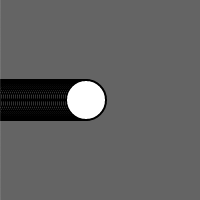
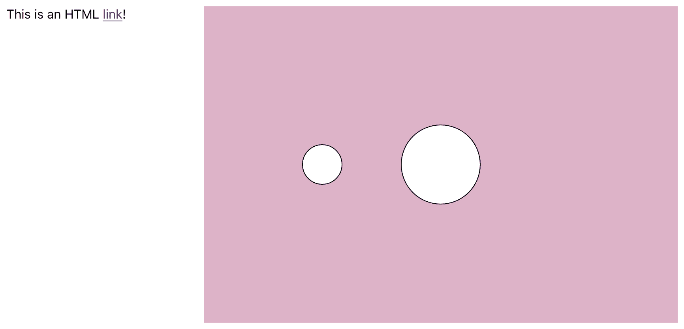
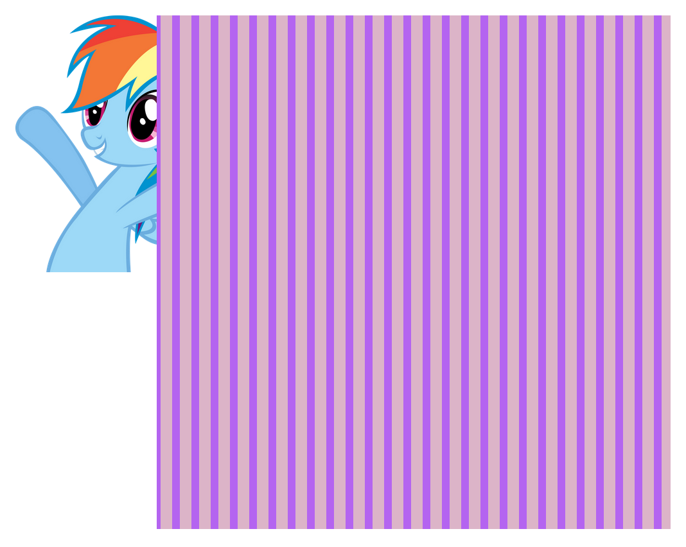
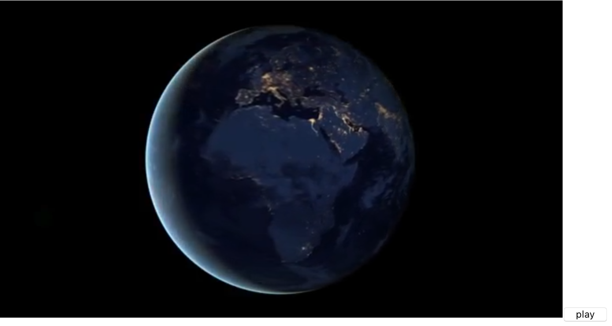

<h1 style="color: #ccc">p5.js 3</h1>

# p5.js Programming

Published on *Oct 10, 2020*

## Program Flow

### Loops

1. The `draw()` function in p5.js runs as a loop. The `draw()` loop may be stopped by calling `noLoop()`, and can then be resumed with `loop()`. If using `noLoop()` in `setup()`, it should be the last line inside the block:

    ```typescript
    import React from 'react'
    import Sketch from 'react-p5'
    import p5Types from 'p5'

    let x = 0

    const setup = async (p5: p5Types, canvasParentRef: Element) => {
        p5.createCanvas(100, 100).parent(canvasParentRef)
        p5.background(100)

        p5.mousePressed = () => {
            p5.loop()
        }

        p5.mouseReleased = () => {
            p5.noLoop()
        }

        p5.noLoop()
    }

    const draw = (p5: p5Types) => {
        p5.ellipse(x, p5.height / 2, 20, 20)
        x++
    }

    const App = () => <Sketch setup={setup} draw={draw} />

    export default App
    ```

    In this example, `noLoop()` is called in `setup()`, so the code within `draw()` runs only once at the start of the program. The `draw()` block will resume looping when mouse is pressed, stop again when mouse is released:

    > 

### Asynchronicity

1. In JavaScript, events may occur concurrently with the main program flow. Load functions in p5.js are asynchronous functions, for example, calling `loadImage()` returns immediately before loading is finished. To help with this issue of asynchronicity, load functions can be placed in `preload()` function that forces the program to wait until everything has loaded before moving on. An alternative to `preload()` is to use a callback function as the last argument to the load functions.

2. Load functions that accept callbacks:

    - `loadImage()` - Loads images
    - `loadJSON()` - Loads JSON
    - `loadFont()` - Loads fonts (.otf, .tff)
    - `loadStrings()` - Loads text files
    - `loadTable()` - Loads CSV files
    - `loadXML()` - Loads XML files
    - `loadBytes()` - Loads file as bytes
    - `loadModel()` - Loads geometry model (.stl, .obj)

3. Some DOM creation functions also accept callbacks:

    - `createImg()`
    - `createFileInput()`
    - `createVideo()`
    - `createAudio()`
    - `createCapture()`

### Event Listeners

1. An event listener or handler is also a type of callback. It is called whenever an event occurs such as when mouse is pressed, or a key is pressed etc.

2. Mouse functions that can be attached to an element:

    - `mousePressed()`
    - `mouseReleased()`
    - `mouseClicked()`
    - `doubleClicked()`
    - `mouseWheel()`
    - `mouseMoved()`
    - `mouseOver()`
    - `mouseOut()`

3. Keyboard functions and mouse function `mouseDragged()` cannot be attached to an element:

    - `mouseDragged()`
    - `keyPressed()` - For non-ASCII keys, use the `keyCode` variable; for ASCII keys, use the `key` variable. However, it does not distinguish between uppercase and lowercase. To distinguish case of the variable, use `keyTyped()`.
    - `keyTyped()` - Use the `key` variable to access ASCII keys, but action keys such as Ctrl, Shift, Alt are ignored.
    - `keyReleased()`

## Interactivity

### Mouse

1. The variables `mouseX` and `mouseY` store the x-coordinate and y-coordinate of the cursor relative to the origin in the upper-left corner of the display window.

    ```typescript
    import React from 'react'
    import Sketch from 'react-p5'
    import p5Types from 'p5'

    const setup = async (p5: p5Types, canvasParentRef: Element) => {
        p5.createCanvas(100, 100).parent(canvasParentRef)
        p5.frameRate(12)
    }

    const draw = (p5: p5Types) => {
        p5.background(255)
        p5.text(`X: \${p5.mouseX}`, 0, p5.height / 4)
        p5.text(`Y: \${p5.mouseY}`, 0, p5.height / 2)
    }

    const App = () => <Sketch setup={setup} draw={draw} />

    export default App
    ```

2. Relation between mouse position and visual elements.

    The circle is directly mapped to the cursor:

    ```typescript
    import React from 'react'
    import Sketch from 'react-p5'
    import p5Types from 'p5'

    const setup = async (p5: p5Types, canvasParentRef: Element) => {
        p5.createCanvas(100, 100).parent(canvasParentRef)
    }

    const draw = (p5: p5Types) => {
        p5.background(100)
        p5.ellipse(p5.mouseX, p5.mouseY, 33, 33)
    }

    const App = () => <Sketch setup={setup} draw={draw} />

    export default App
    ```

## Beyond the Canvas

### HTML Elements

1. There is one important distinction between working with elements on an element level, and calling methods like `rect()` or `fill()` to draw on a canvas level:

    ```typescript
    import React from 'react'
    import Sketch from 'react-p5'
    import p5Types from 'p5'

    const setup = (p5: p5Types, canvasParentRef: Element) => {
        const canvas = p5.createCanvas(600, 400).parent(canvasParentRef)

        // Calling methods of the dom element outside of canvas
        canvas.class("lemon")
        canvas.position(300, 50)
    }

    const draw = (p5: p5Types) => {
        // Calling methods to draw directly into the canvas
        p5.background(220, 180, 200)
        p5.ellipse(p5.width / 2, p5.height / 2, 100, 100)
        p5.ellipse(p5.width / 4, p5.height / 2, 50, 50)
    }

    const App: React.FC = () => <Sketch setup={setup} draw={draw} />

    export default App
    ```

    When drawing in canvas, you typically need to redraw everything in the scene every frame. However, when you are working with elements, they hold a static state that you can change at any time by calling one of their methods. This method is called only once in setup, after that it stays in position and does not need to be reset every frame.

2. In addition to `createCanvas(w, h)`, there are a number of other methods like `createDiv()`, `createP()`, `createA()`:

    ```typescript
    import React from 'react'
    import Sketch from 'react-p5'
    import p5Types from 'p5'

    const setup = (p5: p5Types, canvasParentRef: Element) => {
        const canvas = p5.createCanvas(600, 400).parent(canvasParentRef)

        // Calling methods of the dom element outside of canvas
        canvas.class("lemon")
        canvas.position(300, 50)

        const a='<a href="https://example.org" target="_blank">link</a>'
        const txt = p5.createDiv(`This is an HTML ${a}!`)

        // Calling methods of the dom element outside of canvas
        txt.position(50, 50)
    }

    const draw = (p5: p5Types) => {
        // Calling methods to draw directly into the canvas
        p5.background(220, 180, 200)
        p5.ellipse(p5.width / 2, p5.height / 2, 100, 100)
        p5.ellipse(p5.width / 4, p5.height / 2, 50, 50)
    }

    const App: React.FC = () => <Sketch setup={setup} draw={draw} />

    export default App
    ```

    This creates a `div` element in addition to the `canvas` element:

    > 

    Each of these methods create a `p5.Element`, which is a wrapper around an HTML element, giving simplified access to many of its main properties. However, if you want to access the underlying HTML element, you can use the `.elt` property.

3. An HTML image differs from one drawn on the canvas using `image()`. You don't need to use `loadImage()`, and you don't need to draw it every frame; once you create it, the image exists on the page until you remove it:

    ```typescript
    import React from 'react'
    import Sketch from 'react-p5'
    import p5Types from 'p5'

    const setup = (p5: p5Types, canvasParentRef: Element) => {
        const href='http://th07.deviantart.net/fs70/PRE/i/2011/260/3/5/dash_hooray_by_rainbowcrab-d49xk0d.png'
        const img = p5.createImg(href).parent(canvasParentRef)

        img.position(190, 50)
        img.size(200, 200)

        const canvas = p5.createCanvas(400, 400).parent(canvasParentRef)

        canvas.position(300, 50)
    }

    const draw = (p5: p5Types) => {
        p5.background(220, 180, 200)

        p5.strokeWeight(6)
        p5.stroke(180, 100, 240)

        for (let i = 0; i < p5.width; i += 15) {
            p5.line(i, 0, i, p5.height)
        }
    }

    const App: React.FC = () => <Sketch setup={setup} draw={draw} />

    export default App
    ```

    This creates an `img` element:

    > 

4. There are also create methods for adding elements that deal with media: `createVideo()`, `createAudio()` and `createCapture()`. These methods create a `p5.MediaElement`, which has some additional methods beyond those of a normal `p5.Element`. Again, while many features of HTML5 media are accessible through the *p5.dom* API, there is more [native functionality](https://developer.mozilla.org/en-US/docs/Web/API/HTMLMediaElement).

    The first parameter of `createVideo()` can be either a single string path to a video file, or an array of string paths to different formats of the same video. This is useful for ensuring that your video can play across different browsers, as each supports different formats:

    ```typescript
    import React from 'react'
    import Sketch from 'react-p5'
    import p5Types from 'p5'

    let playing = false
    let mov: p5Types.MediaElement
    let button: p5Types.Element

    const toggle = () => {
        if (playing) {
            mov.pause()
            button.html('play')
        } else {
            mov.loop()
            button.html('pause')
        }
        playing = !playing
    }

    const setup = (p5: p5Types, canvasParentRef: Element) => {
        mov = p5.createVideo('https://file-examples-com.github.io/uploads/2018/04/file_example_MOV_640_800kB.mov')

        button = p5.createButton('play')
        button.mousePressed(toggle)
    }

    const App: React.FC = () => <Sketch setup={setup} />

    export default App
    ```

    This creates a `video` element:

    > 

5. The *p5.dom* API supports a subset as much of all the HTML elements as possible. If you like to add an element that does not have a specific create method, you can use the general `createElement()` method:

    ```typescript
    const setup = (p5: p5Types, canvasParentRef: Element) => {
        const h1 = p5.createElement('h1', 'This is some heading text')
        let canvas = p5.createCanvas(400, 400)
    }
    ```

### Element Listeners

1. Every element has its own `mouseOver()` and `mouseOut()` methods that get called when you move the mouse over or off of the individual element.

    ```typescript
    import React from 'react'
    import Sketch from 'react-p5'
    import p5Types from 'p5'

    const setup = (p5: p5Types, canvasParentRef: Element) => {
        const href='http://th07.deviantart.net/fs70/PRE/i/2011/260/3/5/dash_hooray_by_rainbowcrab-d49xk0d.png'
        const img = p5.createImg(href).parent(canvasParentRef)

        img.position(190, 50)
        img.size(200, 200)

        const canvas = p5.createCanvas(400, 400).parent(canvasParentRef)

        canvas.position(300, 50)
        canvas.mouseOver(() => img.hide())
        canvas.mouseOut(() => img.show())
    }

    const draw = (p5: p5Types) => {
        p5.background(220, 180, 200)

        p5.strokeWeight(6)
        p5.stroke(180, 100, 240)

        for (let i = 0; i < p5.width; i += 15) {
            p5.line(i, 0, i, p5.height)
        }
    }

    const App: React.FC = () => <Sketch setup={setup} draw={draw} />

    export default App
    ```

2. Elements also have `mousePressed()` methods that let you connect functions to the mouse pressed event on a per element level. This is different than using the global `mousePressed()` method, which gets triggered anytime the mouse is clicked anywhere.

    Here is one example illustrating the difference between global and element specific listeners. In this example, click on the canvas makes the background lighter and the ellipse larger. However, click outside the canvas only makes the background lighter:

    ```typescript
    import React from 'react'
    import Sketch from 'react-p5'
    import p5Types from 'p5'

    let grey = 0
    let diameter = 5

    const setup = (p5: p5Types, canvasParentRef: Element) => {
        const canvas = p5.createCanvas(400, 400).parent(canvasParentRef)

        canvas.mousePressed(() => diameter += 5)

        p5.mousePressed = () => grey += 10
    }

    const draw = (p5: p5Types) => {
        p5.background(grey)
        p5.ellipse(400 / 2, 400 / 2, diameter, diameter)
    }

    const App: React.FC = () => <Sketch setup={setup} draw={draw} />

    export default App
    ```

### Searching Elements

1. You can use `.class()` to assign a class name, and `id()` to assign an id to the element. `select('#id')` returns the element on the page with the given id or null if none is found, while `selectAll('.class-name')` returns an array of all elements with the given class name, or an empty array if none are found:

    ```typescript
    import React from 'react'
    import Sketch from 'react-p5'
    import p5Types from 'p5'

    const setup = (p5: p5Types, canvasParentRef: Element) => {
        const myDiv0 = p5.createDiv('This is my div 0')
        const myDiv1 = p5.createDiv('This is my div 1')
        const myDiv2 = p5.createDiv('This is my div 2')

        myDiv0.class('donkey')
        myDiv0.position(50, 50)
        myDiv1.class('donkey')
        myDiv1.position(300, 50)
        myDiv2.id('yogurt')
        myDiv2.position(550, 50)

        p5.keyPressed = () => {
            const donkeys = p5.selectAll('.donkey')
            donkeys.forEach(d => d.hide())
        }
    }

    const App: React.FC = () => <Sketch setup={setup} />

    export default App
    ```

### Removing Elements

1. You can remove any element by calling its `.remove()` method. This removes any event handler connected to the element, and removes the element from the page:

    ```typescript
    const setup = (p5: p5Types, canvasParentRef: Element) => {
        const myDiv = p5.createDiv('this is some text')
        myDiv.remove()
    }
    ```

2. `removeElements()` will remove all elements created by p5.js, except any canvas / graphics elements created by `createCanvas()` or `createGraphics()`:

    ```typescript
    const setup = (p5: p5Types, canvasParentRef: Element) => {
        p5.createCanvas(100, 100).parent(canvasParentRef)
        p5.createDiv('this is some text')
        p5.createP('this is a paragraph')

        p5.mousePressed = () => {
            p5.removeElements()
        }
    }
    ```

## Streaming Video into Canvas

1. In some projects it may be advantageous to copy the pixels of a video into a canvas rather than display the video element itself on the page. This can be accomplished by loading the video into an object and sending that object to the `image()` function:

    ```typescript
    import React from 'react'
    import Sketch from 'react-p5'
    import p5Types from 'p5'

    let playing = false
    let mov: p5Types.MediaElement
    let button: p5Types.Element

    function convertToElement(media: p5Types.MediaElement): p5Types.Element {
        return media as any as p5Types.Element
    }

    const toggle = () => {
        if (playing) {
            mov.pause()
            button.html('play')
        } else {
            mov.loop()
            button.html('pause')
        }
        playing = !playing
    }

    const setup = async (p5: p5Types, canvasParentRef: Element) => {
        p5.createCanvas(600, 300).parent(canvasParentRef)
        p5.background(100)

        mov = p5.createVideo('https://file-examples-com.github.io/uploads/2018/04/file_example_MOV_640_800kB.mov')
        convertToElement(mov).hide()

        button = p5.createButton('play')
        button.mousePressed(toggle)
    }

    const draw = (p5: p5Types) => {
        p5.image(convertToElement(mov), 50, 50, 400, 200)
    }

    const App: React.FC = () => <Sketch setup={setup} draw={draw} />

    export default App
    ```

2. You can create a new `<video>` element that contains the audio/video feed from a webcam using the `createCapture()` function. This can be drawn into the canvas in a similar manner as we did above:

    ```typescript
    import React from 'react'
    import Sketch from 'react-p5'
    import p5Types from 'p5'

    let capture: p5Types.Element
    let ready = false

    const setup = async (p5: p5Types, canvasParentRef: Element) => {
        p5.createCanvas(200, 200).parent(canvasParentRef)
        p5.background(100)

        capture = p5.createCapture(p5.VIDEO, () => ready = true)
        capture.size(200, 200)
    }

    const draw = (p5: p5Types) => {
        if (ready) {
            capture.position(p5.mouseX, 0)

            p5.image(capture, 0, 0, 200, 200)
            p5.filter(p5.INVERT)
        }
    }

    const App = () => <Sketch setup={setup} draw={draw} />

    export default App
    ```
