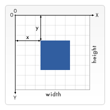

<h1 style="color: #ccc">Web Canvas API</h1>

# Drawing Shapes

Apr 26, 2024

## Canvas Grid

1.  Normally, $1$ unit in the coordinate space of the canvas grid corresponds to $1$ pixel on the element. Therefore, a `<canvas>` element that is $150$ pixels wide and $150$ pixels high has a grid with coordinate space of $150 \times 150$.

    > 

    The origin of the grid is positioned at coordinate $(0,0)$, in the top left corner. All elements are placed relative to this origin. Thus, the position of the top-left corner of the blue square is located $x$ pixels from the left and $y$ pixels from the top, at coordinate $(x,y)$.

## Drawing Rectangles

1.  Unlike SVG, `<canvas>` supports only two primitives shapes: rectangles and paths.

2.  There are three functions that draw rectangles on canvas:

    -   `fillRect(x, y, width, height)`<br>
        Draws a filled rectangle.
    -   `strokeRect(x, y, width, height)`<br>
        Draws a rectangular outline.
    -   `clearRect(x, y, width, height)`<br>
        Clears the specified rectangular area, making it fully transparent.

    <span class="special-label">Rectangular Shape Example.</span>

    ```html
    <canvas id="tutorial" style="border: 1px solid #ccc"
        width="150" height="150"></canvas>
    <script>
        const canvas = document.getElementById('tutorial')
        const ctx = canvas.getContext('2d')

        ctx.fillRect(25, 25, 100, 100)
        ctx.clearRect(45, 45, 60, 60)
        ctx.strokeRect(50, 50, 50, 50)
    </script>
    ```

    <canvas id="tutorial" style="border: 1px solid #ccc" width="150" height="150"></canvas>

## Drawing Paths

1.  A path consists of points connected by line segments of varying shapes, widths, and colours. Paths, including subpaths, can be closed.

    The first step in creating a path is to call the `beginPath()` function. Internally, paths are stored as a list of subpaths (including lines, arcs, etc.) that together form a shape. Each time this method is called, it resets the list, allowing for the creation of new shapes.

    The second step involves calling functions that define the paths to be drawn.

    The third, and optional, step is to use `closePath()`. This method attempts to close the shape by drawing a straight line from the current point to the start. If the shape is already closed or there is only one point in the list, this function will not perform any action.

    When you use `fill()`, any open shapes are automatically closed, eliminating the need to explicitly call `closePath()`. However, this automatic closure does not apply when you use `stroke()`.

### Drawing a Triangle

1.  Drawing a triangle using paths

    <span class="special-label">Triangular Shape Example.</span>

    ```html
    <canvas id="tutorial" style="border: 1px solid #ccc"
        width="150" height="150"></canvas>
    <script>
        const canvas = document.getElementById('tutorial')
        const ctx = canvas.getContext('2d')

        ctx.beginPath()
        ctx.moveTo(50, 75)
        ctx.lineTo(100, 100)
        ctx.lineTo(100, 50)
        ctx.fill()
    </script>
    ```

    <canvas id="tutorial-triangle" style="border: 1px solid #ccc" width="150" height="150"></canvas>

### Moving The Pen

1.  One very useful function, which does not actually draw anything but becomes part of the path list described above, is the `moveTo()` function. You can probably best think of this as lifting a pen or pencil from one spot on a piece of paper and placing it down on another spot.

    <span class="special-label">Smiley Example.</span>

    ```html
    <canvas id="tutorial" style="border: 1px solid #ccc"
        width="150" height="150"></canvas>
    <script>
        const canvas = document.getElementById('tutorial')
        const ctx = canvas.getContext('2d')

        ctx.beginPath()
        ctx.arc(75, 75, 50, 0, Math.PI * 2, true)
        ctx.moveTo(110, 75)
        ctx.arc(75, 75, 35, 0, Math.PI, false)
        ctx.moveTo(65, 65)
        ctx.arc(60, 65, 5, 0, Math.PI * 2, true)
        ctx.moveTo(95, 65)
        ctx.arc(90, 65, 5, 0, Math.PI * 2, true)
        ctx.stroke()
    </script>
    ```

    <canvas id="tutorial-smiley" style="border: 1px solid #ccc" width="150" height="150"></canvas>

### Lines

1.  To draw straight lines, use the `lineTo()` function.

    <span class="special-label">Lines Example.</span>

    ```html
    <canvas id="tutorial" style="border: 1px solid #ccc"
        width="150" height="150"></canvas>
    <script>
        const canvas = document.getElementById('tutorial')
        const ctx = canvas.getContext('2d')

        // Filled triangle
        ctx.beginPath()
        ctx.moveTo(25, 25)
        ctx.lineTo(105, 25)
        ctx.lineTo(25, 105)
        ctx.fill()

        // Stroked triangle
        ctx.beginPath()
        ctx.moveTo(125, 125)
        ctx.lineTo(125, 45)
        ctx.lineTo(45, 125)
        ctx.closePath()
        ctx.stroke()
    </script>
    ```

    <canvas id="tutorial-lines" style="border: 1px solid #ccc" width="150" height="150"></canvas>

### Arcs

1.  To draw arcs or circles, use the `arc()` or `arcTo()` function.

    -   `arc(x, y, radius, startAngle, endAngle, counterclockwise)`<br>
        Draws an arc centred at the (`x`, `y`) position with `radius`, starting at `startAngle` and ending at `endAngle`, going in the given direction indicated by `counterclockwise` (defaulting to clockwise if not specified).
    -   `arcTo(x1, y1, x2, y2, radius)`<br>
        Draws an arc that tangentially connects to two lines defined by the current point and the first control point (`x1`, `y1`), and then the first control point and the second control point (`x2`, `y2`), with the specified `radius`. The arc is automatically connected to the previous path's point by a strainght line.

    <span class="special-label">Arcs Example.</span>

    ```html
    <canvas id="tutorial" style="border: 1px solid #ccc"
        width="150" height="150"></canvas>
    <script>
        const canvas = document.getElementById('tutorial')
        const ctx = canvas.getContext('2d')

        for (let i = 0; i < 3; i++) {
            for (let j = 0; j < 4; j++) {
                ctx.beginPath()

                const x = 39 + i * 36
                const y = 21 + j * 36
                const radius = 15
                const startAngle = 0
                const endAngle = Math.PI + (Math.PI * i) / 2
                const counterclockwise = j % 2 !== 0

                ctx.arc(x, y, radius, startAngle, endAngle, counterclockwise)

                if (j > 1) {
                    ctx.fill()
                } else {
                    ctx.stroke()
                }
            }
        }
    </script>
    ```

    <canvas id="tutorial-arcs" style="border: 1px solid #ccc" width="150" height="150"></canvas>

    <span class="special-label">Tangential Arcs Example.</span>

    ```html
    <canvas id="tutorial" style="border: 1px solid #ccc"
        width="150" height="150"></canvas>
    <script>
        const canvas = document.getElementById('tutorial')
        const ctx = canvas.getContext('2d')

        // Tangent lines
        ctx.strokeStyle = 'gray'
        ctx.beginPath()
        ctx.moveTo(120, 40)
        ctx.lineTo(120, 110)
        ctx.lineTo(30, 40)
        ctx.stroke()

        // Tangential arc
        ctx.strokeStyle = 'black'
        ctx.beginPath()
        ctx.moveTo(120, 40)
        ctx.arcTo(120, 110, 30, 40, 25)
        ctx.stroke()

        // Start point
        ctx.fillStyle = 'blue'
        ctx.beginPath()
        ctx.arc(120, 40, 4, 0, Math.PI * 2)
        ctx.fill()

        // Control points
        ctx.fillStyle = 'red'
        ctx.beginPath()
        ctx.arc(120, 110, 4, 0, Math.PI * 2)
        ctx.arc(30, 40, 4, 0, Math.PI * 2)
        ctx.fill()
    </script>
    ```

    <canvas id="tutorial-tangential-arcs" style="border: 1px solid #ccc" width="150" height="150"></canvas>

2.  Tangential arc between two lines can be mathematically represented by a pair of parametric equations with the parameter $t$ ranging from $a$ to $b$, where $a \leq t \leq b$. Here, $a$ and $b$ are the starting and ending angles, respectively, of the arc on the circle.

    $$
    x(t) = x_0 + r\cos(t)\\
    y(t) = y_0 + r\sin(t)
    $$

    where

    -   $r$ denotes the radius,
    -   $(x_0,y_0)$ denotes the centre of the circle.

### Bézier Curve

1.  The next types of paths available are Bézier curves, available in both quadratic and cubic varieties. These are generally used to draw complex organic shapes.

    -   `quadraticCurveTo(cp1x, cp1y, x, y)`<br>
        Draws a quadratic Bézier curve from the current point to the point (`x`, `y`) using (`cp1x`, `cp1y`) as the single control point. The control point defines the direction and shape of the curve up to the endpoint.
    -   `bezierCurveTo(cp1x, cp1y, cp2x, cp2y, x, y)`<br>
        Draws a cubic Bézier curve from the current point to the point (`x`, `y`) using (`cp1x`, `cp1y`) as the first control point and (`cp2x`, `cp2y`) as the second control point. Both control points define the direction and shape of the curve up to the endpoint.

    <span class="special-label">Quadratic Bézier Curve Example.</span>

    ```html
    <canvas id="tutorial" style="border: 1px solid #ccc"
        width="150" height="150"></canvas>
    <script>
        const canvas = document.getElementById('tutorial')
        const ctx = canvas.getContext('2d')

        // Guiding lines
        ctx.strokeStyle = 'gray'
        ctx.beginPath()
        ctx.moveTo(20, 105)
        ctx.lineTo(50, 45)
        ctx.lineTo(130, 75)
        ctx.stroke()

        // Quadratic beziér curve
        ctx.strokeStyle = 'black'
        ctx.beginPath()
        ctx.moveTo(20, 105)
        ctx.quadraticCurveTo(50, 45, 130, 75)
        ctx.stroke()

        // Start and end points
        ctx.fillStyle = 'blue'
        ctx.beginPath()
        ctx.arc(20, 105, 4, 0, Math.PI * 2)
        ctx.arc(130, 75, 4, 0, Math.PI * 2)
        ctx.fill()

        // Control point
        ctx.fillStyle = 'red'
        ctx.beginPath()
        ctx.arc(50, 45, 4, 0, Math.PI * 2)
        ctx.fill()

        // Caption
        ctx.fillStyle = 'black'
        ctx.fillText('Quadratic Beziér', 50, 110)
    </script>
    ```

    <canvas id="tutorial-quadratic-bezier" style="border: 1px solid #ccc" width="150" height="150"></canvas>

    <span class="special-label">Cubic Bézier Curve Example.</span>

    ```html
    <canvas id="tutorial" style="border: 1px solid #ccc"
        width="150" height="150"></canvas>
    <script>
        const canvas = document.getElementById('tutorial')
        const ctx = canvas.getContext('2d')

        // Guiding lines
        ctx.strokeStyle = 'gray'
        ctx.beginPath()
        ctx.moveTo(20, 105)
        ctx.lineTo(50, 45)
        ctx.moveTo(100, 45)
        ctx.lineTo(130, 75)
        ctx.stroke()

        // Cubic beziér curve
        ctx.strokeStyle = 'black'
        ctx.beginPath()
        ctx.moveTo(20, 105)
        ctx.bezierCurveTo(50, 45, 100, 45, 130, 75)
        ctx.stroke()

        // Start and end points
        ctx.fillStyle = 'blue'
        ctx.beginPath()
        ctx.arc(20, 105, 4, 0, Math.PI * 2)
        ctx.arc(130, 75, 4, 0, Math.PI * 2)
        ctx.fill()

        // Control point
        ctx.fillStyle = 'red'
        ctx.beginPath()
        ctx.arc(50, 45, 4, 0, Math.PI * 2)
        ctx.arc(100, 45, 4, 0, Math.PI * 2)
        ctx.fill()

        // Caption
        ctx.fillStyle = 'black'
        ctx.fillText('Cubic Beziér', 70, 110)
    </script>
    ```

    <canvas id="tutorial-cubic-bezier" style="border: 1px solid #ccc" width="150" height="150"></canvas>

2.  To learn more about Bézier curves, we begin with the linear Bézier curve, which is the simplest form of Bézier curves. This curve represents a straight line segment connecting the start and end points.

    $$
    B(t) = (1 - t)P_{0} + tP_{1}
    $$

    where

    -   $t$ is the parameter, ranging from $0$ to $1$,
    -   $P_{0}$ is the start point,
    -   $P_{1}$ is the end point.

    As $t$ changes from $0$ to $1$, the point $B(t)$ moves linearly from $P_{0}$ to $P_{1}$, tracing the direct path between these two points.

    <canvas id="animate-linear-bezier" style="border: 1px solid #ccc;" width="150" height="150"></canvas>

    <button id="button-animate-linear-bezier"><li class="fa-solid fa-play"></li></button>
    <button id="button-repeat-linear-bezier"><li class="fa-solid fa-repeat"></li></button>

3.  Quadratic Bézier curve represents a curve starts at point $P_{0}$, moves towards and influenced by a control point $P_{1}$, before ending at the endpoint $P_{2}$.

    -   Step 1: Define linear Bézier curves

        The first linear curve, $L_{0}(t)$, goes from $P_{0}$ to $P_{1}$:

        $$
        L_{0}(t) = (1 - t)P_{0} + tP_{1}
        $$

        The second linear curve, $L_{1}(t)$, goes from $P_{1}$ to $P_{2}$:

        $$
        L_{1}(t) = (1 - t)P_{1} + tP_{2}
        $$

    -   Step 2: Interpolate between $L_{0}(t)$ and $L_{1}(t)$

        The quadratic Bézier curve is then a linear interpolation between $L_{0}(t)$ and $L_{1}(t)$ at each value of $t$:

        $$
        B(t) = (1 - t)L_{0}(t) + tL_{1}(t)
        $$

        Substituting $L_{0}(t)$ and $L_{1}(t)$ into the equation,

        $$
        B(t) = (1 - t)[(1 - t)P_{0} + tP_{1}] + t[(1 - t)P_{1} + tP_{2}]
        $$

        Expanding and simplifying,

        $$
        B(t) = (1 - t)^{2}P_{0} + 2(1 - t)tP_{1} + t^{2}P_{2}
        $$

    <canvas id="animate-quadratic-bezier" style="border: 1px solid #ccc;" width="150" height="150"></canvas>

    <button id="button-animate-quadratic-bezier"><li class="fa-solid fa-play"></li></button>
    <button id="button-repeat-quadratic-bezier"><li class="fa-solid fa-repeat"></li></button>

<style scoped>
    button {
        align-items: center;
        background-color: transparent;
        border: 1px solid #ccc;
        display: inline-flex;
        color: black;
        cursor: pointer;
        height: 30px;
        justify-content: center;
        width: 30px;
        padding: 0;
    }
    button.selected {
        border: 1px solid #333;
    }
</style>

<script>
    var isLinearBezierAnimating = false
    var isQuadraticBezierAnimating = false

    document.getElementById('button-animate-linear-bezier')
        .addEventListener('click', handleAnimateLinearBezierClick)
    document.getElementById('button-repeat-linear-bezier')
        .addEventListener('click', handleRepeatLinearBezierClick)

    document.getElementById('button-animate-quadratic-bezier')
        .addEventListener('click', handleAnimateQuadraticBezierClick)
    document.getElementById('button-repeat-quadratic-bezier')
        .addEventListener('click', handleRepeatQuadraticBezierClick)

    function handleAnimateLinearBezierClick(e) {
        switch (isLinearBezierAnimating) {
            case true:
                isLinearBezierAnimating = false
                displayLinearBezierStopped()
                break
            case false:
                isLinearBezierAnimating = true
                displayLinearBezierAnimating()
                animateLinearBezier(false, () => {
                    isLinearBezierAnimating = false
                    displayLinearBezierStopped()
                })
                break
        }
    }

    function handleRepeatLinearBezierClick(e) {
        isLinearBezierAnimating = true
        displayLinearBezierRepeating()
        animateLinearBezier(true, () => {
            isLinearBezierAnimating = false
            displayLinearBezierStopped()
        })
    }

    function handleAnimateQuadraticBezierClick(e) {
        switch (isQuadraticBezierAnimating) {
            case true:
                isQuadraticBezierAnimating = false
                displayQuadraticBezierStopped()
                break
            case false:
                isQuadraticBezierAnimating = true
                displayQuadraticBezierAnimating()
                animateQuadraticBezier(false, () => {
                    isQuadraticBezierAnimating = false
                    displayQuadraticBezierStopped()
                })
                break
        }
    }

    function handleRepeatQuadraticBezierClick(e) {
        isQuadraticBezierAnimating = true
        displayQuadraticBezierRepeating()
        animateQuadraticBezier(true, () => {
            isQuadraticBezierAnimating = false
            displayQuadraticBezierStopped()
        })
    }

    function displayLinearBezierStopped() {
        document.getElementById('button-animate-linear-bezier')
            .innerHTML = `<li class="fa-solid fa-play"></li>`
        document.getElementById('button-repeat-linear-bezier')
            .classList.remove('selected')
    }

    function displayLinearBezierAnimating() {
        document.getElementById('button-animate-linear-bezier')
            .innerHTML = `<li class="fa-solid fa-stop"></li>`
        document.getElementById('button-repeat-linear-bezier')
            .classList.remove('selected')
    }

    function displayLinearBezierRepeating() {
        document.getElementById('button-animate-linear-bezier')
            .innerHTML = `<li class="fa-solid fa-stop"></li>`
        document.getElementById('button-repeat-linear-bezier')
            .classList.add('selected')
    }

    function displayQuadraticBezierStopped() {
        document.getElementById('button-animate-quadratic-bezier')
            .innerHTML = `<li class="fa-solid fa-play"></li>`
        document.getElementById('button-repeat-quadratic-bezier')
            .classList.remove('selected')
    }

    function displayQuadraticBezierAnimating() {
        document.getElementById('button-animate-quadratic-bezier')
            .innerHTML = `<li class="fa-solid fa-stop"></li>`
        document.getElementById('button-repeat-quadratic-bezier')
            .classList.remove('selected')
    }

    function displayQuadraticBezierRepeating() {
        document.getElementById('button-animate-quadratic-bezier')
            .innerHTML = `<li class="fa-solid fa-stop"></li>`
        document.getElementById('button-repeat-quadratic-bezier')
            .classList.add('selected')
    }

    function animateLinearBezier(repeat = false, onEnded) {
        const p0 = { x: 20, y: 105 }
        const p1 = { x: 130, y: 75 }
        const totalTime = 3000

        var startTime = performance.now()
        window.requestAnimationFrame(draw)

        function draw() {
            const canvas = document.getElementById('animate-linear-bezier')
            const ctx = canvas.getContext('2d')

            // Update states
            t = Math.min(performance.now() - startTime, totalTime) / totalTime
            b = calcLinearBezier(t, p0, p1)

            // Draw
            ctx.clearRect(0, 0, 150, 150)

            ctx.beginPath()
            ctx.moveTo(p0.x, p0.y)
            ctx.lineTo(b.x, b.y)
            ctx.stroke()

            // Start and end points
            ctx.fillStyle = 'blue'
            ctx.beginPath()
            ctx.arc(p0.x, p0.y, 4, 0, Math.PI * 2)
            ctx.arc(p1.x, p1.y, 4, 0, Math.PI * 2)
            ctx.fill()

            // Ended
            if (t >= 1) {
                startTime = performance.now()
                if (!repeat) {
                    onEnded()
                }
            }

            // Request next frame
            if (isLinearBezierAnimating) {
                window.requestAnimationFrame(draw)
            }
        }
    }

    function animateQuadraticBezier(repeat = false, onEnded) {
        const p0 = { x: 20, y: 105 }
        const p1 = { x: 50, y: 45 }
        const p2 = { x: 130, y: 75 }
        const totalTime = 3000

        var startTime = performance.now()
        window.requestAnimationFrame(draw)

        function draw() {
            const canvas = document.getElementById('animate-quadratic-bezier')
            const ctx = canvas.getContext('2d')

            // Update states
            t = Math.min(performance.now() - startTime, totalTime) / totalTime
            l0 = calcLinearBezier(t, p0, p1)
            l1 = calcLinearBezier(t, p1, p2)

            // Draw
            ctx.clearRect(0, 0, 150, 150)

            ctx.beginPath()
            ctx.moveTo(p0.x, p0.y)
            ctx.lineTo(l0.x, l0.y)
            ctx.moveTo(p1.x, p1.y)
            ctx.lineTo(l1.x, l1.y)
            ctx.stroke()

            // Start and end points
            ctx.fillStyle = 'blue'
            ctx.beginPath()
            ctx.arc(p0.x, p0.y, 4, 0, Math.PI * 2)
            ctx.arc(p2.x, p2.y, 4, 0, Math.PI * 2)
            ctx.fill()

            // Control points
            ctx.fillStyle = 'red'
            ctx.beginPath()
            ctx.arc(p1.x, p1.y, 4, 0, Math.PI * 2)
            ctx.fill()

            // Ended
            if (t >= 1) {
                startTime = performance.now()
                if (!repeat) {
                    onEnded()
                }
            }

            // Request next frame
            if (isQuadraticBezierAnimating) {
                window.requestAnimationFrame(draw)
            }
        }
    }

    function calcLinearBezier(t, a, b) {
        return {
            x: (1 - t) * a.x + t * b.x,
            y: (1 - t) * a.y + t * b.y,
        }
    }

{
    const canvas = document.getElementById('tutorial')
    const ctx = canvas.getContext('2d')

    ctx.fillRect(25, 25, 100, 100)
    ctx.clearRect(45, 45, 60, 60)
    ctx.strokeRect(50, 50, 50, 50)
}
{
    const canvas = document.getElementById('tutorial-triangle')
    const ctx = canvas.getContext('2d')

    ctx.beginPath()
    ctx.moveTo(50, 75)
    ctx.lineTo(100, 100)
    ctx.lineTo(100, 50)
    ctx.fill()
}
{
    const canvas = document.getElementById('tutorial-smiley')
    const ctx = canvas.getContext('2d')

    ctx.beginPath()
    ctx.arc(75, 75, 50, 0, Math.PI * 2, true)
    ctx.moveTo(110, 75)
    ctx.arc(75, 75, 35, 0, Math.PI, false)
    ctx.moveTo(65, 65)
    ctx.arc(60, 65, 5, 0, Math.PI * 2, true)
    ctx.moveTo(95, 65)
    ctx.arc(90, 65, 5, 0, Math.PI * 2, true)
    ctx.stroke()
}
{
    const canvas = document.getElementById('tutorial-lines')
    const ctx = canvas.getContext('2d')

    // Filled triangle
    ctx.beginPath()
    ctx.moveTo(25, 25)
    ctx.lineTo(105, 25)
    ctx.lineTo(25, 105)
    ctx.fill()

    // Stroked triangle
    ctx.beginPath()
    ctx.moveTo(125, 125)
    ctx.lineTo(125, 45)
    ctx.lineTo(45, 125)
    ctx.closePath()
    ctx.stroke()
}
{
    const canvas = document.getElementById('tutorial-arcs')
    const ctx = canvas.getContext('2d')

    for (let i = 0; i < 3; i++) {
        for (let j = 0; j < 4; j++) {
            ctx.beginPath()
            const x = 39 + i * 36
            const y = 21 + j * 36
            const radius = 15
            const startAngle = 0
            const endAngle = Math.PI + (Math.PI * i) / 2
            const counterclockwise = j % 2 !== 0

            ctx.arc(x, y, radius, startAngle, endAngle, counterclockwise)

            if (j > 1) {
                ctx.fill()
            } else {
                ctx.stroke()
            }
        }
    }
}
{
    const canvas = document.getElementById('tutorial-tangential-arcs')
    const ctx = canvas.getContext('2d')

    // Tangent lines
    ctx.strokeStyle = 'gray'
    ctx.beginPath()
    ctx.moveTo(120, 40)
    ctx.lineTo(120, 110)
    ctx.lineTo(30, 40)
    ctx.stroke()

    // Tangential arc
    ctx.strokeStyle = 'black'
    ctx.beginPath()
    ctx.moveTo(120, 40)
    ctx.arcTo(120, 110, 30, 40, 25)
    ctx.stroke()

    // Start point
    ctx.fillStyle = 'blue'
    ctx.beginPath()
    ctx.arc(120, 40, 4, 0, Math.PI * 2)
    ctx.fill()

    // Control points
    ctx.fillStyle = 'red'
    ctx.beginPath()
    ctx.arc(120, 110, 4, 0, Math.PI * 2)
    ctx.arc(30, 40, 4, 0, Math.PI * 2)
    ctx.fill()
}
{
    const canvas = document.getElementById('tutorial-quadratic-bezier')
    const ctx = canvas.getContext('2d')

    // Guiding lines
    ctx.strokeStyle = 'gray'
    ctx.beginPath()
    ctx.moveTo(20, 105)
    ctx.lineTo(50, 45)
    ctx.lineTo(130, 75)
    ctx.stroke()

    // Quadratic beziér curve
    ctx.strokeStyle = 'black'
    ctx.beginPath()
    ctx.moveTo(20, 105)
    ctx.quadraticCurveTo(50, 45, 130, 75)
    ctx.stroke()

    // Start and end points
    ctx.fillStyle = 'blue'
    ctx.beginPath()
    ctx.arc(20, 105, 4, 0, Math.PI * 2)
    ctx.arc(130, 75, 4, 0, Math.PI * 2)
    ctx.fill()

    // Control point
    ctx.fillStyle = 'red'
    ctx.beginPath()
    ctx.arc(50, 45, 4, 0, Math.PI * 2)
    ctx.fill()

    // Caption
    ctx.fillStyle = 'black'
    ctx.fillText('Quadratic Beziér', 50, 110)
}
{
    const canvas = document.getElementById('tutorial-cubic-bezier')
    const ctx = canvas.getContext('2d')

    // Guiding lines
    ctx.strokeStyle = 'gray'
    ctx.beginPath()
    ctx.moveTo(20, 105)
    ctx.lineTo(50, 45)
    ctx.moveTo(100, 45)
    ctx.lineTo(130, 75)
    ctx.stroke()

    // Cubic beziér curve
    ctx.strokeStyle = 'black'
    ctx.beginPath()
    ctx.moveTo(20, 105)
    ctx.bezierCurveTo(50, 45, 100, 45, 130, 75)
    ctx.stroke()

    // Start and end points
    ctx.fillStyle = 'blue'
    ctx.beginPath()
    ctx.arc(20, 105, 4, 0, Math.PI * 2)
    ctx.arc(130, 75, 4, 0, Math.PI * 2)
    ctx.fill()

    // Control point
    ctx.fillStyle = 'red'
    ctx.beginPath()
    ctx.arc(50, 45, 4, 0, Math.PI * 2)
    ctx.arc(100, 45, 4, 0, Math.PI * 2)
    ctx.fill()

    // Caption
    ctx.fillStyle = 'black'
    ctx.fillText('Cubic Beziér', 70, 110)
}
</script>
