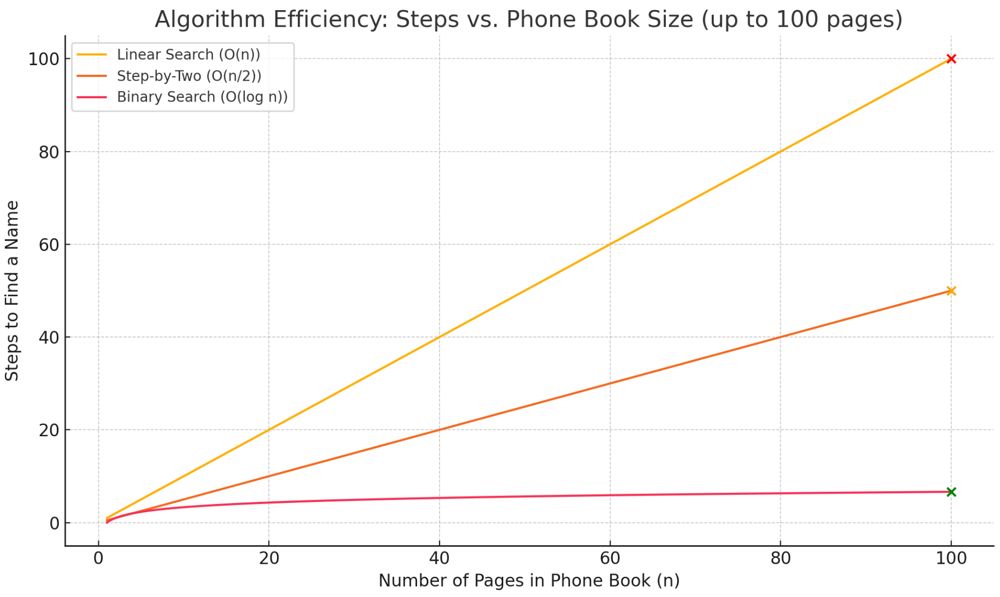

<h1 style="color: #ccc">CS50's Introduction to Computer Science</h1>

# Scratch

<div class="badge">
    <span class="key">Type</span>
    <span class="value">Course</span>
</div>
<div class="badge">
    <span class="key">Instructor</span>
    <span class="value">David J. Malan</span>
</div>
<div class="badge">
    <span class="key">Institution</span>
    <span class="value">Harvard University</span>
</div>
<div class="badge">
    <span class="key">Note Updated</span>
    <span class="value">2025-08-27</span>
</div>

## Welcome

Welcome to CS50 and to the world of computer science. At its core, computer science is the study of information&mdash;how we represent and process it. But more importantly, this course is about *computational thinking*: applying computer science concepts to solve real-world problems. Ultimately, computer science is about problem-solving&mdash;taking an input (a problem) and figuring out how to process it into an output (a solution). The key lies in how you bridge the gap.

## Binary System

To solve problems with computers, we first need a standard way to represent inputs and outputs. Different systems exist for this. For example, counting with fingers is unary (base-1), where each finger represents one unit. But with some creativity, you can count much higher using binary (base-2). Each finger has two states&ndash;up or down&ndash;allowing $2^5=32$ combinations, or numbers $0$ to $31$ on one hand. This is the idea behind the **binary system**: representing data using just two states&mdash;1s and 0s. It is the foundational "language" that all computers understand.

## Bits

Binary system uses **bits**&mdash;short for *binary digits*&mdash;each representing either $0$ or $1$. Unlike the decimal system (base-10), which uses ten digits $(0-9)$, binary is base-2, meaning it only uses two values. Computers rely on this because hardware like *transistors*&mdash;tiny switches&mdash;can be either off $(0)$ or on $(1)$, similar to a light bulb.

With just one bit, you can represent two values: $0$ or $1$. With more bits, the number of combinations grows exponentially. For example, 3 bits give you $2^3=8$ combinations: from $000$ $(0)$ to $111$ $(7)$. Each bit position in binary corresponds to power of $2$, much like decimal positions represent powers of $10$. So:

-   Binary $010 = 0\times4 + 1\times2 + 0\times1 = 2$
-   Binary $111 = 1\times4 + 1\times2 + 1\times1 = 7$

To count beyond $7$, we add another bit: $1000=8$. In general, $n$ bits can represent $2^n$ values, ranging from $0$ to $2^n-1$.

## Bytes and Characters

A **byte** consists of 8 bits, which is convenient since powers of two are fundamental in computing. With 8 bits, you can represent 256 values&mdash;from $0$ to $255$. This is why numbers like $255$ and $256$ are common in programming.

Computers use binary&mdash;just 0s and 1s&mdash;because it is easier to detect simple voltage differences (off vs. on) than interpret subtle range. While it is theoretically possible to use more levels (like in ternary systems), binary remains the most reliable and efficient.

To represent letters, computers assign numbers to characters. For example, in **ASCII**&mdash;the American Standard Code for Information Interchange&mdash;the capital letter $A$ is represented by the number $65$, or $01000001$ in binary. $B$ is $66$, $C$ is $67$, and so on. Lowercase letters start from $97$.

ASCII uses 7 bits, allowing for 128 characters&mdash;including uppercase and lowercase letters, digits, and common punctuation. The 8th bit in a byte was originally used for parity (error checking) or left unused. Later systems introduced **extended ASCII**, using all 8 bits to represent up to 256 characters, though these extended sets vary between systems.

## Unicode and Emoji

There are far more human languages than just English, and many use characters beyond the basic Latin alphabet&mdash;like accented letters or complex Asian glyphs. So, computers need more than the original 7- or 8-bit ASCII encoding. Today, they use 8, 16, 24, or even 32 bits to represent characters&mdash;enabling support for billions of possibilities.

This is where **Unicode** comes in. It builds on ASCII, preserving existing codes like $65$ for $A$, but extends them to include characters from all human languages, past and present, as well as emojis and symbols that go beyond language.

Emojis, for instance, are just characters too&mdash;encoded using Unicode. The popular "Face with Tears of Joy" emoji&mdash;😂 is represented by the number $4,036,991,106$, just a pattern of bits. Different platforms render it differently, as companies like Google and Apple have their own designers.

But if an emoji does not appear on your device, it is usually because your software has not been updated to include the latest Unicode definitions and designs. Unicode adds new emojis every year, and unless your system supports them, you will just see placeholders like black squares.

## Colour, Images, Video, and Sound

Computers represent **colour** using **RGB model**&mdash;Red, Green, and Blue. Each **pixel** is defined by three values (one per colour **channel**), with each value stored in 1 byte. This gives 24 bits per pixel, allowing values from $0$ to $255$ per channel. For example, RGB values of $204$ (red), $153$ (green), and $33$ (blue) produce a yellow hue <span style="color: rgb(204,153,33)">■</span>.

An **image** consists of thousands to millions of such pixels, each encoded with 3 bytes. This explains why high-resolution images require megabytes of storage. While compression can reduce file size, the raw data corresponds directly to these pixel values.

A **video** is simply a sequence of images, or **frames**, shown rapidly&mdash;typically 24 to 30 per second. Each frame is a complete image, so video files are large due to the high number of frames over time.

**Sound** is stored by sampling analog signals at regular intervals and encoding each sample's amplitude as binary data. These amplitude values, stored in bytes, represent the shape of the sound wave over time. When played back, the sequence of samples reconstructs the original audio. Characteristics like pitch and volume are inferred from the pattern of samples, while duration depends on the number of samples collected. Additional metadata (e.g., instrument type) may be included in specific file formats or containers, but not in the audio signal itself.

All digital media&mdash;text, images, video, and sound&mdash;are ultimately stored as binary data, interpreted according to specific encoding formats.

## Algorithms

At the heart of computing lies the **algorithm**: a precise, step-by-step method for solving a problem. The emphasis is on precision&mdash;an algorithm must clearly define each step to ensure consistent results.

Consider a phone book as an example. Suppose you are trying to find someone named John Harvard.

First approach: Start at the beginning and flip page by page until you find him. This is simple and guaranteed to work if he is in the book, but in the worst case&mdash;if his name starts with Z&mdash;it could take up to 1,000 steps for a 1,000-page book.

Second approach: Flip two pages at a time. This is twice as fast, but introduces a risk&mdash;you might skip over his name entirely if you are unlucky. You can fix this by backtracking one page after each step, but it is still only a modest improvement.

Third approach (**Binary Search**): Go to the middle of the phone book. If you land in the M section, you now know John Harvard, whose name starts with J, must be earlier&mdash;so you discard the second half. Repeat this process: divide the remaining section in half, check the middle, and discard the irrelevant half. This reduces the problem size exponentially. For a 1,000-page phone book, this method requires only about 10 steps.

This method exemplifies an algorithm with *logarithmic complexity*, or $O(\log n)$. While linear algorithms (like the first two) require time proportional to the size of the input, binary search scales far better. If the phone book grows from 1,000 to 2,000 pages, binary search only needs one extra step&mdash;going from 10 to 11 steps.

>   

## Pseudocode

Modern software, from Google Search to AI models, relies on smarter, faster algorithms. These not only improve performance but also make the tools more user-friendly. As programmers, our job is to take these ideas&mdash;often described in plain English&mdash;and convert them into actual code using languages like Python, C, or JavaScript.

But before writing real code, we often start with **pseudocode**&mdash;a simple, structured way of expressing an algorithm in English without worrying about syntax. It is precise, logical, and easy to follow.

Let us walk through a classic example: search for someone in a phone book. Here is what that logic looks like as pseudocode:

```pseudocode
function search(name):
    open phone book

    while true:
        open to the middle of the book
        if name is on the current page:
            call(name)
            break
        else if name comes before the current page:
            discard the right half of the book
        else if name comes after the current page:
            discard the left half of the book
        else:
            quit("Name not found")
```

This example shows key programming concepts:

1.  **Functions** represent actions (e.g., `call(name)`).
2.  **Conditionals** (`if`, `else if`, `else`) handle decision-making.
3.  **Loops** (`while true`) repeat steps until a condition is met.
4.  **Boolean expressions** answer true/false questions.
5.  **Indentation** reflects logic and structure.

These building blocks&mdash;functions, conditionals, loops, and expressions&mdash;are the foundation of most programs. And good code must account for all possible situations. If we forget to handle the "name not found" case, for example, the program might freeze or behave unpredictably.

The reason this algorithm does not run forever is because of a strategy called **divide and conquer**. By cutting the book in half each time, we reduce the problem size. Eventually, we either find the name or confirm it is not there.

## Artificial Intelligence

Now, let us relate this to AI. Say you want to build a simple chatbot. You might write pseudocode like this:

```pseudocode
if user says "hello":
    respond "hello"
else if user says "bye":
    respond "goodbye"
else if user says "how are you":
    respond "I'm good"
```

This works for a few phrases, but what if users ask more complicated questions? You cannot write an infinite number of conditions. That is where **AI** steps in.

Instead of hardcoding responses, modern AI systems are trained on massive datasets&mdash;like books, articles, and websites. They learn to recognise patterns and respond based on **probability** rather than fixed rules. These systems use **neural networks**&mdash;layers of interconnected nodes inspired by the human brain&mdash;to process inputs and generate likely responses.

In short, where traditional programming gives exact instructions, AI systems learn from data. And as programmers, we will explore both: writing exact logic ourselves, and understanding how machines can learn to do it too.
