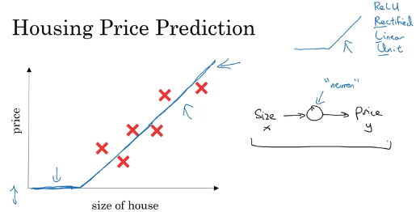
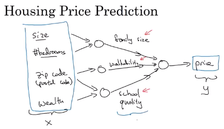
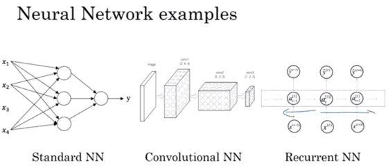
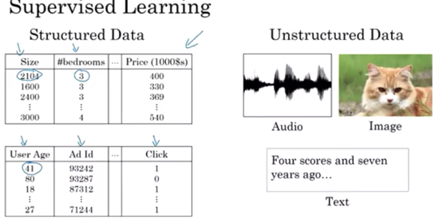
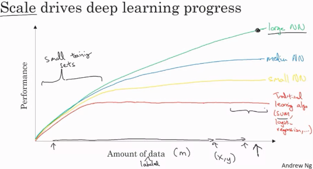
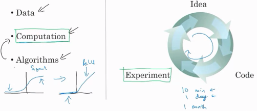

<h1 style="color: #ccc">Deep Learning 1</h1>

# Introduction

*Oct 7, 2019*

## AI is the new Electricity

1. Electricity had once transformed countless industries: transportation, manufacturing, healthcare, communications, and more.

2. AI will now bring about an equally big transformation.

## What you will learn

1. Courses in this sequence (Specialisation):

   - Neural Network and Deep Learning
   - Improving Deep Neural Networks: Hyperparameter tuning, Regularisation and Optimisation
   - Structuring your Machine Learning project
   - Convolutional Neural Networks
   - Natural Language Processing: Building sequence models

## What is a Neural Network?

1. Prices can never be negative

   > 

   * This function is called a ReLU (rectified linear unit) function which means taking a max of 0.

2. Deriving secondary features from the primary raw features

   > 

## Supervised Learning and Neural Networks

1. Application of neural networks in supervised learning

| Input (x) | Output (y) | Application | Type |
|:---|:---|:---|:---|
| Home features | Price | Real Estate | Standard NN |
| Ad, user info | Click on ad? (0/1) | Online Advertising | Standard NN |
| Image | Object (1, ..., 1000) | Photo tagging | CNN |
| Audio | Text transcript | Speech recognition | RNN |
| English | Chinese | Machine translation | RNN |
| Image, Radar info | Position of other cars | Autonomous driving | Custom / Hybrid |

2. Neural network examples

   > 

3. Structured data and unstructured data

   > 

## Why is Deep Learning Taking Off?

1. Scale drives deep learning progress

   > 

   If you want to hit this very high level of performance

   * You need to be able to train big enough neural network
   * You need a lot of data

2. Algorithmic innovation

   > 

   In the last several years, we have seen tremendous algorithmic innovation about trying to make neural networks run much faster. One of the huge breakthroughs in neural networks has been switching from sigmoid function to ReLU function. One of the problems of using sigmoid function is that the slope of the function approaches zero very soon and so learning become really slow, whereas ReLU the gradient is equal to one for all positive values of input.

   Faster computation can help speed up how long a team takes to iterate Idea > Code > Experiment. Being able to try out ideas quickly allows deep learning engineers to iterate more quickly.
