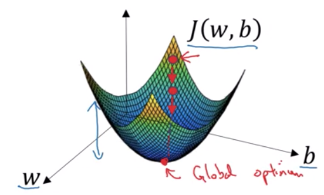
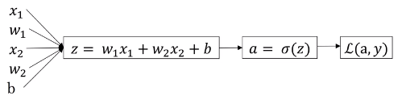

<h1 style="color: #ccc">Deep Learning 2</h1>

# Neural Networks Basics

*Nov 3, 2019*

## Logistic Regression as a Neural Network

### Binary Classification

1. Notation

   $$ X=\begin{bmatrix}
x^{( 1)} & x^{( 2)} & \cdots  & x^{( m)}
\end{bmatrix} =\begin{bmatrix}
x^{( 1)}_{1} & x^{( 2)}_{1} & \cdots  & x^{( m)}_{1}\\
x^{( 1)}_{2} & x^{( 2)}_{2} & \cdots  & x^{( m)}_{2}\\
\vdots  & \vdots  & \ddots  & \vdots \\
x^{( 1)}_{n_{x}} & x^{( 2)}_{n_{x}} & \cdots  & x^{( m)}_{n_{x}}
\end{bmatrix} $$

   $$Y=\begin{bmatrix}
y^{( 1)} & y^{( 2)} & \cdots  & y^{( m)}
\end{bmatrix} $$

   - $ x\in \mathbb{R}^{n_{x}} ,y\in \{0,1\} $

   - $ m\ \text{training examples:} \ \left\{\left( x^{( 1)} ,y^{( 1)}\right) ,\left( x^{( 2)} ,y^{( 2)}\right) ,\dotsc ,\left( x^{( m)} ,y^{( m)}\right)\right\} $

### Logistic Regression

1. Notation

   $$ \text{Given} \ x,\ \text{want} \ \hat{y} =P( y=1|x) ,\ \text{where} \ 0\leq \hat{y} \leq 1 $$

   * The input features vector: $ x\in \mathbb{R}^{n_{x}} $, where $ n_{x} $ is the number of features
   * The training label: $ y\in \{0,1\} $
   * The weights: $ w\in \mathbb{R}^{n_{x}} $, where $ n_{x} $ is the number of features
   * The threshold: $ b\in \mathbb{R} $
   * The output: $ \hat{y} =\sigma \left( w^{\top } x+b\right) $
   * Sigmoid function: $ \sigma ( z) =\frac{1}{1+e^{-z}} $

   > 

   Some observations from the graph:

   * If $ z $ is large positive number, then $ \sigma ( z) \approx 1 $
   * If $ z $ is large negative number, then $ \sigma ( z) \approx 0 $
   * If $ z = 0 $, then $ \sigma ( z) = 0.5 $
   * Sigmoid function $ \sigma $ converts input $z$ from real number set $ \mathbb{R} $ to $ (0,1) $

      $ \sigma :( -\infty ,0,\infty )\rightarrow ( 0,0.5,1) $

### Cost Function

1. Logistic regression

   $$ \hat{y} =\sigma \left( w^{\top } x+b\right) ,\ \text{where} \ \sigma ( z) =\frac{1}{1+e^{-z}} $$

   $$ \text{Given} \ \left\{\left( x^{( 1)} ,y^{( 1)}\right) ,\cdots ,\left( x^{( m)} ,y^{( m)}\right)\right\} ,\ \text{want} \ \hat{y}^{( i)} \approx y^{( i)} $$

2. Loss (error) function

   $$ L\left(\hat{y} ,y\right) =-\left[ y\log\hat{y} +( 1-y)\log\left( 1-\hat{y}\right)\right] $$

   The loss function measures the discrepancy between the prediction $ \hat{y}^{(i)} $ and the desired output $ y^{(i)} $. In other words, the loss function computes the error for a single training example.

   Some observations:

   * $ \log $ converts input from $ (0, \infty) $ to real number set $ \mathbb{R} $

      $ \log :( 0,1,\infty )\rightarrow ( -\infty ,0,\infty ) $

   * If $ y=1 $, then $ L\left(\hat{y} ,y\right) =-\log\hat{y} $

      $ \text{Want} \ \log\hat{y} \ \text{large} ,\ \hat{y}\rightarrow 1\Longrightarrow \log\hat{y}\rightarrow 0 $

   * If $ y=0 $, then $ L\left(\hat{y} ,y\right) =-\log\left( 1-\hat{y}\right) $

      $ \text{Want} \ \log\left( 1-\hat{y}\right) \ \text{large} ,\ \hat{y}\rightarrow 0\Longrightarrow \log\left( 1-\hat{y}\right)\rightarrow 0 $

3. Cost function

   $$ J( w,b) =\frac{1}{m}\sum ^{m}_{i=1} L\left(\hat{y}^{( i)} ,y^{( i)}\right) =-\frac{1}{m}\sum ^{m}_{i=1}\left[ y^{( i)}\log\hat{y}^{( i)} +\left( 1-y^{( i)}\right)\log\left( 1-\hat{y}^{( i)}\right)\right] $$

   The cost function is the average of the loss function of the entire training set. We are going to find the parameter $ w $ and $ b $ that minimise the overall cost function.

### Gradient Descent

1. Want to find $ w,b $ that minimise $ J( w,b) $

   > 

2. Algorithm

   > 

   ```
   repeat until convergence {
   ```

   $$ w:=w-\alpha \frac{\partial J( w,b)}{\partial w} $$

   $$ b:=b-\alpha \frac{\partial J( w,b)}{\partial b} $$

   ```
   }
   ```

   * The learning rate: $ \alpha $ controls how big a step we take downhill with gradient descent

### Computation Graph

1. Concept

   > 

   * Forward propagation on computation graph yields the final output variable.
   * Backward propagation on computation graph yields derivative of final output variable.

2. Derivatives with a computation graphs

   > 

   We are going to do derivatives of a final output variable with respect to various intermediate quantities.

   Layer 3:

   $$ \frac{\partial J}{\partial v} =\frac{\partial ( 3v)}{\partial v} =3 $$

   Layer 2:

   $$ \frac{\partial v}{\partial u} =\frac{\partial ( a+u)}{\partial u} =1 $$

   Therefore,

   $$ \frac{\partial J}{\partial u} =\frac{\partial J}{\partial v} \cdotp \frac{\partial v}{\partial u} =3\cdot 1=3 $$

   Layer 1:

   $$ \frac{\partial v}{\partial a} =\frac{\partial ( a+u)}{\partial a} =1 $$

   $$ \frac{\partial u}{\partial b} =\frac{\partial ( bc)}{\partial b} =\frac{\partial ( 2b)}{\partial b} =2 $$

   $$ \frac{\partial u}{\partial c} =\frac{\partial ( bc)}{\partial c} =\frac{\partial ( 3c)}{\partial c} =3 $$

   Therefore,

   $$ \frac{\partial J}{\partial a} =\frac{\partial J}{\partial v} \cdotp \frac{\partial v}{\partial a} =3\cdotp 1 =3 $$

   $$ \frac{\partial J}{\partial b} =\frac{\partial J}{\partial u} \cdotp \frac{\partial u}{\partial b} =3\cdotp 2=6 $$

   $$ \frac{\partial J}{\partial c} =\frac{\partial J}{\partial u} \cdotp \frac{\partial u}{\partial c} =3\cdotp 3=9 $$

   What we are seeing in this little example is that, through a left-to-right pass, you can compute the value of $ J $, and a right-to-left pass to compute derivatives.

### Cost Function Derivatives

1. Solving loss function derivatives using computation graph

   $$ z=w^{\top } x+b $$

   $$ \hat{y} =a=\sigma ( z) =\frac{1}{1+e^{-z}} $$

   $$ L( a,y) =-[ y\log a+( 1-y)\log( 1-a)] $$

   > 

   Layer 3:

   $$ \frac{\partial L( a,y)}{\partial a} =-\frac{y}{a} +\frac{1-y}{1-a} =\frac{-y+ay+a-ay}{a( 1-a)} =\frac{a-y}{a( 1-a)} $$

   Layer 2:

   $$ \frac{\partial a}{\partial z} =\left(\frac{1}{1+e^{-z}}\right)^{2} e^{-z}( -1) =\left(\frac{1}{1+e^{-z}}\right)\left(\frac{-e^{-z}}{1+e^{-z}}\right) =a( 1-a) $$

   Therefore,

   $$ \frac{\partial L( a,y)}{\partial z} =\frac{\partial L( a,y)}{\partial a} \cdotp \frac{\partial a}{\partial z} =\frac{a-y}{a( 1-a)} \cdotp a( 1-a) =a-y $$

   Layer 1:

   $$ \frac{\partial L( a,y)}{\partial w_{1}} =\frac{\partial L( a,y)}{\partial z} \cdotp \frac{\partial z}{\partial w_{1}} =( a-y) \cdotp x_{1} $$

   $$ \frac{\partial L( a,y)}{\partial w_{2}} =\frac{\partial L( a,y)}{\partial z} \cdotp \frac{\partial z}{\partial w_{2}} =( a-y) \cdotp x_{2} $$

   $$ \frac{\partial L( a,y)}{\partial b} =\frac{\partial L( a,y)}{\partial z} \cdotp \frac{\partial z}{\partial b} =( a-y) \cdotp 1 $$

2. Solving cost function derivatives

   $$ J( w,b) =\frac{1}{m}\sum ^{m}_{i=1} L\left( a^{( i)} ,y^{( i)}\right) $$

   $$ \frac{\partial }{\partial w_{j}} J( w,b) =\frac{1}{m}\sum ^{m}_{i=1}\frac{\partial }{\partial w_{j}} L\left( a^{( i)} ,y^{( i)}\right) =\frac{1}{m}\sum ^{m}_{i=1}\left( a^{( i)} -y^{( i)}\right) x^{( i)}_{j} $$

   $$ \frac{\partial }{\partial b} J( w,b) =\frac{1}{m}\sum ^{m}_{i=1}\frac{\partial }{\partial b} L\left( a^{( i)} ,y^{( i)}\right) =\frac{1}{m}\sum ^{m}_{i=1}\left( a^{( i)} -y^{( i)}\right) $$

### Cost Function Explanation

1. Interpreting loss function

   $$ \hat{y} =\sigma \left( w^{\top } x+b\right) ,\ \text{where} \ \sigma ( z) =\frac{1}{1+e^{-z}} $$

   $$ \hat{y} =P( y=1|x) $$

   To measure the probability of making correct prediction

   - If $ y=1 $, then $ P( y=1|x) =\hat{y} $
   - If $ y=0 $, then $ P( y=0|x) =1-\hat{y} $

   So we can summarise the probability of making correct prediction as

   $$ P( y|x) =\hat{y}^{y}\left( 1-\hat{y}\right)^{\left( 1-y\right)} $$

   Because $\log$ function is a strictly monotonically increasing function, maximising $ \log P( y|x) $ should give you similar result as maximising $ P( y|x) $

   $$ \log P( y|x) =\log\hat{y}^{y}\left( 1-\hat{y}\right)^{( 1-y)} =y\log\hat{y} +( 1-y)\log\left( 1-\hat{y}\right) $$

   So we can define the loss function as

   $$ L\left(\hat{y} ,y\right) =-\log P( y|x) =-\left[ y\log\hat{y} +( 1-y)\log\left( 1-\hat{y}\right)\right] $$

2. Interpreting cost function

   Assuming the training examples are independent identically distributed, so the probability of making correct prediction on the entire training set is

   $$ P\left( y^{( 1)} ,\cdots ,y^{( m)} |x^{( 1)} ,\cdots ,x^{( m)}\right) =\prod ^{m}_{i=1} P\left( y^{( i)} |x^{( i)}\right) $$

   Apply $ \log $ to both sides

   $$ \log P\left( y^{( 1)} ,\cdots ,y^{( m)} |x^{( 1)} ,\cdots ,x^{( m)}\right) =\sum\limits ^{m}_{i=1}\log P\left( y^{( i)} |x^{( i)}\right) $$

   So we can define the cost function as

   $$ J( w,b) =-\sum ^{m}_{i=1}\log P\left( y^{( i)} |x^{( i)}\right) =\sum ^{m}_{i=1} L\left(\hat{y}^{( i)} ,y^{( i)}\right) $$

   Finally, to make sure that our quantities are better scale, we just add  $ \frac{1}{m} $ extra scaling factor

   $$ J( w,b) =\frac{1}{m}\sum ^{m}_{i=1} L\left(\hat{y}^{( i)} ,y^{( i)}\right) $$

## Python and Vectorisation

### Vectorisation

1. What is vectorisation?

   $$ z=w^{\top } x+b $$

   Non-vectorised:

   ```python
   z = 0
   for i in range(n_x):
      z += w[i] * x[i]
   z += b
   ```

   CPU Vectorised:

   ```python
   import numpy as np

   z = np.dot(w, x) + b
   ```

   GPU Vectorised:

   ```python
   import cupy as cp

   z = cp.dot(cp.array(w), cp.array(x)) + b
   ```

2. Performance

   ```python
   import time
   import numpy as np
   import cupy as cp

   n = 1000 * 1000 * 10

   a = np.random.rand(n)
   b = np.random.rand(n)

   c = 0
   tic = time.time()
   for i in range(n):
       c += a[i] * b[i]
   toc = time.time()

   print(c)
   print('For loop: {:.6f} ms'.format(1000 * (toc-tic)))

   tic = time.time()
   c = np.dot(a, b)
   toc = time.time()

   print(c)
   print('CPU Vectorised: {:.6f} ms'.format(1000 * (toc-tic)))

   a_gpu = cp.asarray(a)
   b_gpu = cp.asarray(b)

   tic = time.time()
   c = cp.dot(a_gpu, b_gpu)
   toc = time.time()

   print(c)
   print('GPU Vectorised: {:.6f} ms'.format(1000 * (toc-tic)))

   # For loop: 4471.298456 ms
   # CPU Vectorised: 19.253492 ms
   # GPU Vectorised: 0.244141 ms
   ```

   Both CPU and GPU have parallelisation instructions called SIMD instructions. What this means basically is that, if you use built-in functions such as this np function or other functions that don't require you explicitly implementing a for loop, it enables Python to take much better advantage of parallelism to do your computations much faster.

### Vectorisation of Logistic Regression

1. Vectorising $ m $ training examples

   $$ Z=\begin{bmatrix}
z^{( 1)} & z^{( 2)} & \cdots  & z^{( m)}
\end{bmatrix} =w^{\top } X+\underbrace{\begin{bmatrix}
b & b & \cdots  & b
\end{bmatrix}}_{1\times m} $$

2. Vectorising derivatives

   Vectorising cost function derivatives with respect to $ b $,

   $$ dz^{( i)} =\frac{\partial L\left( a^{( i)} ,y^{( i)}\right)}{\partial z^{( i)}}=a^{( i)} -y^{( i)} $$

   $$ dZ=\begin{bmatrix}
dz^{( 1)} & dz^{( 2)} & \cdots  & dz^{( m)}
\end{bmatrix} $$

   $$ db=\frac{\partial }{\partial b} J( w,b) =\frac{1}{m}\sum ^{m}_{i=1}\left( a^{( i)} -y^{( i)}\right) =\frac{1}{m}\sum ^{m}_{i=1} dz^{( i)} =\frac{1}{m} sum( dZ) $$

   Vectorising cost function derivatives with respect to $ w $,

   $$ dw_{j} =\frac{\partial }{\partial w_{j}} J( w,b) =\frac{1}{m}\sum ^{m}_{i=1}\left( a^{( i)} -y^{( i)}\right) x^{( i)}_{j} $$

   $$ X=\begin{bmatrix}
x^{( 1)} & x^{( 2)} & \cdots  & x^{( m)}
\end{bmatrix} =\begin{bmatrix}
x^{( 1)}_{1} & x^{( 2)}_{1} & \cdots  & x^{( m)}_{1}\\
x^{( 1)}_{2} & x^{( 2)}_{2} & \cdots  & x^{( m)}_{2}\\
\vdots  & \vdots  & \ddots  & \vdots \\
x^{( 1)}_{n_{x}} & x^{( 2)}_{n_{x}} & \cdots  & x^{( m)}_{n_{x}}
\end{bmatrix} $$

   $$ \begin{aligned}
dw=\begin{bmatrix}
dw_{1}\\
dw_{2}\\
\vdots \\
dw_{n}
\end{bmatrix} & =\frac{1}{m}\left[ x^{( 1)} dz^{( 1)} +x^{( 2)} dz^{( 2)} +\cdots +x^{( m)} dz^{( m)}\right]\\
 & =\frac{1}{m}\begin{bmatrix}
x^{( 1)} & x^{( 2)} & \cdots  & x^{( m)}
\end{bmatrix} \times \begin{bmatrix}
dz^{( 1)}\\
dz^{( 2)}\\
\vdots \\
dz^{( m)}
\end{bmatrix}\\
 & =\frac{1}{m} X\cdotp dZ^{\top }
\end{aligned} $$

3. Vectorising gradient descent

   $$ w:=w-\alpha \cdotp dw $$

   $$ b:=b-\alpha \cdotp db $$

### Numpy Broadcasting

1. Subject to certain constraints, the smaller array is “broadcasted” across the larger array so that they have compatible shapes. Broadcasting provides a means of vectorising array operations so that looping occurs in C instead of Python. It does this without making needless copies of data and usually leads to efficient algorithm implementations. There are, however, cases where broadcasting is a bad idea because it leads to inefficient use of memory that slows computation.<sup>[1](#References)</sup>

2. This example demonstrates the disadvantage of broadcasting.<sup>[2](#References)</sup>

   Doing vectorisation is like loading a large amount of data from disk to memory for processing, but it happens in CPU and the data is loaded from memory to CPU cache by SIMD instructions.

   If the data can fit into CPU cache, it is much faster than for-loop operation which accesses memory repeatedly. Otherwise, as old data must be evicted from the cache for new data to be loaded, a big matrix will be transferred to CPU in multiple small batches for a single vectorised operation to complete.

   For a calculation that involves multiple vectorised operations in sequence, such as this calculation `np.sum((M - v) ** 2)` that computes "minus" > "power" > "sum" in sequence, the entire matrix `M` will be loaded 3 times into CPU cache.

   This problem is similar to typical streaming problems we usually see in software engineering such as video streaming, data streaming, and big data processing in environments with limited memory. In these scenarios, it is generally faster to stream data to memory in small buffers, and complete all the sequential computation for the data in a buffer, before loading a new buffer of data from stream into memory again. In this way, the entire data is loaded only once to the memory.

   This explains why, as you will see in the codes below, **CPU Broadcast Vectorised** is slower than **For Loop**. In **Einstein Sum**, there is a smart trick to perform both "power" and "sum" in a single step, reducing the need to load entire matrix `M` to twice rather than thrice initially, thus performing faster than **For Loop**. However, this kind of smart trick is not always available. It is also harder to understand and the codes are not intuitive to read and maintain.

   In **Native Parallelised Loop**, the Python codes is JIT-compiled into native machine codes, and with LLVM optimisation of modern SIMD instructions such as AVX2, resulting in 3x increase in performance.

   Last, we see in **GPU Broadcast Vectorised** the true speed of vectorising with broadcasting when there is enough memory in GPU to store the entire matrix `M`, resulting in 30x increase in performance. Becareful of intepreting the GPU result as the time for data transfer in and out of the GPU is not included in the measurement. Reason being in CPU instructions the data is from the machine memory, whereas in GPU instructions data is from GPU memory. The transfer of data between machine memory and GPU memory is neither part of CPU instructions nor GPU instructions, and must be managed explicitly by separate API calls, so it is not fair to include this step in either of the CPU or GPU benchmarking.

   ```python
   import time
   import numpy as np
   import numba as nb
   import cupy as cp

   def norm_bcast(M, v):
     return np.sum((M - v) ** 2, axis=1)

   def norm_loop(M, v):
     n = M.shape[0]
     d = np.zeros(n)
     for i in range(n):
       d[i] = np.sum((M[i] - v) ** 2)
     return d

   def norm_einsum(M, v):
     tmp = M - v
     return np.einsum('ij,ij->i', tmp, tmp)

   @nb.njit(parallel = True)
   def norm_loop_improved(M, v):
     n = M.shape[0]
     d = np.zeros(n)
     for i in nb.prange(n):
       d[i] = np.sum((M[i] - v) ** 2)
     return d

   def norm_cupy(M, v):
     return cp.sum((M - v) ** 2, axis=1)

   M = np.random.random_sample((1000, 10000))
   v = M[0]
   M_gpu = cp.asarray(M)
   v_gpu = cp.asarray(v)

   norm_bcast(M, v)
   tic = time.time()
   norm_bcast(M, v)
   toc = time.time()
   print('CPU Broadcast Vectorised: {:.6f} ms'.format(1000 * (toc-tic)))

   norm_loop(M, v)
   tic = time.time()
   norm_loop(M, v)
   toc = time.time()
   print('For Loop: {:.6f} ms'.format(1000 * (toc-tic)))

   norm_einsum(M, v)
   tic = time.time()
   norm_einsum(M, v)
   toc = time.time()
   print('Einstein Sum: {:.6f} ms'.format(1000 * (toc-tic)))

   norm_loop_improved(M, v)
   tic = time.time()
   norm_loop_improved(M, v)
   toc = time.time()
   print('Native Parallelised Loop: {:.6f} ms'.format(1000 * (toc-tic)))

   norm_cupy(M_gpu, v_gpu)
   tic = time.time()
   norm_cupy(M_gpu, v_gpu)
   toc = time.time()
   print('GPU Broadcast Vectorised: {:.6f} ms'.format(1000 * (toc-tic)))

   # CPU Broadcast Vectorised: 49.267530 ms
   # For Loop: 38.450241 ms
   # Einstein Sum: 33.173084 ms
   # Native Parallelised Loop: 8.671761 ms
   # GPU Broadcast Vectorised: 0.295401 ms
   ```

### Numpy Rank 1 Array

1. Rank 1 array

   ```python
   import numpy as np

   a = np.random.randn(5)

   print(a)
   print(a.shape)

   # [ 0.24545597  0.23197581 -0.83582954 -0.26934902  1.0874579 ]
   # (5,)

   print(a.T)
   print(np.dot(a, a.T))

   # [ 0.24545597  0.23197581 -0.83582954 -0.26934902  1.0874579 ]
   # 2.0677860021181305
   ```

   A rank 1 array is neither a row vector or a column vector, and this leads it to have some slightly non-intuitive effects.

2. Column vector and row vector

   ```python
   import numpy as np

   a = np.random.randn(5, 1)

   print(a)
   print(a.T)

   print(a.shape)
   print(a.T.shape)
   print(np.dot(a, a.T).shape)

   # [[ 0.64483041]
   #  [ 0.09400471]
   #  [ 0.74921078]
   #  [-0.88491287]
   #  [ 1.94917419]]
   #
   # [[ 0.64483041  0.09400471  0.74921078 -0.88491287  1.94917419]]
   #
   # (5, 1)
   # (1, 5)
   # (5, 5)
   ```

3. Asserting the shape of matrix increases code readability

   ```python
   assert(a.shape == (5, 1))
   ```

4. Changing shape of matrix

   ```python
   a = a.reshape(5,1)
   ```

## References

1. [Numpy Broadcasting](https://docs.scipy.org/doc/numpy/user/basics.broadcasting.html)
2. [Why Python Broadcasting in this example below is slower than a simple loop](https://stackoverflow.com/questions/49632993/why-python-broadcasting-in-the-example-below-is-slower-than-a-simple-loop)
