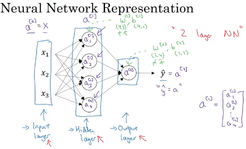
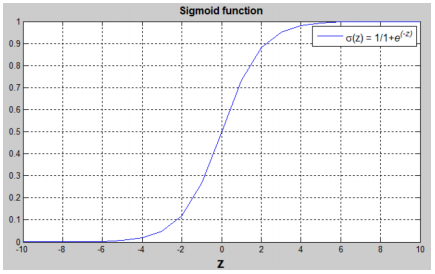
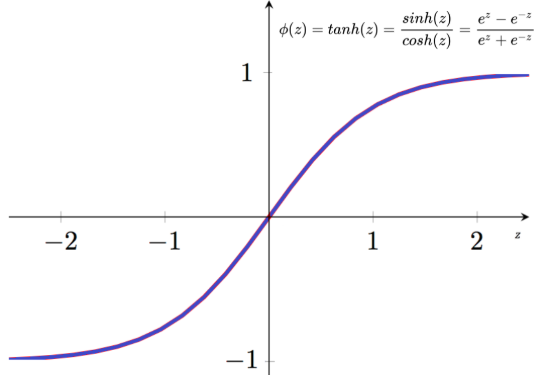
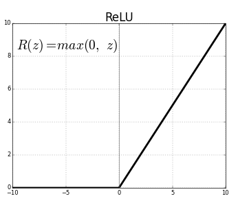
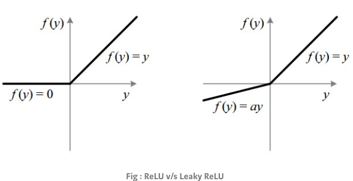

<h1 style="color: #ccc">Deep Learning 3</h1>

# Shallow Neural Networks

*Nov 8, 2019*

## Neural Network Representation

1. Neural network representation

   > 

## Forward Propagation

1. Vectorising neural network output of a single example

   $$ z^{[ 1]} =\begin{bmatrix}
z^{[ 1]}_{1}\\
z^{[ 1]}_{2}\\
z^{[ 1]}_{3}\\
z^{[ 1]}_{4}
\end{bmatrix} =\begin{bmatrix}
w^{[ 1] \top}_{1}\\
w^{[ 1] \top}_{2}\\
w^{[ 1] \top}_{3}\\
w^{[ 1] \top}_{4}
\end{bmatrix} x+\begin{bmatrix}
b^{[ 1]}_{1}\\
b^{[ 1]}_{2}\\
b^{[ 1]}_{3}\\
b^{[ 1]}_{4}
\end{bmatrix} =W^{[ 1]} a^{[ 0]} +b^{[ 1]} $$

   Forward propagation of single example

   $$ z^{[ 1]} =W^{[ 1]} a^{[ 0]} +b^{[ 1]}\\
a^{[ 1]} =\sigma \left( z^{[ 1]}\right)\\
z^{[ 2]} =W^{[ 2]} a^{[ 1]} +b^{[ 2]}\\
a^{[ 2]} =\sigma \left( z^{[ 2]}\right) $$

2. Vectorising across multiple examples

   $$ Z^{[ 1]} =\begin{bmatrix}
z^{[ 1]( 1)} & \cdots  & z^{[ 1]( m)}
\end{bmatrix} =W^{[ 1]} X+\underbrace{\begin{bmatrix}
b^{[ 1]} & \cdots  & b^{[ 1]}
\end{bmatrix}}_{1\times m} $$

   $$ A^{[ 0]} =X=\begin{bmatrix}
x^{( 1)} & x^{( 2)} & \cdots  & x^{( m)}
\end{bmatrix} $$

   Forward propagation of multiple examples

   $$ Z^{[ 1]} =W^{[ 1]} A^{[ 0]} +b^{[ 1]}\\
A^{[ 1]} =\sigma \left( Z^{[ 1]}\right)\\
Z^{[ 2]} =W^{[ 2]} A^{[ 1]} +b^{[ 2]}\\
A^{[ 2]} =\sigma \left( Z^{[ 2]}\right) $$

## Activation Functions

1. Sigmoid Function

   $$ g( z) =\sigma ( z) =\frac{1}{1+e^{-z}} $$

   $$ g:( -\infty ,0,\infty )\rightarrow ( 0,0.5,1) $$

   > 

   Never use this except for the output layer if you are doing binary classification.

2. Hyperbolic Tangent Function

   $$ g( z) =\tanh( z) =\frac{\sinh( z)}{\cosh( z)} =\frac{e^{z} -e^{-z}}{e^{z} +e^{-z}} $$

   $$ g:( -\infty ,0,\infty )\rightarrow ( -1,0,1) $$

   > 

   Hyperbolic tangent function almost always works better than the sigmoid function, and is mathematically a shifted version of the sigmoid function. It kind of has the effect of centering your data so that the mean of your data is closer to $0$ rather than $0.5$, and this makes learning for the next layer a little bit easier.

   One exception where I would use the sigmoid activation function is when you are using binary classifiction, in which case you might use the sigmoid activation function for the output layer. You might have $\tanh$ activation function for the hidden layer, and sigmoid for the output layer. The activation function may be different for different layer.

   One of the downsides of both the sigmoid function and the $\tanh$ function is that if $z$ is either very large or very small, then the gradient or the derivative or the slope of this function becomes very small and close to zero. So this can slow down gradient descent.

3. Rectified Linear Unit (ReLU)

   $$ g( z) =z^{+} =\max( 0,z) $$

   $$ g:( -\infty ,0,\infty )\rightarrow ( 0,0,\infty ) $$

   > 

   If your output is $0$ or $1$, that is binary classification, then the sigmoid activation function is a very natural choice for the output layer. Then for all other units ReLU is increasingly the default choice of activation function. If you not sure what to use for your hidden layer, I would just use the ReLU activation function. It's what most people use these days, although sometimes people also use the $\tanh$ activation function.

4. Leaky ReLU / Parametric ReLU

   Leakly ReLU allows a small, positive gradient when the unit is not active. This usually works better than the ReLU activation function, although it's just not used as much in practice.

   $$ g( z) =\max( 0.01z,z) $$

   $$ g:( -\infty ,0,\infty )\rightarrow ( -\infty ,0,\infty ) $$

   Parametric ReLU (PReLU) takes this idea further by making the coefficient of leakage into a parameter that is learned along with other neural-network parameters.

   $$ g( z) =\max( az,z) ,\ \text{where} \ a\ \leq 1 $$

   > 

   The advantage of ReLU and its variants is that, for a lot of space of $z$ the derivative of the activation function, is very different from $0$. So in practice, using ReLU activation function your neural network will often learn much faster than when using $\tanh$ or the sigmoid activation function. The main reason is that there is less of these effects of the slope of the function going to $0$, which slows down learning. For half of the range of $z$, the slope of ReLU is 0, but in practice enough of your hidden units will have $z$ greater than $0$, so learning can still be quite fast for most training examples.

5. Why do you need non-linear activation functions?

   Linear Activation Function / Identify Activation Function

   $$ g( z) =z $$

   $$ g:( -\infty ,0,\infty )\rightarrow ( -\infty ,0,\infty ) $$

   If you were to use linear activation functions, then the neural network is just outputting a linear function of the input. No matter how many layers your neural network has, all it's doing is just computing a linear activation function. So you might as well not have any hidden layers.

   $$ a^{[ 1]} =z^{[ 1]} =w^{[ 1]} x+b^{[ 1]}\\
a^{[ 2]} =z^{[ 2]} =w^{[ 2]} a^{[ 1]} +b^{[ 2]} $$

   $$ \begin{aligned}
a^{[ 2]} & =w^{[ 2]}\underbrace{\left( w^{[ 1]} x+b^{[ 1]}\right)}_{a^{[ 1]}} +b^{[ 2]}\\
 & =\underbrace{\left( w^{[ 2]} w^{[ 1]}\right)}_{w^{\prime }} x+\underbrace{\left( w^{[ 2]} b^{[ 1]} +b^{[ 2]}\right)}_{b^{\prime }}\\
 & =w^{\prime } x+b^{\prime }
\end{aligned} $$

   If you have hidden layers of linear activation functions and the output layer as a sigmoid function, then this model is no more expressive than standard logistic regression without any hidden layer.

   $$ a^{[ 1]} =z^{[ 1]} =w^{[ 1]} x+b^{[ 1]}\\
a^{[ 2]} =\sigma \left( z^{[ 2]}\right) =\sigma \left( w^{[ 2]} a^{[ 1]} +b^{[ 2]}\right) $$

   $$ \begin{aligned}
a^{[ 2]} & =\sigma \left( w^{[ 2]}\underbrace{\left( w^{[ 1]} x+b^{[ 1]}\right)}_{a^{[ 1]}} +b^{[ 2]}\right)\\
 & =\sigma \left(\underbrace{w^{[ 2]} w^{[ 1]}}_{w^{\prime }} x+\underbrace{\left( w^{[ 2]} b^{[ 1]} +b^{[ 2]}\right)}_{b^{\prime }}\right)\\
 & =\sigma \left( w^{\prime } x+b^{\prime }\right)
\end{aligned} $$

   There is just one place where you might use linear activation function, and that is if you are doing machine learning on regression problem, if $y$ is a real number.
