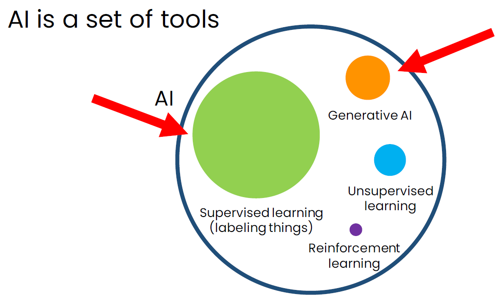
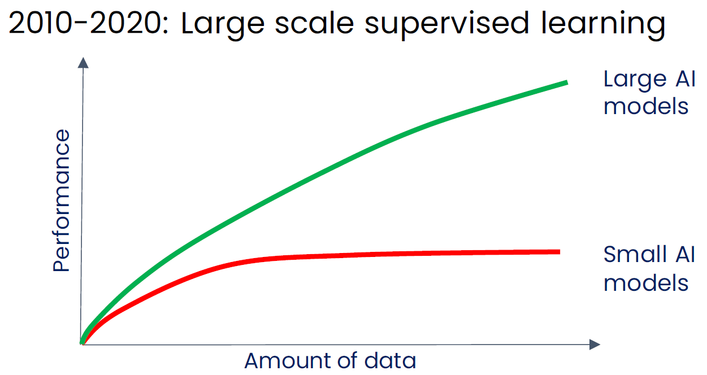
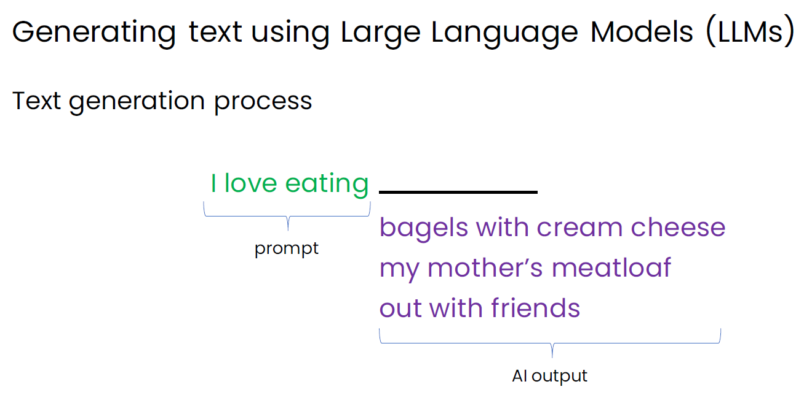
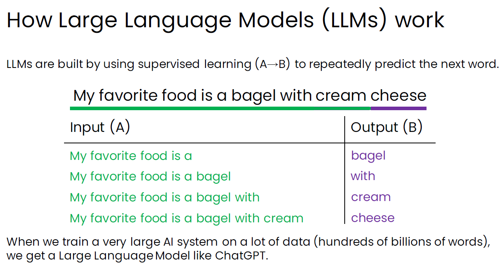
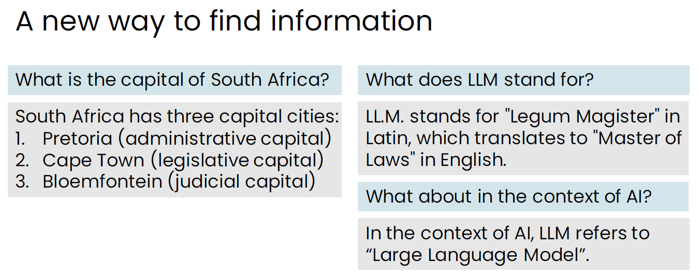
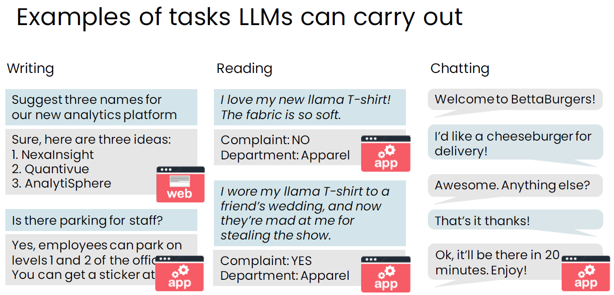
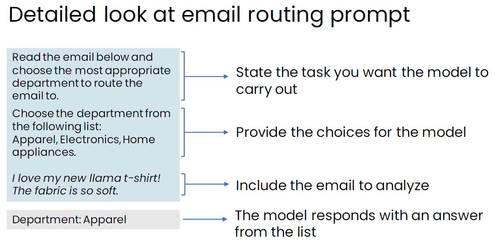
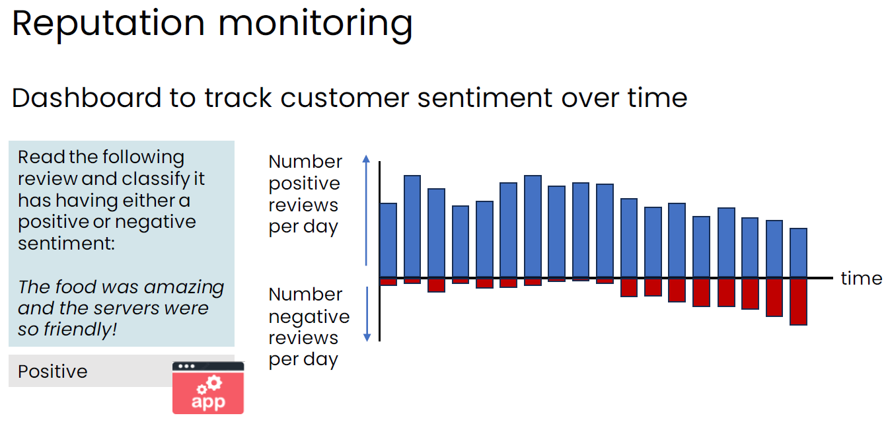
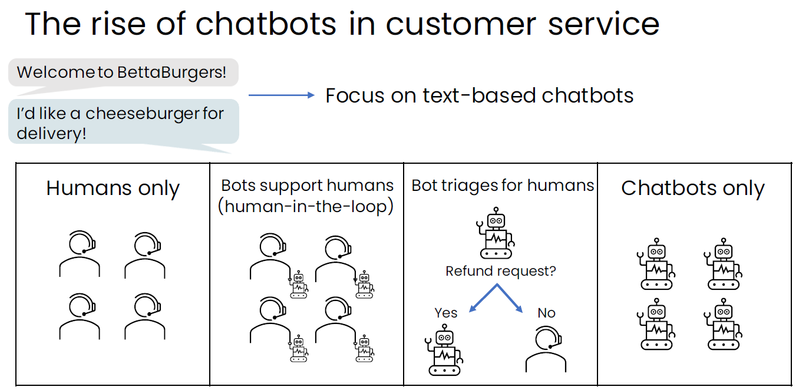
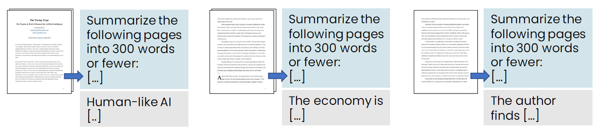

<h1 style="color: #ccc">Generative AI for Everyone</h1>

# Introduction to Generative AI

Apr 2, 2024

## What is Generative AI?

1.  Generative AI refers to artificial intelligence systems capable of producing high quality content, specifically text, images, and audio. Beyond consumer applications, another potentially more impactful long-term use of generative AI is as a tool for developers.

### How Does Generative AI Work?

1.  Supervised learning and generative AI are the two most important tools in AI today.

    >   

2.  The decade of 2010-2020 was marked by large-scale supervised learning, which turned out to have laid the foundation for modern generative AI.

    >   

3.  One way generative AI generates text is by using large language models (LLMs). Given an input such as "I love eating", an LLM can complete this sentence in various ways. The input is also referred to as a prompt.

    >   

4.  LLMs are built using supervised learning to repeatedly predict the next word in a sequence. A single sentence can be transformed into multiple input (A) and output (B) pairs.

    >   

### LLMs as a Thought Partner

1.  LLMs offer a novel way to access information. However, they can sometimes generate inaccurate facts, a phenomenon known as hallucination. Therefore, it is advisable to verify the responses with an authoritative source, especially when accuracy is crucial. Engaging in a detailed question-and-answer exchange can provide LLMs with the necessary context to deliver more accurate answers.

    >   

2.  LLMs can sometimes serve as a thought partner to help  you think things through. For instance, they can assist you in proofreading and rewriting text, or even in writing a short bedtime story for entertainment.

3.  Web search or using an LLM?

    How should I treat a sprained ankle? A web search can direct you to trustworthy sources for medical advice.

    If you are interested in making a pineapple pie, a simple web search can guide you to numerous recipes on the internet. By selecting a recipe from a trusted website or chef, you can achieve very good results. However, asking an LLM might result in receiving a somewhat unsual recipe.

    But if you are looking for something more unique, like a coffee-infused pineapple pie, you might not find any reliable websites offering advice on this. In such cases, an LLM can serve as a creative partner to help you brainstorm how to bake a coffee-infused pineapple pie.

### AI is a General Purpose Technology

1.  AI is a general-purpose technology, similar to electricity, and is useful for a myriad of purposes. Asking "What is electricity good for?" or "What is the internet good for?" highlights the nature of these other general-purpose technologies. It becomes challenging to pinpoint an answer because their use is so pervasive and integral to a multitude of aspects in our lives.

2.  LLMs excel in tasks involving writing, reading, and chatting.

    >   

3.  Two different types of LLM applications.

    -   Web interface-based application (brainstorming)
    -   Software application (workflow automation)

## Generative AI Applications

### Writing

1.  Brainstorming product names

    -   Brainstorm 5 creative names for peanut butter cookies.

2.  Developing sales strategy

    -   Brainstorm 5 ideas for increasing cookie sales in Q4.

3.  Writing a press release

    -   Write a press release announcing the hire of a new COO.
    -   Write a press release announcing the hire of our new COO using the following information: ...

4.  Translation

    -   Translate the following into formal Hindi: ...

5.  Given access to company-specific information, LLMs can aid staff in locating the necessary data efficiently.

### Reading

1.  Proofreading

2.  Summarising an article

    -   LLMs are useful to summarise lengthy articles that we do not have time to read in its entirety.

3.  Summarising call centre conversations

    -   LLMs can be implemented into software application in call centre to automatically summarise text transcripts.

4.  Analysing customer emails

    -   LLMs can be implemented into workflow automation to automatically route customer's emails to the right party.

    >   

5.  Monitoring reputation

    -   LLMs can be implemented into dashboard to analyse review and feedback and track customer sentiments over time.

    >   

### Chatting

1.  In addition to the general-purpose chatbots like ChatGPT, Gemini, and Copilot, many companies are exploring the development of specialised chat applications:

    -   Cheeseburger ordering   Provides advice and interfaces with company's software system
    -   Trip planner   Provides advice and interfaces with company software system
    -   Career coach   Provides advice only
    -   Recipe ideas   Provides advice only

2.  Chatbots design patterns

    >   

    The spectrum of common design patterns used by various customer service chatbots includes:

    -   Humans only
    -   Human-in-the-loop
    -   Bot-in-the-loop
    -   Bots only

    One prevalent design pattern is human-in-the-loop, where bots support human agents. A bot generates a suggested message for a human agent, who then reviews and either approves or edits it before sending it back to the customer. This design aims to mitigate errors made by LLMs.

    Another design pattern is bot-in-the-loop, where bots triage messages for humans. Dispatcher bots at front line receive messages, analyse, and direct straightforward messages to specialised bots, while escalating complex or uncertain cases to human agents.

3.  Chatbots development strategy

    -   Begin by developing an internal-facing chatbot.
    -   Deploy it with a human-in-the-loop pattern to monitor for errors.
    -   Only after it is deemed safe, should the bot be allowed to communicate directly with customers, employing a bot-in-the-loop pattern.

### What LLMs Can and Cannot Do

1.  A useful mental model for understanding what an LLM can do is to ask this question: Can a fresh college graduate follow the instructions in the prompt to complete the task?

    -   Can they determine if an email is a complaint?
    -   Can they determine if a review is positive or negative?
    -   Can they write a press release given basic relevant context?

    For clarity, assume that the fresh college graduate:

    -   No access to the internet or other resources.
    -   No training specific to your company/business.
    -   No memory of previous tasks completed (you get a different fresh college graduate every time).

2.  An LLM's knowledge of the world is frozen at the time of its training.

3.  An LLM can make things up - hallucination.

4.  The input (and output) length is limited.

    Many LLMs can accept a prompt of up to only a few thousand words.

    -   The total amount of context you can give it is limited.
    -   Some LLMs have longer context limits - up to 100,000 words.
    -   An LLM's context length is the limit on the total input + output size.

    If you are asking it to summarise a paper that is longer than the input length limitation, you may have to give it one part of the paper at a time.

    >   

5.  A major limitation of generative AI is that it does not currently work well with structured data, such as database tables. Statistical methods and supervised learning are more effective techniques for analysing and estimating numbers in structured form. Generative AI tends to perform best with unstructured data, including text, image, audio, and video.

6.  LLMs were trained using text from the internet. Given the diverse content available online, LLMs can sometimes produce biased content, as well as toxic or harmful speech. For instance, there are instances where LLMs may inadvertently guide users in performing undesirable, and sometimes even illegal, acts. Fortunately, the leading providers of these LLMs have been diligently enhancing their safety features. As a result, most models have become significantly safer over time.

### Tips for Prompting

1.  Be detailed and specific

    -   Provide sufficient context to enable the LLM to fully understand and complete the task.
    -   Clearly describe the desired task, including any specific requirements or expectations.

2.  Guide the model to think through its answer

    >   

3.  Experiment and iterate

    There is no perfect prompt that suits every person or situation! Instead, it is better to develop a process for improving prompts through iteration.

    >   

    >   

### Image Generation

1.  Even though text generation has the biggest impact of generative AI, part of the excitement also surrounds image generation. There are also some multimodal models that can operate on and generate information from multiple modalities, such as text, images, audio and video.

    >   

2.  Diffusion model

    Image generation today is predominantly accomplished through a method known as diffusion model.

    Diffusion models are trained on a vast number of images sourced from the internet or other repositories. At the core of diffusion model lies supervised learning.

    >   

    -   The initial step involves taking an image and gradually introducing more noise into it.
    -   The diffusion model then takes a noisy image as input and produces an image with reduced noise as output.

3.  Image generation

    We feed a pure noise image into the trained diffusion model, which, at each step, removes a bit of noise. In practice, it takes about 100 steps for the diffusion model to generate a pretty nice image.

    >   

4.  Adding text

    This algorithm can be slightly modified to add a prompt that allows users to specify what they want to generate. Essentially, the diffusion model receives both a noisy image and a text prompt as input and produces an image with reduced noise as output.

    >   

    >   
