<h1 style="color: #ccc">Generative AI for Everyone</h1>

# Generative AI Projects

May 20, 2024

## Software Applications

### Using Generative AI in Software Applications

1.  Many generative AI applications that assist in building intelligent software existed and were developed before the advent of generative AI. These include answering questions about parking policy, analysing restaurant reviews for reputation monitoring, or creating chatbots to take food orders. Generative AI has significantly simplified the development of these applications and, in many cases, has improved their performance as well.

2.  A few years ago, building a system to read restaurant reviews would have required extensive coding and a team of experts.

    > 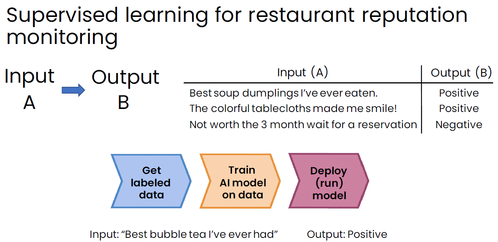

    The process would begin by collecting hundreds or thousands of data points, labeling the data, finding a team of data scientists to train a supervised learning model, and then finding a team of machine learning engineers for model deployment and monitoring.

3.  In contrast, using prompt-based development simplifies the process significantly. The code below illustrates how straightforward it is to build such a system with this approach.

    > 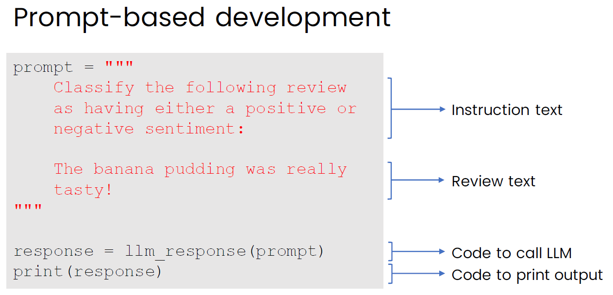

4.  The traditional approach to building a machine learning model may require a highly skilled machine learning team around 6-12 months to develop and deploy the model; whereas, prompt-based development might only take hours to write the prompt and days to deploy it.

    > 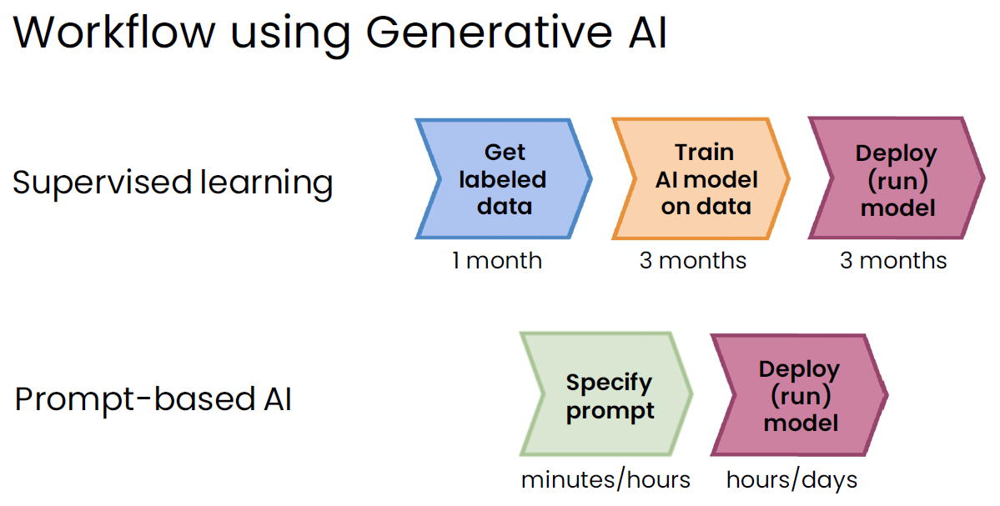

### Generative AI Code

1.  Prompting an LLM in code

    Set up programming environment to send prompts to the Open AI cloud-hosted service using code.

    ```python
    import os
    import openai

    openai.api_key = os.getenv('OPENAI_API_KEY')

    def llm_response(prompt):
        response = openai.ChatCompletion.create(
            model='gpt-3.5-turbo',
            messages=[{ 'role': 'user', 'content': prompt }],
            temperature=0,
        )
        return response.choices[0].message['content']
    ```

    Create a prompt that will classify the sentiment of a restaurant review.

    ```python
    prompt = '''
        Classify the following review as having either a positive or negative
        sentiment:

        The banana pudding was really tasty!
    '''

    response = llm_response(prompt)
    print(response)

    # Positive sentiment
    ```

2.  Reputation monitoring system

    Create a list of reviews.

    ```python
    all_reviews = [
        "The mochi is excellent!",
        "Best soup dumplings I have ever eaten.",
        "Not worth the 3 months wait for a reservation.",
        "The colourful tablecloths made me smile!",
        "The pasta was cold.",
    ]
    ```

    Classify the reviews as positive or negative.

    ```python
    all_sentiments = []
    for review in all_reviews:
        prompt = f'''
            Classify the following review as having either a positive or
            negative sentiment. State your answer as a single word, either
            "positive" or "negative":

            {review}
        '''
        response = llm_response(prompt)
        all_sentiments.append(response)

    print(llm_response)

    # ['positive', 'positive', 'negative', 'positive', 'negative']
    ```

    Count the number of positive and negative reviews.

    ```python
    num_positive = 0
    num_negative = 0
    for sentiment in all_sentiments:
        if sentiment == 'positive':
            num_positive += 1
        elif sentiment == 'negative':
            num_negative += 1
    print(f"There are {num_positive} positive and {num_negative} negative reviews.")

    # There are 3 positive and 2 negative reviews.
    ```

### Lifecycle of a Generative AI Project

1.  Lifecycle of a Generative AI Project

    > 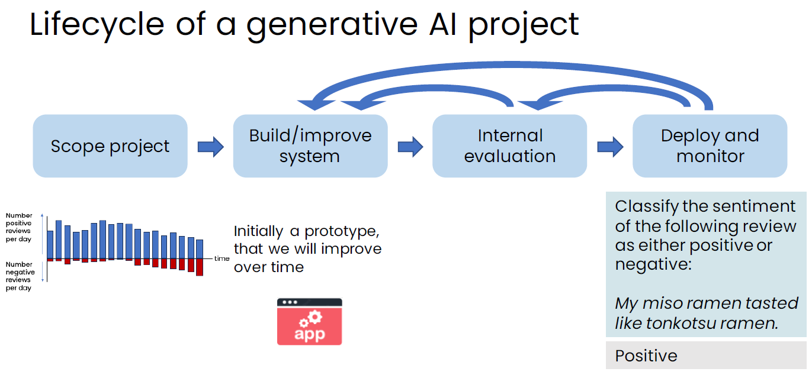

    We begin by scoping a project to determine its objectives, such as building a restaurant reputation monitoring system. Initially, we develop a prototype within one or two days, which is then incrementally improved over time.

    Rapid prototyping enables us to present the prototype to the internal evaluation team, allowing us to test various test cases and assess the accuracy of the system. Based on the issues identified during internal evaluation, we return to improving the system.

    After conducting a thorough internal evaluation to ensure the system's quality, we confidently deploy it for public use and continue monitoring its performance. It is common for external users to interact with the system in ways that may lead to errors initially. If such errors are deemed unacceptable, the system may be subjected to further internal evaluation and refinement.

    Building generative AI software is an empirical and iterative process that requires ongoing refinement and testing.

2.  Tools to improve generative AI system performance

    - Prompting
    - Retrieval-augmented generation (RAG)
        - Give LLM access to external data source
    - Fine-tuned models
        - Adapt LLM to your task
    - Pretrained models
        - Train LLM from scratch

### Cost Intuition

1.  You may be wondering, what is a token? Token is loosely defined as either a word or a subpart of a word. This is because that is how LLM process text. A common word would be counted as a single token, while a less common word might be split into two tokens, and some into four. However, on average, across a large collection of text documents, each token correspond to roughly three-quarters of a word.

    > 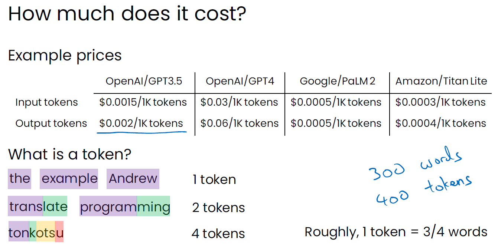

2.  Paying 8 cents per hour for intense reading might seem like a minimal expense, especially when considering that the minimum wage in many parts of the world is around 10-15 dollars an hour.

    > 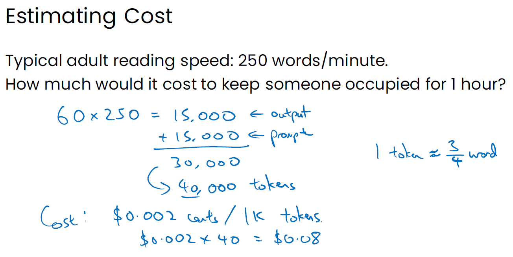

    Of course, if you offer a free product used by a million users, then multiplying 8 cents by a million without any associated revenue can become costly.

## Advanced Technologies

### Retrieval-Augmented Generation

1.  Given a question such as "Is there parking for employees?" an LLM does not know the parking policy of your company. Retrieval-augmented generation (RAG) is a technique that provides LLMs with additional information, enabling them to answer questions specific to you and your company.

2.  RAG works in three steps:

    -   Given a question, it searches through a collection of documents that may have the answer and selects the document that is most relevant.
    -   It then incorporates the retrieved text from the document into an updated prompt. Remember the limitation regarding prompt length or input length. In practice, you might want to extract just the part of the document that is most relevant to the question.
    -   Finally, it adds the original question, "Is there parking for employees?"

    > 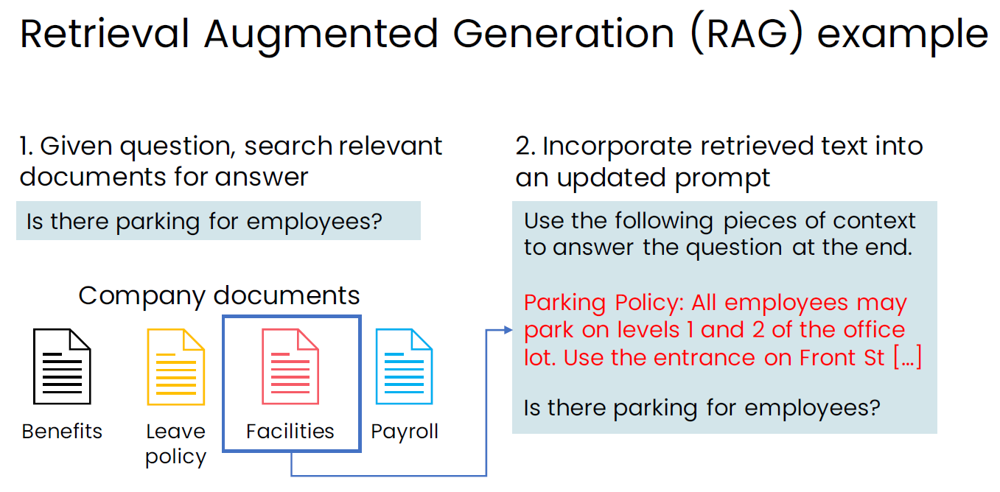

    > 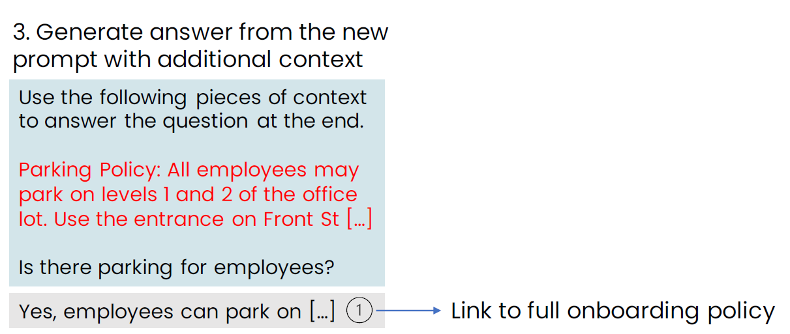

3.  This is called retrieval-augmented generation, because it enhances how the language model generates text by retrieving relevant context and augmenting the prompt with additional information.

4.  RAG-based applications

    -   Chat with PDF files
    -   Answer questions on website articles
    -   New form of web search

5.  Big idea: LLM as a reasoning engine

    -   LLMs possess a vast amount of general knowledge, yet they do not know everything.
    -   By supplying relevant context in the prompt, we enable the LLM to read and process text in order to derive an answer.
    -   We can use it as a reasoning engine to process information, rather than merely as a source of information.

### Fine-tuning

1.  Fine-tuning is another technique that can give LLMs additional information.

    -   If you have a larger context that exceeds the input or the context length limit, fine-tuning provides a way for allowing LLMs to absorb this information.
    -   Fine-tuning is also valuable for getting an LLM to produce text in a specific style.

2.  An LLM may have learnt hundreds of billions of words found on the internet and can generate text that sounds like what is on the internet. This process of training an LLM on large amount of data is called pre-trainning. Now, the LLM can be modified by a bit more learning to change its output, say to be more optimistic.

    We then come up with a set of sentences or text that is more positive or optimistic. If you take an LLM that was pre-trained on hundreds of billions of words and fine-tune it with just thousands, or tens of thousands, it can shift the output of the LLM to adopt a more optimistic tone.

    > 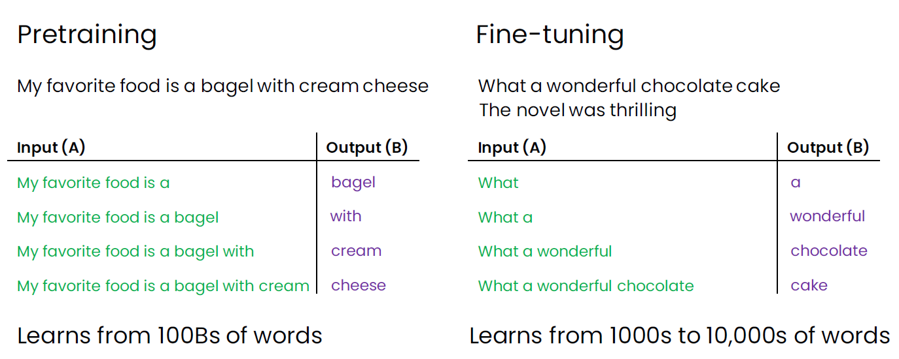

3.  Fine-tuning can help us to carry out tasks that are not easy to define in a prompt.

    -   Summarising in certain style or structure

        > 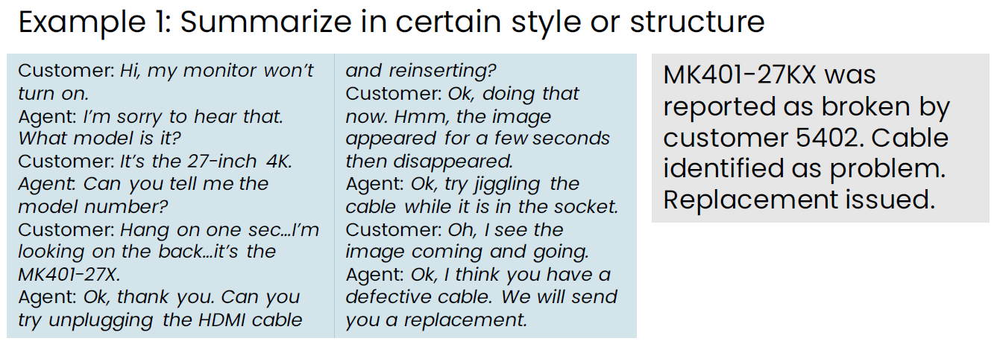

    -   Mimicking a writing or speaking style

        > 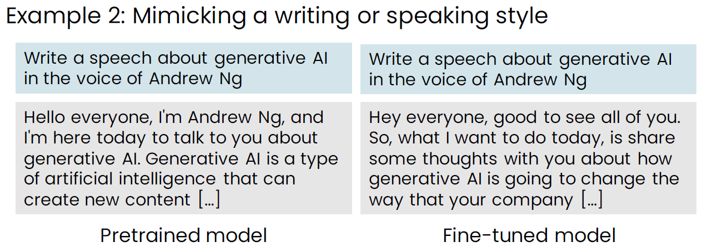

4. Fine-tuning can help LLMs gain specific domain knowledge.

    -   Medical domain knowledge

        > 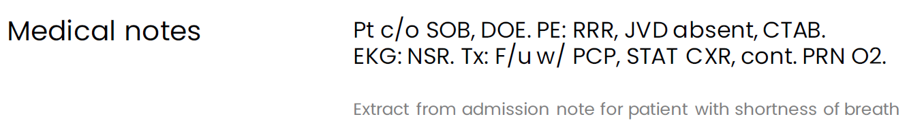

    -   Legal domain knowledge

        > 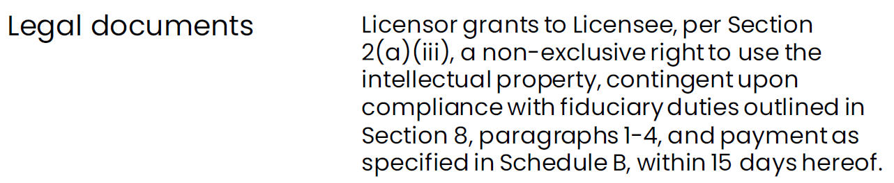

    -   Financial domain knowledge

        > 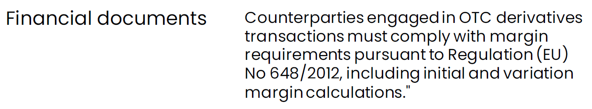

5.  Fine-tuning can enable a smaller model to perform tasks that would otherwise require a larger model.

    For LLM applications that require extensive knowledge or complex reasoning, you might need a relatively large model. Although these models are not expensive, you might want them to be even cheaper. Another reason you might prefer a smaller model is that larger models may require specialised GPUs to run, making them difficult to operate on a standard PC or laptop, and certainly not on a smartphone today.

    > 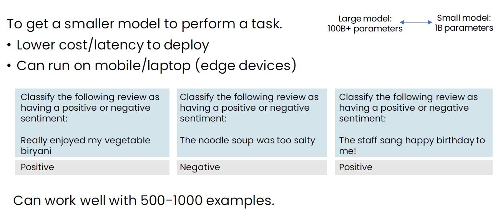

### Pre-training an LLM

1.  Many of the LLMs are pre-trained by big tech companies. This turns out to be so expensive that I would probably advise against it when in doubt.

    The efforts to train LLMs can cost tens of millions of dollars, require a large and dedicated engineering team, take many months, and need a huge amount of data, such as that found on the internet. Given the time and expense involved in pre-training a model from scratch, building a specific application this way is often considered a last-resort option. However, it could be beneficial if you have a highly specialised domain and a substantial amount of data.

    For example, Bloomberg is a company that offers software as well as media articles centred around financial services. Because of its access to a vast amount of text on finance, it trained BloombergGPT, a 50-billion parameter LLM purpose-built from scratch for financial applications. Bloomberg reported that compared to general-purpose LLMs that had learnt mainly from internet data, this model performs quite a bit better in processing financial text.

    For many other applications, unless you have a huge amount of resources and data, it will be more practical to start with pre-trained LLM and fine-tune it to your own data. This approach often yields decent performance in much more economical way.

### Choosing a Model

1.  Model size

    | Model Size | Capabilities | Applications |
    |:---|:---|:---|
    | 1B parameters | Pattern matching and basic knowledge of the world. | Restaurant review sentiment analysis |
    | 10B parameters | Greater world knowledge, ability to follow basic instructions. | Food order chatbot |
    | 100B+ parameters | Rich world knowledge, complex reasoning capabilities. | Brainstorming partner |

    Very large models tend to possess extensive world knowledge. They are well-versed in physics, philosophy, and history, enhancing their capacity for complex reasoning.

    That is why, when building a food order chatbot, you do not need the model to understand physics and philosophy, nor everything under the sun. Some models might be inexpensive enough that using large models for a food order chatbot is feasible. However, large models are better suited to tasks that require deep knowledge or complex reasoning.

    While these are general guidelines, in practice, using large language models is a highly empirical and experimental process. It will be worthwhile to experiment with different models and test them thoroughly.

2.  Open source models
    -   Cloud programming interfaces
    -   Easy to use in applications
    -   Larger/more powerful models
    -   Relatively inexpensive
    -   Some risk of vendor lock-in

    Many of the largest and most powerful models today are available only through cloud programming interfaces and are closed source. They are relatively inexpensive to operate because the large companies hosting these models have often invested significantly in making these API calls cost-effective.

3.  Closed source models
    -   Full control over model
    -   Can be run on your own device (on-premises, PC, etc.)
    -   Full control over data privacy/access

### Instruction Tuning and RLHF

1.  LLMs are pre-trained on a large corpus of text. For example, if your favourite food is a bagel with cream cheese, an LLM trained on such data would excel at predicting the next word based on typical internet text patterns.

    If you were to ask an LLM, "What is the capital of France?" it might respond with unrelated questions like, "What is the capital of Germany?" "Where is Mumbai?" or "Is Mount Fuji or Mount Kilimanjaro taller?" However, the answer you are seeking is straightfoward: the capital of France is Paris.

2.  To ensure an LLM follows instructions rather than merely predicting the next word, a technique called instruction tuning is used. This involves taking a pre-trained LLM and fine-tuning it with examples where the LLM successfully follows specific instructions.

    > 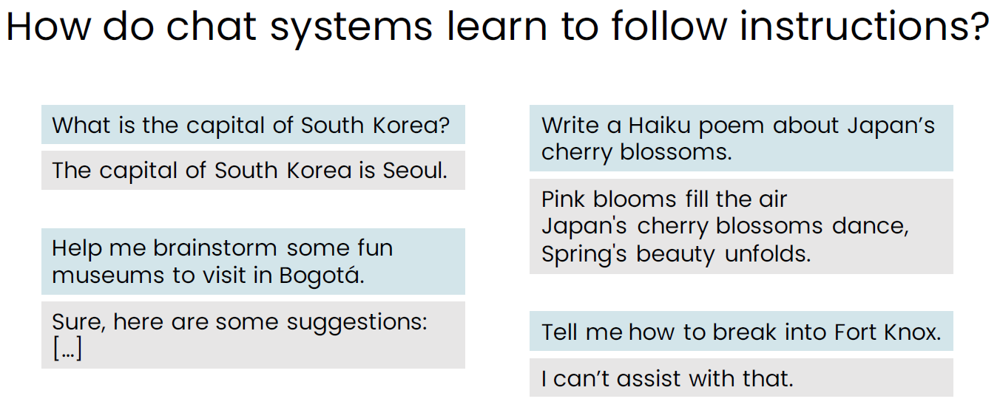

    When you fine-tune an LLM on a dataset of prompts and effective responses, the LLM learns not just to predict the next word based on internet text, but also to answer your questions and follow your instructions.

    > 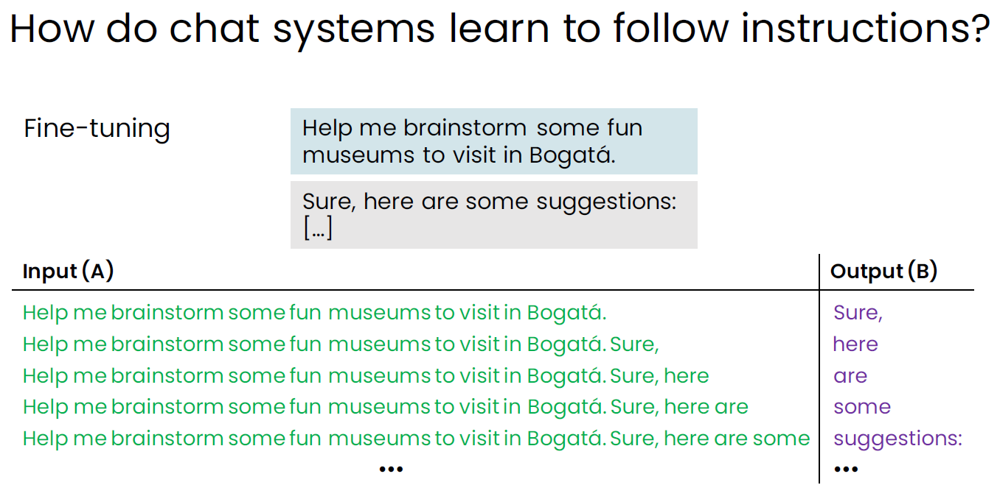

3.  There is a technique called reinforcement learning from human feedback (RLHF) that can further improve the quality of answers. Many companies training LLMs want them to produce results that are helpful, honest, and harmless (HHH), and RLHF technique is a way to accomplish this.

    > 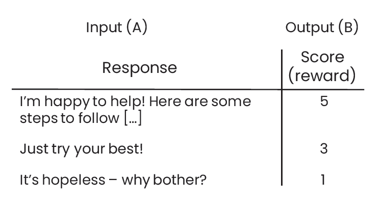

    -   Step 1: Train an answer quality (reward) model using supervised learning to rate the answers of the LLM.
    -   Step 2: Have the LLM to generate many answers to various prompts and further train it to produce more responses that receive higher scores.

### Tool Use and Agents

1.  In the example of a food order-taking chatbot, if we were to order a burger, the LLM cannot just say, "Okay, it's on its way," because it needs to take concrete actions to actually send the burger to us. The LLM is fine-tuned to output text that triggers a software application, which then passes a request to the restaurant ordering system to deliver a burger to the user's address. What is shown to the user is only the second part of the text output.

    This is an example of tools used by an LLM, where the text output consists of codes and commands that call APIs of different software systems to complete a task. Only part of the code contains the command to call the API that sends the interactive text response to the user.

    ```
    order(item='burder', user_id=9876, address='1234 My Street')
    message("Okay, it's on its way")
    ```

2.  Placing an incorrect order can be a costly mistake. It is a good idea to let the user verify and confirm the desired action before executing all the commands from the generated text output. This is especially important if the systems are safety-critical or mission-critical.

    > 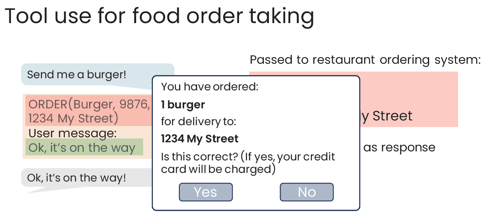

3.  In additional to tools for taking actions, we can also give LLMs tools for reasoning purpose.

    > 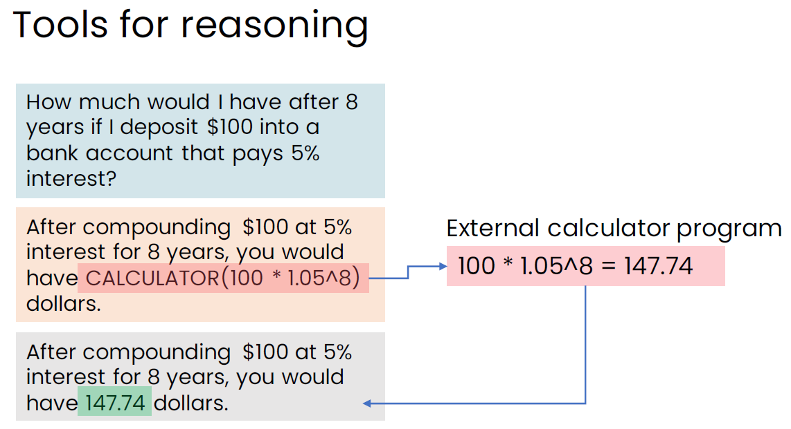

4.  By giving LLMs the ability to call tools in their output, we can significantly extend their reasoning and action-taking capabilities. The use of tools today are an important part of many LLM applications. Of course, designers of these applications should be careful to ensure that tools are not triggered in a way that causes harm or irreversible damage.

5.  Going beyond tools into a more experimental area, AI researchers have been examining agents that not only trigger a tool to carry out a single action but also explore whether LLMs can choose and execute complex sequences of actions. There is a lot of excitement and research on agents, but this is at the cutting edge of AI research. It is not yet mature enough to rely on for most important applications.

6.  If you were to ask an agent that is built on top of an LLM to help you research burger top competitors, then the agent might use the LLM as reasoning engine to figure out what the steps are to carry out the research task. It can then translate the steps into concrete actions in the form of codes and commands, where each command corresponds to a tool or LLM's capability such as summarisation.

    > 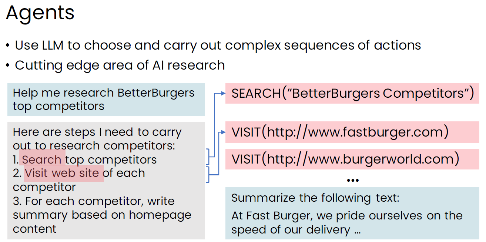
