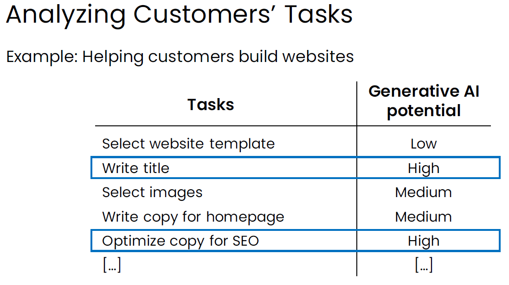

<h1 style="color: #ccc">Generative AI for Everyone</h1>

# Generative AI in Business and Society

Jun 1, 2024

## Generative AI and Business

1.  Day-to-day usage of web interface LLMs

    -   Writing assistant or copy editor
    -   Brainstorm marketing ideas
    -   Summarise job candidate reviews
    -   Generate programming codes
    -   As a thought partner to help me think things through

### Task Analysis of Jobs

1.  There is a [framework](https://dspace.mit.edu/bitstream/handle/1721.1/120302/pandp.20181019.pdf?sequence=1&isAllowed=y) originating in economics for analysing work tasks for possible automation using AI. This framework turns out to be useful not just for economists to understand the financial or economic impact of AI, but also for businesses to identify specific opportunities to use generative AI.

2.  Most jobs involve a collection of many tasks, so it is useful to think of AI not as automating jobs, but as augmenting or automating tasks.

    > 

3.  The potential for augmenting/automating a task depends on technical feasibility and business value.

    Technical feasibility: Can AI do it?

    -   Can a fresh college graduate, following the instructions in a prompt, commplete the task?
    -   If unsure, try prompting an LLM to see if you can get it to do it.
    -   An AI engineer can also help assess if RAG, fine-tuning, or other techniques can help.

    Business value: How valuable is it for AI to augment or automate this task?

    -   How much time is spent on this task?
    -   Does doing this task significantly faster, cheaper or more consistently create substantial value?

4.  Augmentation vs automation

    Augmentation
    -   Helps humans with a task.
    -   E.g., recommends a response for a customer service agent to edit/approve.

    Automation
    -   Automatically performs a task.
    -   E.g., automatically transcribes and summarises records of customer interactions.

    For some tasks, business may start with augmentation, and gradually nove towards automation.

5.  For many job roles, people have a mental picture of the iconic tasks that uniquely define those roles. For example, computer programmers write code, doctors see patients, and lawyers argue court cases in court. When people think about AI opportunities, it is often instinctual to ask if AI can perform those iconic tasks. However, when we systematically analyse the tasks that make up a job, the best opportunities for AI may lie in less obvious tasks rather than the iconic ones.

6.  There is a U.S. government-funded website called [O*NET](https://www.onetonline.org/), which is an online occupation database that you can use to look up the tasks that comprise certain job roles.

### New Workflows and New Opportunities

1.  Surgeon

    Generative AI with custom RAG tools can assist with the research portion of the medical procedures that surgeons require.

    > 

2.  Legal document review

    With generative AI, the review of legal documents may become much faster. After building such a system for a highly productive process, however, legal companies may decide to change the workflow to add an additional human verification step to ensure that what the generative AI has generated in the document is comprehensive and correct.

    > 

3.  Marketing automation

    Sometimes, instead of making incremental improvements to the workflow, such as adding a human verification step, a total redesign with the help of generative AI can make the new workflow more relevant and create new value.

    > 

4.  In addition to searching for growth opportunities by analysing the tasks performed by the employees of a company, another useful framework is to also consider analysing the tasks of your customers. I found that this approach can sometimes lead companies to develop very different products or services for their customers. This can be another recipe for gaining many happy customers and, therefore, pursuing growth for your business.

    > 

### Team to Build Generative AI Software

1.  Common roles

    Software engineer
    -   Responsible for writing software application.
    -   Can be very effective in small team by putting a bit of efforts to learn the basics of LLMs and prompting.

    Machine learning engineer
    -   Responsible for implementing AI system.
    -   Can be very effective in building LLM applications by spending a bit of efforts to learn not just about LLM and prompting, but also some of the more advanced techniques like RAG and fine-tuning.

    Product manager
    -   Responsible for identifying and scoping the project.

2.  Getting started with a small team

    One person team
    -   Software engineer (who has learnt some prompting), or
    -   Machine learning engieer, or
    -   Just yourself!

    Two person team
    -   Can be machine learning engineer + software engineer.
    -   But many other configurations are fine.

4.  Additional roles

    -   Data engineer   Responsible for organising data and ensuring data quality.
    -   Data scientist   Responsible for analysing data to make recommendations to guide project or business decisions.
    -   Project manager   Responsible for coordinating project execution.
    -   Machine learning researcher   Responsible for developing advanced AI technologies.

### Automation Potential Across Sectors

1.  Earlier waves of automation tended to expose lower-wage jobs more because AI could handle routine, repetitive work. However, LLMs, and generative AI more broadly, are exposing higher-wage occupations to automation in this wave.

    > 

2.  The impact of generative AI is widespread across every sector, but some sectors are more affected than others.

    > 

3.  If we look at the data showing the impact of generative AI on automation, one remarkable observation is that sectors not previously highly exposed to automation are now seeing greater potential for augmentation or automation, such as creative and arts management.

    If you look at the top few lines on the graph, one recurring theme in all the studies is that a significant portion of the impact of generative AI will be on knowledge workers&mdash;those who generate value primarily through their knowledge, including their expertise, critical thinking, and interpersonal skills. This contrasts with workers who create value mainly through performing physical tasks rather than knowledge tasks.

    > 

## Generative AI and Society

### Concerns About AI

1.  Concern 1: Amplifying humanity's worst impulses

    -   LLMs are trained on text from the internet, which reflects some of humanity's best qualities, but also some of its worst.
    -   Will they amplify our worst impulses?
    -   LLMs are becoming less biased through fine-tuning and more advanced technologies, such as reinforcement learning from human feedback (RLHF).

2.  Concern 2: Job loss

    -   Many years ago, AI was thought to be so advanced that it could take radiologists' jobs. Now, more than five years later, AI is still far from replacing radiologists.
    -   First, interpreting X-rays has turned out to be harder than it seemed back then, although we are making rapid progress.
    -   Second, radiologists perform around 30 different tasks, with interpreting X-ray images being just one of them.

    > 

3.  Concern 3: Human extinction

    We know that AI in poorly designed software can run amok. Self-driving cars have crashed, leading to tragic loss of life. In 2010, an automated trading algorithm caused the stock market crash. And in the justice system, AI has led to unfair sentencing decisions. These system malfunctions are unlikely to lead to human extinction.

    Some are concerned about a bad actor using AI to destroy humanity, say, by creating a bioweapon. Others worry about AI inadvertently driving humanity to extinction, similar to how humans have driven many other species to extinction through a simple lack of awareness that our actions could lead to that outcome.

    Most of the argument boils down to it could happen, and this is a new technology, so things could be different this time. That statement is true for every new type of technology that has been invented by humanity. But as with every technology, as we know more about it, we become better at controlling it, and it becomes safer every day.

    Finally, in facing the real risks to humanity, such as climate change, the next pandemic, or an asteroid strike, AI will be a key part of our response to such challenges.

### Artificial General Intelligence

1.  Artificial general intelligence is defined as AI that can perform any intellectual task that a human can.

2.  There are different views about how long it would take to achieve AGI. Some businesses have made much more optimistic forecasts about when we will get there. Most of these businesses have changed the definition of AGI and set a much lower bar to reach it.

3.  One of the exciting things about large language models is that we can use them as reasoning engines. Maybe we are now starting to see what a rough outline of AGI could be someday. Even though we are still far away from AGI, AI is very powerful, and it is important that we use it responsibly.

### Responsible AI

1.  Responsible AI refers to developing and using AI in ways that are ethical, trustworthy, and socially responsible. Many developer, businesses, and governments care about this and have been having conversations and working hard to ensure that AI is built and used responsibly.

2.  Dimensions of responsible AI

    -   **Fairness**   Ensuring AI does not perpetuate or amplify biases.
    -   **Transparency**   Making AI systems and their decisions understandable to stakeholders.
    -   **Privacy**   Protecting user data and ensure confidentiality.
    -   **Security**   Safeguard AI systems from malicious attacks.
    -   **Ethical use**   Ensuring AI is used for beneficial purposes.

3.  Tips for responsible AI

    -   Build a culture that encourages discussion and debate on ethical issues.
    -   Brainstorm potential pitfalls, such as issues with the five dimensions of responsible AI.
    -   Work with a diverse team and include perspectives from all stakeholders.

### Building a More Intelligent World

1.  We invest years of our lives and trillions of dollars on education, training wise human beings. Human intelligence is expensive.

2.  Today, only the wealthiest people can affort to hire large amounts of intelligence by employing specialists like doctors to examine medical conditions or tutors to truly understand your child and gently coach them where they need the most help.

3.  Artificial intelligence can be made cheap. AI has the potential to give every individual the ability to hire intelligence at low cost, so you no longer need to worry about the huge bill for visiting a doctor or getting an education.

4.  Looking beyond AI, the world has many problems such as climate change, pandemics, and wars. To solve them, we will need all the intelligence we can muster, including all the artificial intelligence we can develop.
