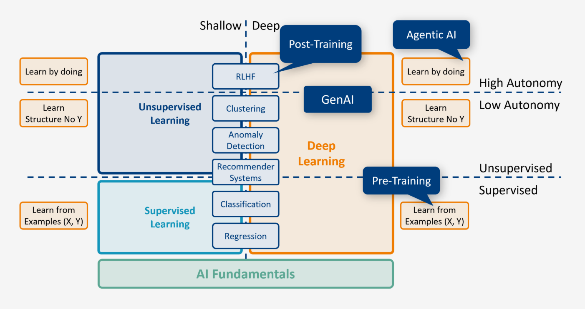
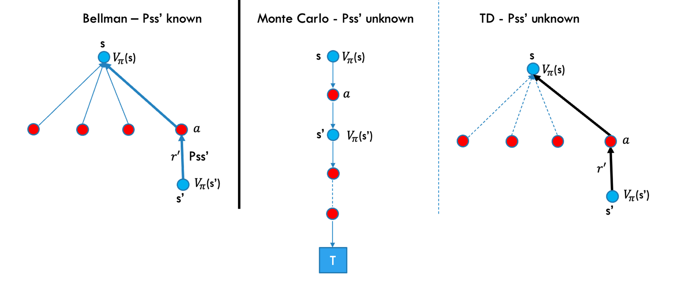

<h1 style="color: #ccc">Generative AI: Fundamentals to Advanced Concepts</h1>

# Reinforcement Learning for Generative AI

May 15, 2025

## Reinforcement Learning

1.  Developing LLM agents with advanced planning and inter-agent communication is a key research focus. Challenges include managing complex interactions, ensuring reliable communication, and reducing error accumulation in multi-agent setups.

    >   

    -   Reinforcement Learning (RL), inspired by neuroscience, enables agents to learn through trial and error via rewards and penalties.
    -   AI training approaches include supervised (learning from labelled data), unsupervised (finding patterns), and reinforcement learning (learning through interaction).
    -   RL is central to progress in robotics, autonomous systems, and game-playing AI.

2.  Generative AI and LLM Training

    -   Generative AI models learn the underlying data distribution and do not fit neatly into one learning category.
    -   While often considered unsupervised, LLMs use supervised learning for pre-training and reinforcement learning for fine-tuning.
    -   In post-training, Generative AI and RL converge to tackle the alignment problem, advancing AI towards more general and capable intelligence.

3.  Reinforcement Learning from Human Feedback (RLHF)

    -   After pre-training, an LLM must be aligned with human values before practical use.
    -   Traditional fine-tuning, which adjusts model weights using task-specific data, is costly for large models and still fails to eliminate hallucinations.
    -   Reinforcement Learning from Human Feedback (RLHF) helps align LLMs with human values by ranking outputs based on human preferences.

## Reinforcement Learning System

Think about how a toddler learns to walk&mdash;not by instructions, but by trying, failing, and adjusting. Reinforcement Learning (RL) works the same way. This session introduces RL as a framework where an agent learns by interacting with an environment and receiving feedback through rewards.

Unlike supervised or unsupervised learning, RL focuses on **learning through action**. For example, in the game *Space Invaders*, the agent takes actions via a joystick, aiming to maximise its score. Each action changes the state and produces a reward signal, which tells the agent how good that action was.

The agent's goal is to **maximise long-term cumulative rewards**&mdash;in other words, to optimise behaviour over time. As in other ML settings, this involves a trade-off:

-   **Optimisation** ensures the agent learns the best actions for high rewards.
-   **Generalisation** helps the agent handle new, unseen situations.

RL also introduces core concepts:

-   **Exploration vs. Exploitation**: Trying new actions vs. repeating what worked.
-   **Delayed Consequences**: Actions now may effect reward much later.
-   **State Representation**: Observed conditions that guide decisions.

## Policy and Q-Value

Reinforcement learning differs from other AI approaches. We will begin by discussing **Markov property**, **policy**, **discount factor**, **state value**, and **Q-value**.

First, a quick refresher: the **expected value** of a random variable is the weighted average of all possible outcomes. For example, rolling a die gives an expected value of 3.5.

$$
\mathbb{E}[X]=\sum_{i=1}^n{x_i\cdot p_i}
$$

where,

-   $x_i$ is the $i$-th possible outcome of the random variable $X$.
-   $p_i$ is the probability of that outcome, i.e.. $\mathbb{P}(X=x_i)$
-   $n$ is the total number of possible outcomes.

Now, the **Markov property**: if the environment satisfies this, the next state depends only on the current state&mdash;not the path taken. For example, if the agent is in state $s_4$, the next state $s_5$ depends only on $s_4$.

A **policy ($\pi$)** tells the agent what action to take in each state. A **deterministic policy** maps each state to a single action, while a **stochastic policy** maps states to probabilities over actions (e.g., in state $s_4$, take action 1 with 10%, action 2 with 20%, and action 3 with 70%).

The **state value** measures the long-term potential of being in a state, assuming the agent follows policy $\pi$ from that point on. But it does not tell us which action to take. That is where the **Q-value** (state-action value) comes in: it measures the expected cumulative reward of taking a specific action in a state, and then continuing to follow the policy.

The **discounting factor ($\gamma$)** reduces the value of future rewards, similar to the time value of money. A $\gamma$ near 1 values future rewards almost equally to present ones, while a lower $\gamma$ prioritises immediate rewards.

We define the **return** from state $s_t$, denoted as $G(s_t)$, as the total accumulated reward from time $t$ onwards, discounted over time:

$$
G(s_t)=r_{t+1}+\gamma r_{t+2}+\gamma^2r_{t+3}+\cdots
$$

where,

-   $r_{t+k}$ is the reward received at time $t+k$.
-   $\gamma\in[0,1]$ is the **discounting factor**, which reduces the value of future rewards.

The **state value function** under policy $\pi$, denoted as $V_{\pi}(s_t)$, is the expected return when starting from state $s_t$ and following policy $\pi$:

$$
V_{\pi}(s_t)=\mathbb{E}_{\pi}[G(s_t)]
$$

where,

-   $\mathbb{E}_{\pi}$ denotes the expectation over trajectories generated by policy $\pi$.

The **action value function** for **Q-value** under a policy $\pi$, denoted as $Q_{\pi}(s_t,a_t)$, represents the expected return starting from state $s_t$, taking action $a_t$, and therefore following policy $\pi$:

$$
Q_{\pi}(s_t,a_t)=\mathbb{E}_{\pi}[G(s_t)\mid s_t,a_t]
$$

where,

-   $s_t$ is the state at time $t$.
-   $a_t$ is the action taken at time $t$.
-   $G(s_t)$ is the return from time $t$ onwards.
-   $\mathbb{E}_{\pi}$ is the expectation assuming the agent follows policy $\pi$ after taking $a_t$.

## MDP and Optimal Policy

A Markov Decision Process (MDP) is a formal framework for sequential decision-making where actions affect both immediate and future rewards. It assumes the agent has full knowledge of the environment and has been widely studied since 1950s.

### Bellman Equations

The Bellman equation expresses the relationship between the value $V_{\pi}(s)$ of the current state and the value of all potential successor states $V_{\pi}(s^{\prime})$. The return $G$ of the current state $s$ is defined as follows:

$$
G(s)=r^{\prime}+\gamma r^{\prime\prime}+\gamma^2r^{\prime\prime\prime}+\cdots
$$

Express the return of the current state $G(s)$ as a function of the return of the next state $G(s^{\prime})$:

$$
G(s)=r^{\prime}+\gamma(r^{\prime\prime}+\gamma r^{\prime\prime\prime}+\cdots)
$$

$$
G(s)=r^{\prime}+\gamma G(s^{\prime}) \tag{1}
$$

We also define the state value $V_{\pi}(s)$ as the expected value of the return $G(s)$:

From $(1)$:

$$
\begin{aligned}
V_{\pi}(s) & =\mathbb{E}_{\pi}[r^{\prime}+\gamma G(s^{\prime})] \\
& =r^{\prime}+\gamma\mathbb{E}_{\pi}[G(s^{\prime})] \\
& =r^{\prime}+\gamma V_{\pi}(s^{\prime})
\end{aligned}
$$

$$
V_{\pi}(s)=r^{\prime}+\gamma V_{\pi}(s^{\prime}) \tag{2}
$$

Let us generalise equation $(2)$ and derive the Bellman equation for an MDP with multiple actions and successor states.

$$
V_{\pi}(s)=\sum_a\pi(a\mid s)\sum_{s^{\prime}}\sum_{r^{\prime}}P_{ss^{\prime}}\left[r^{\prime}+\gamma V_{\pi}(s^{\prime})\right] \tag{Bellman 1}
$$

The Bellman equation links a state's value $V(s)$ to the values of its possible next states $V(s^{\prime})$, allowing value estimation without seeing all future rewards. It provides a way to compute $V_{\pi}(s)$ under policy $\pi$ by considering all actions and resulting next states. Estimating $V_{\pi}(s)$ using $V_{\pi}(s^{\prime})$ is called **bootstrapping**, and the visual representation is known as the **Bellman backup diagram**.

There is also a Bellman equation for state-action:

$$
Q_{\pi}(s,a)=\mathbb{E}_{\pi}[G(s)\mid s,a]
$$

$$
Q_{\pi}(s,a)=\sum_{s^{\prime}}\sum_{r^{\prime}}P_{ss^{\prime}}\left[r^{\prime}+\gamma\sum_{a^{\prime}}{\pi(a^{\prime}\mid s^{\prime})Q_{\pi}(s^{\prime},a^{\prime})}\right] \tag{Bellman 2}
$$

### Optimal Policy ($\pi_*$)

In Reinforcement Learning, the goal is to find the optimal policy $\pi_*$ that maximises the agent's expected cumulative reward. For any MDP, there exists an **optimal deterministic policy $\pi_*$**.

The optimal state value and state-action value are defined as:

$$
V_{\pi_*}(s)=\mathbb{E}_{\pi_*}[G(s)]=\max_{\pi}{V_{\pi}}(s)
$$

$$
Q_{\pi_*}(s,a)=\max_{\pi}{Q_{\pi}(s,a)}
$$

We can rewrite the Bellman equations for optimal values.

Optimal state value function:

$$
V_{\pi_*}(s)=\max_a\sum_{s^{\prime}}\sum_{r^{\prime}}P_{ss^{\prime}}\left[r^{\prime}+\gamma V_{\pi_*}(s^{\prime})\right] \tag{Bellman 3}
$$

Optimal action value function:

$$
Q_{\pi_*}(s,a)=\sum_{s^{\prime}}\sum_{r^{\prime}}P_{ss^{\prime}}\left[r^{\prime}+\gamma\max_a Q_{\pi_*}(s^{\prime},a^{\prime})\right] \tag{Bellman 4}
$$

## Model-Based Learning: Dynamic Programming

Dynamic Programming (DP) is used when the agent has complete knowledge of the environment, allowing it to compute the optimal policy without interacting with the environment directly. However, in most real-world reinforcement learning problems, the agent does not have access to such detailed information, making DP impractical.

**Prediction and Control in Reinforcement Learning**

In standard RL, problem-solving typically involves two key stages:

-   **Policy Evaluation (Prediction Problem)** 
    Estimate the value function $V_{\pi}(s)$ or action-value function $Q_{\pi}(s,a)$ for a given policy $\pi$.
-   **Policy Improvement (Control Problem)** 
    Improve the policy by choosing actions that increases state values.

**Policy Iteration**

After evaluating the state values, we improve the policy by acting **greedily**&mdash;selecting actions that maximise value. This cycle of evaluation and improvement continues until the policy converges to the optimal policy $\pi_*$:

$$
\pi_0\to\pi_1\to\pi_2\to\cdots\to\pi_*
$$

This iterative process is known as **policy iteration**.

## Model-Free Learning

Model-free learning involves agents learning optimal behaviour through direct interaction with the environment, using trial and error to estimate the value of states or actions.

### Monte Carlo: Prediction Problem

In policy evaluation, we estimate the value function $V_{\pi}(s)$ for each state under a fixed policy $\pi$. Monte Carlo (MC) methods do this by sampling episodes&mdash;sequences of states, actions, and rewards&mdash;generated through interaction. Each episode must end in a terminal state.

Key point: MC does not use bootstrapping; it relies entirely on complete returns from episodes.

### Monte Carlo: Control Problem

We calculate returns backward from the terminal state using:

$$
G(s_t)=r_{t+1}+\gamma G(s_{t+1})
$$

Each episode produces returns for visited states. By averaging these returns across many episodes, we estimate expected return $\mathbb{E}[G]$, which equals the value function $V_{\pi}(s)$.

Monte Carlo control improves the policy by evaluating these returns and updating the policy towards actions with higher estimated value.

## Temporal Difference Learning (TD)

TD learning combines ideas from Dynamic Programming and Monte Carlo. Like Monte Carlo, it is model-free and learns from direct experience. Unlike Monte Carlo, TD does not wait for an episode to end&mdash;it uses **boostrapping** to learn from **incomplete episodes**.

Using MC, we sample full episodes to estimate values. But we can calculate value of $V_t(s)$ after $t$ episodes:

$$
\begin{aligned}
V_t(s) & =\frac{(t-1)V_{t-1}(s)+r_t(s)}{t} \\
& =\frac{t-1}{t}V_{t-1}(s)+\frac{r_t(s)}{t} \\
& =V_{t-1}(s)-\frac{1}{t}V_{t-1}(s)+\frac{1}{t}r_t(s) \\
& =V_{t-1}(s)+\alpha_t\underbrace{\left[r_t(s)-V_{t-1}(s)\right]}_{\text{Temporal Difference}} & \quad\alpha_t=\frac{1}{t}
\end{aligned}
$$

The temporal difference is the difference between the reward that we get now $r_t$ and the value estimate $V_{t-1}(s)$ that we had in previous timestamp.

**TD Update Rule**

Rather than waiting for full returns like MC, TD updates values **step-by-step**, using previous estimates:

$$
V_{\pi}(s_t)\leftarrow V_{\pi}(s_t)+\alpha\left[r_{r+1}+\gamma V_{\pi}(s_{t+1})-V_{\pi}(s_t)\right]
$$

where,

-   $V_{\pi}(s_t)$ is the current value estimate.
-   $\alpha$ is the learning rate.
-   $r_{t+1}+\gamma V_{\pi}(s_{t+1})$ is the TD Target.
-   $r_{t+1}+\gamma V_{\pi}(s_{t+1})-V_{\pi}(s_t)$ is the TD Error.

**Backup Diagrams for Three Learning Methods**

>   

**Comparison of Learning Methods**

| Method | Transition Model Known? | Learns From | Uses Bootstrapping? |
|:---:|:---:|:---:|:---:|
| Bellman (DP) | Yes | Full model | Yes |
| Monte Carlo | No | Complete episodes | No |
| TD Learning | No | Partial transitions | Yes |

## Exploration vs. Exploitation

Consider a scenario where the agent follows a **deterministic policy $\pi$**, always choosing action $a_1$ in state $s$. While this maximises known reward, it prevents the agent from trying other actions like $a_2$ and $a_3$, which could lead to even better outcomes.

This lack of exploration limits learning and may trap the agent in suboptimal behaviour.

**Solution: $\varepsilon$-Greedy Policy**

To balance exploration and exploitation, we can use an **$\varepsilon$-greedy policy**:

-   Most of the time, the agent chooses the best-known action (exploitation).
-   Occasionally, it selects a random action (exploration).

Over time, this ensures the agent samples **all possible actions** in each state, allowing it to discover better strategies and improve its policy.

## Tabular Q-Learning

Tabular Q-learning is a foundational Temporal-Difference (TD) control method introduced in 1989.

Before diving into Q-learning, it is important to clarify **on-policy** vs. **off-policy** learning.

So far, we have only looked at **on-policy** learning. Here, the agent learns a **target policy $\pi(s\mid a)$**&mdash;for example, the optimal policy $\pi_*$. In on-policy learning, the agent both evaluates and improves the same policy it uses to act.

In contrast, **off-policy** learning involves a **behaviour policy $b(s\mid a)$**, which is used to select actions, while the agent learns a **different target policy**. This separation allows for more exploration, as the agent can use a more exploratory behaviour policy while learning the optimal one.

---

**Q-learning** is a form of off-policy learning. The agent learns optimal actions independently of its behaviour policy, eventually converging to a deterministic optimal policy.

**Q-Learning Update Rule**

The agent updates the Q-value by adjusting the current estimate with:

-   The observed reward
-   The estimated best future reward

$$
Q(s_t, a_t) \leftarrow Q(s_t, a_t) + \alpha \left[r_{t+1} + \gamma \max_{a_{t+1}} Q(s_{t+1}, a_{t+1}) - Q(s_t, a_t)\right]
$$

## Deep Q-Networks (DQNs)

Tabular Q-learning does not scale well with large state-action spaces&mdash;it consumes too much memory and compute. To handle this, Deep Q-Networks (DQNs) use neural networks to approximate Q-values, enabling generalisation across similar states.

Just like in supervised learning, DQNs assume similar states have similar values. For example, if you can drive a Toyota, you can likely drive a Volkswagen. This principle helps RL agents make good decisions without learning each state-action pair explicitly.

During training:

-   Each experience (state, action, reward, next state) is stored in **replay memory**.
-   We sample randomly from replay memory to break correlations between experiences.
-   To compute the loss, we use a **target network**, a slower-updated clone of the main Q-network, to provide stable target Q-values.
-   We pass the next state through the target network to get the maximum Q-value for that state.
-   The main network updates its weights via gradient descent to reduce the difference between predicted and target Q-values.

This process repeats across episodes, gradually improving the Q-value function approximation. Unlike tabular methods, DQNs learn a mapping function from states to Q-values&mdash;similar in spirit to supervised learning, but adapted for sequential decision-making.

Step-by-step flow:

1.  Agent is in state $st$.
2.  Agent selects an action $a_t$ (usually using the main network).
3.  Agent executes the action in the environment.
4.  The environment returns:
    -   New state $s_{t+1}$
    -   Reward $r_{t+1}$ (this comes from the environment, not network)

Then we use:

-   $r_{t+1}$ from environment
-   $\max_{a'}Q(s_{t+1},a')$ from target network (target, used to guide learning)
-   $Q(s_t,a_t)$ from main network (prediciton and what we update)

All three go into the TD target and loss function for the update rule below:

$$
Q(s_t, a_t) \leftarrow Q(s_t, a_t) + \alpha \left[r_{t+1} + \gamma \max_{a'} Q(s_{t+1}, a') - Q(s_t, a_t)\right]
$$

## Policy Gradient

In policy gradient methods, we learn a **policy function** parameterised by $\theta$ that produces a probability distribution over possible actions, given a state:

$$
\pi_{\theta}(u\mid s)
$$

In the context of an LLM, this corresponds to predicting a distribution over the next word.

From now on, we will use $u$ for actions (instead of $a$) and assume the discount factor $\gamma=1$.

The goal is to use a **stochastic policy**, since deterministic ones can change too suddenly and disrupt the gradient descent process.

Let us define a trajectory $\tau$ as a sequence of state-action pairs.

### Key Concepts

**Trajectory ($\tau$)**: A sequence of states and actions:

$$
\tau=(s_0,u_0,\cdots,s_H,u_H)
$$

**Reward** of a trajectory:

$$
R(\tau)=\sum_{t=0}^H R(s_t,u_t)
$$

**Policy value or utility**:

$$
U(\theta) = \mathbb{E}_{\tau\sim\pi_{\theta}} \left[ \sum_{t=0}^H R(s_t,u_t) \right] = \sum_\tau P(\tau;\theta) R(\tau)
$$

**Objective**:

Maximise the expected reward under the policy:

$$
\max_\theta U(\theta) = \max_\theta \sum_\tau P(\tau;\theta) R(\tau)
$$

### Computing the Gradient

We aim to find parameters $\theta$ that maximise the expected reward. The gradient is:

$$
\begin{aligned}
\frac{\partial}{\partial\theta} U(\theta) & = \frac{\partial}{\partial\theta} \sum_{\tau} P(\tau;\theta) R(\tau) \\
& = \sum_{\tau} \frac{\partial}{\partial\theta} P(\tau;\theta) R(\tau) \\
& = \sum_{\tau} \left[ P(\tau;r) \frac{1}{P(\tau;r)} \right] \frac{\partial}{\partial\theta} P(\tau;r) R(\tau) \\
& = \sum_{\tau} P(\tau;r) \left[ \frac{1}{P(\tau;r)} \frac{\partial}{\partial\theta} P(\tau;r) \right] R(\tau) \\
& = \sum_{\tau} P(\tau;r) \left[ \frac{\partial}{\partial\theta} \log P(\tau;r) \right] R(\tau) \\
& \approx \hat{g} = \frac{1}{m} \sum_{i=1}^m \frac{\partial}{\partial\theta} \log P(\tau^{(i)};\theta) R(\tau^{(i)})
\end{aligned}
$$

This gradient estimate allows us to perform policy gradient updates using sampled trajectories. Good trajectories (high reward) are reinforced; bad ones are discouraged. Next, we break down trajectories into state-action pairs for deeper analysis.

### Trajectory and Probability

A trajectory $\tau^{(i)}$ includes:

-   States: $s_t^{(i)}$
-   Actions: $u_t^{(i)}$
-   Transitions

The probability of a trajectory under policy $\pi_\theta$ is:

$$
P(\tau^{(i)};\theta) = \prod_{t=0}^H \pi_\theta(u_t^{(i)} \mid s_t^{(i)}) \cdot P(s_{t+1}^{(i)} \mid s_t^{(i)},u_t^{(i)})
$$

where,

-   $\pi_\theta(u_t^{(i)} \mid s_t^{(i)})$: Policy's probability of choosing action $u_t^{(i)}$ in state $s_t^{(i)}$.
-   $P(s_{t+1}^{(i)} \mid s_t^{(i)},u_t^{(i)})$: Transition probability from the dynamics model.

### Calculating the Log-Probability Gradient

To compute the policy gradient, we apply log and differentiate:

$$
\begin{aligned}
\frac{\partial}{\partial\theta} \log P(r^{(i)};\theta) & = \frac{\partial}{\partial\theta} \log \left[ \prod_{t=0}^H \pi_\theta(u_t^{(i)} \mid s_t^{(i)}) \cdot P(s_{t+1}^{(i)} \mid s_t^{(i)},u_t^{(i)}) \right] \\
& = \frac{\partial}{\partial\theta} \left[ \sum_{t=0}^H \log \pi_\theta(u_t^{(i)} \mid s_t^{(i)}) + \sum_{t=0}^H \log P(s_{t+1}^{(i)} \mid s_t^{(i)}) \right]
\end{aligned}
$$

Since the transition probabilities do not depend on $\theta$, their gradients are zero:

$$
\frac{\partial}{\partial\theta} \log P(r^{(i)};\theta) = \frac{\partial}{\partial\theta} \sum_{t=0}^H \log \pi_\theta(u_t^{(i)} \mid s_t^{(i)})
$$

This means we do not need a **dynamics model** to estimate the gradient.

## References

1. [Adding a Generative AI Task to a Service Flow - IBM Documentation](https://www.ibm.com/docs/en/dbaoc?topic=flow-adding-generative-ai-task-service)
2. [Reinforcement Learning from Human Feedback (RLHF) for LLMs - SuperAnnotate Blog](https://www.superannotate.com/blog/rlhf-for-llm)
3. [RLHF in Large Language Models - Turing](https://www.turing.com/resources/rlhf-in-llms)
4. [Fine-Tuning Large Language Models - SuperAnnotate Blog](https://www.superannotate.com/blog/llm-fine-tuning)
5. [LLM Continuous Self-Instruct Fine-Tuning Framework - AWS Machine Learning Blog](https://aws.amazon.com/blogs/machine-learning/llm-continuous-self-instruct-fine-tuning-framework-powered-by-a-compound-ai-system-on-amazon-sagemaker/)
