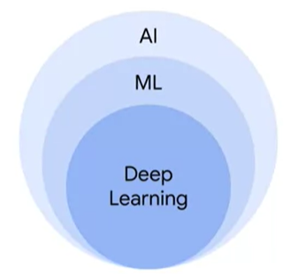
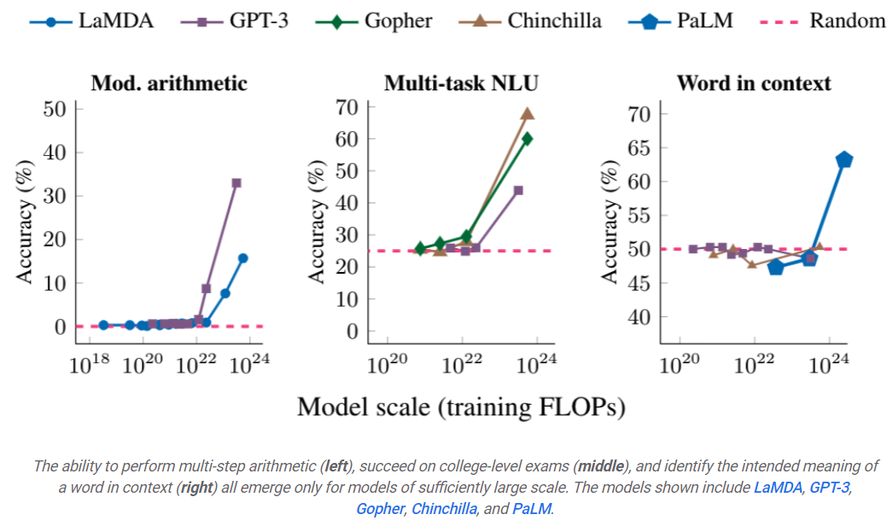

<h1 style="color: #ccc">Introduction to Generative AI</h1>

# Introduction to Generative AI

*Mar 9, 2024*

## Introduction to Generative AI

1. Artificial intelligence (AI) involves the theory and development of computer systems that can perform tasks normally requiring human intelligence.

    > 

2. Machine learning (ML) is a type of AI enables computers to learn without being explicitly programmed.

3. ML models

    - Supervised ML models
    - Unsupervised ML models
    - [Semi-supervised ML models](https://www.v7labs.com/blog/semi-supervised-learning-guide)

4. Deep learning is a subset of ML that utilises artificial neural networks, enabling it to process more complex patterns than traditional ML methods.

5. Discriminative ML models

    - Used to classify or predict.
    - Typically trained on a dataset of labeled data.
    - Learns the relationship between the features of the data points and their labels.

6. Generative ML models

    - Generates new data similar to data they were trained on.
    - Understand the distribution of data and assess how likely a given example is.
    - Predict the next word in a sequence.

7. What is Generative AI?

    Generative AI (GenAI) and Large Language Models (LLMs) are subsets of deep learning that create new content based on what they have learned from existing content.

8. What does it take to build a GenAI model?

    Building a GenAI model is predominantly a significant endeavour, so much so that primarily a handful of well-equipped technology giants have ventured into this space. These corporations engage some of the most distinguished computer scientists and engineers globally.

    OpenAI has not disclosed the precise costs; however, estimates suggest that GPT-3 was trained on approximately 45 terabytes of text data, with the expense amounting to several million dollars.

9. What kinds of problems can a GenAI model solve?

    Any organisation that needs to produce written codes or written materials potentially stands to benefit. We have observed that developing GenAI model is so resource-intensive that it becomes impractical for all but the largest and most well-resourced companies. Companies looking to implement GenAI have the option to use it out of the box or fine-tune it to perform specific tasks.

10. Multi-step reasoning

    One of the broad key challenges in AI is to build systems that can perform **multi-step reasoning**, learning to break down complex problems into smaller tasks and combining solutions to those to address the larger problem. Google's work on [Chain of Thought prompting](https://blog.research.google/2022/05/language-models-perform-reasoning-via.html), whereby the model is encouraged to "show its work" in solving new problems, helps language models follow a logical chain of thought and generate more structured, organised and accurate responses.

    A key research question is whether ML models can learn to solve complex problems using multi-step reasoning. By taking the general purpose PaLM language model, **fine-tuning** it on a large corpus of mathematical documents and scientific research papers from arXiv, and then using Chain of Thought prompting and [self-consistency decoding](https://arxiv.org/abs/2203.11171), the [Minerva effort](https://blog.research.google/2022/06/minerva-solving-quantitative-reasoning.html) was able to demonstrate substantial improvements over the state-of-the-art for mathematical reasoning and scientific problems across a wide variety of scientific and mathematical benchmark suites.

    The similar **learnt prompt tuning**, in which a large language model is fine-tuned on a corpus of problem-domain-specific text, has shown great promise. In [Large Language Models Encode Clinical Knowledge](https://arxiv.org/abs/2212.13138), we demonstrated that learnt prompt tuning can adapt a general-purpose language model to the medical domain with relatively few examples and that the resulting model can achieve 67.6% accuracy on US Medical License Exam questions (MedQA), surpassing the prior ML state-of-the-art by over 17%.

11. Language translation

    Large language models trained on multiple languages can help with translation from one language to another, even when they have never been taught to explicitly translate text. In "[Unlocking Zero-Resource Machine Translation to Support New Languages in Google Translate](http://ai.googleblog.com/2022/05/24-new-languages-google-translate.html)" and the accompanying papers "[Building Machine Translation Systems for the Next Thousand Languages](https://arxiv.org/abs/2205.03983)" and "[Towards the Next 1000 Languages in Multilingual Machine Translation: Exploring the Synergy Between Supervised and Self-Supervised Learning](https://arxiv.org/abs/2205.03983)", Google describes a set of techniques that use massively multilingual language models trained on monolingual (non-parallel) datasets to [add 24 new languages spoken by 300 million people to Google Translate](https://blog.google/products/translate/24-new-languages/).

12. Learned soft prompt

    [Learned soft prompt](https://ai.googleblog.com/2022/02/guiding-frozen-language-models-with.html) utilise a small set of tunable parameters per task, which are derived from a few examples of the task, instead of creating new input tokens to represent a prompt. This approach typically results in high performance for tasks utilising learned soft prompts, while enabling the large pre-trained model to be shared across thousands of different tasks. This is a specific example of the more general technique of [task adaptors](https://arxiv.org/abs/1902.00751), which allow a large portion of the parameters to be shared across tasks while still allowing task-specific adaptation and tuning.

13. Emergent phenomena

    "[Characterising Emergent Phenomena in Large Language Models](https://ai.googleblog.com/2022/11/characterizing-emergent-phenomena-in.html)" examines the sometimes surprising characteristics that these models are not able to perform particular complex tasks very effectively until reaching a certain scale. But then, once a critical amount of learning has happened, they suddenly show large jumps in the ability to perform a complex task accurately. This raises the quetions of what new tasks will become feasible when these models are trained further.

    > 
