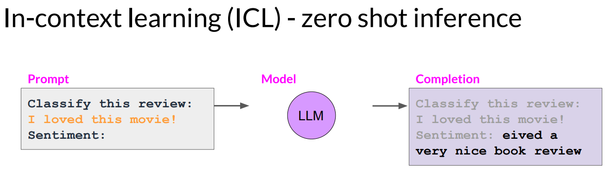

<h1 style="color: #ccc">Generative AI with Large Language Models</h1>

# Introduction to Generative AI with LLMs

Aug 15, 2024

## Introduction

1.  **Generative AI** and **large language models (LLMs)** are very exciting technologies. Despite the buzz and hype, many people still underestimate their power as developer tools. Specifically, many machine learning and AI applications that once took months to build can now be developed in just days or a few weeks.

2.  Generative AI, and particularly LLMs, are general-purpose technologies. This means, like other general-purpose technologies such as deep learning and electricity, they are not limited to a single application. Instead, they are useful for a wide range of applications across various sectors of the economy.

    Similar to the rise of deep learning about 15 years ago, there is still a lot of important work ahead. This work will need to be done over many years by many people, and I hope you will be among them, to identify use cases and build specific applications.

## Large Language Models

1.  Generative AI is a branch of traditional machine learning. The models that support generative AI develop their capabilities by identifying statistical patterns in large datasets of content originally created by humans.

2.  LLMs, trained on trillions of words over weeks and months with significant computational power, are referred to as **foundation models**. With billion of parameters, these models demonstrate **emergent properties** beyond just language. Researchers are discovering their ability to tackle complex tasks, reason, and solve problems.

3.  Foundation models, also known as **base models**, can be thought of as having a form of memory represented by their parameters. The more parameters a model has, the greater its memory.

4.  As the scale of foundation models expands from hundreds of millions to billions, and even hundreds of billions of parameters, their ability to understand language also improves. This enhanced language understanding, embedded within the model's parameters, enables it to process information, reason, and solve various tasks. However, it is important to note that smaller models can also be fine-tuned to excel in specific, focused tasks.

5.  You can rapidly develop customised solutions by using these models as they are or by fine-tuning them to suit your specific needs, eliminating the need to train a new model from scratch.

6.  The way you interact with language models is quite different from other machine learning and programming paradigms. Typically, you write computer code with formal syntax to interact with libraries and APIs. In contrast, LLMs can take natural language or human-written instructions and perform tasks in a manner similar to human.

7.  The text you provide to a language model is called a **prompt**. The space or memory available for the prompt is known as the **context window**, which can typically accommodate a few thousand words, though it varies by model. The prompt is fed to the model, which then predicts the next words. If your prompt contains a question, the model generates an answer. The output from the model is called a **completion**, and the process of generating text is known as **inference**. The completion consists of the original prompt followed by the generated text.

### LLMs Use Cases

1.  Next word prediction is the foundational concept behind many different capabilities in text generation. This straightforward technique can be applied to various tasks, including:

    -   **Chatbot**   Chatbots are often the main focus because they are highly visible and receive a lot of attention. However, LLMs and generative AI have many other applications beyond chat tasks.
    -   **Essay writing**   You can prompt a model to write an essay based on a given topic.
    -   **Summarisation**   You can ask a model to summarise conversations by providing the dialogue as part of your prompt, allowing the model to use this data along with its understanding of natural language to generate a summary.
    -   **Translation**   Models can handle various tasks, from traditional language translation between languages like French and German or English and Spanish, to translating natural language into machine code. For example, you could ask a model to write Python code that calculates the mean of every column in a DataFrame, and the model will generate the appropriate code for you to run.
    -   **Information retrieval**   LLMs can perform specific tasks like information retrieval. For example, you can ask the model to identify all the people and places mentioned in a news article. This task, known as **named entity recognition**, involves classifying words. The model's understanding, encoded in its parameters, enables it to accurately carry out this task and return the requested information to you.
    -   **Invoke APIs and actions**   An emerging area of development is augmenting LLMs by connecting them to external data sources or using them to invoke APIs. This augmentation allows the model to access information beyond its pre-training and enables it to facilitate real-world interactions.

## Transformer

### Text Generation Before Transformer

1.  Previous generations of language models used an architecture called recurrent neural networks (RNNs). While powerful at the time, RNNs were limited by the amount of computing power and memory required for effective performance in generative tasks. When an RNN sees only one previous word, its prediction quality is poor. Scaling the RNN to consider more preceding words significantly increases resource consumption. Despite scaling, the model still does not see enough input to make accurate predictions. To predict the next word successfully, models need to understand more than just the previous few words; they require a grasp of the entire sentence or even the whole document.

    >   

2.  The problem is that language is complex. In many languages, a single word can have multiple meanings&mdash;these are called homonyms. Additionally, sentence structures can be ambiguous, leading to what we call syntatic ambiguity. For example, consider the sentence, "The teacher taught the students with the book." Did the teacher use the book to teacher, did the students have the book, or both? If humans sometimes struggle to make sense of such sentences, how can an algorithm manage it?

    >   

3.  In 2017, researchers from Google and the University of Toronto published the paper "Attention Is All You Need", which revolutionised the field of natural language processing. This paper introduced the **transformer architecture**, a novel approach that has significantly advanced generative AI. The transformer model efficiently scales with multi-core GPUs, processes input data in parallel, and handles larger training datasets. This paper's title highlights the centrality of attention mechanisms in this architecture, which has replaced traditional RNNs and CNNs, forming the basis for large language models like GPT and PaLM.

    >   

4.  Transformers, primarily used for text processing, are also essential for vision transformers and other modalities. Understanding transformers in the context of text models helps grasp their broader applications in machine learning. This architecture is becoming a vital component across various machine learning fields.

### Transformer Architecture

1.  Building LLMs using the transformer architecture significantly enhanced the performance of natural language tasks compared to the earlier generation of RNNs, leading to a surge in generative capabilities.

2.  The power of the transformer architecture lies in its ability to learn the relevance and context of all the words in a sentence. It does not just consider each word in relation to its immediate neighbours, but to every other word in the sentence. By applying attention weights to these relationships, the model learns the relevance of each word to every other word, regardless of their positions in the input. This allows the algorithm to determine who has the book, who might have the book, and whether this information is relevant to the broader context of the document.

    >   

3.  These attention weights are learnt during the training of an LLM. The diagram, called **attention map**, illustrates the attention weights between each word and every other word. In this stylised example, you can see that the word "book" is strongly connected to, or pays attention to, the words "teacher" and "student". This is known as **self-attention**. The ability to learn attention weights in this manner across the entire input significantly enhances the model's capacity to encode language.

    >   

4.  Let us go over high-level overview of how the model works. Here is a simplified diagram of the transformer architecture to help you focus on the main processes. The transformer architecture is divided into two distinct parts: the **encoder** and the **decoder**. These components work together and share several similarities. Note that the inputs to the model are at the bottom, while the outputs are at the top.

    >   

5.  Machine learning models are essentially large statistical calculators that work with numbers, not words. Therefore, before a model can process text, the words must be tokenised. **Tokensiation** converts words into numbers, with each number representing a position in a dictionary of all possible words the model can handle. There are multiple tokenisation methods to choose from. For example, some tokenisers assign token IDs to complete words, while others break words into smaller parts and assign token IDs to these parts. The key point is that once you select a tokeniser to train the model, you must use the same tokeniser when generating text.

    >   

6.  Now that your input is represented as numbers, you can pass it to the **embedding layer**. This layer is a trainable vector space where each token is represented as a unique vector in a high-dimensional space. Each token ID in the vocabulary corresponds to a multi-dimensional vector. These vectors learn to encode the meaning and context of individual tokens in the input sequence. Embedding vector spaces have been used in natural language processing for some time; previous generation language algorithms like Word2vec also use this concept.

    >   

7.  Looking back at the sample sequence, you can see that each word has been matched to a token ID, and each token ID has been mapped to a vector. In the original transformer paper, the vector size was 512, which is too large to display in this image.

    >   

8.  For simplicity, imagine a vector size of just three. You could plot words into a three-dimensional space and observe their relationships. Words located close to each other in this embedding space are related, and you can calculate the distance between words as an angle. This allows the model to mathematically understand the language.

    >   

9.  When you add token vectors to the base of the encoder or decoder, you also include **positional encoding**. This ensures the model processes each input token in parallel while preserving the word order. By adding positional encoding, you maintain the relevance of each word's position in the sentence.

    >   

10. As you saw earlier, this feature allows the model to focus on different parts of the input sequence to better understand the relationships between words. The self-attention weights, learnt during training and stored in these layers, indicate the significance of each word in the sequence relative to all other words. This process does not occur just once; the transformer architecture uses **multi-headed self-attention**. This means multiple sets of self-attention weights, or heads, are learnt in parallel independently of each other. The number of attention heads in the attention layer varies between models, typically ranging from 12 to 100.

    >   

    The intuition here is that each self-attention head learns a different aspect of language. For example, one head might focus on the relationships between people mentioned in a sentence, while another head might concentrate on the activities described. Yet another head might focus on properties like rhyming. It is important to note that we do not predetermine what each attention head will learn. The weights of each head are initialised randomly, and with enough training data and time, each will naturally learn different language aspects. While some attention maps are easy to interpret, like the examples discussed here, others may not be as clear.

11. After applying all the attention weights to your input data, the output is processed through a fully-connected **feed-forward network**. This layer produces a vector of logits, which represent the probability scores for each token in the tokeniser dictionary.

    >   

    You can then pass these logits to a final **softmax layer**, which normalises them into probability scores for each word. This output includes a probability for every word in the vocabulary, resulting in thousands of scores. One token will have the highest score, representing the most likely predicted token.

    >   

### Text Generation with Transformer

1.  You now have a high-level understanding of the major components within the transformer architecture. However, you have not yet seen how the entire prediction process works from start to finish. Let us walk through a simple example. We will examine a translation task, which is a type of sequence-to-sequence task. Interestingly, this was the original goal of the transformer architecture designers. In this example, a tranformer model translates French into English.

    >   

2.  First, tokenise the input words using the same tokeniser that was used to train the network. These tokens are then fed into the encoder side of the network, passed through the embedding layer, and then processed by the multi-headed self-attention layers. The output from the multi-headed self-attention layers is then passed through a feed-forward network to produce the encoder's output.

    >   

3.  At this stage, the data output by the encoder is a deep representation of the structure and meaning of the input sequence. This representation is fed into the middle of the decoder to influence its self-attention mechanisms. Then, a start-of-sequence token is added to the decoder's input. This prompts the decoder to predict the next token, using the contextual understanding provided by the encoder.

    >   

4.  The output from the decoder's self-attention layers is processed through the decoder's feed-forward network and then through a final softmax output layer. This produces our first token. The process continues in a loop, with each output token fed back into the input to generate the next token, until the model predicts an end-of-sequence token. Finally, the sequence of tokens is detokenised into words, resulting in the output. In this case, the output is "I love machine learning".

    >   

    There are multiple ways to use the output from the softmax layer to predict the next token. These methods can influence the creativity of your generated text.

5.  To summarise, the transformer architecture comprises an encoder and a decoder. The encoder processes input sequences to form a deep representation of their structure and meaning, while the decoder uses this contextual understanding to generate new tokens in a loop until a stop condition is met.

    Both the encoder and decoder consist of multiple layers, each containing a multi-headed self-attention mechanism and a feed-forward neural network. The self-attention mechanism allows the model to focus on different parts of the input sequence, and the feed-forward network applies a fully connected layer to each position independently.

    To enhance training and prevent overfitting, the transformer model employs residual connections and layer normalisation. Additionally, it uses positional encoding to capture the order of tokens in the input sequence, eliminating the need for recurrent or convolutional operations.

### Variations of Transformer Architecture

1.  Although the translation example you explored used both the encoder and decoder parts of the transformer, you can separate these components for different variations of the architecture.

    >   

    -   **Encoder-only models**   Encoder-only models also function as sequence-to-sequence models. However, without modifications, the input and output sequences remain the same length. While less commonly used today, you can train encoder-only models for classification tasks like sentiment analysis by adding extra layers to the architecture. BERT is an example of an encoder-only model.
    -   **Encoder-decoder models**   Encoder-decoder models excel in sequence-to-sequence tasks like translation, where the input and output sequences can be of different lengths. These models can also be scaled and trained for general text generation tasks. Examples of encoder-decoder models include BART and T5, the latter of which you will use in the labs in this course.
    -   **Decoder-only models**   Decoder-only models are currently among the most commonly used. As these models have scaled, their capabilities have expanded, allowing them to generalise to a wide range of tasks. Popular decoder-only models include the GPT family, BLOOM, Jurassic, LLaMa, and many others.

    The main goal of this overview of transformer models is to provide you with enough background to understand the differences between various models in use today and to help you read model documentation.

## Prompt Engineering

1.  Although examples often show the model performing well, there are many instances where the model does not produce the desired outcome on the first try. You may need to revise the language or structure of your prompt multiple times to achieve the desired behaviour. This process of developing and improving prompts is known as **prompt engineering**, which is a broad and complex topic.

    >   

### In-Context Learning

1.  One effective strategy to achieve better results from the model is to include examples of the desired task within the prompt. This technique, known as **in-context learning**, involves providing these examples in the context window.

2.  With in-context learning, you can enhance LLMs' understanding of a task by including examples or additional data in the prompt. Here is a concrete example: if you ask the model to classify the sentiment of a movie review, your prompt should include the instruction "Classify this review", followed by the review itself, and a final instruction to identify the sentiment. This technique, where you provide all necessary input data within the prompt, is called **zero-shot inference**. The largest LLMs excel at this, effectively grasping the task and providing accurate answers. In this instance, the model correctly identifies the review's sentiment as positive.

    >   

3.  Smaller models can struggle with this. For instance, here is a completion generated by GPT-2, an earlier and smaller version of the model that powers ChatGPT. As you can see, it does not follow the instruction properly. While the text is somewhat related to the prompt, the model fails to grasp the task's details and does not identify the sentiment.

    >   

4.  Providing an example within the prompt can improve performance. Here, the prompt text is longer and starts with a completed example that demonstrates the task. The prompt specifies that the model should classify the review and includes a sample review: "I love this movie," followed by a completed sentiment analysis indicating the review is positive. Then, the prompt states the instruction again and includes the actual input review we want the model to analyse. By passing this longer prompt to the smaller model, it has a better chance of understanding the task and the desired response format. This approach, including a single example, is known as **one-shot inference**, in contrast to the zero-shot prompt used earlier.

    >   

5.  Sometimes, a single example will not be enough for the model to learn what you want it to do. In such cases, you can provide multiple examples, a technique known as **few-shot inference**. For instance, if you are working with a smaller model that struggled with sentiment analysis using one-shot inference, you can try few-shot inference by adding a second example, such as a negative review. Including examples with different output classes helps the model better understand the task. When you pass the new prompts to the model, it successfully identifies the sentiment of the review as negative.

    >   

6.  To summarise, you can design your prompts to help the model learn from examples. While the largest models are good at zero-shot inference (making predictions without examples), smaller models benefit from one-shot or few-shot inference, which includes examples of the desired behaviour. However, keep the context window in mind, as there is a limit to how much in-context learning you can provide. If you model is not performing well with five or six examples, consider fine-tuning it instead. Fine-tuning involves additional training with new data to improve the model's ability to perform the desired task.

7.  As larger models have been trained, it has become evident that their ability to perform multiple tasks and their performance level strongly depend on their scale. Models with more parameters can understand language better. The largest models excel at zero-shot inference, successfully handling tasks they were not specifically trained for. In contrast, smaller models are generally proficient at only a few tasks, usually those similar to the ones they were trained on.

## Generative Configuration

1.  You will explore various methods and configuration parameters that can influence how the model generates the next word. If you have used LLMs on platform like the Hugging Face website or AWS, you might have seen controls to adjust the model's behaviour. Each model has a set of configuration parameters that affect its output during inference. These are different from training parameters, which are learned during training. Instead, **inference parameters** let you control aspects like the maximum number of tokens in the completion and the creativity of the output.

    >   

2.  Max new tokens is likely the simplest of these parameters. It limits the number of tokens the model will generate, essentially capping the number of times the model goes through the selection process. For example, you can set max new tokens to 100, 150, or 200. However, note that the length of the completion in the examples for 200 may be shorter due to another stop condition being reached, such as the model predicting an end-of-sequence token.

    >   

3.  The output from the transformer's softmax layer is a probability distribution across the entire dictionary of words that the model uses. Here, you can see a selection of words and their probability scores next to them. Although we are only showing four words here, imagine that this list extends to the complete dictionary. Most LLMs by default use a method called **greedy decoding**. This is the simplest form of next-word prediction, where the model always chooses the word with the highest probability. While this method can work well for short generations, it is prone to repeating words or sequences of words. To generate text that is more natural, creative, and avoids repetition, other techniques are needed.

    >   

    **Random sampling** is the easiest way to introduce variability. Instead of always selecting the most probable word, the model chooses a word at random, using the probability distribution to weight the selection. For example, if the word "banana" has a probability score of 0.02, random sampling gives it a 2% chance of being selected. This technique reduces the likelihood of repeated words. However, depending on the settings, it may produce overly creative outputs, causing the text to wander off-topic or include nonsensical words. Note that in some implementations, you may need to disable greedy decoding and enable random sampling explicitly. For example, in the Hugging Face Transformer library, you need to set "do sample" to true.

4.  To limit options while still allowing some variability, you can specify a **top-k** value. This instructs the model to choose only from the k tokens with the highest probability. For instance, if k is set to three, the model will restrict its choices to these three options. It then selects from these options using probability weighting. In this example, the model chooses "donut" as the next word. This method introduces some randomness while preventing the selection of highly improbable words, making the text generation more coherent and sensible.

    >   

5.  Alternatively, you can use the **top-p** setting to limit random sampling to predictions whose combined probabilities do not exceed p. For example, if you set p to 0.3, the options might be "cake" and "donut", since their probabilities of 0.2 and 0.1 add up to 0.3. The model then uses probability weighting to choose from these tokens. With top-k, you specify the number of tokens to choose from, while with top-p, you specify the total probability threshold for the selection.

    >   

6.  One more parameter that you can use to control the randomness of the model output is known as **temperature**. This parameter influences the probability distribution that the model calculates for the next token. In general, a higher temperature increases randomness, while a lower temperature decreases it. The temperature value acts as a scaling factor applied within the final softmax layer of the model, affecting the shape of the probability distribution for the next token. Unlike the top-k and top-p parameters, adjusting the temperature actually changes the model's predictions.

    >   

    If you choose a low temperature value, say less than one, the resulting probability distribution from the softmax layer becomes more sharply peaked, with the probability concentrated in a smaller set of words. This is illustrated by the blue bars beside the table, which show a probability bar chart turned on its side. Here, most of the probability is concentrated on the word "cake". The model will then select from this distribution using random sampling, resulting in text that is less random and more closely aligned with the most likely word sequences the model learned during training.

    If you set the temperature to a higher value, say greater than one, the model will produce a broader, flatter probability distribution for the next token. Unlike the concentrated probabilities shown by the blue bars, the probability is more evenly spread across the tokens. This causes the model to generate text with greater randomness and variability, leading to more creative output. If you leave the temperature at one, the softmax function remains unaltered, and the default probability distribution is used.

## Generative AI Project Lifecycle

1.  Here is a diagram of the overall life cycle. We will go through it step by step. The first and most crucial step in any project is to define the scope as precisely and narrowly as possible. As you have learned in this course, LLMs can perform a wide range of tasks, but their effectiveness heavily depends on the model's size and architecture. Consider what role the LLM will play in your specific application. Do you need the model to handle various tasks, such as long-form text generation with high capability, or is the task more focused, like named entity recognition, where the model only needs to excel at one thing? As you will see throughout the course, clearly defining your model's purpose can save you both time and, more importantly, computing resources.

    >   

2.  Your first decision is whether to train your own model from scratch or use an existing base model. Typically, you will begin with an existing model, although there are situations where training a model from scratch might be necessary. Later this week, you will learn more about the factors to consider when making this decision, along with some guidelines to help you assess whether training your own model is feasible.

    >   

3.  Once you have your model, the next step is to assess its performance and, if necessary, carry out additional training for your specific application. Sometimes, prompt engineering is enough to achieve good results, so you will likely begin by trying in-context learning with examples tailored to your task. However, there may be instances where the model does not perform as well as you need, even with one or few-shot inference. In such cases, you can consider fine-tuning the model. As models become more advanced, it's increasingly important to ensure they behave appropriately and align with human preferences during deployment. You will also learn about a fine-tuning technique called reinforcement learning with human feedback, which helps ensure that your model behaves correctly.

    >   

    An important aspect of all these techniques is evaluation. Next week, you will explore various metrics and benchmarks to assess how well your model is performing and how closely it aligns with your preferences. Keep in mind that this adaptation and alignment stage of app development can be highly iterative. You might begin with prompt engineering, evaluate the outputs, then use fine-tuning to enhance performance, and finally revisit and refine prompt engineering again to achieve the desired results.

4.  Finally, once your model meets your performance needs and is well aligned, you can deploy it into your infrastructure and integrate it with your application. At this stage, it is crucial to optimise the model for deployment, ensuring efficient use of compute resources and providing the best possible experience for your users. Additionally, consider any extra infrastructure your application might need to functions smoothly. It is important to be aware of some fundamental limitations of LLMs, such as their tendency to generate inaccurate information when unsure and their limited capacity for complex reasoning and mathematics, which can be challenging to address through training alone.

    >   

1.  The generative AI project lifecycle guides you through the stages and decisions involved in developing generative AI applications. First, you must choose between using an off-the-shelf foundation model or pre-training your own model. Then, you need to decide whether to fine-tune and customise the model for your specific data.

    Developers often wonder which LLMs to use given the many options available, both open source and proprietary. Evaluating and choosing the right model size is crucial. For applications requiring comprehensive generalisation across various tasks, very large models (e.g., 100 billion parameters or more) are ideal. However, for specific tasks, smaller models (ranging from sub-1 billion to 30 billion parameters) can be highly effective. Surprisingly, smaller models can often deliver excellent results for single-use cases, such as summarising dialogue or acting as a customer service agent, without needing the extensive capabilities of the largest models.
