<h1 style="color: #ccc">Generative AI with Large Language Models</h1>

# LLM Pre-Training and Scaling Laws

Aug 23, 2024

## Pre-Training LLMs

1.  After defining your use case and determining how the LLM will integrate with your application, the next step is to choose a model. You will need to decide whether to use an existing model or train a new one from scratch. While there are situations where training your own model might be beneficial, it is generally recommended to start with an existing foundation model when developing your application.

2.  Many open-source models are available for AI community members like you to use in your applications. Developers of major frameworks for building generative AI applications, such as Hugging Face and PyTorch, have curated hubs where you can browse and access these models.

    >   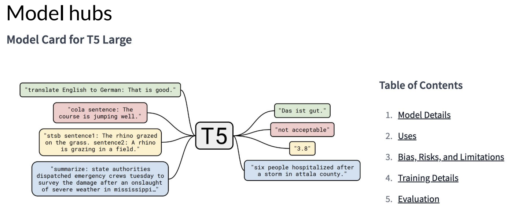

    A particularly useful feature of these hubs is the inclusion of model cards, which provide important details such as the best use case for each model, how it was trained, and its known limitations.

3.  The model you choose depends on the specific task. Different transformer model architectures are better suited to various language tasks due to differences in their training. Initially, LLMs undergo a **pre-training** phase, where they learn from vast amounts of unstructured text data, ranging from gigabytes to petabytes. This data is sourced from the internet and specialised text corpora. During this self-supervised learning step, the model internalises language patterns and structures, enabling it to achieve its training objectives, which vary depending on the model's architecture.

    >   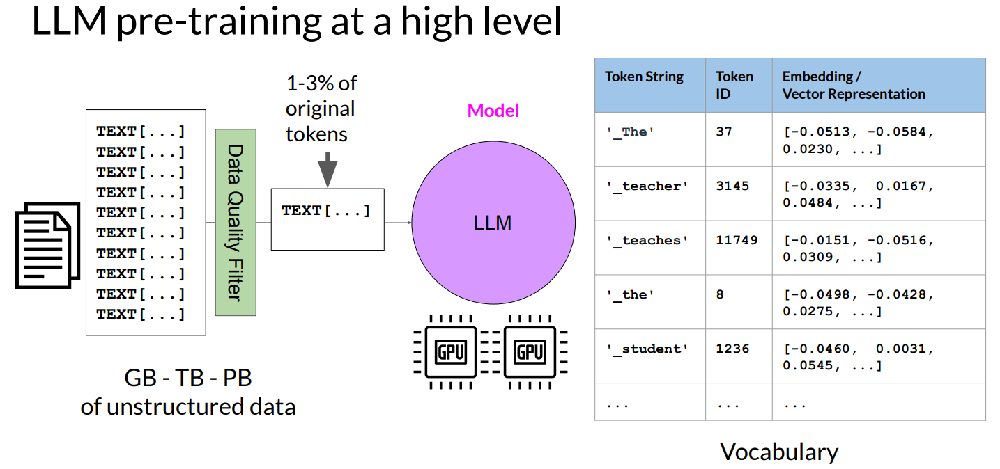

    During pre-training, the model's weights are adjusted to minimise the loss of the training objective. The encoder creates an embedding or vector representation for each token. Pre-training requires significant computational power, often utilising GPUs. When using data scraped from public sites, like the internet, it often needs to be processed to improve quality, reduce bias, and remove harmful content. Due to this data curation, typically only 1-3% of tokens are used for pre-training. This is important to consider when estimating the amount of data needed if you are planning to pre-train your own model.

4.  Earlier, we discussed three variants of the tranformer model: encoder-only, encoder-decoder, and decoder-only models. Each of these models is trained with a different objective, which allows them to perform distinct tasks.

    Encoder-only models, also known as **autoencoding models**, are pre-trained using a technique called **masked language modeling**. In this method, some tokens in the input sequence are randomly masked, and the model is trained to predict these masked tokens to reconstruct the original sentence. This process is referred to as a denoising objective.

    >   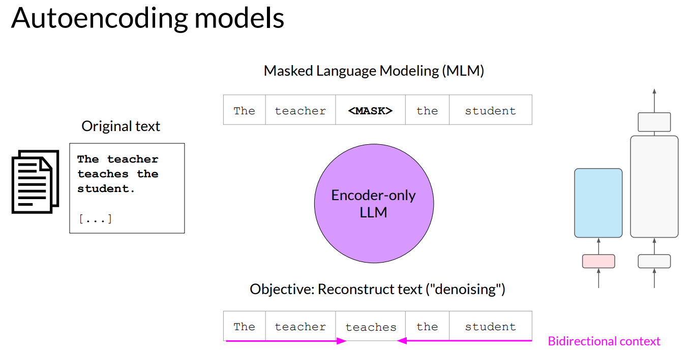

    Autoencoding models build **bi-directional** representations of the input sequence, meaning the model understands the full context of each token, not just the words that come before it. These models are particularly well-suited for tasks that benefit from this bi-directional context, such as sentence classification (e.g., sentiment analysis) or token-level tasks (e.g., named entity recognition or word classification). Well-known examples of autoencoding model include BERT and RoBERTa.

5.  Decoder-only or **autoregressive models** are pre-trained using causal language modeling. In this approach, the model's training objective is to predict the next token based on the preceding sequence of tokens, a process sometimes referred to as **full language modeling** by researchers.

    >   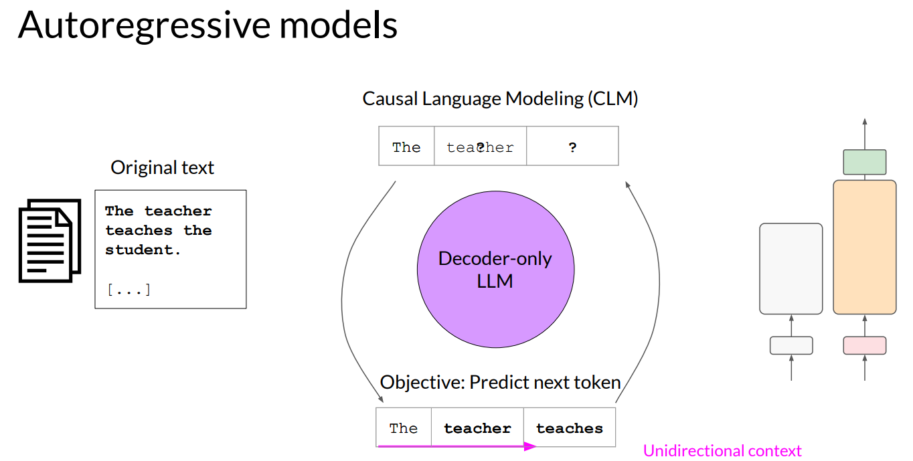

    In decoder-based autoregressive models, only the tokens leading up to the one being predicted are visible to the model; it has no knowledge of the tokens that follow or what comes at the end of the sentence. The model iterates over the input sequence one token at a time to predict the next token, which means the context it uses is **unidirectional**.

    By learning to predict the next token from a vast number of examples, the model builds a statistical understanding of the language. Decoder-only models are often used for text generation, though larger versions of these models have shown strong zero-shot inference abilities and can perform a wide range of tasks effectively. Well-known examples of decoder-based autoregressive models include GPT and BLOOM.

6.  The final variant of the transformer model is the **sequence-to-sequence model**, which utilises both the encoder and decoder components of the original transformer architecture. The specifics of the pre-training objective can vary depending on the model.

    >   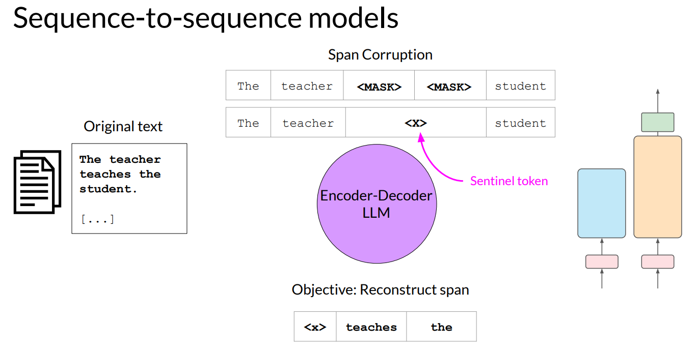

    For example, the popular sequence-to-sequence model T5 pre-trains its encoder using a technique called **span corruption**. In this method, random sequences of the input tokens are masked and replaced with a unique sentinel token, represented here as "x". The sentinel tokens are special tokens added to the vocabulary and do not correspond to any actual word in the input text. The decoder's job is then to reconstruct the masked token sequences in an autoregressive manner. The output is the sentinel token followed by the predicted tokens.

    Sequence-to-sequence models are versatile and can be used for tasks like translation, summarisation, and question-answering. They are particularly useful when both the input and output consist of text. In addition to T5, which will be used in the labs for this course, another well-known encoder-decoder model is BART.

7.  To summarise, here is a quick comparison of different model architectures and their pre-training objectives.

    >   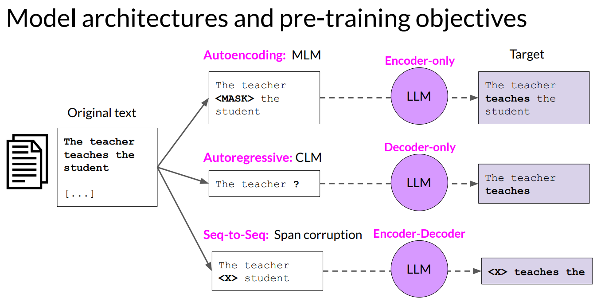

    -   Autoencoding models are pre-trained using masked language modeling and correspond to the encoder part of the original transformer architecture. They are often used for tasks like sentence classification or token classification.
    -   Autoregressive models are pre-trained using causal language modeling. These models use the decoder component of the original transformer architecture and are commonly employed for text generation tasks.
    -   Sequence-to-sequence models utilise both the encoder and decoder parts of the original transformer architecture. The specific pre-training objectives can vary  between models. For example, the T5 model is pre-trained using span corruption. These models are typically used for tasks such as translation, summarisation, and question-answering.

8.  One important point to consider is that larger models, regardless of architecture, generally perform better at their tasks. Researchers have found that as models increase in size, they are more likely to achieve the desired results without needing additional in-context learning or futher training. This trend of improved capability with size has driven the development of increasingly larger models in recent years.

    >   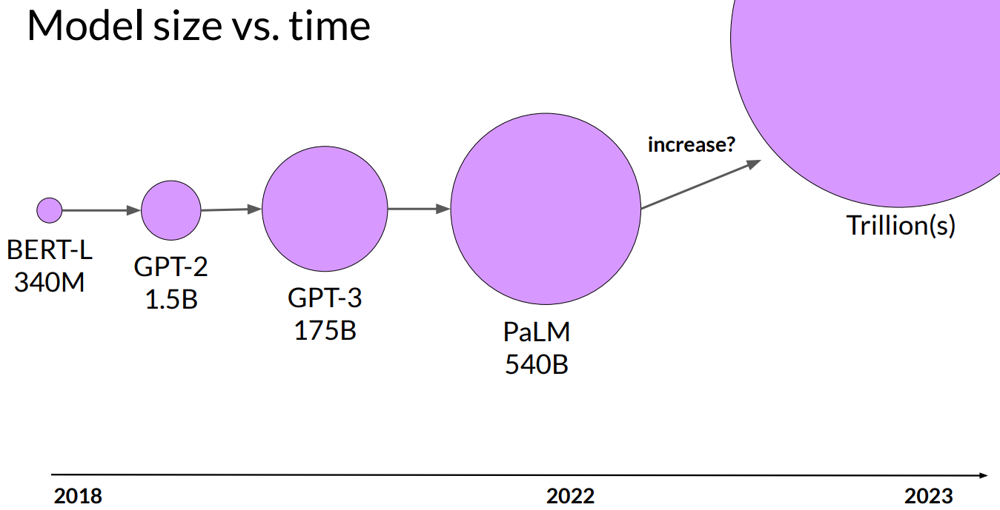

    This growth has been supported by key advancements, such as the introduction of the highly scalable transformer architecture, access to vast amounts of training data, and the development of more powerful computing resources. Some researchers have even hypothesised the emergence of a new "Moore's Law" for LLMs, questioning whether continually adding parameters will keep enhancing performance and making models smarter.

    However, while this sounds promising, training these enormous models is both challenging and extremely costly, making it potentially infeasible to keep scaling them up indefinitely.

## Computational Challenges of Training LLMs

1.  A common issue you may encounter when training LLMs is running out of memory. If you have ever tried training or even just loading a model on Nvidia GPUs, you might be familiar with this error message. CUDA, which stands for Compute Unified Device Architecture, is a set of libraries and tools developed for Nvidia GPUs. Libraries like PyTorch and TensorFlow use CUDA to accelerate tasks like matrix multiplication and other operations essential to deep learning.

2.  Memory requirement

    You may encounter out-of-memory issues because LLMs are enormous and require a vast amount of memory to store and train all their parameters. Let us do some quick math to get a sense of the scale of this problem. A single parameter is usually represented by a 32-bit float, a format that computers use to represent real numbers. A 32-bit float occupies four bytes of memory. So, to store one billion parameters, you would need four bytes per parameter multiplied by one billion, which equals four gigabytes of GPU RAM at 32-bit full precision. This is a significant amount of memory and keep in mind that this calculation only covers the memory needed to store the model weights.

    $$
    1\text{ parameter} =4\text{ bytes}\\
    1\text{B parameters} =4\times 10^{9}\text{ bytes} =4\text{GB}
    $$

    If you plan to train the model, you will need to account for additional components that use GPU memory during the training process. These include two Adam optimiser states, gradients, activations, and temporary variables required by your functions. This can quickly add up to an extra 20 bytes of memory per model parameter.

    | Components | Bytes Per Parameter | Remarks |
    |:---|---:|:---|
    | Model Parameters (Weights) | 4 bytes | |
    | Adam Optimiser x 2 | 8 bytes | |
    | Gradients | 4 bytes | |
    | Activations and temp memory (variable size) | 8 bytes | High-end estimate |
    | **TOTAL** | **24 bytes** |

    To account for all the overhead during training, you will actually need roughly 6 times the amount of GPU RAM required just for the model weights. For example, training a one-billion-parameter model at 32-bit full precision would require around 24 gigabytes of GPU RAM. This is far beyond the capacity of consumer hardware and even challenging for data centre hardware if you are aiming to train on a single processor.

3.  Quantisation

    What can you do to reduce the memory required for training? One effective technique is **quantisation**. This involves reducing the memory needed to store your model's weights by lowering their precision from 32-bit floating point numbers to 16-bit floating point numbers or even 8-bit integers. The range of values representable by FP32 is approximately $-3\times10^{38}$ to $3\times10^{38}$. By default, model weights, activations, and other parameters are stored in FP32. Quantisation works by projecting these 32-bit floating point numbers into lower precision space, using scaling factors based on the original range of the 32-bit values.

    >   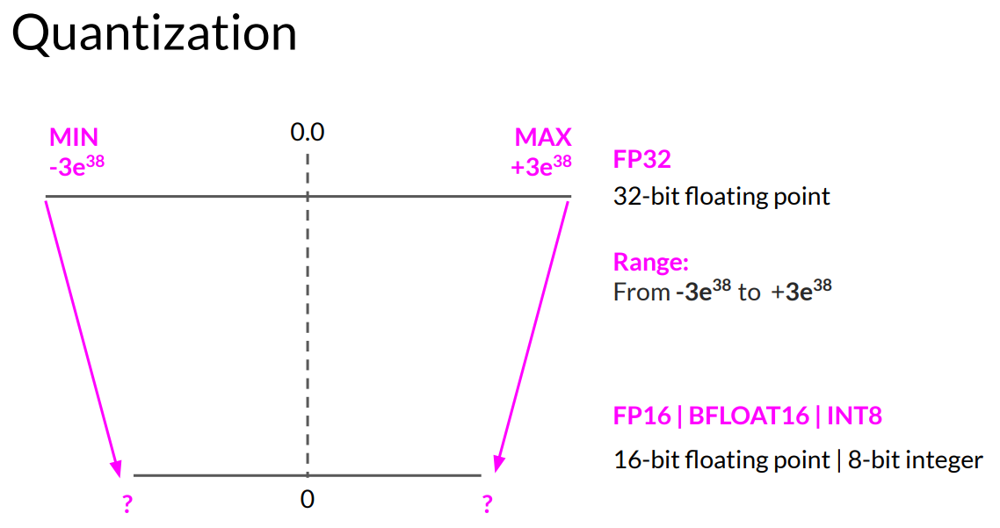

    Let us look at an example. Suppose you want to store the value of Pi to six decimal places using different precisions. Floating point numbers are stored as a series of bits&mdash;zeros and ones. In full precision with FP32, 32 bits are used: one bit for the sign (where zero indicates a positive number and one a negative number), eight bits for the exponent, and 23 bits for the fraction, also known as the mantissa or significant, which represents the precision of the number. If you convert a 32-bit floating point value back to a decimal, you may notice some loss in precision. For reference, here is the value of Pi to 19 decimal places.

    Now, let us see what happens if you project this FP32 representation of Pi into a lower precision, 16-bit FP16 space. In FP16, the 16 bits include one bit for sign, five bits for the exponent, and 10 bits for the fraction. This reduces the range of representable numbers from approximately -65,504 to 65,504. The original FP32 value gets projected to 3.140625 in the 16-bit space. Notice the loss of precision&mdash;there are now only six decimal places. However, this loss is often acceptable because you are optimising for memory usage. Storing value in FP32 requires four bytes of memory, while FP16 requires only two bytes, effectively halving the memory requirement through quantisation.

    >   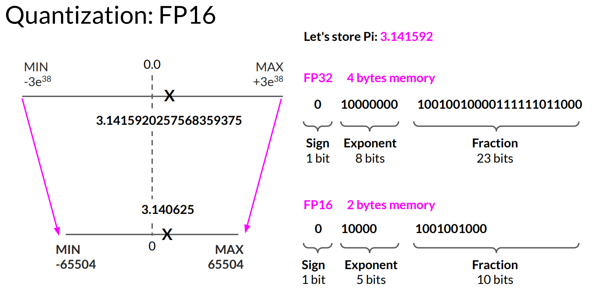

    For completeness, let us examine what happens when you quantise Pi from 32-bit to even lower 8-bit precision. In the INT8 format, one bit is used for the sign, and the remaining seven bits represent the value, giving a range from -128 to 127. When Pi is quantised into this 8-bit space, it gets reduced to a value like 2 or 3. While this drastically lowers the memory requirement from 4 bytes to just 1 byte, it also results in a significant loss of precision.

4.  BFLOAT16

    The AI research community has been exploring ways to optimise 16-bit quantisation, and one datatype that has gained popularity is BFLOAT16. Developed by Google Brain, BFLOAT16 (short for Brain Floating Point Format) has become a popular choice in deep learning. Many LLMs, including FLAN-T5, have been pre-trained using BFLOAT16. BFLOAT16, or BF16, is a hybrid between half-precision FP16 and full-precision FP32. It significantly improves training stability and is supported by newer GPUs, such as NVIDIA's A100.

    >   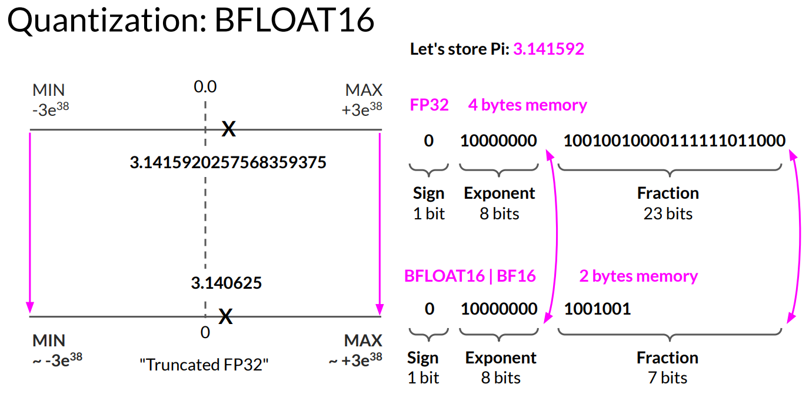

    BF16 is often described as a truncated 32-bit float because it captures the full dynamic range of FP32 while using only 16 bits. It uses the full eight bits to represent the exponent but truncates the fraction to just seven bits. This approach not only saves memory but also boosts model performance by speeding up calculations. The trade-off is that BF16 is less suitable for integer calculations, although these are relatively rare in deep learning.

5.  GPU RAM

    Let us revisit the challenge of fitting models into GPU memory and examine the impact of quantisation. By applying quantisation, you can signficantly reduce the memory required to store model parameters. Using 16-bit half precision, memory consumption can be cut to just 2 gigabytes&mdash;a 50% reduction. You can further halve the memory footprint by using 8-bit integers, bringing the requirement down to just 1 gigabyte of GPU RAM. Importantly, even with these reductions, your model still contains 1 billion parameters. As illustrated, the models are the same size, and quantisation provides similar savings during training.

    >   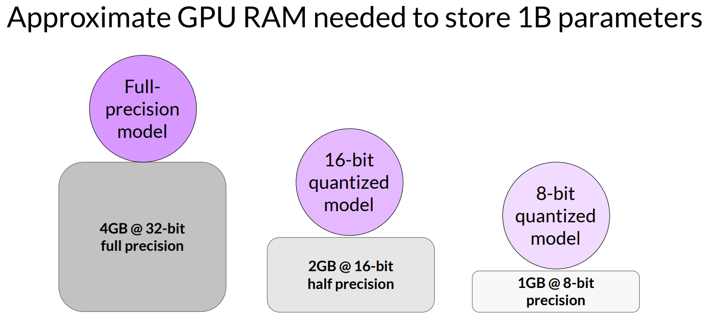

    However, many models today have over 50 billion or even 100 billion parameters, requiring up to 500 times more memory&mdash;tens of thousands of gigabytes&mdash;to train. These massive models far exceed the 1 billion parameter model we have discussed, as shown on the scale to the left. Once models reach a few billion parameters, training them on a single GPU becomes impossible. Instead, distributed computing techniques must be used to train across multiple GPUs, potentially requiring hundreds of GPUs, which is extremely costly. This is one of the reasons why most people do not pre-train their own models from scratch.

    >   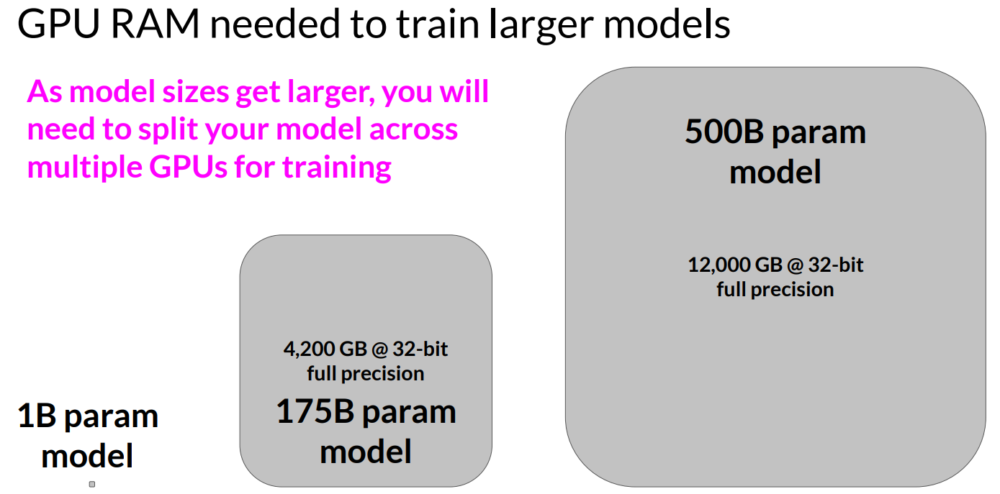

## Efficient Multi-GPU Compute Strategies

1.  As your model grows, you may need to scale training across multiple GPUs, especially when it becomes too large for a single GPU. Even for smaller models that fit on one GPU, using multiple GPUs can speed up training. Learning to distribute compute across GPUs is beneficial regardless of model size.

2.  Distributed Data-Parallel (DDP)

    Let us discuss how to efficiently scale model training across multiple GPUs. Start with a model that still fits on a single GPU. The first step is to distribute large datasets across multiple GPUs and process these data batches in parallel. A popular method for this is PyTorch's **Distributed Data-Parallel (DDP)**. DDP replicates your model on each GPU, sends batches of data to each GPU simultaneously, and processes them in parallel. After processing, a synchronisation step combines the results, updating the model on each GPU to ensure consistency. This approach enables faster training through parallel computation across all GPUs.

    >   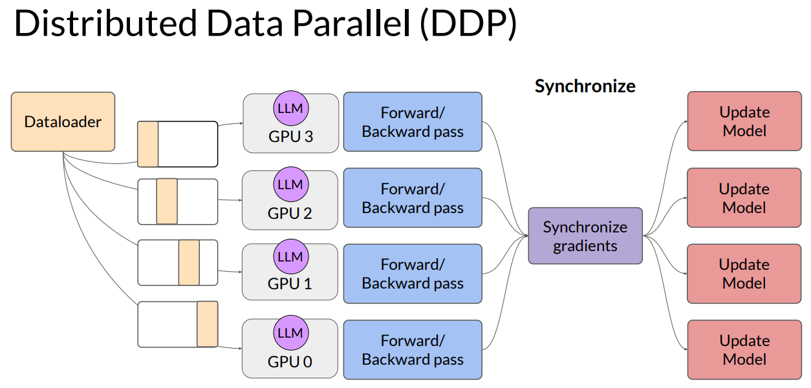

3.  It is important to note that DDP requires all model weights, along with additional parameters, gradients, and optimiser states, to fit on a single GPU. If your model is too large for this, you should consider a technique called model sharding. One approach to model sharding is based on ZeRO (Zero Redundancy Optimiser), a technique proposed by Microsoft researchers in 2019. ZeRO optimises memory by distributing or sharding model states across GPUs without data overlap, enabling you to scale model training even when the model does not fit into a single GPU's memory.

    If you looked at all of the memory components required for training LLMs, let us represent the parameters as the blue box, the gradients in yellow and the optimiser states in green. One limitation of the model replicating strategy that I showed before is that you need to keep a full model copy on each GPU, which leads to redundant memory consumption. You are storingt the same numbers on every GPU. ZeRO, on the other hand, eliminates this redundancy by distributing, also referred to as sharding, the model parameters, gradients, and optimiser states across GPUs instead of replicating them. At the same time, the communication overhead for a sinking model states stays close to that of the previously discussed DDP.
