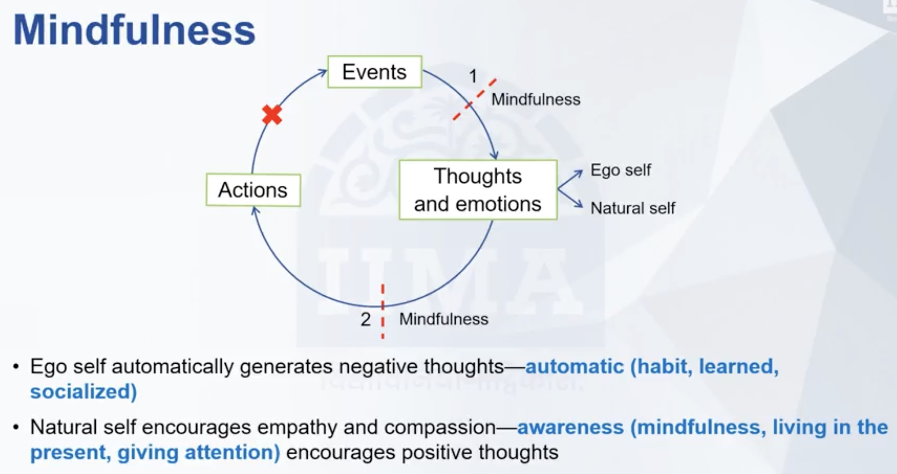

<h1 style="color: #ccc">Leadership Skills</h1>

# Leading the Self

    Type
    Course

    Instructor
    Vishal Gupta

    Institution
    IIMA - IIMA Ahmedabad

    Note Updated
    2025-12-25

## About This Course

This course, Leadership Skills, introduces key concepts and dimensions of leadership. It covers leadership theory and practice, ethics, mindfulness, and organisational development. The course also draws on Indian wisdom, including lessons from scriptures like the Mahabharata, to provide unique cultural insights into leadership.

It is part of the MBA curriculum at IIM Ahmedabad and is designed to help learners develop a deeper understanding of leadership in both modern and traditional contexts.

## Introduction

In an increasingly complex world, the practice of leadership is becoming more and more important for leaders and organisations today. The impact leaders have on organisations is known to everybody. In a world that is characterised by changes and turbulence, what could leaders do to improve their own art and craft as the lead of organisations?

We will talk about various aspects of leaderships. We would look at issues such as mindfulness and emotional intelligence, which is about leading oneself. We would talk about understanding leadership styles, managing supportive conversations and supportive communications, decision-making biases, navigating ethical dilemmas, managing cultures of organisations and change management. One of the modules of the course would also talk about the great Indian epic, the Mahabharata and the lessons we can derive as leaders from the ethics it presents.

The course is built on the core philosophy that leaders are not always born, leaders can also be made. And the aim of this course is to equip you with certain skills that we hope would be useful for you as you carry on on your journey of leadership.

## Overview

In our increasingly complex world, understanding the practice of leadership is critical. In simpler words, leadership is the *practice* of **influencing** people to *meet* the **challenges** that will enable them to *achieve* important individual and organisational **goals**.

This course provides a foundation for leadership practice and aims to take you on a journey of self-discovery. You will gain insight into building inner stability and developing your leadership skills. This is a beginner course designed for professionals from diverse work backgrounds. The course will help you lean on your experiences and strengthen your capacity to lead across boundaries, from any political or organisational position, with or without authority.

This course will also enable you to learn important leadership skills, clarifying the relationships between key concepts such as definitions of leadership, self-management, authority, power, influence, politics, negotiations, change management, decision-making, and various leadership styles. This knowledge will provide you with a practical and coherent theoretical framework for applying and exercising leadership. This course draws from business management, philosophy, spirituality, history, literature, sports, communications, and psychology.

Lastly, the course explores the challenges of managing the inevitable personal stresses and dangers of leading a team.

To succeed in this course, you should have experience or a basic understanding of working in organisations.

## Mindfulness and Inner Stability

### Automatic Cycle of Behaviour

**Automaticity** refers to the *unconscious*, *automatic* **reactions** people have to **events**. In daily life&mdash;especially at work&mdash;individuals are constantly exposed to situations that trigger automatic thoughts and emotions, often without deliberate reflection.

For example, when someone is unexpectedly removed from a project, immediate thoughts may arise: *Why was I removed? Did I do something wrong?* These thoughts generate emotions such as sadness, fear, or anger, which in turn shape behaviour&mdash;reduced motivation, withdrawal, or tension in personal relationships.

This forms a cycle:

**Event → Thoughts/Emotions → Actions → New Events**

Events themselves are often uncontrollable, but the responses to them are not. The cycle can be disrupted in two ways: by intervening between the event and the resulting thoughts/emotions, or between those thoughts/emotions and the actions that follow. However, once actions are taken, they lead to new events, which the individual must then face.

Recognising this pattern is crucial. Without awareness, people may fall into recurring *negative cycles* that reinforce *stress* and *conflict*. Breaking the automatic loop allows for more *awareness* and *constructive* responses to **life's challenges**.

### Multitasking

**Multitasking** is often seen as doing multiple tasks simultaneously, but in reality, it reduces efficiency and increases errors.

A simple exercise illustrate this:

-   Task 1: Write "Multitasking is a crime" on one line, then numbers 1-20 on the next.
-   Task 2: Alternate between each letter and number (e.g., M 1, u 2, l 3, ...).

The second task takes longer, feels harder, and results in more mistakes. This highlights how switching between tasks strains attention and accuracy.

In daily life, multitasking&mdash;like eating while watching TV&mdash;leads to reduced awareness and weaker social interactions.

Beyond inefficiency, multitasking also feeds into **automaticity**: we move through activities without concious thought, reacting rather than choosing.

When we are not fully present, we risk misinterpreting events, making poor decisions, and reinforcing unhelpful patterns. Multitasking keeps us in this autopilot mode, disconnected from the moment and our own mental processes.

**Doing one task at a time** is not just about productivity&mdash;it is a way to interrupt automatic reactions, bring awareness back into our actions, and respond with greater clarity and intention. **Focus** *breaks the cycle of automaticity*, *improves efficiency and accuracy*, and *strengthens relationships as well as awareness in decision-making*.

### Mindfulness

**Mindfulness** is the practice of being fully present in the moment. It emphasises focused awareness rather than dwelling on the past or worrying about the future.

A well-known example is Rishabh Pant's performance in the July 17, 2022 India-England cricket match. With India struggling at 38/3, he scored 125 runs off 113 balls to secure victory. When asked about his thoughts while batting, he said he was focused only on each ball. This illustrate mindfulness: attention to the immediate experience without distraction.

The concept has deep roots in Buddhist and Hindu philosophy, where it is taught that the past is unchangeable and the future uncertain, while the present is the only reality that can be lived. Dwelling on regrets or anxieties prevents engagement with the moment at hand.

Mindfulness breaks the automatic cycle of thoughts, emotions, and actions that can lead to poor decisions. It also counters the inefficiency of multitasking, since the mind can truly attend to only one thing at a time.

To practice mindfulness is to give complete attention to what is happening now&mdash;whether listening in a conversation, working, or making decisions. Living with such awareness allows for wiser actions, fewer errors, and a fuller experience of life.

### Our Two Selves

We carry within us two ways of thinking, represented by two wolves. The first, the **natural self**, is calm, compassionate, empathetic, and truthful. The second, the **ego self**, is angry, judmental, and focused on superiority. In any situation, we always face a choice&mdash;whether to let the natural self or the ego self guide our thoughts and actions.

>   

When we are born, our default way of being is the natural self

The ego self tends to dominate automatically. Over time, we develop learnt habits of suspicion, negativity, and judgment. These automatic thoughts can trigger fear, sadness, and anger, shaping unhelpful behaviours. By contrast, the natural self emerges when we are mindful&mdash;paying attention to the present, observing our thoughts, and asking whether we are being too harsh, arrogant, or dismissive.
