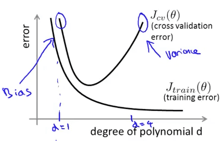
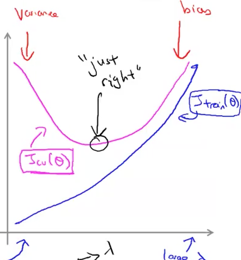
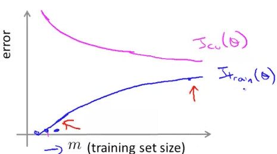
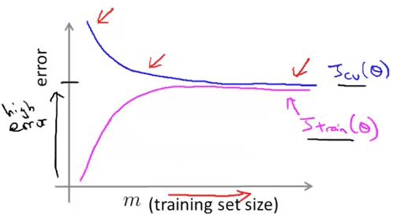
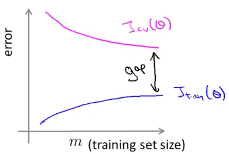
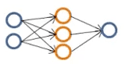
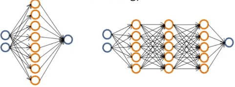

<h1 style="color: #ccc">Machine Learning 10</h1>

# Advice for Applying Machine Learning

*Nov 13, 2016*

## Evaluating a Hypothesis

### Deciding What to Try Next

1. Debugging a learning algorithm

   Suppose you have implemented regularized linear regression to predict housing prices.

   $$ J\left( \theta  \right) =\frac { 1 }{ 2m } \left[ \sum _{ i=1 }^{ m }{ { \left( { h }_{ \theta  }\left( { x }^{ \left( i \right)  } \right) -{ y }^{ \left( i \right)  } \right)  }^{ 2 } } +\lambda \sum _{ j=1 }^{ m }{ { \theta  }_{ j }^{ 2 } }  \right] $$

   However, when you test your hypothesis on a new set of houses, you find that it makes unacceptably large errors in its predictions. What should you try next?

   * Get more training examples
   * Try smaller sets of features
   * Try getting additional features
   * Try adding polynomial features ($ { x }_{ 1 }^{ 2 },{ x }_{ 2 }^{ 2 },{ x }_{ 1 }{ x }_{ 2 } $, etc)
   * Try decreasing $ \lambda $
   * Try increasing $ \lambda $

2. Machine learning diagnostic

   A test that you can run to gain insights what is / isn't working with a learning algorithm, and gain guidance as to how best to improve its performance.

   Diagnostics can take time to implement, but doing so can be very good use of your time.

### Evaluating a Hypothesis

1. Splitting data set

   Split random 70% of the data to training set

   $$ \left( { x }^{ \left( 1 \right)  },{ y }^{ \left( 1 \right)  } \right) ,\left( { x }^{ \left( 2 \right)  },{ y }^{ \left( 2 \right)  } \right) ,\cdots ,\left( { x }^{ \left( m \right)  },{ y }^{ \left( m \right)  } \right) $$

   Split random 30% of the data to test set

   $$ \left( { x }_{ test }^{ \left( 1 \right)  },{ y }_{ test }^{ \left( 1 \right)  } \right) ,\left( { x }_{ test }^{ \left( 2 \right)  },{ y }_{ test }^{ \left( 2 \right)  } \right) ,\cdots ,\left( { x }_{ test }^{ \left( { m }_{ test } \right)  },{ y }_{ test }^{ \left( { m }_{ test } \right)  } \right) $$

   * $ { m }_{ test } $ = no. of test examples

2. Training / testing procedure for linear regression

   Learn parameter $ \theta $ from training data (minimizing training error $ J\left( \theta  \right) $)

   Compute test set error

   $$ { J }_{ test }\left( \theta  \right) =\frac { 1 }{ 2{ m }_{ test } } \sum _{ i=1 }^{ { m }_{ test } }{ { \left( { h }_{ \theta  }\left( { x }_{ test }^{ \left( i \right)  } \right) -{ y }_{ test }^{ \left( i \right)  } \right)  }^{ 2 } } $$

3. Training / testing procedure for logistic regression

   Learn parameter $ \theta $ from training data

   Compute test set error

   $$ { J }_{ test }\left( \theta  \right) =-\frac { 1 }{ { m }_{ test } } \sum _{ i=1 }^{ { m }_{ test } }{ \left[ { y }_{ test }^{ \left( i \right)  }\log { { h }_{ \theta  }\left( { x }_{ test }^{ \left( i \right)  } \right)  } +\left( 1-{ y }_{ test }^{ \left( i \right)  } \right) \log { { h }_{ \theta  }\left( { x }_{ test }^{ \left( i \right)  } \right)  } \right] } $$

4. Misclassification error (0/1 misclassification error)

   $$ err\left( { h }_{ \theta  }\left( x \right) ,y \right) \begin{cases} 1\quad if\left( { h }_{ \theta  }\left( x \right) \ge 0.5,y=0 \right) or\left( { h }_{ \theta  }\left( x \right) <0.5,y=1 \right)  \\ 0\quad otherwise \end{cases} $$

   $$ { Error }_{ test }=\frac { 1 }{ { m }_{ test } } \sum _{ i=1 }^{ { m }_{ test } }{ err\left( { h }_{ \theta  }\left( { x }_{ test }^{ \left( i \right)  } \right) ,{ y }_{ test }^{ \left( i \right)  } \right)  } $$

### Model Selection and Train / Validation / Test Sets

1. Overfitting example

   Once parameters $ { \theta  }_{ 0 },{ \theta  }_{ 1 },\cdots ,{ \theta  }_{ n } $ were fit to some set of data (training set), the error of the parameters as measured on that data (the training error $ J\left( \theta  \right) $) is likely to be lower than the actual generalization error.

2. Model selection

   $$ d=1:{ h }_{ \theta  }\left( x \right) ={ \theta  }_{ 0 }+{ \theta  }_{ 1 }x\xrightarrow {  } { \theta  }^{ \left( 1 \right)  }\xrightarrow {  } { J }_{ test }\left( { { \theta  }^{ \left( 1 \right)  } } \right)  $$

   $$ d=2:{ h }_{ \theta  }\left( x \right) ={ \theta  }_{ 0 }+{ \theta  }_{ 1 }x+{ \theta  }_{ 2 }{ x }^{ 2 }\xrightarrow {  } { \theta  }^{ \left( 2 \right)  }\xrightarrow {  } { J }_{ test }\left( { { \theta  }^{ \left( 2 \right)  } } \right)  $$

   $$ \vdots $$

   $$ d=10:{ h }_{ \theta  }\left( x \right) ={ \theta  }_{ 0 }+{ \theta  }_{ 1 }x+{ \theta  }_{ 2 }{ x }^{ 2 }+\cdots { \theta  }_{ 10 }{ x }^{ 10 }\xrightarrow {  } { \theta  }^{ \left( 10 \right)  }\xrightarrow {  } { J }_{ test }\left( { { \theta  }^{ \left( 10 \right)  } } \right)  $$

   * $ d $ = degree of polynomial

   How well does the model generalize? Report test set error $ { J }_{ test }\left( { { \theta  }^{ \left( d \right)  } } \right) $.

   Problem: $ { J }_{ test }\left( { { \theta  }^{ \left( d \right)  } } \right) $ is likely to be an optimistic estimate of generalization error, i.e. our extra parameter (d = degree of polynomial) is fit to test set.

3. Splitting data set

   Split random 60% of the data to training set

   $$ \left( { x }^{ \left( 1 \right)  },{ y }^{ \left( 1 \right)  } \right) ,\left( { x }^{ \left( 2 \right)  },{ y }^{ \left( 2 \right)  } \right) ,\cdots ,\left( { x }^{ \left( m \right)  },{ y }^{ \left( m \right)  } \right) $$

   Split random 20% of the data to cross validation set

   $$ \left( { x }_{ cv }^{ \left( 1 \right)  },{ y }_{ cv }^{ \left( 1 \right)  } \right) ,\left( { x }_{ cv }^{ \left( 2 \right)  },{ y }_{ cv }^{ \left( 2 \right)  } \right) ,\cdots ,\left( { x }_{ cv }^{ \left( { m }_{ cv } \right)  },{ y }_{ cv }^{ \left( { m }_{ cv } \right)  } \right) $$

   Split random 20% of the data to test set

   $$ \left( { x }_{ test }^{ \left( 1 \right)  },{ y }_{ test }^{ \left( 1 \right)  } \right) ,\left( { x }_{ test }^{ \left( 2 \right)  },{ y }_{ test }^{ \left( 2 \right)  } \right) ,\cdots ,\left( { x }_{ test }^{ \left( { m }_{ test } \right)  },{ y }_{ test }^{ \left( { m }_{ test } \right)  } \right) $$

   * $ { m }_{ cv } $ = no. of cross validation examples.

4. Training / validation / test error

   Training error:

   $$ { J }_{ train }\left( \theta  \right)=\frac { 1 }{ 2m } \sum _{ i=1 }^{ m }{ { \left( { h }_{ \theta  }\left( { x }^{ \left( i \right)  } \right) -{ y }^{ \left( i \right)  } \right)  }^{ 2 } } $$

   Cross Validation error:

   $$ { J }_{ cv }\left( \theta  \right) =\frac { 1 }{ 2{ m }_{ cv } } \sum _{ i=1 }^{ { m }_{ cv } }{ { \left( { h }_{ \theta  }\left( { x }_{ cv }^{ \left( i \right)  } \right) -{ y }_{ cv }^{ \left( i \right)  } \right)  }^{ 2 } } $$

   Test error:

   $$ { J }_{ test }\left( \theta  \right) =\frac { 1 }{ 2{ m }_{ test } } \sum _{ i=1 }^{ { m }_{ test } }{ { \left( { h }_{ \theta  }\left( { x }_{ test }^{ \left( i \right)  } \right) -{ y }_{ test }^{ \left( i \right)  } \right)  }^{ 2 } } $$

5. Model selection

   $$ d=1:{ h }_{ \theta  }\left( x \right) ={ \theta  }_{ 0 }+{ \theta  }_{ 1 }x\xrightarrow {  } { \theta  }^{ \left( 1 \right)  }\xrightarrow {  } { J }_{ cv }\left( { { \theta  }^{ \left( 1 \right)  } } \right)  $$

   $$ d=2:{ h }_{ \theta  }\left( x \right) ={ \theta  }_{ 0 }+{ \theta  }_{ 1 }x+{ \theta  }_{ 2 }{ x }^{ 2 }\xrightarrow {  } { \theta  }^{ \left( 2 \right)  }\xrightarrow {  } { J }_{ cv }\left( { { \theta  }^{ \left( 2 \right)  } } \right)  $$

   $$ \vdots $$

   $$ d=10:{ h }_{ \theta  }\left( x \right) ={ \theta  }_{ 0 }+{ \theta  }_{ 1 }x+{ \theta  }_{ 2 }{ x }^{ 2 }+\cdots { \theta  }_{ 10 }{ x }^{ 10 }\xrightarrow {  } { \theta  }^{ \left( 10 \right)  }\xrightarrow {  } { J }_{ cv }\left( { { \theta  }^{ \left( 10 \right)  } } \right)  $$

   Estimate generalization error in test set with $ { J }_{ test }\left( { \theta  }^{ \left( d \right)  } \right) $

## Bias vs Variance

### Diagnosing Bias vs Variance

1. Suppose your learning algorithm is performing less well than were hoping ($ { J }_{ cv }\left( { \theta  } \right) $ or $ { J }_{ test }\left( { \theta  } \right) $ is high). Is it a bias or a variance problem?

   

2. Bias (underfit)

   * $ { J }_{ train }\left( { \theta  } \right) $ will be high
   * and $ { J }_{ cv }\left( { \theta  } \right) \approx { J }_{ train }\left( { \theta  } \right) $

3. Variance (overfit)

   * $ { J }_{ train }\left( { \theta  } \right) $ will be low
   * and $ { J }_{ cv }\left( { \theta  } \right) \gg { J }_{ train }\left( { \theta  } \right) $

### Regularization and Bias / Variance

1. Linear regression with regularization

   $$ { J }\left( \theta  \right) =\frac { 1 }{ 2m } \sum _{ i=1 }^{ m }{ { \left( { h }_{ \theta  }\left( { x }^{ \left( i \right)  } \right) -{ y }^{ \left( i \right)  } \right)  }^{ 2 } } +\frac { \lambda  }{ 2m } \sum _{ j=1 }^{ m }{ { \theta  }_{ j }^{ 2 } } $$

   Large $ \lambda $ (high bias, underfit): $ \lambda =10000,{ h }_{ \theta  }\left( x \right) \approx { \theta  }_{ 0 } $

   Intermediate $ \lambda $ (just right)

   Small $ \lambda $ (high variance, overfit): $ \lambda =0 $

2. Choosing the regularization parameter $ \lambda $

   Try $ \lambda \in \left\{ 0,0.01,0.02,0.04,0.08,\cdots ,10.24 \right\} $

   $$ \left( 1 \right) :\lambda =0\xrightarrow {  } { \theta  }^{ \left( 1 \right)  }\xrightarrow {  } { J }_{ cv }\left( { \theta  }^{ \left( 1 \right)  } \right) $$

   $$ \left( 2 \right) :\lambda =0.01\xrightarrow {  } { \theta  }^{ \left( 2 \right)  }\xrightarrow {  } { J }_{ cv }\left( { \theta  }^{ \left( 2 \right)  } \right) $$

   $$ \left( 3 \right) :\lambda =0.02\xrightarrow {  } { \theta  }^{ \left( 3 \right)  }\xrightarrow {  } { J }_{ cv }\left( { \theta  }^{ \left( 3 \right)  } \right)  $$

   $$ \vdots $$

   $$ \left( 12 \right) :\lambda =10.24\xrightarrow {  } { \theta  }^{ \left( 12 \right)  }\xrightarrow {  } { J }_{ cv }\left( { \theta  }^{ \left( 12 \right)  } \right) $$

   Estimate regularization error in test set with $ { J }_{ test }\left( { \theta  }^{ \left( r \right)  } \right) $

3. Bias / variance as a function of the regularization parameter $ \lambda $

   $$ { J }_{ train }\left( \theta  \right)=J\left( \theta  \right)=\frac { 1 }{ 2m } \sum _{ i=1 }^{ m }{ { \left( { h }_{ \theta  }\left( { x }^{ \left( i \right)  } \right) -{ y }^{ \left( i \right)  } \right)  }^{ 2 } } $$

   $$ { J }_{ cv }\left( \theta  \right) =\frac { 1 }{ 2{ m }_{ cv } } \sum _{ i=1 }^{ { m }_{ cv } }{ { \left( { h }_{ \theta  }\left( { x }_{ cv }^{ \left( i \right)  } \right) -{ y }_{ cv }^{ \left( i \right)  } \right)  }^{ 2 } } $$

   

### Learning Curves

1. Learning curves

   

2. High bias

   

   If a learning algorithm is suffering from high bias, getting more training data will not (by itself) help much.

3. High variance

   

   If a learning algorithm is suffering from high variance, getting more training data is likely to help.

### Deciding What to Do Next Revisited

1. Debugging a learning algorithm

   Suppose you have implemented regularized linear regression to predict housing prices. However, when you test your hypothesis on a new set of houses, you find that it makes unacceptably large errors in its predictions. What should you try next?

   * Get more training examples $ \rightarrow $ fixes high variance
   * Try smaller sets of features $ \rightarrow $ fixes high variance
   * Try getting additional features $ \rightarrow $ fixes high bias
   * Try adding polynomial features ($ { x }_{ 1 }^{ 2 },{ x }_{ 2 }^{ 2 },{ x }_{ 1 }{ x }_{ 2 } $, etc) $ \rightarrow $ fixes high bias
   * Try decreasing $ \lambda $ $ \rightarrow $ fixes high bias
   * Try increasing $ \lambda $ $ \rightarrow $ fixes high variance

2. Neural networks and overfitting

   Small neural network (fewer parameters; more prone to underfitting)

   

   * Computationally cheaper

   Large neural network (more parameters; more prone to overfitting)

   

   * Computationally more expensive
   * Use regularization ($ \lambda $) to address overfitting
