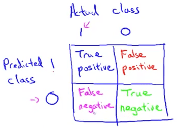

<h1 style="color: #ccc">Machine Learning 11</h1>

# Machine Learning System Design

*Nov 13, 2016*

## Building a Spam Classifier

### Prioritizing What to Work On

1. Building a spam classifier

   Supervised learning. $ x $ = features of email. $ y $ = spam(1) or not spam(0). Features $ x $: Choose 100 words indicative of spam / not spam.

   $$ x\in { R }^{ 100 },{ x }_{ j }=\begin{cases} 1 & \text{word j appears} \\ 0 & \text{otherwise} \end{cases},X=\begin{bmatrix} 0 \\ 1 \\ 1 \\ 0 \\ \vdots  \\ 1 \\ \vdots  \end{bmatrix} $$

   Note: In practice, take most frequently occurring $ n $ word (10,000 to 50,000) in training set, rather than manually pick 100 words.

2. How to spend your time to make it have low error?

   * Collect lots of data (e.g. honeypot project)
   * Develop sophisticated features based on email routing information (from email header)
   * Develop sophisticated features for message body, e.g. should "discount" and "discounts" be treated as the same word? How about "deal" and "Dealer"? Features about punctuation?
   * Develop sophisticated algorithm to detect misspellings (e.g. m0rtgage, med1cine, w4tches)

### Error Analysis

1. Recommended approach

   * Start with a simple algorithm that you can implement quickly. Implement it and test it on your cross-validation data.
   * Plot learning curves to decide if more data, more features, etc are likely to help.
   * Error analysis: Manually examine the examples (in cross validation set) that your algorithm made errors on. See if you spot any systematic trend in what type of examples it is making errors on.

2. Error Analysis

   $ { m }_{ cv } $ examples in cross validation set. Algorithm misclassified 100 emails. Manually examine the 100 errors, and categorize them based on:

   * What type of email it is
   * What cues (features) you think would have helped the algorithm classify them correctly.

3. The importance of numerical evaluation

   * Should discount / discounts / discounted / discounting be treated as the same word?
   * Can use "stemming" software (e.g. porter stemmer)

   "universe" / "university"

   Error analysis may not be helpful for deciding if this is likely to improve performance. Only solution is to try it and see if it works.

   Need numerical evaluation (e.g. cross validation error) of algorithm's performance with and without stemming.

## Handling Skewed Data

### Error Metrics for Skewed Data

1. Cancer classification example

   Train logistic regression model $ { h }_{ \theta  }\left( x \right) $. ($ y=1 $ if cancer, $ y=0 $ otherwise)

   Find that you got 1% error on test set. (99% correct diagnoses)

   Only 0.5% of patients have cancer. (skewed class)

   ```
   function y = predictCancer(x)
       y = 0; % ignore x, 0.5% error, better than training model
   return
   ```

2. Precision / Recall

   $ y=1 $ in presence of rare class that we want to detect

   

   Precision: Of all patients where we predicted $ y=1 $, what fraction actually has cancer?

   $$ \frac { \text{true positive} }{ \text{predicted positive} } =\frac { \text{true positive} }{ \text{true positive} + \text{false positive} } $$

   Recall: Of all patients that actually have cancer, what fraction did we correctly detect as having cancer?

   $$ \frac { \text{true positive} }{ \text{actual positive} } =\frac { \text{true positive} }{ \text{true positive} + \text{false negative} } $$

### Trading Off Precision and Recall

1. Trading off precision and recall

   Suppose we want to predict $ y=1 $ (cancer) only if very confident.

   * Predict 1 if $ { h }_{ \theta  }\left( x \right) \ge 0.7 $
   * Predict 0 if $ { h }_{ \theta  }\left( x \right) \lt 0.7 $
   * High precision, lower recall

   Suppose we want to avoid missing too many cases of cancer (avoid false negatives).

   * Predict 1 if $ { h }_{ \theta  }\left( x \right) \ge 0.3 $
   * Predict 0 if $ { h }_{ \theta  }\left( x \right) \lt 0.3 $
   * High recall, lower precision

   More generally, predict 1 if $ { h }_{ \theta  }\left( x \right) \ge \text{threshold} $

   

2. $ { F }_{ 1 } $ Score (F score)

   How to compare precision / recall number?

   $$ { F }_{ 1 } \text{Score}=2\frac { PR }{ P+R } $$

## Using Large Data Sets

### Data For Machine Learning

1. Designing a high accuracy learning system

   E.g. Classify between confusable words. {to, two, too}, {then, than}

   For breakfast I ate ___ eggs.

   Algorithms

   * Perceptron (logistic regression)
   * Winnow
   * Memory-based
   * Naive Bayes

   

   It's not who has the best algorithm that wins. It's who has the most data.

2. Large data rationale

   Assume feature $ x\in { R }^{ n+1 } $ has sufficient information to predict $ y $ accurately.

   Example: For breakfast I ate ___ eggs.

   Counterexample: Predict house price from only size ($ { \text{feet} }^{ 2 } $) and no other features.

   Useful test: Given the input $ x $, can a human expert confidently predict $ y $?

   Use a learning algorithm with many parameters (e.g. logistic regression / linear regression with many features; neural network with many hidden units) - low bias algorithms.

   $$ { J }_{ train }\left( \theta  \right) \approx 0 $$

   Use a very large training set (unlikely to overfit) - low variance

   $$ { J }_{ train }\left( \theta  \right) \approx { J }_{ test }\left( \theta  \right) \approx 0 $$
