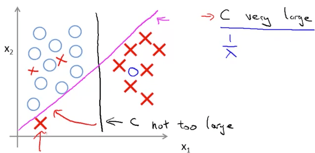
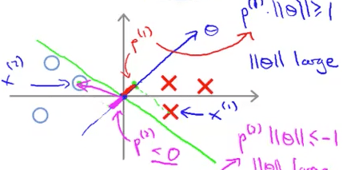

<h1 style="color: #ccc">Machine Learning 12</h1>

# Support Vector Machine

*Nov 20, 2016*

## Large Margin Classification

### Optimization Objective

1. Alternative view of logistic regression

   $$ { h }_{ \theta  }\left( x \right) =g\left( { \theta  }^{ \top  }x \right) =\frac { 1 }{ 1+{ e }^{ -{ \theta  }^{ \top  }x } } $$

   If $ y=1 $, we want $ { h }_{ \theta  }\left( x \right) \approx 1 $, $ { \theta  }^{ \top  }x\gg 0 $

   If $ y=0 $, we want $ { h }_{ \theta  }\left( x \right) \approx 0 $, $ { \theta  }^{ \top  }x\ll 0 $

2. Support vector machine

   Logistic regression:

   $$ \min _{ \theta  }{ \frac { 1 }{ m } \sum _{ i=1 }^{ m }{ \left[ { y }^{ \left( i \right)  }\left( -\log { \left( { h }_{ \theta  }\left( { x }^{ \left( i \right)  } \right)  \right)  }  \right) +\left( 1-{ y }^{ \left( i \right)  } \right) \left( -\log { \left( 1-{ h }_{ \theta  }\left( { x }^{ \left( i \right)  } \right)  \right)  }  \right) \right] } +\frac { \lambda  }{ 2m } \sum _{ j=1 }^{ n }{ { \theta  }_{ j }^{ 2 } }  } $$

   Support vector machine:

   $$ \min _{ \theta  }{ C\sum _{ i=1 }^{ m }{ \left[ { y }^{ \left( i \right)  }{ cost }_{ 1 }\left( { \theta  }^{ \top  }{ x }^{ \left( i \right)  } \right) +\left( 1-{ y }^{ \left( i \right)  } \right) { cost }_{ 0 }\left( { \theta  }^{ \top  }{ x }^{ \left( i \right)  } \right)  \right]  } +\frac { 1 }{ 2 } \sum _{ j=1 }^{ n }{ { \theta  }_{ j }^{ 2 } }  } $$

3. SVM hypothesis

   $$ { h }_{ \theta  }\left( x \right) =\begin{cases} 1 & \text{if }{ \theta  }^{ \top  }x\gg 0 \\ 0 & \text{otherwise} \end{cases} $$

   No longer using probability

### Large Margin Intuition

1. Support vector machine

   

   If $ y=1 $, we want $ { \theta  }^{ \top  }x\ge 1 $ (not just $ \ge 0 $)

   If $ y=0 $, we want $ { \theta  }^{ \top  }x\le -1 $ (not just $ \lt 0 $)

2. SVM Decision Boundary

   When C is very large

   $$ \min _{ \theta  }{ \frac { 1 }{ 2 } \sum _{ j=1 }^{ n }{ { \theta  }_{ j }^{ 2 } }  } $$

   $$ s.t.\begin{cases} { \theta  }^{ \top  }{ x }^{ \left( i \right)  }\ge 1 & \text{if }{ y }^{ \left( i \right)  }=1 \\ { \theta  }^{ \top  }{ x }^{ \left( i \right)  }\le -1 & \text{if }{ y }^{ \left( i \right)  }=0 \end{cases} $$

   

   The support vector machine is sometimes also called the large margin classifier.

3. Large margin classifier in presence of outliers

   

### Mathematics Behind Large Margin Classification

1. Vector Inner Product

   $$ u=\begin{bmatrix} { u }_{ 1 } \\ { u }_{ 2 } \end{bmatrix},v=\begin{bmatrix} { v }_{ 1 } \\ { v }_{ 2 } \end{bmatrix} $$

   $$ \begin{array}{ c l l } \Vert u\Vert  & = & \text{length of vector} \ u\\ & = & \sqrt{u^{2}_{1} +u^{2}_{2}} \in \mathbb{R} \end{array} $$

   $$ { p }_{ vu }=\text{signed (+/-) length of projection of }v\text{ onto }u $$

   $$ \begin{array}{ c l l } u^{\top } v & = & p_{vu} \cdot \Vert u\Vert \\ & = & u_{1} v_{1} +u_{2} v_{2}\\ & = & p_{uv} \cdot \Vert v\Vert \\ & = & v^{\top } u \end{array} $$

   

2. SVM Decision Boundary

   $$ \min _{ \theta  }{ \frac { 1 }{ 2 } \sum _{ j=1 }^{ n }{ { \theta  }_{ j }^{ 2 } }  } $$

   $$ s.t.\begin{cases} { \theta  }^{ \top  }{ x }^{ \left( i \right)  }\ge 1 & \text{if }{ y }^{ \left( i \right)  }=1 \\ { \theta  }^{ \top  }{ x }^{ \left( i \right)  }\le -1 & \text{if }{ y }^{ \left( i \right)  }=0 \end{cases} $$

   Simplification: $ { \theta  }_{ 0 }=0,n=2 $

   $$ \min _{ \theta  }{ \frac { 1 }{ 2 } \sum _{ j=1 }^{ n }{ { \theta  }_{ j }^{ 2 } }  } =\frac { 1 }{ 2 } { \left( \sqrt { { \theta  }_{ 1 }^{ 2 }+{ \theta  }_{ 2 }^{ 2 } }  \right)  }^{ 2 }=\frac { 1 }{ 2 } { \left\| \theta  \right\|  }^{ 2 } $$

   $$ { \theta  }^{ \top  }{ x }^{ \left( i \right)  }={ p }_{ { x }^{ \left( i \right)  }\theta  }\cdot \left\| \theta  \right\| ={ p }^{ \left( i \right)  }\cdot \left\| \theta  \right\| ={ \theta  }_{ 1 }{ x }_{ 1 }^{ \left( i \right)  }+{ \theta  }_{ 2 }{ x }_{ 2 }^{ \left( i \right)  } $$

   * $ { p }^{ \left( i \right)  }={ p }_{ { x }^{ \left( i \right)  }\theta  } $ for training set $ i $

2. SVM Decision Boundary (vector form)

   $$ \min _{ \theta  }{ \frac { 1 }{ 2 } { \left\| \theta  \right\|  }^{ 2 } } $$

   $$ s.t.\begin{cases} { p }^{ \left( i \right)  }\cdot \left\| \theta  \right\| \ge 1 & \text{if }{ y }^{ \left( i \right)  }=1 \\ { p }^{ \left( i \right)  }\cdot \left\| \theta  \right\| \le -1 & \text{if }{ y }^{ \left( i \right)  }=0 \end{cases} $$

   where $ { p }^{ \left( i \right)  } $ is the projection of $ { x }^{ \left( i \right)  } $ onto the vector $ \theta $

   Simplification: $ { \theta  }_{ 0 }=0 $

   

   

## Kernels

### Kernels

1. Non-linear Decision Boundary

   Predict $ y=1 $ if $ { \theta  }_{ 0 }+{ \theta  }_{ 1 }{ x }_{ 1 }+{ \theta  }_{ 2 }{ x }_{ 2 }+{ \theta  }_{ 3 }{ x }_{ 1 }{ x }_{ 2 }+\cdots \ge 0 $

   $$ { h }_{ \theta  }\left( x \right) =\begin{cases} 1 & \text{if }{ \theta  }^{ \top  }x\ge 0 \\ 0 & \text{otherwise} \end{cases} $$

   $$ { f }_{ 1 }={ x }_{ 1 },{ f }_{ 2 }={ x }_{ 2 },{ f }_{ 3 }={ x }_{ 1 }{ x }_{ 2 },\cdots $$

   Is there a different / better choice of features $ { f }_{ 1 },{ f }_{ 2 },{ f }_{ 3 },\cdots  $?

2. Kernel

   Given $ x $, compute new feature depending on proximity to landmarks $ { l }^{ \left( 1 \right)  },{ l }^{ \left( 2 \right)  },{ l }^{ \left( 3 \right)  },\cdots $

   $$ { f }_{ j }=similarity\left( x,{ l }^{ \left( j \right)  } \right) =k\left( x,{ l }^{ \left( j \right)  } \right) ,\text{ for }j=1,2,3,\cdots $$

   * $ similarity $ / $ k $ = kernel function (such as Gaussian kernel)

3. Gaussian kernel

   $$ k\left( x,{ l }^{ \left( j \right)  } \right) ={ e }^{ -\frac { { \left\| x-{ l }^{ \left( j \right)  } \right\|  }^{ 2 } }{ 2{ \sigma  }^{ 2 } }  }=exp\left( -\frac { { \left\| x-{ l }^{ \left( j \right)  } \right\|  }^{ 2 } }{ 2{ \sigma  }^{ 2 } }  \right)  $$

4. Kernels and Similarity

   $$ { f }_{ 1 }=k\left( x,{ l }^{ \left( 1 \right)  } \right) =exp\left( -\frac { { \left\| x-{ l }^{ \left( 1 \right)  } \right\|  }^{ 2 } }{ 2{ \sigma  }^{ 2 } }  \right) =exp\left( -\frac { \sum _{ j=1 }^{ n }{ { \left( { x }_{ j }-{ l }_{ j }^{ \left( 1 \right)  } \right)  }^{ 2 } }  }{ 2{ \sigma  }^{ 2 } }  \right) $$

   If $ x\approx { l }^{ \left( 1 \right)  } $:

   $$ { f }_{ 1 }\approx exp\left( -\frac { { 0 }^{ 2 } }{ 2{ \sigma  }^{ 2 } }  \right) \approx 1 $$

   If $ x $ is far from $ { l }^{ \left( 1 \right)  } $:

   $$ { f }_{ 1 }\approx exp\left( -\frac { { \left( \text{large number} \right)  }^{ 2 } }{ 2{ \sigma  }^{ 2 } }  \right) \approx 0 $$

5. Landmark example

   $$ { l }^{ \left( 1 \right)  }=\begin{bmatrix} 3 \\ 5 \end{bmatrix} $$

   

6. Choosing landmarks

   Given $ \left( { x }^{ \left( 1 \right)  },{ y }^{ \left( 1 \right)  } \right) ,\left( { x }^{ \left( 2 \right)  },{ y }^{ \left( 2 \right)  } \right) ,\cdots ,\left( { x }^{ \left( m \right)  },{ y }^{ \left( m \right)  } \right) $

   Choose $ { l }^{ \left( 1 \right)  }={ x }^{ \left( 1 \right)  },{ l }^{ \left( 2 \right)  }={ x }^{ \left( 2 \right)  },\cdots ,{ l }^{ \left( m \right)  }={ x }^{ \left( m \right)  } $

   Given example $ { x }^{ \left( i \right)  } $:

   $$ { f }^{ \left( i \right)  }=\begin{bmatrix} { f }_{ 0 }^{ \left( i \right)  } \\ { f }_{ 1 }^{ \left( i \right)  } \\ { f }_{ 2 }^{ \left( i \right)  } \\ \vdots  \\ { f }_{ i }^{ \left( i \right)  } \\ \vdots  \\ { f }_{ m }^{ \left( i \right)  } \end{bmatrix}=\begin{bmatrix} 1 \\ k\left( { x }^{ \left( i \right)  },{ l }^{ \left( 1 \right)  } \right)  \\ k\left( { x }^{ \left( i \right)  },{ l }^{ \left( 2 \right)  } \right)  \\ \vdots  \\ k\left( { x }^{ \left( i \right)  },{ l }^{ \left( i \right)  } \right) =exp\left( -\frac { 0 }{ 2{ \sigma  }^{ 2 } }  \right) =1 \\ \vdots  \\ k\left( { x }^{ \left( i \right)  },{ l }^{ \left( m \right)  } \right)  \end{bmatrix} $$

### SVM with Kernels

1. SVM with Kernels

   Hypothesis: Given $ x $, compute features $ f\in { \mathbb{R} }^{ m+1 } $. Predict $ y=1 $ if $ { \theta  }^{ \top  }f\ge 0 $.

   Training:

   $$ \min _{ \theta  }{ C\sum _{ i=1 }^{ m }{ { y }^{ \left( i \right)  }{ cost }_{ 1 }\left( { \theta  }^{ \top  }{ f }^{ \left( i \right)  } \right)  } +\left( 1-{ y }^{ \left( i \right)  } \right) { cost }_{ 0 }\left( { \theta  }^{ \top  }{ f }^{ \left( i \right)  } \right) +\frac { 1 }{ 2 } \sum _{ j=1 }^{ m }{ { \theta  }_{ j }^{ 2 } }  } $$

2. Computational tricks

   $$ \sum _{ j=1 }^{ m }{ { \theta  }_{ j }^{ 2 } } ={ \theta  }^{ \top  }\theta \approx { \theta  }^{ \top  }M\theta  $$

   When m is too big, we use $ { \theta  }^{ \top  }M\theta $ instead of $ { \theta  }^{ \top  }\theta $, for the reason of computational efficiency to allow the SVM software to run much more efficiently. This should be built-in in the off-the-shelf computational software.

   Kernels can be applied to logistic regression as well but it runs very slow. Because of computational tricks SVM and kernels tend to go particularly well together.

### SVM Bias vs Variance

1. SVM parameters

   $$ C=\frac { 1 }{ \lambda  }  $$

   * Large C: Lower bias, higher variance
   * Small C: Higher bias, lower variance

   $$ { \sigma }^{ 2 } $$

   * Large $ { \sigma }^{ 2 } $: Features $ { f }_{ j } $ vary more smoothly. Higher bias, lower variance.
   * Small $ { \sigma }^{ 2 } $: Features $ { f }_{ j } $ vary less smoothly. Lower bias, higher variance.

## SVMs in Practice

### Using An SVM

1. Using An SVM

   Use SVM software package (e.g. liblinear, libsvm, ...) to solve for parameters $ \theta $.

   Need to specify:

   * Choice of parameter C
   * Choice of kernel (similarity function)

2. No kernel (linear kernel): when $ n $ large, $ m $ small

   Predict $ y=1 $ if $ { \theta  }^{ \top  }x\ge 0 $

3. Gaussian kernel

   $$ { f }_{ j }=exp\left( -\frac { { \left\| x-{ l }^{ \left( j \right)  } \right\|  }^{ 2 } }{ 2{ \sigma  }^{ 2 } }  \right), \text{where }{ l }^{ \left( j \right)  }={ x }^{ \left( j \right)  } $$

   Need to choose $ { \sigma }^{ 2 } $

4. Kernel function

   ```
   function f = kernel(x1, x2)
   ```

   $$ { f }=exp\left( -\frac { { \left\| \text{x1}-\text{x2} \right\|  }^{ 2 } }{ 2{ \sigma  }^{ 2 } }  \right)  $$

   ```
   return
   ```

   Note: Do perform feature scaling before using the Gaussian kernel

5. Other choices of kernel

   Not all similarity functions $ k\left( x,l \right) $ make valid kernels.

   Need to satisfy technical condition called "Mercer's Theorem" to make sure SVM packages' optimizations run correctly, and do not diverge.

   Many off-the-shelf kernels available:

   * Polynomial kernel

   $$ k\left( x,l \right) ={ \left( { x }^{ \top  }l+\text{constant} \right)  }^{ \text{degree} } \text{, e.g. }{ \left( { x }^{ \top  }l \right)  }^{ 2 },{ \left( { x }^{ \top  }l+5 \right)  }^{ 3 },\cdots  $$

   * More esoteric: String kernel, chi-square kernel, histogram intersection kernel

6. Multi-class classification

   $$ y\in \left\{ 1,2,\cdots ,K \right\} $$

   Many SVM packages already built-in multi-class classification functionality.

   Otherwise, use one-vs-all method (Train $ K $ SVMs, one to distinguish $ y=i $ from the rest, for $ i=1,2,\cdots ,K $), get $ { \theta  }^{ \left( 1 \right)  },{ \theta  }^{ \left( 2 \right)  },\cdots ,{ \theta  }^{ \left( K \right)  } $. Pick class $ i $ with largest $ { \left( { \theta  }^{ \left( i \right)  } \right)  }^{ \top  }x $.

7. Logistic regression vs SVMs

   $ n $ = number of features ($ x\in { \mathbb{R} }^{ n+1 } $), $ m $ = number of training examples

   If $ n $ is large (relative to $ m $): $ n\ge m $

   * Use logistic regression, or SVM without a kernel (linear kernel)

   If $ n $ is small, $ m $ is intermediate: $ m\lt n $ and $ m\le 50k $

   * Use SVM with Gaussian kernel

   If $ n $ is small, $ m $ is large: $ m\lt n $ and $ m\gt 50k $

   * Create / add more features, then use logistic regression or SVM without a kernel

   Logistic regression and SVM without a kernel are very similar to each other. The power of SVM is to be able to use different kernels to learn complex non-linear function.

   Neural network likely to work well for most of these settings, but may be slower to train.

   The optimization problem that the SVM has is a convex optimization problem and so the good SVM optimization software packages will always find the global minimum or something close to it.
