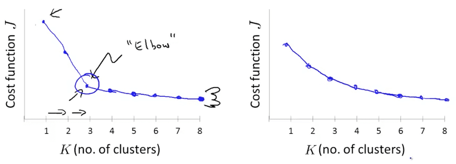

<h1 style="color: #ccc">Machine Learning 13</h1>

# Unsupervised Learning

*Nov 27, 2016*

## Clustering

### Introduction

1. Introduction

   Supervised learning

   $$ \text{Training Set}=\left\{ \left( { x }^{ \left( 1 \right)  },{ y }^{ \left( 1 \right)  } \right) ,\left( { x }^{ \left( 2 \right)  },{ y }^{ \left( 2 \right)  } \right) ,\left( { x }^{ \left( 3 \right)  },{ y }^{ \left( 3 \right)  } \right) ,\cdots ,\left( { x }^{ \left( m \right)  },{ y }^{ \left( m \right)  } \right)  \right\} $$

   Unsupervised learning

   $$ \text{Traning Set}=\left\{ { x }^{ \left( 1 \right)  },{ x }^{ \left( 2 \right)  },{ x }^{ \left( 3 \right)  },\cdots ,{ x }^{ \left( m \right)  } \right\} $$

2. Applications of clustering

   * Market segmentation
   * Social network analysis
   * Organize computing clusters
   * Astronomical data analysis

### K-Means Algorithm

1. K-means algorithm

   Input

   * $ K $ (number of clusters)
   * Training set $ \left\{ { x }^{ \left( 1 \right)  },{ x }^{ \left( 2 \right)  },\cdots ,{ x }^{ \left( m \right)  } \right\} $

   $ { x }^{ \left( i \right)  }\in { \mathbb{R} }^{ n } $ (drop $ { x }_{ 0 }=1 $ convention)

   Randomly initialize $ K $ cluster centroids $ { \mu  }_{ 1 },{ \mu  }_{ 2 },\cdots ,{ \mu  }_{ K }\in { \mathbb{R} }^{ n } $

   ```
   repeat {
       for i in 1..m {
   ```

   $$ { c }^{ \left( i \right)  }:=\text{index (from 1 to K) of cluster centroid closest to }{ x }^{ \left( i \right)  }\text{, i.e. }\min _{ k }{ { \left\| { x }^{ \left( i \right)  }-{ \mu  }_{ k } \right\|  }^{ 2 } } $$

   ```
       }

       for k in 1..K {
   ```

   $$ { \mu  }_{ k }:=\text{average (mean) of points assigned to cluster }k $$

   ```
       }
   }
   ```

### Optimization Objective

1. Notation

   * $ { c }^{ \left( i \right)  } $ = index of cluster $ \left( 1,2,\cdots ,K \right) $ to which example $ { x }^{ \left( i \right)  } $ is currently assigned
   * $ { \mu  }_{ k } $ = cluster centroid $ k \left( { \mu  }_{ k }\in { R }^{ n } \right) $
   * $ { \mu  }_{ { c }^{ \left( i \right)  } } $ = cluster centroid of cluster to which example $ { x }^{ \left( i \right)  } $ has been assigned

2. Optimization objective

   $$ \text{Distortion of K-Means}=J\left( { c }^{ \left( 1 \right)  },\cdots ,{ c }^{ \left( m \right)  },{ \mu  }_{ 1 },\cdots ,{ \mu  }_{ K } \right) =\frac { 1 }{ m } \sum _{ i=1 }^{ m }{ { \left\| { x }^{ \left( i \right)  }-{ \mu  }_{ { c }^{ \left( i \right)  } } \right\|  }^{ 2 } } $$

   $$ \min _{ { c }^{ \left( 1 \right)  },\cdots ,{ c }^{ \left( m \right)  },{ \mu  }_{ 1 },\cdots ,{ \mu  }_{ K } }{ J\left( { c }^{ \left( 1 \right)  },\cdots ,{ c }^{ \left( m \right)  },{ \mu  }_{ 1 },\cdots ,{ \mu  }_{ K } \right)  } $$

### Random Initialization

1. Random initialization

   Should have $ K<m $

   Randomly pick $ K $ training examples

   Set $ { \mu  }_{ 1 },\cdots ,{ \mu  }_{ K } $ equal to these $ K $ examples

2. Multiple random initializations (avoid local optima)

   ```
   for i in 1..100 {
       Randomly initialize K-means
       Run K-means
   ```

   $$ \text{Get }\left\{ { c }^{ \left( 1 \right)  },\cdots ,{ c }^{ \left( m \right)  },{ \mu  }_{ 1 },\cdots { \mu  }_{ K } \right\} $$

   ```
       Compute cost function (distortion)
   ```

   $$ { J\left( { c }^{ \left( 1 \right)  },\cdots ,{ c }^{ \left( m \right)  },{ \mu  }_{ 1 },\cdots ,{ \mu  }_{ K } \right)  } $$

   ```
   }
   ```

   Pick clustering that gave lowest cost $ { J\left( { c }^{ \left( 1 \right)  },\cdots ,{ c }^{ \left( m \right)  },{ \mu  }_{ 1 },\cdots ,{ \mu  }_{ K } \right)  } $

   If $ K $ is small (2 to 10), then multiple random initializations can sometimes make sure that you find a better local optimum. But if $ K $ is very large (>10), then multiple random initializations is less likely to make a huge difference and there is a much higher chance that your first random initialization will give you a pretty decent solution already.

### Choosing the Number of Clusters

1. Elbow method

   

   It turns out the Elbow method isn't used that often, you fairly often end up with a curve that looks much more ambiguous, it looks like distortion continuously goes down with no clear elbow. Elbow method is worth the try, but it wouldn't necessary be working for any particular problem.

2. Purpose method

   Sometimes, you're running K-means to get clusters to use for some later / downstream purpose. Evaluate K-means based on a metric for how well it performs for that later purpose.

   * $ K=3 $, for S, M, L sizes
   * $ K=5 $, for XS, S, M, L, XL sizes

   
