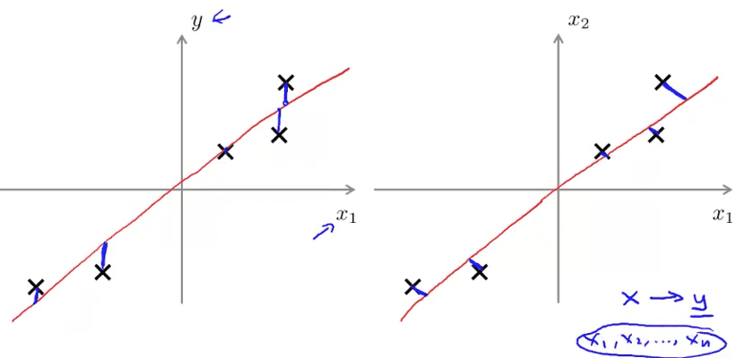

<h1 style="color: #ccc">Machine Learning 14</h1>

# Dimensionality Reduction

*Nov 27, 2016*

## Motivation

### Data Compression

1. Reduce data from 2D to 1D

   $$ { x }^{ \left( i \right)  }\in { R }^{ 2 }\xrightarrow {  } { z }^{ \left( i \right)  }\in R $$

   

2. Reduce data from 3D to 2D

   $$ { x }^{ \left( i \right)  }\in { R }^{ 3 }\xrightarrow {  } { z }^{ \left( i \right)  }=\begin{bmatrix} { z }_{ 1 }^{ \left( i \right)  } \\ { z }_{ 2 }^{ \left( i \right)  } \end{bmatrix}\in { R }^{ 2 } $$

   

### Visualization

1. Visualization

   

   

   

## Principal Component Analysis

### PCA Problem Formulation

1. Problem formulation

   Reduce from 2-dimension to 1-dimension: Find a direction (a vector $ { u }^{ \left( 1 \right)  }\in { R }^{ n } $) onto which to project the data so as to minimize the projection error.

   Reduce from n-dimension to k-dimension: Find $ k $ vectors $ { u }^{ \left( 1 \right)  }\in { R }^{ n } $ onto which to project the data, so as to minimize the projection error.

   

2. PCA is not linear regression

   

### PCA Algorithm

1. Data preprocessing

   Training set: $ { x }^{ \left( 1 \right)  },{ x }^{ \left( 2 \right)  },\cdots { x }^{ \left( m \right)  } $

   Preprocessing (feature scaling / mean normalization):

   * Set $ { \mu  }_{ j }:=\frac { 1 }{ m } \sum _{ i=1 }^{ m }{ { x }_{ j }^{ \left( i \right)  } } $
   * Replace each $ { x }_{ j }^{ \left( i \right)  } $ with $ { x }_{ j }^{ \left( i \right)  }-{ \mu  }_{ j } $
   * If different features on different scales (e.g., $ { x }_{ 1 } $ = size of house, $ { x }_{ 2 } $ = number of bedrooms), scale features to have comparable range of values.
   * Replace each $ { x }_{ j }^{ \left( i \right)  } $ with $ \frac { { x }_{ j }^{ \left( i \right)  }-{ \mu  }_{ j } }{ { s }_{ j } } $ or $ \frac { { x }_{ j }^{ \left( i \right)  }-{ \mu  }_{ j } }{ { \sigma }_{ j } } $

2. PCA algorithm

   Reduce data from n-dimensions to k-dimensions

   Compute "covariance matrix":

   $$ \Sigma =\frac { 1 }{ m } \sum _{ i=1 }^{ m }{ \left( { x }^{ \left( i \right)  } \right) { \left( { x }^{ \left( i \right)  } \right)  }^{ \top  } } $$

   $ { { x }^{ \left( i \right)  } }^{ \top  }\in { \mathbb{R} }^{ 1\times n },X=\begin{bmatrix} { { x }^{ \left( 1 \right)  } }^{ \top  } \\ \vdots  \\ { { x }^{ \left( m \right)  } }^{ \top  } \end{bmatrix}\in { \mathbb{R} }^{ m\times n } $, then ``Sigma = 1 / m * X' * X``

   Compute "eigenvectors" of matrix $ \Sigma $:

   ```
   [U, S, V] = svd(Sigma)
   ```

   ``svd`` stands for Singular Value Decomposition. ``eig(Sigma)`` can also be used to compute the same thing, although ``svd(Sigma)`` is a little more numerically stable. ``svd`` will give you the same thing because covariance matrix always satisfies a mathematical property called Symmetric Positive Definite.

   $$ U=\begin{bmatrix} { u }^{ \left( 1 \right)  } & \cdots  & { u }^{ \left( n \right)  } \end{bmatrix}\in { \mathbb{R} }^{ n\times n } $$

   $$ { x }^{ \left( i \right)  }\in { \mathbb{R} }^{ n },{ U }_{ reduce }=\begin{bmatrix} { u }^{ \left( 1 \right)  } & \cdots  & { u }^{ \left( k \right)  } \end{bmatrix}\in { \mathbb{R} }^{ n\times k } $$

   $$ { z }^{ \left( i \right)  }={ U }_{ reduce }^{ \top  }{ x }^{ \left( i \right)  }=\begin{bmatrix} { { u }^{ \left( 1 \right)  } }^{ \top  } \\ \vdots  \\ { { u }^{ \left( k \right)  } }^{ \top  } \end{bmatrix}{ x }^{ \left( i \right)  }\in { \mathbb{R} }^{ k } $$

   ```
   Ureduce = U(:, 1:k);
   z = Ureduce' * x;
   ```

## Applying PCA

### Reconstruction from Compressed Representation

1. Reconstruction from compressed representation

   $$ { x }_{ approx }^{ \left( i \right)  }={ U }_{ reduce }{ z }^{ \left( i \right)  } $$

### Choosing the Number of Principal Components

1. Choosing $ k $ (number of principal components)

   Average squared projection error:

   $$ \frac { 1 }{ m } \sum _{ i=1 }^{ m }{ { \left\| { x }^{ \left( i \right)  }-{ x }_{ approx }^{ \left( i \right)  } \right\|  }^{ 2 } } $$

   Total variation in the data:

   $$ \frac { 1 }{ m } \sum _{ i=1 }^{ m }{ { \left\| { x }^{ \left( i \right)  } \right\|  }^{ 2 } } $$

   Typically, choose $ k $ to be smallest value so that error is less than 1%, 5%

   $$ \frac { \frac { 1 }{ m } \sum _{ i=1 }^{ m }{ { \left\| { x }^{ \left( i \right)  }-{ x }_{ approx }^{ \left( i \right)  } \right\|  }^{ 2 } }  }{ \frac { 1 }{ m } \sum _{ i=1 }^{ m }{ { \left\| { x }^{ \left( i \right)  } \right\|  }^{ 2 } }  } \le 0.01 $$

   99% of variance is retained

2. Algorithm

   Brute force approach is inefficient

   * Try PCA with $ k=1,2,\cdots $
   * Compute $ { U }_{ reduce },{ z }^{ \left( 1 \right)  },\cdots ,{ z }^{ \left( m \right)  },{ x }_{ approx }^{ \left( 1 \right)  },\cdots ,{ x }_{ approx }^{ \left( m \right)  } $
   * Check if $ \frac { \frac { 1 }{ m } \sum _{ i=1 }^{ m }{ { \left\| { x }^{ \left( i \right)  }-{ x }_{ approx }^{ \left( i \right)  } \right\|  }^{ 2 } }  }{ \frac { 1 }{ m } \sum _{ i=1 }^{ m }{ { \left\| { x }^{ \left( i \right)  } \right\|  }^{ 2 } }  } \le 0.01 $

   ``svd`` approach much more efficient

   ```
   [U, S, V] = svd(Sigma)
   ```

   $$ S=\begin{bmatrix} { s }_{ 11 } &  &  & 0 \\  & { s }_{ 22 } &  &  \\  &  & \ddots  &  \\ 0 &  &  & { s }_{ nn } \end{bmatrix} $$

   * Try PCA with $ k=1,2,\cdots $
   * Check if $ 1-\frac { \sum _{ i=1 }^{ k }{ { s }_{ ii } }  }{ \sum _{ i=1 }^{ n }{ { s }_{ ii } }  } \le 0.01 $

3. Summary

   Pick smallest value of $ k $ for which

   $$ \frac { \sum _{ i=1 }^{ k }{ { s }_{ ii } }  }{ \sum _{ i=1 }^{ n }{ { s }_{ ii } }  } \ge 0.99 $$

   99% of variance retained

### Advice for Applying PCA

1. Supervised learning speedup

   Original training set:

   $$ \left( { x }^{ \left( 1 \right)  },{ y }^{ \left( 1 \right)  } \right) ,\left( { x }^{ \left( 2 \right)  },{ y }^{ \left( 2 \right)  } \right) ,\cdots \left( { x }^{ \left( m \right)  },{ y }^{ \left( m \right)  } \right) $$

   Extract inputs:

   $$ { x }^{ \left( 1 \right)  },{ x }^{ \left( 2 \right)  },\cdots ,{ x }^{ \left( m \right)  }\in { \mathbb{R} }^{ 10000 } $$

   $$ \downarrow PCA $$

   $$ { z }^{ \left( 1 \right)  },{ z }^{ \left( 2 \right)  },\cdots ,{ z }^{ \left( m \right)  }\in { \mathbb{R} }^{ 100 } $$

   New training set:

   $$ \left( { z }^{ \left( 1 \right)  },{ y }^{ \left( 1 \right)  } \right) ,\left( { z }^{ \left( 2 \right)  },{ y }^{ \left( 2 \right)  } \right) ,\cdots \left( { z }^{ \left( m \right)  },{ y }^{ \left( m \right)  } \right) $$

   Note: Mapping $ { x }^{ \left( i \right)  }\xrightarrow {  } { z }^{ \left( i \right)  } $ should be defined by running PCA only on the training set. This mapping can be applied as well to the examples $ { x }_{ cv }^{ \left( i \right)  } $ and $ { x }_{ test }^{ \left( i \right)  } $ in the cross validation and test sets.

2. Application of PCA

   Compression

   * Reduce memory / disk needed to store data
   * Speed up learning algorithm
   * Choose $ k $ by % of variance retained

   Visualization

   * $ k=2 $ or $ k=3 $

3. Bad use of PCA: To prevent overfitting

   Use $ { z }^{ \left( i \right)  } $ instead of $ { x }^{ \left( i \right)  } $ to reduce the number of features $ k<n $. Thus, fewer features, less likely to overfit.

   This might work OK, but isn't a good way to address overfitting. Use regularization instead.

   $$ \min _{ \theta  }{ \frac { 1 }{ 2m } \sum _{ i=1 }^{ m }{ { \left( { h }_{ \theta  }\left( { x }^{ \left( i \right)  } \right) -{ y }^{ \left( i \right)  } \right)  }^{ 2 } } +\frac { \lambda  }{ 2m } \sum _{ j=1 }^{ n }{ { \theta  }_{ j }^{ 2 } }  } $$

3. PCA is sometimes used where it shouldn't be

   Design of ML system:

   * Get training set $ \left\{ \left( { x }^{ \left( 1 \right)  },{ y }^{ \left( 1 \right)  } \right) ,\left( { x }^{ \left( 2 \right)  },{ y }^{ \left( 2 \right)  } \right) ,\cdots ,\left( { x }^{ \left( m \right)  },{ y }^{ \left( m \right)  } \right)  \right\} $
   * Run PCA to reduce $ { x }^{ \left( i \right)  } $ in dimension to get $ { z }^{ \left( i \right)  } $
   * Train logistic regression on $ \left\{ \left( { z }^{ \left( 1 \right)  },{ y }^{ \left( 1 \right)  } \right) ,\cdots ,\left( { z }^{ \left( m \right)  },{ y }^{ \left( m \right)  } \right)  \right\} $
   * Test on test set: Map $ { x }_{ test }^{ \left( i \right)  } $ to $ { z }_{ test }^{ \left( i \right)  } $. Run $ { h }_{ \theta  }\left( z \right) $ on $ \left\{ \left( { z }_{ test }^{ \left( 1 \right)  },{ y }_{ test }^{ \left( 1 \right)  } \right) ,\cdots ,\left( { z }_{ test }^{ \left( m \right)  },{ y }_{ test }^{ \left( m \right)  } \right)  \right\} $

   How about doing the whole thing without using PCA?

   Before implementing PCA, first try running whatever you want to do with the original / raw data $ { x }^{ \left( i \right)  } $. Only if that doesn't do what you want, then implement PCA and consider using $ { z }^{ \left( i \right)  } $, e.g. when it runs too slowly, disk or memory requirement is too large.
