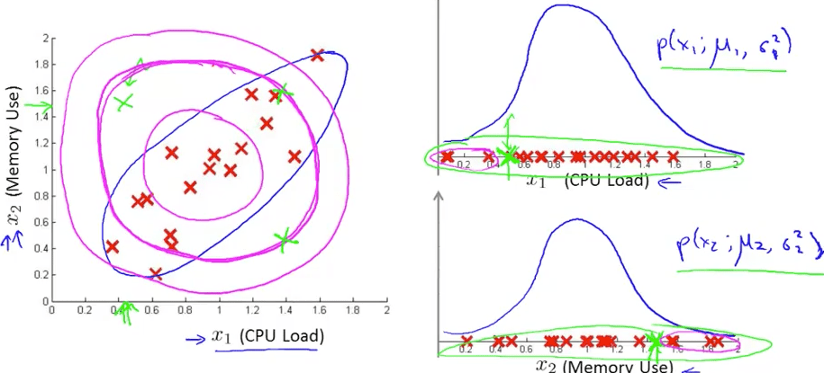
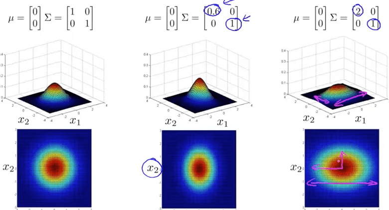
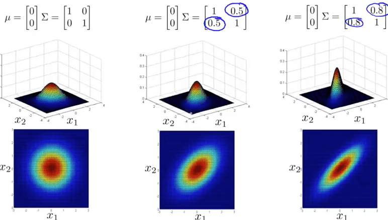

<h1 style="color: #ccc">Machine Learning 15</h1>

# Anomaly Detection

*Dec 4, 2016*

## Density Estimation

### Problem Motivation

1. Density estimation

   Dataset: $ \left\{ { x }^{ \left( 1 \right)  },{ x }^{ \left( 2 \right)  },\cdots ,{ x }^{ \left( m \right)  } \right\} $

   Is new engine: $ { x }_{ test } $ anomalous?

   Model $ p\left( x \right) $

   $$ p\left( { x }_{ test } \right) \begin{cases} <\varepsilon  & \text{flag anomaly} \\ \ge \varepsilon  & \text{ok} \end{cases} $$

   

2. Example applications

   Fraud detection

   * $ { x }^{ \left( i \right)  } $ = features of user $ i $'s activities
   * Model $ p\left( x \right) $ from data
   * Identify unusual users by checking which have $ p\left( x \right) <\varepsilon $
   * $ { x }_{ 1 } $ = how often does this user login
   * $ { x }_{ 2 } $ = number of what pages visited
   * $ { x }_{ 3 } $ = number of transaction
   * $ { x }_{ 4 } $ = number of posts
   * $ { x }_{ 5 } $ = typing speed

   Manufacturing quality assurance

   * $ { x }^{ \left( i \right)  } $ = features of engine $ i $
   * $ { x }_{ 1 } $ = heat
   * $ { x }_{ 2 } $ = vibration

   Monitoring computers in a data center

   * $ { x }^{ \left( i \right)  } $ = features of machine $ i $
   * $ { x }_{ 1 } $ = memory used
   * $ { x }_{ 2 } $ = number of disk accesses / sec
   * $ { x }_{ 3 } $ = CPU load
   * $ { x }_{ 4 } $ = CPU load / network traffic

### Gaussian Distribution

1. Gaussian (Normal) distribution

   Say $ x\in \mathbb{R} $. If $ x $ is a distributed Gaussian with mean $ \mu $, variance $ { \sigma  }^{ 2 } $.

   $$ x\sim \mathcal{N}\left( \mu ,{ \sigma  }^{ 2 } \right) $$

   $$ p\left( x;\mu ,{ \sigma  }^{ 2 } \right) =\frac { 1 }{ \sqrt { 2\pi  } \sigma  } exp\left( -\frac { { \left( x-\mu  \right)  }^{ 2 } }{ 2{ \sigma  }^{ 2 } }  \right) $$

2. Parameter estimation

   Dataset: $ \left\{ { x }^{ \left( 1 \right)  },{ x }^{ \left( 2 \right)  },\cdots ,{ x }^{ \left( m \right)  } \right\} $, $ { x }^{ \left( i \right)  }\in \mathbb{R} $

   $$ { x }^{ \left( i \right)  }\sim N\left( \mu ,{ \sigma  }^{ 2 } \right) ,\mu =\frac { 1 }{ m } \sum _{ i=1 }^{ m }{ { x }^{ \left( i \right)  } } ,{ \sigma  }^{ 2 }=\frac { 1 }{ m } \sum _{ i=1 }^{ m }{ { \left( { x }^{ \left( i \right)  }-\mu  \right)  }^{ 2 } } $$

   

### Algorithm

1. Anomaly detection algorithm

   * Choose features $ { x }_{ i } $ that you think might be indicative of anomalous examples.
   * Fit parameters $ { \mu  }_{ 1 },\cdots ,{ \mu  }_{ n },{ \sigma  }_{ 1 }^{ 2 },\cdots ,{ \sigma  }_{ n }^{ 2 } $

   $$ { \mu  }_{ j }=\frac { 1 }{ m } \sum _{ i=1 }^{ m }{ { x }_{ j }^{ \left( i \right)  } } $$

   $$ { \sigma  }_{ j }^{ 2 }=\frac { 1 }{ m } \sum _{ i=1 }^{ m }{ { \left( { x }_{ j }^{ \left( i \right)  }-{ \mu  }_{ j } \right)  }^{ 2 } } $$

   * Given new example $ x $, compute $ p\left( x \right) $:

   $$ p\left( x \right) =\prod _{ j=1 }^{ n }{ p\left( { x }_{ j };{ \mu  }_{ j },{ \sigma  }_{ j }^{ 2 } \right)  } =\prod _{ j=1 }^{ n }{ \frac { 1 }{ \sqrt { 2\pi  } { \sigma  }_{ j } }  } exp\left( -\frac { { \left( { x }_{ j }-{ \mu  }_{ j } \right)  }^{ 2 } }{ 2{ \sigma  }_{ j }^{ 2 } }  \right) $$

   Anomaly if $ p\left( x \right) <\varepsilon $

2. Anomaly detection example

   

## Building an Anomaly Detection System

### Developing and Evaluating an Anomaly Detection System

1. The importance of real-number evaluation

   When developing a learning algorithm (choosing features, etc.), making decisions is much easier if we have a way of evaluating our learning algorithm.

   Assume we have some labeled data, of anomalous and non-anomalous examples ($ y=0 $ if normal, $ y=1 $ if anomalous).

   Training set: $ { x }^{ \left( 1 \right)  },{ x }^{ \left( 2 \right)  },\cdots ,{ x }^{ \left( m \right)  } $ (assume normal examples / not anomalous)

   Cross validation set: $ \left( { x }_{ cv }^{ \left( 1 \right)  },{ y }_{ cv }^{ \left( 1 \right)  } \right) ,\cdots ,\left( { x }_{ cv }^{ \left( { m }_{ cv } \right)  },{ y }_{ cv }^{ \left( { m }_{ cv } \right)  } \right) $

   Test set: $ \left( { x }_{ test }^{ \left( 1 \right)  },{ y }_{ test }^{ \left( 1 \right)  } \right) ,\cdots ,\left( { x }_{ test }^{ \left( { m }_{ test } \right)  },{ y }_{ test }^{ \left( { m }_{ test } \right)  } \right) $

2. Aircraft engines motivating example

   * 10000 good (normal) engines
   * 20 flawed engines (anomalous)
   * Training set: 6000 good engines
   * CV: 2000 good engines ($ y=0 $), 10 anomalous ($ y=1 $)
   * Test: 2000 good engines ($ y=0 $), 10 anomalous ($ y=1 $)

3. Algorithm evaluation

   Fit model $ p\left( x \right) $ on training set $ \left\{ { x }^{ \left( 1 \right)  },\cdots ,{ x }^{ \left( m \right)  } \right\} $

   On a cross validation / test example $ x $, predict

   $$ y=\begin{cases} 1 & \text{if }p\left( x \right) <\varepsilon \text{ (anomaly)} \\ 0 & \text{if }p\left( x \right) \ge \varepsilon \text{ (normal)} \end{cases} $$

   Possible evaluation metrics:

   * True positive, false positive, false negative, true negative
   * Precision / recall
   * F1-score

   Can also use cross validation set to choose parameter $ \epsilon $

### Anomaly Detection vs Supervised Learning

1. Anomaly detection

   * Very small number of positive examples ($ y=1 $). ($ 0-20 $ is common)
   * Large number of negative examples ($ y=0 $).
   * Many different types of anomalies. Hard for any algorithm to learn from positive examples what the anomalies look like.
   * Future anomalies may look nothing like any of the anomalous examples we have seen so far.

2. Supervised learning

   * Large number of positive and negative examples.
   * Enough positive examples for algorithm to get a sense of what positive examples are like, future positive examples likely to be similar to ones in training set.

3. Example applications

   Anomaly detection

   * Fraud detection
   * Manufacturing (e.g. aircraft engines)
   * Monitoring machines in data center

   Supervised learning

   * Email spam classification
   * Weather prediction (sunny / rainy / etc)
   * Cancer classification

### Choosing What Features to Use

1. Non-gaussian features

   $$ \log { \left( x \right)  } ,\log { \left( x+c \right)  } ,\sqrt { x } ,{ x }^{ \frac { 1 }{ c }  } $$

   

2. Error analysis for anomaly detection

   Want

   * $ p\left( x \right) $ large for normal examples $ x $.
   * $ p\left( x \right) $ small for anomalous examples $ x $.

   Most common problem

   * $ p\left( x \right) $ is comparable (say, both large) for normal and anomalous examples

   

3. Choosing features

   Choose features that might take on unsually large or small values in the event of an anomaly.

   Monitoring computers in a data center

   * $ { x }_{ 1 } $ = memory used
   * $ { x }_{ 2 } $ = number of disk accesses / sec
   * $ { x }_{ 3 } $ = CPU load
   * $ { x }_{ 4 } $ = network traffic

   Getting more features

   * $ { x }_{ 5 } $ = $ \frac { \text{CPU load} }{ \text{network traffic} } $
   * $ { x }_{ 6 } $ = $ \frac { { \left( \text{CPU load} \right) }^{ 2 } }{ \text{network traffic} } $

## Multivariate Gaussian Distribution

### Multivariate Gaussian Distribution

1. Motivating example: monitoring machines in data center

   Anomaly detection algorithm fails to detect this

   

2. Multivariate Gaussian (Normal) distribution

   $ x\in { \mathbb{R} }^{ n } $. Don't model $ p\left( { x }_{ 1 } \right) ,p\left( { x }_{ 2 } \right) ,\cdots $ etc. separately.

   Model $ p\left( x \right) $ all in one go.

   Parameters: $ \mu \in { \mathbb{R} }^{ n },\Sigma \in { \mathbb{R} }^{ n\times n } $ (covariance matrix)

   $$ p\left( x;\mu ,\Sigma  \right) =\frac { 1 }{ { \left( 2\pi  \right)  }^{ \frac { n }{ 2 }  }{ \left| \Sigma  \right|  }^{ \frac { 1 }{ 2 }  } } exp\left( -\frac { 1 }{ 2 } { \left( x-\mu  \right)  }^{ \top  }{ \Sigma  }^{ -1 }\left( x-\mu  \right)  \right) $$

   * &#124;$ \Sigma $&#124; = determinant of $ \Sigma $

3. Multivariate Gaussian (Normal) examples

   

   

   

   

### Anomaly Detection using the Multivariate Gaussian Distribution

1. Multivariate Gaussian (Normal) distribution

   Parameters $ \mu ,\Sigma $

   $$ p\left( x;\mu ,\Sigma  \right) =\frac { 1 }{ { \left( 2\pi  \right)  }^{ \frac { n }{ 2 }  }{ \left| \Sigma  \right|  }^{ \frac { 1 }{ 2 }  } } exp\left( -\frac { 1 }{ 2 } { \left( x-\mu  \right)  }^{ \top  }{ \Sigma  }^{ -1 }\left( x-\mu  \right)  \right) $$

   Parameter fitting:

   Given training set $ \left\{ { x }^{ \left( 1 \right)  },{ x }^{ \left( 2 \right)  },\cdots ,{ x }^{ \left( m \right)  } \right\} $

   $$ \mu =\frac { 1 }{ m } \sum _{ i=1 }^{ m }{ { x }^{ \left( i \right)  } } ,\Sigma =\frac { 1 }{ m } \sum _{ i=1 }^{ m }{ \left( { x }^{ \left( i \right)  }-\mu  \right) { \left( { x }^{ \left( i \right)  }-\mu  \right)  }^{ \top  } } $$

2. Anomaly detection with the multivariate Gaussian

   Fit model $ p \left( x \right) $ by setting

   $$ \mu =\frac { 1 }{ m } \sum _{ i=1 }^{ m }{ { x }^{ \left( i \right)  } } ,\Sigma =\frac { 1 }{ m } \sum _{ i=1 }^{ m }{ \left( { x }^{ \left( i \right)  }-\mu  \right) { \left( { x }^{ \left( i \right)  }-\mu  \right)  }^{ \top  } } $$

   Given a new example $ x $, compute

   $$ p\left( x;\mu ,\Sigma  \right) =\frac { 1 }{ { \left( 2\pi  \right)  }^{ \frac { n }{ 2 }  }{ \left| \Sigma  \right|  }^{ \frac { 1 }{ 2 }  } } exp\left( -\frac { 1 }{ 2 } { \left( x-\mu  \right)  }^{ \top  }{ \Sigma  }^{ -1 }\left( x-\mu  \right)  \right) $$

   Flag an anomaly if $ p\left( x \right) <\varepsilon $

3. Relationship to original model

   Original model: $ p\left( x \right) =p\left( { x }_{ 1 };{ \mu  }_{ 1 },{ \sigma  }_{ 1 }^{ 2 } \right) \times p\left( { x }_{ 1 };{ \mu  }_{ 1 },{ \sigma  }_{ 1 }^{ 2 } \right) \times \cdots \times p\left( { x }_{ n };{ \mu  }_{ n },{ \sigma  }_{ n }^{ 2 } \right) $

   Corresponds to multivariate Gaussian

   $$ p\left( x;\mu ,\Sigma  \right) =\frac { 1 }{ { \left( 2\pi  \right)  }^{ \frac { n }{ 2 }  }{ \left| \Sigma  \right|  }^{ \frac { 1 }{ 2 }  } } exp\left( -\frac { 1 }{ 2 } { \left( x-\mu  \right)  }^{ \top  }{ \Sigma  }^{ -1 }\left( x-\mu  \right)  \right) $$

   where $ \Sigma =\begin{bmatrix} { \sigma  }_{ 1 }^{ 2 } &  &  & 0 \\  & { \sigma  }_{ 2 }^{ 2 } &  &  \\  &  & \ddots  &  \\ 0 &  &  & { \sigma  }_{ n }^{ 2 } \end{bmatrix} $

3. Original model

   * Manually create features to capture anomalies where $ { x }_{ 1 }, { x }_{ 2 } $ take unusual combinations of values
   * Computationally cheaper (alternatively, scales better to large $ n $)
   * Ok even if $ m $ (training set size) is small

4. Multivariate Gaussian

   * Automatically captures correlations between features
   * Computationally more expensive
   * Must have $ m>n $ (better $ m>10n $) or else $ \Sigma $ is non invertible
