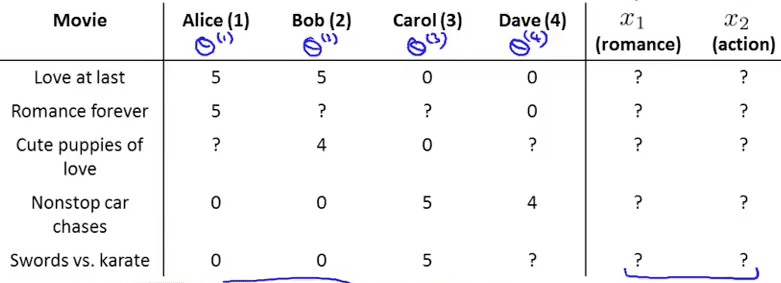
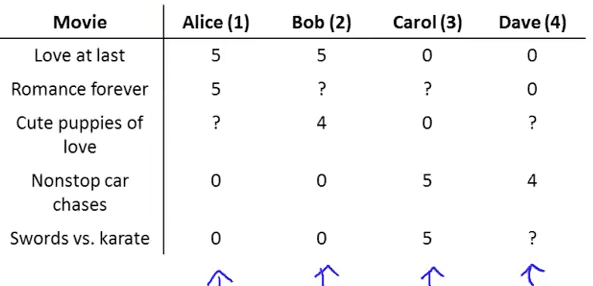

<h1 style="color: #ccc">Machine Learning 16</h1>

# Recommender Systems

*Dec 4, 2016*

## Predicting Movie Ratings

### Problem Formulation

1. Predicting movie ratings

   User rates movies using zero to five stars

   * $ { n }_{ u } $ = no. users
   * $ { n }_{ m } $ = no. movies
   * $ r\left( i,j \right) $ = 1 if user $ j $ has rated movie $ i $
   * $ { y }^{ \left( i,j \right)  } $ = rating given by user $ j $ to movie $ i $ (defined only if $ \left( i,j \right)=1 $)

### Content Based Recommendations

1. Content-based recommender systems

   For each user $ j $, learn a parameter $ { \theta  }^{ \left( j \right)  }\in { R }^{ 3 } $. Predict user $ j $ as rating movie $ i $ with $ { \left( { \theta  }^{ \left( j \right)  } \right)  }^{ \top  }\left( { x }^{ \left( i \right)  } \right) $ stars.

   

2. Problem formulation

   * $ r\left( i,j \right) $ = 1 if user $ j $ has rated movie $ i $ (0 otherwise)
   * $ { y }^{ \left( i,j \right)  } $ = rating by user $ j $ to movie $ i $ (if defined)
   * $ { \theta  }^{ \left( j \right)  } $ = parameter vector for user $ i $
   * $ { x }^{ \left( i \right)  } $ = feature vector for movie $ i $
   * $ { m }^{ \left( j \right)  } $ = no. of movies rated by user $ j $

   For user $ j $, movie $ i $, predicted rating: $ { \left( { \theta  }^{ \left( j \right)  } \right)  }^{ \top  }\left( { x }^{ \left( i \right)  } \right) $

   To learn $ { \theta  }^{ \left( j \right)  } $:

   $$ \min _{ { \theta  }^{ \left( j \right)  } }{ \frac { 1 }{ 2{ m }^{ \left( j \right)  } }  } \sum _{ i:r\left( i,j \right) =1 }^{  }{ { \left( { \left( { \theta  }^{ \left( i \right)  } \right)  }^{ \top  }\left( { x }^{ \left( i \right)  } \right) -{ y }^{ \left( i,j \right)  } \right)  }^{ 2 } } +\frac { \lambda  }{ 2{ m }^{ \left( j \right)  } } \sum _{ k=1 }^{ n }{ { \left( { \theta  }_{ k }^{ \left( j \right)  } \right)  }^{ 2 } } $$

3. Optimization objective

   To learn $ { \theta  }^{ \left( j \right)  } $ (parameter for user $ j $):

   $$ \min _{ { \theta  }^{ \left( j \right)  } }{ \frac { 1 }{ 2 } \sum _{ i:r\left( i,j \right) =1 }^{  }{ { \left( { \left( { \theta  }^{ \left( j \right)  } \right)  }^{ \top  }{ x }^{ \left( i \right)  }-{ y }^{ \left( i,j \right)  } \right)  }^{ 2 } } +\frac { \lambda  }{ 2 } \sum _{ k=1 }^{ n }{ { \left( { \theta  }_{ k }^{ \left( j \right)  } \right)  }^{ 2 } }  } $$

   To learn $ { \theta  }^{ \left( 1 \right)  },{ \theta  }^{ \left( 2 \right)  },\cdots ,{ \theta  }^{ \left( { n }_{ u } \right)  } $:

   $$ J\left( { \theta  }^{ \left( 1 \right)  },\cdots ,{ \theta  }^{ \left( { n }_{ u } \right)  } \right) =\frac { 1 }{ 2 } \sum _{ j=1 }^{ { n }_{ u } }{ \sum _{ i:r\left( i,j \right) =1 }^{  }{ { \left( { \left( { \theta  }^{ \left( j \right)  } \right)  }^{ \top  }{ x }^{ \left( i \right)  }-{ y }^{ \left( i,j \right)  } \right)  }^{ 2 } }  } +\frac { \lambda  }{ 2 } \sum _{ j=1 }^{ { n }_{ u } }{ \sum _{ k=1 }^{ n }{ { \left( { \theta  }_{ k }^{ \left( j \right)  } \right)  }^{ 2 } }  }  $$

   $$ \min _{ { \theta  }^{ \left( 1 \right)  },\cdots ,{ \theta  }^{ \left( { n }_{ u } \right)  } }{ J\left( { \theta  }^{ \left( 1 \right)  },\cdots ,{ \theta  }^{ \left( { n }_{ u } \right)  } \right)  }  $$

   Gradient descent update:

   $$ \frac { \partial  }{ \partial { \theta  }_{ k }^{ \left( j \right)  } } J\left( { \theta  }^{ \left( 1 \right)  },\cdots ,{ \theta  }^{ \left( { n }_{ u } \right)  } \right) =\begin{cases} \sum _{ i:r\left( i,j \right) =1 }^{  }{ \left( { \left( { \theta  }^{ \left( j \right)  } \right)  }^{ \top  }{ x }^{ \left( i \right)  }-{ y }^{ \left( i,j \right)  } \right) { x }_{ k }^{ \left( i \right)  } }  & \text{for }k=0 \\ \sum _{ i:r\left( i,j \right) =1 }^{  }{ \left( { \left( { \theta  }^{ \left( j \right)  } \right)  }^{ \top  }{ x }^{ \left( i \right)  }-{ y }^{ \left( i,j \right)  } \right) { x }_{ k }^{ \left( i \right)  } } +\lambda { \theta  }_{ k }^{ \left( j \right)  } & \text{for }k\neq 0 \end{cases} $$

   $$ { \theta  }_{ k }^{ \left( j \right)  }:={ \theta  }_{ k }^{ \left( j \right)  }-\alpha \frac { \partial  }{ \partial { \theta  }_{ k }^{ \left( j \right)  } } J\left( { \theta  }^{ \left( 1 \right)  },\cdots ,{ \theta  }^{ \left( { n }_{ u } \right)  } \right) $$

## Collaborative Filtering

### Collaborative Filtering

1. Most of the time features $ { x }^{ \left( i \right)  } $ is not available

   

2. Optimization algorithm

   Given $ { \theta  }^{ \left( 1 \right)  },\cdots ,{ \theta  }^{ \left( { n }_{ u } \right)  } $, to learn $ { x }^{ \left( i \right)  } $:

   $$ \min _{ { x }^{ \left( i \right)  } }{ \frac { 1 }{ 2 } \sum _{ j:r\left( i,j \right) =1 }^{  }{ { \left( { \left( { \theta  }^{ \left( j \right)  } \right)  }^{ \top  }{ x }^{ \left( i \right)  }-{ y }^{ \left( i,j \right)  } \right)  }^{ 2 } } +\frac { \lambda  }{ 2 } \sum _{ k=1 }^{ n }{ { \left( { x }_{ k }^{ \left( i \right)  } \right)  }^{ 2 } }  } $$

   Given $ { \theta  }^{ \left( 1 \right)  },\cdots ,{ \theta  }^{ \left( { n }_{ u } \right)  } $, to learn $ { x }^{ \left( 1 \right)  },\cdots ,{ x }^{ \left( { n }_{ m } \right)  } $:

   $$ \min _{ { x }^{ \left( 1 \right)  },\cdots ,{ x }^{ \left( { n }_{ m } \right)  } }{ \frac { 1 }{ 2 } \sum _{ i=1 }^{ { n }_{ m } }{ \sum _{ j:r\left( i,j \right) =1 }^{  }{ { \left( { \left( { \theta  }^{ \left( j \right)  } \right)  }^{ \top  }{ x }^{ \left( i \right)  }-{ y }^{ \left( i,j \right)  } \right)  }^{ 2 } }  } +\frac { \lambda  }{ 2 } \sum _{ i=1 }^{ { n }_{ m } }{ \sum _{ k=1 }^{ n }{ { \left( { x }_{ k }^{ \left( i \right)  } \right)  }^{ 2 } }  }  }  $$

3. Collaborative filtering

   Given $ { x }^{ \left( 1 \right)  },\cdots ,{ x }^{ \left( { n }_{ m } \right)  } $ (and movie ratings), can estimate $ { \theta  }^{ \left( 1 \right)  },\cdots ,{ \theta  }^{ \left( { n }_{ u } \right)  } $

   Given $ { \theta  }^{ \left( 1 \right)  },\cdots ,{ \theta  }^{ \left( { n }_{ u } \right)  } $, can estimate $ { x }^{ \left( 1 \right)  },\cdots ,{ x }^{ \left( { n }_{ m } \right)  } $

   Random $ \theta \xrightarrow {  } x\xrightarrow {  } \theta \xrightarrow {  } x\xrightarrow {  } \theta \xrightarrow {  } x\xrightarrow {  } \cdots  $

### Collaborative Filtering Algorithm

1. Collaborative filtering optimization objective

   Minimizing $ { x }^{ \left( 1 \right)  },\cdots ,{ x }^{ \left( { n }_{ m } \right)  } $ and $ { \theta  }^{ \left( 1 \right)  },\cdots ,{ \theta  }^{ \left( { n }_{ u } \right)  } $ simultaneously:

   $ J\left( { x }^{ \left( 1 \right)  },\cdots { x }^{ \left( { n }_{ m } \right)  },{ \theta  }^{ \left( 1 \right)  },\cdots ,{ \theta  }^{ \left( { n }_{ u } \right)  } \right) $

   $= \frac { 1 }{ 2 } \sum _{ \left( i,j \right) :r\left( i,j \right) =1 }^{  }{ { \left( { \left( { \theta  }^{ \left( j \right)  } \right)  }^{ \top  }{ x }^{ \left( i \right)  }-{ y }^{ \left( i,j \right)  } \right)  }^{ 2 } } +\frac { \lambda  }{ 2 } \sum _{ i=1 }^{ { n }_{ m } }{ \sum _{ k=1 }^{ n }{ { \left( { x }_{ k }^{ \left( i \right)  } \right)  }^{ 2 } }  } +\frac { \lambda  }{ 2 } \sum _{ j=1 }^{ { n }_{ u } }{ \sum _{ k=1 }^{ n }{ { \left( { \theta  }_{ k }^{ \left( i \right)  } \right)  }^{ 2 } }  } $

   $$ \min _{ { x }^{ \left( 1 \right)  },\cdots { x }^{ \left( { n }_{ m } \right)  },{ \theta  }^{ \left( 1 \right)  },\cdots ,{ \theta  }^{ \left( { n }_{ u } \right)  } }{ J\left( { x }^{ \left( 1 \right)  },\cdots { x }^{ \left( { n }_{ m } \right)  },{ \theta  }^{ \left( 1 \right)  },\cdots ,{ \theta  }^{ \left( { n }_{ u } \right)  } \right)  }  $$

2. Collaborative filtering algorithm

   * Initialize $ { x }^{ \left( 1 \right)  },\cdots { x }^{ \left( { n }_{ m } \right)  },{ \theta  }^{ \left( 1 \right)  },\cdots ,{ \theta  }^{ \left( { n }_{ u } \right)  } $ to small random values
   * Minimize $ J\left( { x }^{ \left( 1 \right)  },\cdots { x }^{ \left( { n }_{ m } \right)  },{ \theta  }^{ \left( 1 \right)  },\cdots ,{ \theta  }^{ \left( { n }_{ u } \right)  } \right)  $ using gradient descent (or an advanced optimization algorithm). E.g. for every $ j=1,\cdots ,{ n }_{ u },i=1,\cdots { n }_{ m } $:

   $$ { x }_{ k }^{ \left( i \right)  }:={ x }_{ k }^{ \left( i \right)  }-\alpha \left( \sum _{ j:r\left( i,j \right) =1 }^{  }{ \left( { \left( { \theta  }^{ \left( i \right)  } \right)  }^{ \top  }{ x }^{ \left( i \right)  }-{ y }^{ \left( i,j \right)  } \right) { \theta  }_{ k }^{ \left( i \right)  } } +\lambda { x }_{ k }^{ \left( i \right)  } \right)  $$

   $$ { \theta  }_{ k }^{ \left( j \right)  }:={ \theta  }_{ k }^{ \left( j \right)  }-\alpha \left( \sum _{ i:r\left( i,j \right) =1 }^{  }{ \left( { \left( { \theta  }^{ \left( j \right)  } \right)  }^{ \top  }{ x }^{ \left( i \right)  }-{ y }^{ \left( i,j \right)  } \right) { x }_{ k }^{ \left( i \right)  } } +\lambda { \theta  }_{ k }^{ \left( j \right)  } \right)  $$

   * For a user with parameters $ \theta $ and a movie with (learned) features $ x $, predict a star rating of $ { \theta  }^{ \top  }x $

## Low Rank Matrix Factorization

### Vectorization: Low Rank Matrix Factorization

1. Low rank matrix factorization

   

   $$ Y=\begin{bmatrix} 5 & 5 & 0 & 0 \\ 5 & ? & ? & 0 \\ ? & 4 & 0 & ? \\ 0 & 0 & 5 & 4 \\ 0 & 0 & 5 & 0 \end{bmatrix} $$

   Predicted ratings:

   $$ X=\begin{bmatrix} { \left( { x }^{ \left( 1 \right)  } \right)  }^{ \top  } \\ { \left( { x }^{ \left( 2 \right)  } \right)  }^{ \top  } \\ \vdots  \\ { \left( { x }^{ \left( { n }_{ m } \right)  } \right)  }^{ \top  } \end{bmatrix},\Theta =\begin{bmatrix} { \left( { \theta  }^{ \left( 1 \right)  } \right)  }^{ \top  } \\ { \left( { \theta  }^{ \left( 2 \right)  } \right)  }^{ \top  } \\ \vdots  \\ { \left( { \theta  }^{ \left( { n }_{ u } \right)  } \right)  }^{ \top  } \end{bmatrix} $$

   $$ X{ \Theta  }^{ \top  }=\begin{bmatrix} { \left( { \theta  }^{ \left( 1 \right)  } \right)  }^{ \top  }\left( { x }^{ \left( 1 \right)  } \right)  & { \left( { \theta  }^{ \left( 2 \right)  } \right)  }^{ \top  }\left( { x }^{ \left( 1 \right)  } \right)  & \cdots  & { \left( { \theta  }^{ \left( { n }_{ u } \right)  } \right)  }^{ \top  }\left( { x }^{ \left( 1 \right)  } \right)  \\ { \left( { \theta  }^{ \left( 1 \right)  } \right)  }^{ \top  }\left( { x }^{ \left( 2 \right)  } \right)  & { \left( { \theta  }^{ \left( 2 \right)  } \right)  }^{ \top  }\left( { x }^{ \left( 1 \right)  } \right)  & \cdots  & { \left( { \theta  }^{ \left( { n }_{ u } \right)  } \right)  }^{ \top  }\left( { x }^{ \left( 2 \right)  } \right)  \\ \vdots  & \vdots  & \ddots  & \vdots  \\ { \left( { \theta  }^{ \left( 1 \right)  } \right)  }^{ \top  }\left( { x }^{ \left( { n }_{ m } \right)  } \right)  & { \left( { \theta  }^{ \left( 2 \right)  } \right)  }^{ \top  }\left( { x }^{ \left( { n }_{ m } \right)  } \right)  & \cdots  & { \left( { \theta  }^{ \left( { n }_{ u } \right)  } \right)  }^{ \top  }\left( { x }^{ \left( { n }_{ m } \right)  } \right)  \end{bmatrix} $$

2. Finding related movies

   For each product $ i $, we learn a feature vector $ { x }^{ \left( i \right)  }\in { \mathbb{R} }^{ n } $

   * $ { x }_{ 1 } $ = romance
   * $ { x }_{ 2 } $ = action
   * $ { x }_{ 3 } $ = comedy

   How to find movies $ j $ related to movie $ i $?

   Small $ \left\| { x }^{ \left( i \right)  }-{ x }^{ \left( j \right)  } \right\| \xrightarrow {  }  $ movies $ j $ and $ i $ are "similar"

   5 most similar movies to movie $ i $:

   Find the 5 movies $ j $ with the smallest $ \left\| { x }^{ \left( i \right)  }-{ x }^{ \left( j \right)  } \right\| $

### Implementation Detail: Mean Normalization

1. Users who have not rated any movies

   Mean Normalization:

   $$ Y=\begin{bmatrix} 5 & 5 & 0 & 0 & ? \\ 5 & ? & ? & 0 & ? \\ ? & 4 & 0 & ? & ? \\ 0 & 0 & 5 & 4 & ? \\ 0 & 0 & 5 & 0 & ? \end{bmatrix},\mu =\begin{bmatrix} 2.5 \\ 2.5 \\ 2 \\ 2.25 \\ 1.25 \end{bmatrix}\xrightarrow {  } Y=\begin{bmatrix} 2.5 & 2.5 & -2.5 & -2.5 & ? \\ 2.5 & ? & ? & -2.5 & ? \\ ? & 2 & -2 & ? & ? \\ -2.25 & -2.25 & 2.75 & 1.75 & ? \\ -1.25 & -1.25 & 3.75 & -1.25 & ? \end{bmatrix} $$

   Learn $ { \theta  }^{ \left( j \right)  } $ and $ { x }^{ \left( i \right)  } $ from the new mean normalized matrix $ Y $

   For user $ j $, on movie $ i $ predict $ { \left( { \theta  }^{ \left( j \right)  } \right)  }^{ \top  }\left( { x }^{ \left( i \right)  } \right) +{ \mu  }_{ i } $ stars
