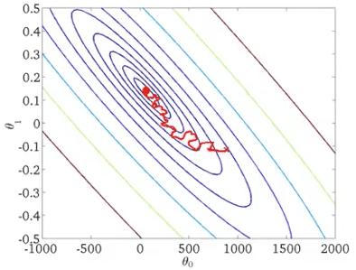
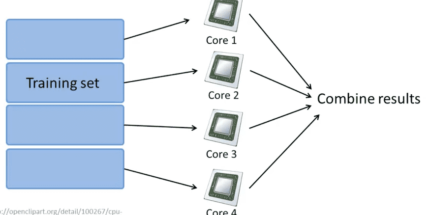

<h1 style="color: #ccc">Machine Learning 17</h1>

# Large Scale Machine Learning

*Dec 11, 2016*

## Gradient Descent with Large Datasets

### Learning with Large Datasets

1. Machine learning and data

   It's not who has the best algorithm that wins. It's who has the most data.

   

   * High variance -> add more training examples
   * High bias -> add more hidden layers

### Stochastic Gradient Descent

1. Linear regression with gradient descent

   $$ { h }_{ \theta  }\left( x \right) =\sum _{ j=0 }^{ n }{ { \theta  }_{ j }{ x }_{ j } } $$

   $$ J\left( \theta  \right) =\frac { 1 }{ 2m } \sum _{ i=1 }^{ m }{ { \left( { h }_{ \theta  }\left( { x }^{ \left( i \right)  } \right) -{ y }^{ \left( i \right)  } \right)  }^{ 2 } } $$

   ```
   repeat until convergence {
       simultaneously for j in 0..n {
   ```

   $$ { \theta  }_{ j }:={ \theta  }_{ j }-\alpha \frac { 1 }{ m } \sum _{ i=1 }^{ m }{ \left( { h }_{ \theta  }\left( { x }^{ \left( i \right)  } \right) -{ y }^{ \left( i \right)  } \right) { x }_{ j }^{ \left( i \right)  } } $$

   ```
       }
   }
   ```

   * This particular version of gradient descent is also called Batch Gradient Descent

2. Stochastic gradient descent

   $$ cost\left( \theta ,\left( { x }^{ \left( i \right)  },{ y }^{ \left( i \right)  } \right)  \right) =\frac { 1 }{ 2 } { \left( { h }_{ \theta  }\left( { x }^{ \left( i \right)  } \right) -{ y }^{ \left( i \right)  } \right)  }^{ 2 } $$

   $$ J\left( \theta  \right) =\frac { 1 }{ m } \sum _{ i=1 }^{ m }{ cost\left( \theta ,\left( { x }^{ \left( i \right)  },{ y }^{ \left( i \right)  } \right)  \right)  } $$


   Randomly shuffle (reorder) training examples

   ```
   repeat 1 to 10 times {
       for i in 1..m {
           simultaneously for j in 0..n {
   ```

   $$ { \theta  }_{ j }:={ \theta  }_{ j }-\alpha \left( { h }_{ \theta  }\left( { x }^{ \left( i \right)  } \right) -{ y }^{ \left( i \right)  } \right) { x }_{ j }^{ \left( i \right)  } $$

   ```
           }
       }
   }
   ```

   

### Mini-Batch Gradient Descent

1. Mini-batch gradient descent

   Batch gradient descent: Use all $ m $ examples in each iteration

   Stochastic gradient descent: Use 1 example in each iteration

   Mini-batch gradient descent: Use $ b $ examples in each iteration

   b $=\text{mini-batch size (2-100)}$

   Get $ m=1000,b=10 $ examples $ \left( { x }^{ \left( i \right)  },{ y }^{ \left( i \right)  } \right) ,\cdots ,\left( { x }^{ \left( i+9 \right)  },{ y }^{ \left( i+9 \right)  } \right) $

   ```
   repeat 1 to 10 times {
       for i in 1..(m / b) {
           simultaneously for j in 0..n {
   ```

   $$ { \theta  }_{ j }:={ \theta  }_{ j }-\alpha \frac { 1 }{ b } \sum _{ k=b(i-1)+1 }^{ bi }{ \left( { h }_{ \theta  }\left( { x }^{ \left( k \right)  } \right) -{ y }^{ \left( k \right)  } \right) { x }_{ j }^{ \left( k \right)  } } $$

   ```
           }
       }
   }
   ```

2. Mini-batch gradient descent is likely to outperform Stochastic gradient descent only if you have a good vectorized implementation.

### Stochastic Gradient Descent Convergence

1. Batch gradient descent

   Plot $ J\left( \theta  \right) $ as a function of the number of iterations of gradient descent.

   $$ J\left( \theta  \right) =\frac { 1 }{ 2m } \sum _{ i=1 }^{ m }{ { \left( { h }_{ \theta  }\left( { x }^{ \left( i \right)  } \right) -{ y }^{ \left( i \right)  } \right)  }^{ 2 } } $$

2. Stochastic gradient descent

   $$ cost\left( \theta ,\left( { x }^{ \left( i \right)  },{ y }^{ \left( i \right)  } \right)  \right) =\frac { 1 }{ 2 } { \left( { h }_{ \theta  }\left( { x }^{ \left( i \right)  } \right) -{ y }^{ \left( i \right)  } \right)  }^{ 2 } $$

   During learning, compute $ cost\left( \theta ,\left( { x }^{ \left( i \right)  },{ y }^{ \left( i \right)  } \right)  \right) $ before updating $ \theta $ using $ \left( { x }^{ \left( i \right)  },{ y }^{ \left( i \right)  } \right) $.

   Every 1000 iterations (say), plot $ cost\left( \theta ,\left( { x }^{ \left( i \right)  },{ y }^{ \left( i \right)  } \right)  \right)  $ averaged over the last 1000 examples processed by algorithm.

   * Smaller learning rate may end up with smaller oscillations.
   * Bigger averaging size (say 5000) may end up with smoother curve, but the feedback you get on how well your learning algorithm is more delayed.
   * If the curve is not converging, either need to change the learning rate, change the features or change something else about the algorithm.
   * If the curve is diverging, use a smaller $ \alpha $.

   

3. Decreasing learning rate

   Learning rate $ \alpha $ is typically held constant. Can slowly decrease $ \alpha $ over time if we want $ \theta $ to converge.

   $$ \alpha =\frac { \text{const1} }{ \text{iterationNumber}+\text{const2} } $$

   

## Advanced Topics

### Online Learning

1. Shipping service

   Shipping service website where user comes, specifies origin and destination, you offer to ship their packages for some asking price, and users sometimes choose to use your shipping service ($ y=1 $), sometimes not ($ y=0 $).

   Features $ x $ capture properties of user, of origin / destination and asking price. We want to learn to optimize price.

   $$ p\left( y=1|x;\theta  \right) $$

   ```
   repeat forever {
   ```

   Get $ \left( x,y \right) $ corresponding to user.

   Update $ \theta $ using $ \left( x,y \right) $:

   ```
       simultaneously for j in 0..n {
   ```

   $$ { \theta  }_{ j }:={ \theta  }_{ j }-\alpha \left( h\left( x \right) -y \right) { x }_{ j } $$

   ```
       }
   }
   ```

2. Product search (learning to search)

   User searches for "Android phone 1080p camera".

   Have 100 phones in store. Will return 10 results.

   $ x $ = features of phone, how many words in user query match name of phone, how many words in query match description of phone, etc.

   $ y=1 $ if user clicks on link. $ y=0 $ otherwise. Learn predicted CTR (click through rate)

   $$ p\left( y=1|x;\theta  \right) $$

### Map Reduce and Data Parallelism

1. Map-reduce

   Batch gradient descent

   $$ { \theta  }_{ j }:={ \theta  }_{ j }-\alpha \frac { 1 }{ 400 } \sum _{ t=1 }^{ 400 }{ \left( { h }_{ \theta  }\left( { x }^{ \left( i \right)  } \right) -{ y }^{ \left( i \right)  } \right) { x }_{ j }^{ \left( i \right)  } } $$

   Machine 1: Use $ \left( { x }^{ \left( 1 \right)  },{ y }^{ \left( 1 \right)  } \right) ,\cdots ,\left( { x }^{ \left( 100 \right)  },{ y }^{ \left( 100 \right)  } \right) $

   $$ { temp }_{ j }^{ \left( 1 \right)  }=\sum _{ i=1 }^{ 100 }{ \left( { h }_{ \theta  }\left( { x }^{ \left( i \right)  } \right) -{ y }^{ \left( i \right)  } \right) { x }_{ j }^{ \left( i \right)  } } $$

   Machine 2: Use $ \left( { x }^{ \left( 101 \right)  },{ y }^{ \left( 101 \right)  } \right) ,\cdots ,\left( { x }^{ \left( 200 \right)  },{ y }^{ \left( 200 \right)  } \right) $

   $$ { temp }_{ j }^{ \left( 2 \right)  }=\sum _{ i=101 }^{ 200 }{ \left( { h }_{ \theta  }\left( { x }^{ \left( i \right)  } \right) -{ y }^{ \left( i \right)  } \right) { x }_{ j }^{ \left( i \right)  } } $$

   Machine 3: Use $ \left( { x }^{ \left( 201 \right)  },{ y }^{ \left( 201 \right)  } \right) ,\cdots ,\left( { x }^{ \left( 300 \right)  },{ y }^{ \left( 300 \right)  } \right) $

   $$ { temp }_{ j }^{ \left( 3 \right)  }=\sum _{ i=201 }^{ 300 }{ \left( { h }_{ \theta  }\left( { x }^{ \left( i \right)  } \right) -{ y }^{ \left( i \right)  } \right) { x }_{ j }^{ \left( i \right)  } } $$

   Machine 4: Use $ \left( { x }^{ \left( 301 \right)  },{ y }^{ \left( 301 \right)  } \right) ,\cdots ,\left( { x }^{ \left( 400 \right)  },{ y }^{ \left( 400 \right)  } \right) $

   $$ { temp }_{ j }^{ \left( 4 \right)  }=\sum _{ i=301 }^{ 400 }{ \left( { h }_{ \theta  }\left( { x }^{ \left( i \right)  } \right) -{ y }^{ \left( i \right)  } \right) { x }_{ j }^{ \left( i \right)  } } $$

   ```
   repeat until convergence {
       simultaneously for j in 0..n {
   ```

   $$ { \theta  }_{ j }:={ \theta  }_{ j }-\alpha \frac { 1 }{ 400 } \left( { temp }_{ j }^{ \left( 1 \right)  }+{ { temp } }_{ j }^{ \left( 2 \right)  }+{ { temp } }_{ j }^{ \left( 3 \right)  }+{ { temp } }_{ j }^{ \left( 4 \right)  } \right) $$

   ```
       }
   }
   ```

   

2. Map-reduce and summation over the training set

   Many learning algorithms can be expressed as computing sums of functions over the training set.

   E.g. for advanced optimization, with logistic regression, need:

   $$ J\left( \theta  \right) =-\frac { 1 }{ m } \sum _{ i=1 }^{ m }{ { y }^{ \left( i \right)  }\log { { h }_{ \theta  }\left( { x }^{ \left( i \right)  } \right)  } -\left( 1-{ y }^{ \left( i \right)  } \right) \log { \left( 1-{ h }_{ \theta  }\left( { x }^{ \left( i \right)  } \right)  \right)  }  } $$

   $$ \frac { \partial  }{ \partial { \theta  }_{ j } } J\left( \theta  \right) =\frac { 1 }{ m } \sum _{ i=1 }^{ m }{ \left( { h }_{ \theta  }\left( { x }^{ \left( i \right)  } \right) -{ y }^{ \left( i \right)  } \right) { x }_{ j }^{ \left( i \right)  } } $$

3. Multi-core machines

   
