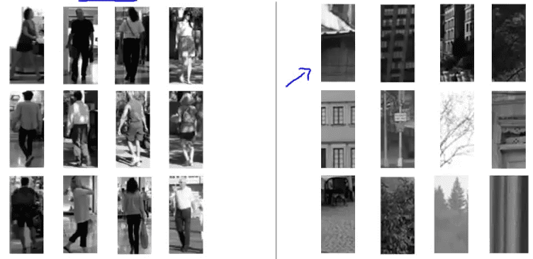
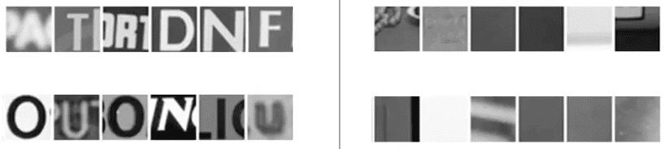

<h1 style="color: #ccc">Machine Learning 17</h1>

# Application Example: Photo OCR

*Dec 18, 2016*

## Photo OCR

### Problem Description and Pipeline

1. Photo ORC (Optical Character Recognition) pipeline

   * Text detection
   * Character segmentation
   * Character classification

   Optional

   * Spelling correction

### Sliding Windows

1. Pedestrian detection

   Pedestrian detection has the same aspect ratio.

   Supervised learning for pedestrian detection:

   $ x $ = pixels in $ 82\times 36 $ image patches

   * Positive examples ($ y=1 $)
   * Negative examples ($ y=0 $)

   

2. Sliding window detection

   * Slide the image patch by a small step size or stride
   * Repeat the sliding window with progressively larger image patch, but with the same aspect ratio so that can resize the larger image patch to $ 82\times 36 $

   

3. Text detection

   * Positive examples ($ y=1 $)
   * Negative examples ($ y=0 $)

   

4. Sliding window text detection

   

5. 1D Sliding window for character segmentation

   Detect split between characters

   

6. Put all together

   

### Getting Lots of Data and Artificial Data

1. Artificial data synthesis

   Character recognition

   Synthesizing data for photo OCR using existing fonts

   

   

2. Synthesizing data by introducing distortions

   

   Speech recognition

   * Original audio
   * Audio on bad cellphone connection
   * Noisy background: Crowd
   * Noisy background: Machinery

   Distortion introduced should be representation of the type of noise / distortions in the test set (Audio: background noise, bad cellphone connection)

   

   Usually does not help to add purely random / meaningless noise to your data

   $$ { x }_{ i }=\text{intensity (brightness) of pixel }i $$

   $$ { x }_{ i }\xleftarrow {  } { x }_{ i }+\text{random noise} $$

   

3. Discussion on getting more data

   Make sure you have low bias classifier before expanding the effort. (Plot learning curves). E.g. keep increasing the number of features / number of hidden units in neural network until you have a low bias classifier.

   How much work would it be to get 10x as much data as we currently have?

   * Artificial data synthesis
   * Collect / label it yourself
   * Crowd source (E.g. Amazon Mechanical Turk)

### Ceiling Analysis: What Part of the Pipeline to Work on Next

1. Estimating the error due to each component (ceiling analysis)

   

2. Face recognition from images (artificial example)

   

## Summary

1. Supervised Learning

   * Linear regression, logistic regression, neural network, SVMs

2. Unsupervised Learning

   * K-means, PCA, Anomaly detection

3. Special applications / special topics

   * Recommender systems, large scale machine learning

4. Advice on building a machine learning system

   * Bias / variance, regularization, deciding what to work on next, evaluation of learning algorithms, learning curves, error analysis, ceiling analysis
