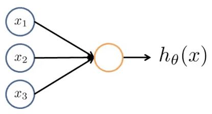
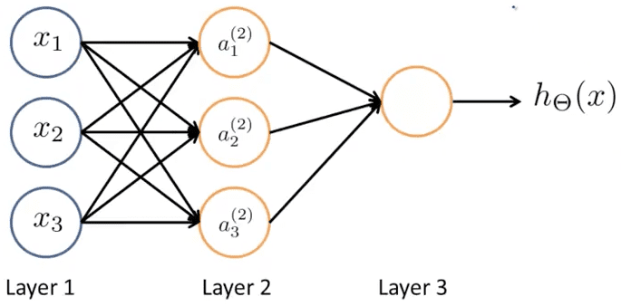

<h1 style="color: #ccc">Machine Learning 8</h1>

# Neural Networks: Representation

*Oct 30, 2016*

## Motivation

### Non-linear Hypotheses

1. Non-linear Classification

   Asymptotically, the number of quadratic features grows roughly as order of n square $ \approx \frac { { n }^{ 2 } }{ 2 } $

### Neurons and the Brain

1. Origins

   Algorithms that try to mimic the brain. Was very widely used in 80s and early 90s; popularity diminished in late 90s.

2. Recent Resurgence

   State-of-the-art technique for many applications.

3. The "one learning algorithm" hypothesis

   * Auditory cortex learns to see
   * Somatosensory cortex learns to touch

   To a surprisingly large extent, it seems as if we can plug in almost any sensor to almost any part of the brain and so, within the reason, the brain will learn to deal with it.

## Neural Networks

### Model Representation

1. Neuron in the brain

   Neural networks were developed as simulating neurons or networks of neurons in the brain. The neuron has a cell body. The neuron has a number of input wires, and these are called the dendrites. The neuron also has an output wire called an Axon, and this output wire is what it uses to send signals to other neurons. A neuron is a computational unit that gets a number of inputs through its input wires and does some computation and then it sends outputs via its axon to other nodes or to other neurons in the brain.

2. Single Neuron

   Logistic Unit: An artificial neuron with a Sigmoid or logistic activation function

   

   * bias unit: $ { x }_{ 0 }=1 $
   * weights: $ \theta =\begin{bmatrix} { \theta  }_{ 0 } \\ { \theta  }_{ 1 } \\ { \theta  }_{ 2 } \end{bmatrix} $

3. Neural Network

   

   * Layer 1 = Input Layer
   * Layer 2 = Hidden Layer
   * $ { a }_{ i }^{ (j) } $ = "activation" of unit $ i $ in layer $ j $
   * $ { \Theta  }^{ (j) } $ = matrix of weights controlling function mapping from layer $ j $ to layer $ j+1 $

   $$ { a }_{ 1 }^{ \left( 2 \right)  }=g\left( { z }_{ 1 }^{ \left( 2 \right)  } \right)=g\left( { \Theta  }_{ 10 }^{ \left( 1 \right)  }{ x }_{ 0 }+{ \Theta  }_{ 11 }^{ \left( 1 \right)  }{ x }_{ 1 }+{ \Theta  }_{ 12 }^{ \left( 1 \right)  }{ x }_{ 2 }+{ \Theta  }_{ 13 }^{ \left( 1 \right)  }{ x }_{ 3 } \right) $$

   $$ { a }_{ 2 }^{ \left( 2 \right)  }=g\left( { z }_{ 2 }^{ \left( 2 \right)  } \right)=g\left( { \Theta  }_{ 20 }^{ \left( 1 \right)  }{ x }_{ 0 }+{ \Theta  }_{ 21 }^{ \left( 1 \right)  }{ x }_{ 1 }+{ \Theta  }_{ 22 }^{ \left( 1 \right)  }{ x }_{ 2 }+{ \Theta  }_{ 23 }^{ \left( 1 \right)  }{ x }_{ 3 } \right) $$

   $$ { a }_{ 3 }^{ \left( 2 \right)  }=g\left( { z }_{ 3 }^{ \left( 2 \right)  } \right)=g\left( { \Theta  }_{ 30 }^{ \left( 1 \right)  }{ x }_{ 0 }+{ \Theta  }_{ 31 }^{ \left( 1 \right)  }{ x }_{ 1 }+{ \Theta  }_{ 32 }^{ \left( 1 \right)  }{ x }_{ 2 }+{ \Theta  }_{ 33 }^{ \left( 1 \right)  }{ x }_{ 3 } \right) $$

   $$ { h }_{ \Theta  }\left( x \right)={ a }_{ 1 }^{ \left( 3 \right)  }=g\left( { z }_{ 1 }^{ \left( 3 \right)  } \right)=g\left( { \Theta  }_{ 10 }^{ \left( 2 \right)  }{ a }_{ 0 }^{ \left( 2 \right)  }+{ \Theta  }_{ 11 }^{ \left( 2 \right)  }{ a }_{ 1 }^{ \left( 2 \right)  }+{ \Theta  }_{ 12 }^{ \left( 2 \right)  }{ a }_{ 2 }^{ \left( 2 \right)  }+{ \Theta  }_{ 13 }^{ \left( 2 \right)  }{ a }_{ 3 }^{ \left( 2 \right)  } \right) $$

   If network has $ { s }_{ j } $ units in layer $ j $, $ { s }_{ j+1 } $ units in layer $ j+1 $, then $ { \Theta }^{ \left( j \right) } $ will be of dimension $ { s }_{ j+1 }\times \left( { s }_{ j }+1 \right) $.

4. Vectorized Implementation

   $$ { \Theta  }^{ \left( 1 \right)  }=\begin{bmatrix} { \Theta  }_{ 10 }^{ \left( 1 \right)  } & { \Theta  }_{ 11 }^{ \left( 1 \right)  } & { \Theta  }_{ 12 }^{ \left( 1 \right)  } & { \Theta  }_{ 13 }^{ \left( 1 \right)  } \\ { \Theta  }_{ 20 }^{ \left( 1 \right)  } & { \Theta  }_{ 21 }^{ \left( 1 \right)  } & { \Theta  }_{ 22 }^{ \left( 1 \right)  } & { \Theta  }_{ 23 }^{ \left( 1 \right)  } \\ { \Theta  }_{ 30 }^{ \left( 1 \right)  } & { \Theta  }_{ 31 }^{ \left( 1 \right)  } & { \Theta  }_{ 32 }^{ \left( 1 \right)  } & { \Theta  }_{ 33 }^{ \left( 1 \right)  } \end{bmatrix}\quad x=\begin{bmatrix} { x }_{ 0 } \\ { x }_{ 1 } \\ { x }_{ 2 } \\ { x }_{ 3 } \end{bmatrix}=\begin{bmatrix} { a }_{ 0 }^{ \left( 1 \right)  } \\ { a }_{ 1 }^{ \left( 1 \right)  } \\ { a }_{ 2 }^{ \left( 1 \right)  } \\ { a }_{ 3 }^{ \left( 1 \right)  } \end{bmatrix}={ a }^{ \left( 1 \right)  }\quad { z }^{ \left( 2 \right)  }=\begin{bmatrix} { z }_{ 1 }^{ \left( 2 \right)  } \\ { z }_{ 2 }^{ \left( 2 \right)  } \\ { z }_{ 3 }^{ \left( 2 \right)  } \end{bmatrix} $$

   $$ { z }^{ \left( 2 \right)  }={ \Theta  }^{ \left( 1 \right)  }x={ \Theta  }^{ \left( 1 \right)  }{ a }^{ \left( 1 \right)  } $$

   $$ { a }^{ \left( 2 \right)  }=g\left( { z }^{ \left( 2 \right)  } \right) $$

   $$ Add\quad { a }_{ 0 }^{ \left( 2 \right)  }=1 $$

   $$ { z }^{ \left( 3 \right)  }={ \Theta  }^{ \left( 2 \right)  }{ a }^{ \left( 2 \right)  } $$

   $$ { h }_{ \Theta  }\left( x \right) ={ a }^{ \left( 3 \right)  }=g\left( { z }^{ \left( 3 \right)  } \right) $$

   This process of computing $ { h }_{ \Theta  }\left( x \right) $ is also called forward propagation.

## Applications

### Applications

1. Neural network with logistic function can be used to built the following logical functions:

   * AND
   * OR
   * NOT
   * (NOT) AND (NOT): NOT(OR)
   * XNOR: OR(AND, NOT(OR))

### Multiclass Classification

1. Multiple output units: One-vs-all

   $$ { h }_{ \Theta  }\left( x \right) \in { \mathbb{R}  }^{ 4 } $$

   Training set: $ \left( { x }^{ \left( 1 \right)  },{ y }^{ \left( 1 \right)  } \right) ,\left( { x }^{ \left( 2 \right)  },{ y }^{ \left( 2 \right)  } \right) ,\cdots ,\left( { x }^{ \left( m \right)  },{ y }^{ \left( m \right)  } \right) $

   $ { y }^{ \left( i \right)  } $ one of $ \begin{bmatrix} 1 \\ 0 \\ 0 \\ 0 \end{bmatrix},\begin{bmatrix} 0 \\ 1 \\ 0 \\ 0 \end{bmatrix},\begin{bmatrix} 0 \\ 0 \\ 1 \\ 0 \end{bmatrix},\begin{bmatrix} 0 \\ 0 \\ 0 \\ 1 \end{bmatrix} $, (pedestrian, car, motorcycle, truck)
