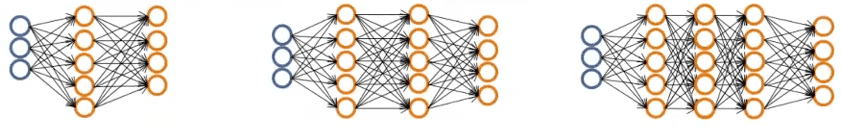

<h1 style="color: #ccc">Machine Learning 9</h1>

# Neural Networks: Learning

*Nov 6, 2016*

## Cost Function

1. Neural Network (Classification)

   * $ L $ = total no. of layers in network
   * $ { s }_{ l } $ = no. of units (not counting bias unit) in layer $ l $

2. Binary Classification

   $ y=0 $ or $ 1 $

   1 output unit: $ { s }_{ l }=K=1 $

3. Multi-class Classification (K classes)

   $ y\in { \mathbb{R} }^{ K } $, e.g. $ \begin{bmatrix} 1 \\ 0 \\ 0 \\ 0 \end{bmatrix},\begin{bmatrix} 0 \\ 1 \\ 0 \\ 0 \end{bmatrix},\begin{bmatrix} 0 \\ 0 \\ 1 \\ 0 \end{bmatrix},\begin{bmatrix} 0 \\ 0 \\ 0 \\ 1 \end{bmatrix} $

   K output units: $ { s }_{ l }=K\ge 3 $

4. Cost Function

   Logistic Regression

   $$ J\left( \theta  \right) =-\frac { 1 }{ m } \left[ \sum _{ i=1 }^{ m }{ { y }^{ \left( i \right)  }\log { { h }_{ \theta  }\left( { x }^{ \left( i \right)  } \right)  } +\left( 1-{ y }^{ \left( i \right)  } \right) \log { \left( 1-{ h }_{ \theta  }\left( { x }^{ \left( i \right)  } \right)  \right)  }  }  \right] +\frac { 1 }{ 2m } \sum _{ j=1 }^{ n }{ { \theta  }_{ j }^{ 2 } } $$

   Neural Network

   $$ J\left( \Theta  \right) =-\frac { 1 }{ m } \left[ \sum _{ i=1 }^{ m }{ \sum _{ k=1 }^{ K }{ { y }_{ k }^{ \left( i \right)  }\log { { { h }_{ \Theta  }\left( { x }^{ \left( i \right)  } \right) }_{ k } } +\left( 1-{ y }_{ k }^{ \left( i \right)  } \right) \log { \left( 1-{ { h }_{ \Theta  }\left( { x }^{ \left( i \right)  } \right) }_{ k } \right)  }  }  }  \right] +\frac { 1 }{ 2m } \sum _{ l=1 }^{ L-1 }{ \sum _{ i=1 }^{ { s }_{ l } }{ \sum _{ j=1 }^{ { s }_{ l+1 } }{ { \left( { \Theta  }_{ ji }^{ \left( l \right)  } \right)  }^{ 2 } }  }  } $$

   * $ { h }_{ \Theta  }\left( x \right) \in { \mathbb{R} }^{ K } $ = K outputs
   * $ { { h }_{ \Theta  }\left( { x } \right) }_{ i } $ = i<sup>th</sup> output

## Backpropagation Algorithm

1. Gradient Descent

   Want $ \min _{ \Theta  }{ J\left( \Theta  \right)  } $

   Need to compute

   $$ J\left( \Theta  \right) , \frac { \partial  }{ \partial { \Theta  }_{ ij }^{ \left( l \right)  } } $$

2. Forward Propagation

   * Step 1: $ { a }^{ \left( 1 \right)  }=x $
   * Step 2: $ { z }^{ \left( 2 \right)  }={ \Theta  }^{ \left( 1 \right)  }{ a }^{ \left( 1 \right)  } $
   * Step 3: $ { a }^{ { \left( 2 \right)  } }=g\left( { z }^{ \left( 2 \right)  } \right) \quad \left( add\quad { a }_{ 0 }^{ \left( 2 \right)  } \right) $
   * Step 4: $ { z }^{ \left( 3 \right)  }={ \Theta  }^{ \left( 2 \right)  }{ a }^{ { \left( 2 \right)  } } $
   * Step 5: $ { a }^{ \left( 3 \right)  }=g\left( { z }^{ \left( 3 \right)  } \right) \quad \left( add\quad { a }_{ 0 }^{ \left( 3 \right)  } \right) $
   * Step 6: $ { z }^{ \left( 4 \right)  }={ \Theta  }^{ \left( 3 \right)  }{ a }^{ \left( 3 \right)  } $
   * Step 7: $ { a }^{ \left( 4 \right)  }=g\left( { z }^{ \left( 4 \right)  } \right) ={ h }_{ \Theta  }\left( x \right) $

3. Intuition

   $ { \delta  }_{ j }^{ \left( l \right)  } $ = "error" of node $ j $ in layer $ l $

   For each output unit of layer $ L $

   $$ { \delta  }_{ j }^{ \left( L \right)  }={ a }_{ j }^{ \left( L \right)  }-{ y }_{ j }={ \left( { h }_{ \Theta  }\left( x \right)  \right)  }_{ j }-{ y }_{ j } $$

4. Computing errors

   * Step 1: $ { \delta  }^{ \left( 4 \right)  }={ a }^{ \left( 4 \right)  }-y={ h }_{ \Theta  }\left( x \right) -y $
   * Step 2: $ { \delta  }^{ \left( 3 \right)  }={ \left( { \Theta  }^{ \left( 3 \right)  } \right)  }^{ \top  }{ \delta  }^{ \left( 4 \right)  }\cdot \ast g\prime \left( { z }^{ \left( 3 \right)  } \right) ={ \left( { \Theta  }^{ \left( 3 \right)  } \right)  }^{ \top  }{ \delta  }^{ \left( 4 \right)  }\cdot \ast { a }^{ \left( 3 \right)  }\cdot \ast \left( 1-{ a }^{ \left( 3 \right)  } \right) $
   * Step 3: $ { \delta  }^{ \left( 2 \right)  }={ \left( { \Theta  }^{ \left( 2 \right)  } \right)  }^{ \top  }{ \delta  }^{ \left( 3 \right)  }\cdot \ast g\prime \left( { z }^{ \left( 2 \right)  } \right) ={ \left( { \Theta  }^{ \left( 2 \right)  } \right)  }^{ \top  }{ \delta  }^{ \left( 3 \right)  }\cdot \ast { a }^{ \left( 2 \right)  }\cdot \ast \left( 1-{ a }^{ \left( 2 \right)  } \right) $

3. Backpropagation Algorithm

   Training set $ \left\{ \left( { x }^{ \left( 1 \right)  },{ y }^{ \left( 1 \right)  } \right) ,\cdots ,\left( { x }^{ \left( m \right)  },{ y }^{ \left( m \right)  } \right)  \right\} $

   Set $ { \Delta  }_{ ij }^{ \left( l \right)  }:=0 $ (for all $ l,i,j $)

   For $ i=1 $ to $ m $

   * Set $ { a }^{ \left( 1 \right)  }={ x }^{ \left( i \right)  } $
   * Perform forward propagation to compute $ { a }^{ \left( 1 \right)  } $ for $ l=2,3,\cdots ,L $
   * Using $ { y }^{ \left( i \right)  } $, compute $ { \delta  }^{ \left( L \right)  }={ a }^{ \left( L \right)  }-{ y }^{ \left( i \right)  } $
   * Compute $ { \delta  }^{ \left( L-1 \right)  },{ \delta  }^{ \left( L-2 \right)  },\cdots ,{ \delta  }^{ \left( 2 \right)  } $
   * Set $ { \Delta  }_{ ij }^{ \left( l \right)  }:={ \Delta  }_{ ij }^{ \left( l \right)  }+{ \delta  }_{ i }^{ \left( l+1 \right)  }{ \left( { a }_{ j }^{ \left( l \right)  } \right)  }^{ \top  } $

   Set $ { D }_{ ij }^{ \left( l \right)  }:=\frac { 1 }{ m } { \Delta  }_{ ij }^{ \left( l \right)  }+\frac { \lambda  }{ m } { \Theta  }_{ ij }^{ \left( l \right)  } $, if $ j\ne 0 $

   Set $ { D }_{ ij }^{ \left( l \right)  }:=\frac { 1 }{ m } { \Delta  }_{ ij }^{ \left( l \right)  } $, if $ j=0 $

   $$ \frac { \partial  }{ \partial { \Theta  }_{ ij }^{ \left( l \right)  } } J\left( \Theta  \right) ={ D }_{ ij }^{ \left( l \right)  } $$

### Backpropagation Intuition

1. How well is the network doing on example $ i $?

   $$ cost\left( i \right) ={ y }^{ \left( i \right)  }\log { \left( { h }_{ \Theta  }\left( { x }^{ \left( i \right)  } \right)  \right)  } +\left( 1-{ y }^{ \left( i \right)  } \right) \log { \left( 1-{ h }_{ \Theta  }\left( { x }^{ \left( i \right)  } \right)  \right)  } $$

2. Formally, $ { \delta  }_{ j }^{ \left( l \right)  }=\frac { \partial  }{ \partial { z }_{ j }^{ \left( l \right)  } } cost\left( i \right) $ (for $ j\ge 0 $)

### Backpropagation in Practice

#### Implementation Note: Unrolling Parameters

1. Advanced Optimization

   ```
   function [jVal, gradient] = costFunction(theta)
   ...
   optTheta = fminunc(@costFunction, initialTheta, options)
   ```

   ``theta``, ``initialTheta`` and ``gradient`` are vectors

   Neural Network

   * $ { \Theta  }^{ \left( 1 \right)  },{ \Theta  }^{ \left( 2 \right)  },{ \Theta  }^{ \left( 3 \right)  } $ - matrices (``Theta1``, ``Theta2``, ``Theta3``)
   * $ { D }^{ \left( 1 \right)  },{ D }^{ \left( 2 \right)  },{ D }^{ \left( 3 \right)  } $ - matrices (``D1``, ``D2``, ``D3``)

2. Example

   $$ { s }_{ 1 }=10,{ s }_{ 2 }=10,{ s }_{ 3 }=1 $$

   $$ { \Theta  }^{ \left( 1 \right)  }\in { R }^{ 10\times 11 },{ { \Theta  } }^{ \left( 2 \right)  }\in { R }^{ 10\times 11 },{ { \Theta  } }^{ \left( 3 \right)  }\in { R }^{ 1\times 11 } $$

   $$ { D }^{ \left( 1 \right)  }\in { R }^{ 10\times 11 },{ { D } }^{ \left( 2 \right)  }\in { R }^{ 10\times 11 },{ { D } }^{ \left( 3 \right)  }\in { R }^{ 1\times 11 } $$

   ```
   thetaVec = [Theta1(:); Theta2(:); Theta3(:)];
   DVec = [D1(:); D2(:); D3(:)];
   ...
   Theta1 = reshape(thetaVec(1:110), 10, 11);
   Theta2 = reshape(thetaVec(111:220), 10, 11);
   Theta3 = reshape(thetaVec(221:231), 1, 11);
   ```

#### Gradient Checking

1. Two-sided Difference (numerical estimation of gradients )

   $$ \frac { \partial  }{ \partial \theta  } J\left( \theta  \right) \approx \frac { J\left( \theta +\varepsilon  \right) -J\left( \theta -\varepsilon  \right)  }{ 2\varepsilon  } $$

   $$ \varepsilon ={ 10 }^{ -4 } $$

2. Octave

   ```
   gradApprox = (J(theta + EPSILON) - J(theta - EPSILON)) / (2 * EPSILON);
   ```

3. Parameter Vector $ \theta $

   $ \theta ={ \theta  }_{ 1 },{ \theta  }_{ 2 },\cdots ,{ \theta  }_{ n }\in { R }^{ n } $ (e.g. $ \theta $ is unrolled version of $ { \Theta  }^{ \left( 1 \right)  },{ \Theta  }^{ \left( 2 \right)  },{ \Theta  }^{ \left( 3 \right)  } $)

   $$ \frac { \partial  }{ \partial { \theta  }_{ 1 } } J\left( \theta  \right) \approx \frac { J\left( { \theta  }_{ 1 }+\varepsilon ,{ \theta  }_{ 2 },\cdots ,{ \theta  }_{ n } \right) -J\left( { \theta  }_{ 1 }-\varepsilon ,{ \theta  }_{ 2 },\cdots ,{ \theta  }_{ n } \right)  }{ 2\varepsilon  } $$

   $$ \frac { \partial  }{ \partial { \theta  }_{ 2 } } J\left( \theta  \right) \approx \frac { J\left( { \theta  }_{ 1 },{ \theta  }_{ 2 }+\varepsilon ,\cdots ,{ \theta  }_{ n } \right) -J\left( { \theta  }_{ 1 },{ \theta  }_{ 2 }-\varepsilon ,\cdots ,{ \theta  }_{ n } \right)  }{ 2\varepsilon  } $$

   $$ \frac { \partial  }{ \partial { \theta  }_{ n } } J\left( \theta  \right) \approx \frac { J\left( { \theta  }_{ 1 },{ \theta  }_{ 2 },\cdots ,{ \theta  }_{ n }+\varepsilon  \right) -J\left( { \theta  }_{ 1 },{ \theta  }_{ 2 },\cdots ,{ \theta  }_{ n }-\varepsilon  \right)  }{ 2\varepsilon  } $$

3. Octave Parameter Vector $ \theta $

   ```
   for i = 1:n,
       thetaPlus = theta;
       thetaPlus(i) = thetaPlus(i) + EPSILON;
       thetaMinus = theta;
       thetaMinus(i) = thetaMinus(i) - EPSILON;
       gradApprox(i) = (J(thetaPlus) - J(thetaMinus)) / (2 * EPSILON);
   end;
   ```

   Check that ``gradApprox`` $ \approx $ ``DVec``

4. Implementation Note

   * Implement backprop to compute ``DVec`` (unrolled $ { D }^{ \left( 1 \right)  },{ D }^{ \left( 2 \right)  },{ D }^{ \left( 3 \right)  } $).
   * Implement numerical gradient check to compute ``gradApprox``.
   * Make sure they give similar values.
   * Turn off gradient checking. Using backprop code for learning.

5. Important

   * Be sure to disable your gradient checking code before training your classifier. If you run numerical gradient computation on every iteration of gradient descent (or in the inner loop of ``costFunction()``) your code will be very slow.

#### Random Initialization

1. Initial value of $ \Theta $

   For gradient descent and advanced optimization method, need initial value for $ \Theta $.

   ```
   optTheta = fminunc(@costFunction, initialTheta, options);
   ```

2. Zero Initialization

   $$ \Theta ^{( l)}_{ij} =0\forall i,j,l $$

   After each update, parameters corresponding to inputs going into each of hidden units are identical.

3. Random Initialization (Symmetry Breaking)

   Initialize each $ { \Theta  }_{ ij }^{ \left( l \right)  } $ to a random value in $ \left[ -\varepsilon ,\varepsilon  \right] $ (i.e. $ -\varepsilon \le { \Theta  }_{ ij }^{ \left( l \right)  }\le \varepsilon $)

   ```
   Theta1 = rand(10, 11) * (2 * INIT_EPSILON) - INIT_EPSILON;
   Theta2 = rand(1, 11) * (2 * INIT_EPSILON) - INIT_EPSILON;
   ```

## Putting It Together

1. Pick a network architecture

   

   * No of input units: Dimension of features $ { x }^{ \left( i \right)  } $
   * No of output units: Number of classes
   * Reasonable default: 1 hidden layer, or if >1 hidden layer, have same number of hidden units in every layer (usually the more the better)

2. Training a neural network

   * Randomly initialize weights
   * Implement forward propagation to get $ { h }_{ \Theta  }\left( { x }^{ \left( i \right)  } \right) $ for any $ { x }^{ \left( i \right)  } $
   * Implement code to compute cost function $ J\left( \Theta  \right) $
   * Implement backprop to compute partial derivatives $ \frac { \partial  }{ \partial { \Theta  }_{ ij }^{ \left( l \right)  } } J\left( \Theta  \right) $
   * Use gradient checking to compare $ \frac { \partial  }{ \partial { \Theta  }_{ ij }^{ \left( l \right)  } } J\left( \Theta  \right) $ computed using backprop vs using numerical estimate of gradient of $ J\left( \Theta  \right) $, then disable gradient checking code
   * Use gradient descent or advanced optimization method with backprop to try to minimize $ J\left( \Theta  \right) $ as a function of parameters $ \Theta $

3. For neural networks, the cost function is non-convex, or is not convex and so it can theoretically be susceptible to local minima, and in fact algorithms like gradient descent and the advance optimization methods can, in theory, get stuck in local optima, but it turns out that in practice this is not usually a huge problem and even though we can't guarantee that these algorithms will find a global optimum, usually algorithms like gradient descent will do a very good job minimizing the cost function and get a very good local minimum, even if it doesn't get to the global optimum.
