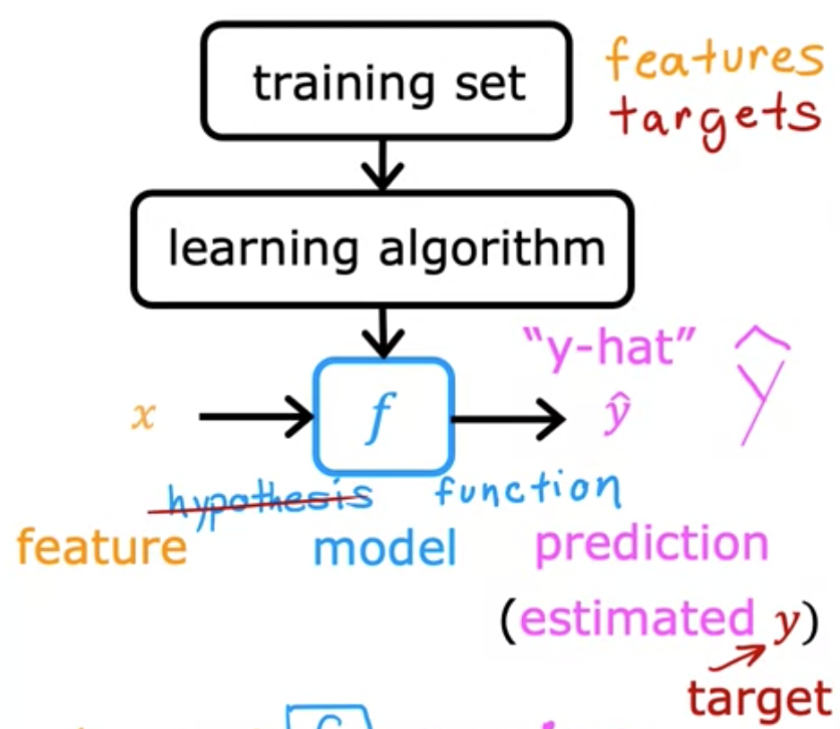

<h1 style="color: #ccc">Machine Learning Specialisation</h1>

# Univariate Linear Regression

*Jun 21, 2022*

## Overview of Machine Learning

1. Machine learning definition by Arthur Samuel (1959)

    > Field of study that gives computers the ability to learn without being explicitly programmed.

### Supervised Learning

1. Regression

    - Predicts a number or continuous value as output

2. Classification

    - Predicts a class or discrete category as output

### Unsupervised Learning

1. Find something interesting (pattern or structure) in unlabelled data.

2. Clustering

    - Groups similar data points together

3. Anomaly detection

    - Detects unusual events

4. Dimensionality reduction

    - Compresses a big dataset to a much smaller dataset while losing as little information as possible

## Linear Regression with One Variable

### Model Representation

1. Terminology

    - Training set Data used to train the model

2. Notation

    - $x=$ input variable or feature
    - $y=$ output variable or target variable
    - $m=$ number of training examples
    - $(x,y)=$ one training example
    - $\left( x^{( i)} ,y^{( i)}\right)=$ ith training example
    - $\hat{y}=$ the estimate or prediction of $y$
    - $f=$ the function or model that takes new input $x$ and produces output $\hat{y}$

3. Training process

    Learning algorithm derives the function $f$ from an input of training set.

    > 

4. Model representation

    What is the math formula we are going to use to compute $f$?

    $$
    f_{w,b}( x) =wx+b
    $$

    - $w,b=$ parameters of the model

   Parameters of the model are the variables you can adjust during training in order to improve the model. $w$ is also known as coefficient or weight, while $b$ is called y-intercept or bias.

### Cost Function

1. Loss function

    $$
    L(\hat{y} ,y) =\frac{1}{2}(\hat{y} -y)^{2}
    $$

    The loss function or error function measures the discrepancy between the prediction $\hat{y}^{( i)}$ and the target $y^{( i)}$. In other words, the loss function computes the error for a single training example.

2. Cost function

    $$
    J( w,b) =\frac{1}{m}\sum _{i=1}^{m} L\left(\hat{y}^{( i)} ,y^{( i)}\right) =\frac{1}{2m}\sum _{i=1}^{m}\left(\hat{y}^{( i)} -y^{( i)}\right)^{2}
    $$

    $$
    J( w,b) =\frac{1}{2m}\sum _{i=1}^{m}\left( f_{w,b}\left( x^{( i)}\right) -y^{( i)}\right)^{2}
    $$

    The cost function is the average of the loss function of the entire training set. This cost function is also called square error cost function. We are going to find parameters $w,b$ that minimise the cost function.

    $$
    \underset{w,b}{\arg\min} J( w,b)
    $$
