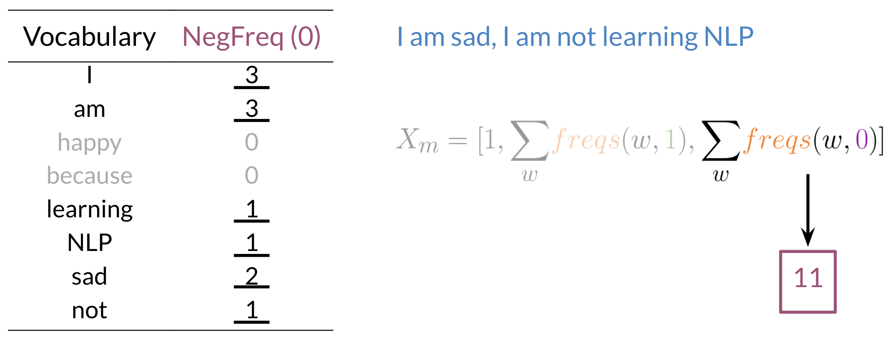

<h1 style="color: #ccc">NLP 1</h1>

# Sentiment Analysis with Logistic Regression

*Sep 29, 2021*

## Supervised ML & Sentiment Analysis

1. In supervised machine learning, you usually have an input $X$, which goes into your prediction function to get your $\hat{y}$. You can then compare your prediction with the true value of $y$. This gives you your cost which you use to update the parameters $\theta$.

2. To perform sentiment analysis on a tweet, you have to

    - Represent the text (i.e. `"I am happy because I am learning NLP"`) as features.
    - Label the text $1$, for a positive sentiment, or $0$, for a negative sentiment.
    - Train your logistic regression classifier.
    - Use it to classify the text.

## Vocabulary & Feature Extraction

1. Given a tweet, or some text, you can represent it as a vector of dimension $V$, where $V$ corresponds to your vocabulary size. If you had the tweet `"I am happy because I am learning NLP"`, then you would put a $1$ in the corresponding index for any word in the tweet, and a $0$ otherwise.

    > 

2. You can see, as $V$ gets larger, the vector becomes more sparse. Furthermore, we end up having many more features and end up having $(n + 1)$ parameters $\theta$. This could result in larger training time, and large prediction time.

## Feature Extraction with Frequencies

1. Given a corpus with positive and negative tweets as follows:

    > 

    You can create a word frequency dictionary to map the word, and the class it appeared in (positive or negative) to the number of times that word appeared in its corresponding class.

    > 

2. You have to encode each tweet as a vector. Instead of a vector of dimension $V$, you now will represent it with a vector of dimension $3$. Given the frequency dictionary above denoted as $freqs$, and the tweet, `"I am sad, I am not learning NLP"`, you can create a vector by first encoding the positive feature:

    > 

    And then encoding the negative feature:

    > 

3. Hence you end up getting the following feature vector $[1,8,11]$. $1$ corresponds to bias, $8$ the positive feature, and $11$ the negative feature.

## Preprocessing

1. During preprocessing, you have to perform the following:

    - **Lowercasing**: Convert all your words to lower case.
    - **Expanding Contraction**: Expand contractions, such as *I'll*, *I've*, *don't* etc, to their expanded form helps in text standardisation. This step can be skipped if stop-words removal later includes all the contractions.
    - **Punctuation Removal**: Remove punctuation like `,.:!"'` etc. However, in some contexts you won't have to eliminate punctuation if it adds important information to your NPL task.
    - **Stop-Words Removal**: Remove stop-words like *and*, *is*, *a*, *on*, etc.
    - **Elimination**: Eliminate handles and URLs.
    - **Stemming / Lemmatisation**: Stemming converts every word to its stem, like *dancer*, *dancing*, *danced*, becomes "danc". You can use porter stemmer to take care of this. Lemmatisation converts every word to its base form that are lexicographically correct. However, stemming is a lot faster than lemmatisation.
    - **Tokenisation**: Tokenise the string into words.

2. For example the following tweet `"@YMourri and @AndrewYNg are tuning a GREAT AI model at https://deeplearning.ai!!!"` after preprocessing becomes `['tun', 'great', 'ai', 'model']`.

    > 

## Putting It All Together

1. Over all, you start with a given text, you perform preprocessing, then you do feature extraction to convert text into numerical representation.

    > 

2. $X$ becomes of dimension $(m, 3)$.

    $$
    X=\begin{bmatrix}
    1 & x_{1}^{( 1)} & x_{2}^{( 1)}\\
    1 & x_{1}^{( 2)} & x_{2}^{( 2)}\\
    \vdots  & \vdots  & \vdots \\
    1 & x_{1}^{( m)} & x_{2}^{( m)}
    \end{bmatrix}
    $$

3. You can see in the last step of this code below, you are storing the extracted features as rows in your $X$ matrix and you have $m$ of these examples.

    ```python
    freqs = build_freqs(tweets, labels) # Build frequencies dictionary
    X = np.zeros((m, 3)) # Initialise matrix X
    for i in range(m): # For every tweet
        p_tweet = process_tweet(tweets[i]) # Process tweet
        X[i, :] = extract_features(p_tweet, freqs) # Extract Features
    ```

## Logistic Regression Overview

1. Logistic regression makes use of the sigmoid function which outputs a probability between 0 and 1.

    $$
    \hat{y}^{( i)} =h\left( x^{( i)} ,\theta \right) =\sigma \left( \theta ^{\mathsf{T}} x^{( i)}\right) =\frac{1}{1+e^{-\theta ^{\mathsf{T}} x^{( i)}}}
    $$

2. Note that as $\theta ^{\mathsf{T} } x^{( i)}$ gets closer and closer to $-\infty$ the denominator of the sigmoid function gets larger and larger and as a result, the sigmoid gets closer to $0$. On the other hand, as $\theta ^{\mathsf{T} } x^{( i)}$ gets closer and closer to $\infty$ the denominator of the sigmoid function gets closer to 1 and as a result the sigmoid also gets closer to 1.

    > 

3. Given a tweet, you can transform it into a vector and run through your sigmoid function to get a prediction.

    > 

## Logistic Regression Training

1. To train your logistic regression function, you initialise your parameters $\theta$, that you can use in your sigmoid, you then compute the gradient that you will use to update $\theta$, and then calculate the cost. You keep doing so until good enough.

    - Initialise parameters $\theta$

    - Classify / predict

    $$
    \hat{y}^{( i)} =h\left( x^{( i)} ,\theta \right) =\sigma \left( \theta ^{\mathsf{T}} x^{( i)}\right)\text{, where } \sigma ( z) =\frac{1}{1+e^{-z}}
    $$

    $$
    \hat{y} =H( X,\theta )
    $$

    - Get gradient

    $$
    \nabla _{j} =\frac{\partial }{\partial \theta _{j}} J( \theta ) =\frac{1}{m}\sum _{i=1}^{m}\left(\hat{y}^{( i)} -y^{( i)}\right) x_{j}^{( i)}
    $$

    $$
    \nabla =\frac{1}{m} X^{\mathsf{T}}(\hat{y} -y)
    $$

    - Update parameters $\theta$ of iteration $k$ using $\theta$ from iteration $(k-1)$

    $$
    \theta ^{( k)} =\theta ^{( k-1)} -\alpha \nabla 
    $$

    - Calculate the cost

    $$
    J( \theta ) =\frac{1}{m}\sum _{i=1}^{m} L\left( h\left( x^{( i)} ,\theta \right) ,y^{( i)}\right)
    $$

    $$
    L(\hat{y} ,y) =-[ y\log\hat{y} +( 1-y)\log( 1-\hat{y})]
    $$

    $$
    J( \theta ) =-\frac{1}{m}\left[ y^{\mathsf{T}}\log\hat{y} +( 1-y)^{\mathsf{T}}\log( 1-\hat{y})\right]
    $$

2. Usually you keep training until the cost converges. If you were to plot the number of iterations versus the cost, you should see something like the chart on left side below.

    > 

## Logistic Regression Testing

1. To test your model, you would run a subset of your data, known as the test set, on your model to get predictions. The predictions are outputs of the sigmoid function. If the output is $\geq 0.5$, you would assign it to a positive class, otherwise, a negative class.

    $$
    pred_{test} =[ H( X_{test} ,\theta ) \geq 0.5]
    $$

    $$
    \left[\begin{bmatrix}
    0.3\\
    0.8\\
    0.5\\
    \vdots \\
    \hat{y}_{test}^{( m)}
    \end{bmatrix} \geq 0.5\right] =\begin{bmatrix}
    0.3\geq 0.5\\
    0.8\geq 0.5\\
    0.5\geq 0.5\\
    \vdots \\
    \hat{y}_{test}^{( m)} \geq 0.5
    \end{bmatrix} =\begin{bmatrix}
    0\\
    1\\
    1\\
    \vdots \\
    pred_{test}^{( m)}
    \end{bmatrix}
    $$

2. To compute accuracy

    $$
    accuracy=\sum _{i=1}^{m}\frac{\left( pred_{test}^{( i)} ==y_{test}^{( i)}\right)}{m}
    $$
