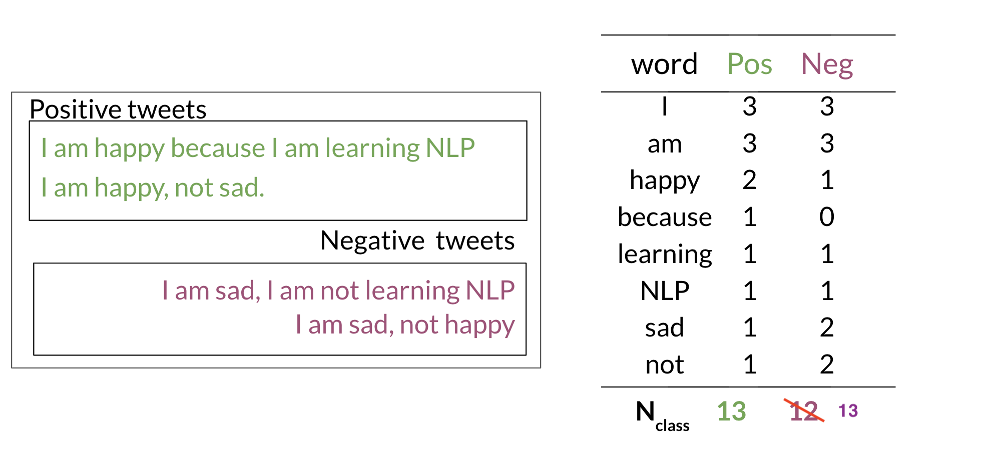
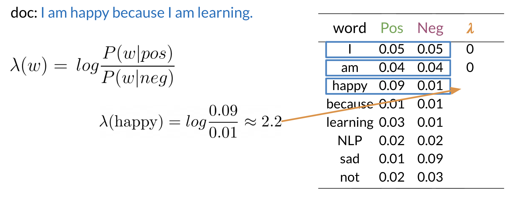

<h1 style="color: #ccc">NLP 2</h1>

# Sentiment Analysis with Naïve Bayes

*Oct 3, 2021*

## Bayes' Rule

1. Conditional probabilities help us reduce the sample space.

2. Bayes' Rule is defined as:

    $$
    P( Y|X) =\frac{P( X\cap Y)}{P( X)} =\frac{1}{P( X)} P( X|Y) P( Y)
    $$

    $$
    \begin{aligned}
    P( y_{k} |x_{1} ,\cdots ,x_{n}) & =\frac{1}{z} P( y_{k})\prod _{j=1}^{n} P( x_{j} |y_{k})\\
     & \varpropto P( y_{k})\prod _{j=1}^{n} P( x_{j} |y_{k})
    \end{aligned}
    $$

    $$
    z=P( X) =\sum\limits _{k} P( y_{k})\prod _{j=1}^{n} P( x_{j} |y_{k})
    $$

    $z$ is the probability of and a constant for the same values of $X$, since the summation has exhausted all the possible states of $Y$.

    Hence, a K-class Bayes classifier is to maximise the product of prior and likelihood, without depending on the constant $z$:

    $$
    \hat{y} =\arg\underset{y_{k}}{\max}\left( P( y_{k})\prod _{j=1}^{n} P( x_{j} |y_{k})\right) \forall k\in \{1,\cdots ,K\}
    $$

## Naive Bayes Introduction

1. First, you create word frequency dictionary as follows:

    > 

    Then, you can calculate the conditional probability of each word given each class.

    $$
    P( happy|pos) =\frac{freqs( happy,pos)}{N_{pos}} =\frac{2}{13} \approx 0.15
    $$

    $$
    P( happy|neg) =\frac{freqs( happy,neg)}{N_{neg}} =\frac{1}{13} \approx 0.08
    $$

    This allows us to compute the following table of conditional probabilities:

    > 

2. Once you have the probabilities, you can compute the likelihood ratio as follows:

    Tweet: `I am happy today; I am learning.`

    $$
    \prod _{i=1}^{n}\frac{P( w_{i} |pos)}{P( w_{i} |neg)} =\left(\frac{0.24}{0.25}\right)^{2} \cdotp \frac{0.15}{0.08} \cdot \left(\frac{0.24}{0.25}\right)^{2} \cdot \frac{0.08}{0.08} \approx 1.59
    $$

    A ratio greater than $1$ indicates that the class is positive, otherwise it is negative.

## Laplacian Smoothing

1. We usually compute the probability of a word given a class as follows:

    $$
    P( w_{i} |class) =\frac{freqs( w_{i} ,class)}{N_{class}}\\
    class\in \{Positive,Negative\}
    $$

2. However, if a word does not appear in the training, then it automatically gets a probability of 0, to fix this we add smoothing as follows:

    $$
    P( w_{i} |class) =\frac{freqs( w_{i} ,class) +1}{N_{class} +V}
    $$

    Note that we added $1$ in the numerator, and since there are $V$ words to normalise, we add $V$ in the denominator.

    - Frequency of all words in class: $N_{class}$
    - Number of unique words in vocabulary: $V$

## Log Likelihood

1. We need to get the likelihood ratios and use them to compute a score that will allow us to decide whether a tweet is positive or negative. The higher the ratio, the more positive the word is.

    > 

2. To do inference, you can compute the following:

    $$
    \frac{P( pos)}{P( neg)}\prod _{i=1}^{n}\frac{P( w_{i} |pos)}{P( w_{i} |neg)}  >1
    $$

    As $n$ gets larger, we can get numerical flow issues, so we introduce the $\log$, which gives you the following equation:

    $$
    \log\left(\frac{P( pos)}{P( neg)}\prod _{i=1}^{n}\frac{P( w_{i} |pos)}{P( w_{i} |neg)}\right)  =\log\frac{P( pos)}{P( neg)} +\sum _{i=1}^{n}\log\frac{P( w_{i} |pos)}{P( w_{i} |neg)}
    $$

    The first component is called the log prior ratio and the second component is the log likelihood ratio.

3. We further introduce $\lambda$ as follows:

    > 

4. The range of log likelihood is from $-\infty$ to $\infty$, with $>0$ means positive tweet.

    > 

5. To do inference using $\lambda$

    $$
    \log\frac{P( pos)}{P( neg)} +\sum _{i=1}^{n} \lambda ( w_{i})  >0
    $$

## Training Naive Bayes

1. To train Naive Bayes classifier, you have to perform the following steps:

    - Get or annotate a dataset with positive or positive tweets.
    - Preprocess the tweets, `process_tweet(tweet) -> [w1, w2, w3]`.
    - Compute $freqs(w, class)$.
    - Get $P(w|pos)$, $P(w|neg)$.
    - Get $\lambda(w)$.
    - Compute $logprior=\log\frac{P( pos)}{P( neg)}$

        $logprior=\log\frac{D_{pos}}{D_{neg}}$, where $D_{pos}$ and $D_{neg}$ correspond to the number of positive and negative documents respectively.

## Testing Naive Bayes

1. To test your model, run the test set of your data, to get predictions.

    $$
    pred_{test} =[ score( X_{test} ,\lambda ,logprior)  >0]
    $$

    $$
    \left[\begin{bmatrix}
    0.5\\
    -1\\
    1.3\\
    \vdots \\
    \text{score}_{test}^{( m)}
    \end{bmatrix}  >0\right] =\begin{bmatrix}
    0.5 >0\\
    -1 >0\\
    1.3 >0\\
    \vdots \\
    \text{score}_{test}^{( m)}  >0
    \end{bmatrix} =\begin{bmatrix}
    1\\
    0\\
    1\\
    \vdots \\
    \text{pred}_{test}^{( m)}
    \end{bmatrix}
    $$

2. To compute accuracy

    $$
    accuracy=\sum _{i=1}^{m}\frac{\left( pred_{test}^{( i)} ==y_{test}^{( i)}\right)}{m}
    $$

## Application of Naive Bayes

1. There are many applications of Naive Bayes.

   - Author identification
   - Spam filtering
   - Information retrieval
   - Word disambiguation

   This method is usually used as a simple baseline. It is also really fast.

## Naive Bayes Assumptions

1. Assuming independent features associated with each class.

2. Assuming same proportion of positive and negative class.

## Error Analysis

1. Removing punctuation

    Tweet: `My beloved grandmother :(`

    Processed Tweet: `['belov', 'grandmoth']`

2. Removing stop-words

    Tweet: `This is not good, because your attitude is not even close to being nice.`

    Processed Tweet: `['good', 'attitube', 'close', 'nice']`

3. Word order

    Tweet: `I am happy because I did not go.`

    Tweet: `I am not happy because I did go.`

4. Adversarial attacks: sarcasm, irony, and euphemisms

    Tweet: `This is a ridiculously powerful movie. The plot was gripping and I cried right through until the ending!`

    Processed Tweet: `['ridicul', 'power', 'movi', 'plot', 'grip', 'cry', 'end']`
