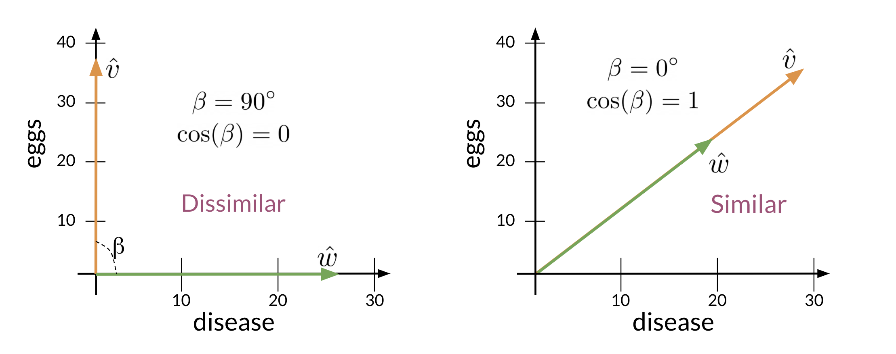

<h1 style="color: #ccc">NLP 3</h1>

# Vector Space Models

*Oct 4, 2021*

## Introduction

1. If you were to represent a word, document, tweet, or any form of text, you will probably be encoding it as a vector. These vectors are important in tasks like information extraction, machine translation, and chatbots.

2. Vector spaces could also be used to help you identify relationships between words as follows:

    - You eat *cereal* from a *bowl*.
    - You *buy* something and someone else *sells* it.

3. The famous quote by Firth says,

    > You shall know a word by the company it keeps.

    When learning these vectors, you usually make use of the neighbouring words to extract meaning and information about the center word.

4. Vector space model

    - Represents words and documents as vectors.
    - Is a representation that captures relative meaning.

## Co-occurrence Matrices

1. To construct vector space model based on a co-occurrence matrix

   - In *word by word design*, the co-occurance of two similar words, is the number of times they occur together within a certain distance $k$. The vector representation of the words can be taken from the row of the table to produce a vector of size $n$, where $n$ between $1$ and $V$.

   - In *word by document design*, the number of times a word occurs within a certain category.

## Euclidian Distance

1. Let us assume that you want to compute the distance between two points $(A,B)$. To do so, you can use the euclidean distance defined as

    $$
    d( A,B) =\sqrt{( B_{1} -A_{1})^{2} +( B_{2} -A_{2})^{2}}
    $$

2. You can generalise finding the distance between two points $(A,B)$ to the distance between two $n$ dimensional vectors as follows:

    $$
    d(\vec{v} ,\vec{w}) =\sqrt{\sum _{i=1}^{n}( w_{i} -v_{i})^{2}}
    $$

    This formula is known as the norm of the difference between the vectors.

    ```python
    v = np.array([1, 6, 8])
    w = np.array([0, 4, 6])
    d = np.linalg.norm(w - v)
    print("The Euclidean distance between v and w is", d)
    ```

## Cosine Similarity

1. One of the issues with Euclidean distance is that it is not always accurate and sometimes we are not looking for that type of similarity metric. For example, when comparing large documents to smaller ones with Euclidean distance one could get an inaccurate result.

    > 

2. Given the **norm** of a vector is defined as

    $$
    \Vert \vec{v}\Vert =\sqrt{\sum _{i=1}^{n} v_{i}^{2}}
    $$

    And **dot product** is defined as

    $$
    \vec{v} \cdotp \vec{w} =\sum _{i=1}^{n} v_{i} \cdot w_{i}
    $$

    Cosine similarity equation

    $$
    \vec{v} \cdot \vec{w} =\Vert \vec{v}\Vert \Vert \vec{w}\Vert \cos( \beta )
    $$

    > 

3. When $\vec{v}$ and $\vec{w}$ are the same then $\beta =0\degree $. On the other hand, the dot product of two orthogonal vectors is $0$, then $\beta =90\degree $.

    > 

## Manipulating Words in Vector Spaces

1. By using the distance between USA and Washington, you can compute a vector to locate the position of Russia capital. You can then use cosine similarity of the computed vector with all other word vectors you have and you can see that the vector of Moscow is the closest.

    > 
