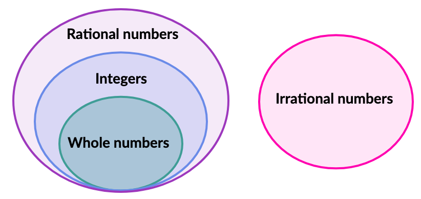

<h1 style="color: #ccc">Secondary Mathematics 1</h1>

# Pre-algebra

*Sep 12, 2020*

## Order of Operations

1. Order of operations

    | Order | Operations |
    |:---:|:---|
    | 1 | Parentheses |
    | 2 | Exponents |
    | 3 | Mul / Div |
    | 4 | Add / Sub |

    For example:

    $$
    \begin{aligned}
    & ( 7+3) \times 4\div 2-3\times 6+( 3\times 2+2)^{2} \div 4\\
    & =11\times 4\div 2-18+( 6+2)^{2} \div 4\\
    & =44\div 2-18+8^{2} \div 4\\
    & =22-18+8\times 8\div 4\\
    & =4+64\div 4\\
    & =4+16\\
    & =20
    \end{aligned}
    $$

## Commutative Property

1. Commutative property of addition

    Changing the order of addends does not change the sum. For example:

    $$
    4+2=2+4
    $$

2. Commutative property of multiplication

    Changing the order of factors does not change the product. For example:

    $$
    4\times 3=3\times 4
    $$

## Associative Property

1. Associative property of addition

    Changing the grouping of addends does not change the sum. For example:

    $$
    (2+3)+4=2+(3+4)
    $$

2. Associative property of multiplication

    Changing the groupings of factors does not change the product. For example:

    $$
    (2\times 3)\times 4=2\times (3\times 4)
    $$

## Identity Property

1. Identity property of addition

    The sum of $0$ and any number is that number. For example:

    $$
    0+4=4
    $$

2. Identity property of multiplication

    The product of $1$ and any number is that number. For example:

    $$
    7\times 1 = 7
    $$

## Distributive Property

1. The distributive property tells us how to solve expressions in the form of $a(b+c)$. The distributive property says that in a multiplication problem, when one factor is rewritten as the sum of two numbers, the product doesn't change. The distributive property is sometimes called **the distributive law of multiplication over addition**. For example:

    $$
    a(b+c)=a\times b + a\times c
    $$

## Classifying Numbers

1. Whole numbers

    Whole numbers are numbers that do not need to be represented with a fraction or decimal. Also, whole numbers cannot be negative. In other words, whole numbers are the counting numbers and zero.

    $$
    0,1,2,3,\cdots
    $$

2. Integers

    Integers are whole numbers and their opposites. Therefore, integers can be negative.

    $$
    \cdots,-3,-2,-1,0,1,2,3,\cdots
    $$

3. Rational numbers

    Rational numbers are numbers that can be expressed as a fraction of two integers. For example:

    $$
    44,0.\overline{12} ,-\frac{18}{5} ,\sqrt{36}
    $$

4. Irrational numbers

    Irrational numbers are numbers that *cannot* be expressed as a fraction of two integers. For example:

    $$
    -4\pi ,\sqrt{3}
    $$

    If you take an irrational number, and you multiply it or divide it by any rational number, you are still going to get an irrational number.

5. The following diagram shows that all whole numbers are integers, and all integers are rational numbers. Numbers that are not rational are called irrational.

    > 

## Divisibility Rules

1. Any integer is divisible by 1.

2. Any even integer (last digit is even) is divisible by 2.

3. An integer is divisible by 3 if the sum of the digits (excluding 3,6,9) is divisible by 3.

    $$
    381\rightarrow (\cancel{3}+8+1=9)\rightarrow \text{Yes}
    $$

    $$
    217\rightarrow (\cancel{2+1}+7=7)\rightarrow \text{No}
    $$

    This rule can be repeated when needed.

    $$
    88889\rightarrow ( 4\cdot 8+\cancel{9}=32)\rightarrow ( \cancel{3}+2=2)\rightarrow \text{No}
    $$

    Explanation:

    $$
    \begin{aligned}
    6789 & =6( 1+999) +7( 1+99) +8( 1+9) +9\\
    & =\underbrace{6\cdot 999+7\cdot 99+8\cdot 9}_{\text{Divisible by 3}} +\underbrace{6+7+8+9}_{\text{Is this divisible by 3?}}\\
    & =\underbrace{6\cdot 999+7\cdot 99+8\cdot 9}_{\text{Divisible by 3}} +\underbrace{6+9}_{\text{Divisible by 3}} +\underbrace{7+8}_{\text{Is this divisible by 3?}}
    \end{aligned}
    $$

    Therefore,

    $$
    6789\rightarrow ( 7+8=15)\rightarrow \text{Yes}
    $$

4. An integer is divisible by 4 if the last 2 digits are divisible by 4.

    $$
    1312\rightarrow \left(\frac{12}{4} =3\right)\rightarrow \text{Yes}
    $$

    $$
    7019\rightarrow \left(\frac{19}{4} =4\frac{3}{4}\right)\rightarrow \text{No}
    $$

    Explanation:

    $$
    \begin{aligned}
    3456 & =3400\ +\ 56\\
    & =\underbrace{34\cdot 100}_{\text{Divisible by 4}} +\underbrace{56}_{\text{Is this divisible by 4?}}
    \end{aligned}
    $$

    Therefore,

    $$
    3456\rightarrow \left(\frac{56}{4} =\frac{28}{2} =14\right)\rightarrow \text{Yes}
    $$

5. An integer is divisible by 5 if the last digit is $0$ or $5$.

6. An integer is divisible by 6 if it is even and is divisible by 3 (it passes both the 2 rule and 3 rule above).

7. An integer is divisible by 7 if double the last digit and substract it from a number made by other digits is divisible by 7. Repeat until the result is a recognisable 2-digit multiple of 7.

    $$
    672\rightarrow ( 67-4=63)\rightarrow \text{Yes}
    $$

    $$
    951\rightarrow ( 95-2=93)\rightarrow ( 9-6=3)\rightarrow \text{No}
    $$

    Explanation:

    $$
    \begin{aligned}
    2345 & =2340+5\\
    & =2340+21\cdot 5-20\cdot 5\\
    & =\left[\underbrace{234-2\cdot 5}_{\text{Is this divisible by 7?}}\right] \cdot \underbrace{10}_{\text{Not divisible by 7}} +\underbrace{21\cdot 5}_{\text{Divisible by 7}}
    \end{aligned}
    $$

    Therefore,

    $$
    2345\rightarrow ( 234-10=224)\rightarrow ( 22-8=14)\rightarrow \text{Yes}
    $$

8. An integer is divisible by 8 if the last 3 digits are divisible by 8.

    $$
    109816\rightarrow \left(\frac{816}{8} =102\right)\rightarrow \text{Yes}
    $$

    $$
    216302\rightarrow \left(\frac{302}{8} =37\frac{6}{8}\right)\rightarrow \text{No}
    $$

    Explanation:

    Given $1000\div 8=125$,

    $$
    \begin{aligned}
    3456 & =3000+456\\
    & =\underbrace{3\cdot 1000}_{\text{Divisible by 8}} +\underbrace{456}_{\text{Is this divisible by 8?}}
    \end{aligned}
    $$

    Therefore,

    $$
    3456\rightarrow \left(\frac{456}{8} =\frac{228}{4} =\frac{112}{2} =56\right)\rightarrow \text{Yes}
    $$

9. An integer is divisible by 9 if the sum of the digits (excluding 9) is divisible by 9. This rule can be repeated when needed.

    $$
    1629\rightarrow \left( 1+6+2+\cancel{9} =9\right)\rightarrow \text{Yes}
    $$

    $$
    4526\rightarrow \left(\cancel{4+5} +2+6=8\right)\rightarrow \text{No}
    $$

    Explanation:

    $$
    \begin{aligned}
    2889 & =2( 1+999) +8( 1+99) +8( 1+9) +9\\
    & =\underbrace{2\cdot 999+8\cdot 99+8\cdot 9}_{\text{Divisible by 9}} +\underbrace{2+8+8+9}_{\text{Is this divisible by 9?}}\\
    & =\underbrace{2\cdot 999+8\cdot 99+8\cdot 9}_{\text{Divisible by 9}} +\underbrace{9}_{\text{Divisible by 9}} +\underbrace{2+8+8}_{\text{Is this divisible by 9?}}
    \end{aligned}
    $$

    Therefore,

    $$
    2889\rightarrow \left( 2+8+8+\cancel{9} =18\right)\rightarrow \text{Yes}
    $$

10. An integer is divisible by 10 if the last digit is $0$.

11. An integer is divisible by 11 if add and subtract digits in an alternating pattern and the answer is divisible by 11.

    $$
    1364\rightarrow ( 1-3+6-4=0)\rightarrow \text{Yes}
    $$

    $$
    987\rightarrow ( 9-8+7=8)\rightarrow \text{No}
    $$

    Explanation:

    Notice that even number digits of 9 are divisible by 11,

    $$
    99,9999,\cdots
    $$

    Following it, the sequence below are also divisible by 11,

    $$
    \left(990+11,99990+11,\cdots\right)=\left(1001,100001,\cdots\right)
    $$

    Then we have,

    $$
    \begin{aligned}
    3729 & =3( 1001-1) +7( 99+1) +2( 11-1) +9\\
    & =\underbrace{3\cdot 1001+7\cdot 99+2\cdot 11}_{\text{Divisible by 11}} +\left[\underbrace{-3+7-2+9}_{\text{Is this divisible by 11?}}\right]
    \end{aligned}
    $$

    The sign does not matter in testing divisibility, so we check if $(3-7+2-9)$ is divisible by 11.

    Therefore,

    $$
    3729\rightarrow ( 3-7+2-9=-11)\rightarrow \text{Yes}
    $$

12. An integer is divisible by 12 if it is divisible by 3 and 4 (it passes both the 3 rule and 4 rule above).

## Factors and Multiples

1. Factors are whole numbers that can evenly divide another number.

    Factors of $120$ are,

    $$
    1,2,3,4,5,6,8,10,12,15,20,24,30,40,60,120
    $$

2. Two numbers that we multiply together to get certain product are called factor pairs.

    Factor pairs of $120$ are,

    $$
    ( 1,120) ,( 2,60) ,( 3,40) ,( 4,30) ,( 5,24) ,( 6,20) ,( 8,15) ,( 10,12)
    $$

3. Multiples are numbers that result when we multiply one whole number by another whole number.

    Multiples of $3$ are,

    $$
    3,6,9,12,\cdots
    $$

## Prime Numbers

1. We can divide all numbers into two categories: prime numbers and composite numbers.

2. A prime number is a number with exactly 2 factors, $1$ and the number itself.

3. A **composite number** is a number with more than 2 factors. $16$ is an example of a composite number, the factors are $1$, $2$, $4$, $8$ and $16$.

## Prime Factorisation

1. Prime factorisation is finding which prime numbers multiply together to make the original number. For example:

    $$
    12=2\times 2\times 3\\
    147=3\times 7\times 7\\
    17=17
    $$

    Since $17$ is a prime number, its prime factorisation is $17$ itself.

## Coprime

1. Two integers are said to be **relatively prime**, **mutually prime** or **coprime** if they have no common factor other than $1$.

   $21$ and $22$ are coprime. The only common factor is $1$:

    - The factors of $21$ are $1$, $3$, $7$ and $21$.
    - The factors of $22$ are $1$, $2$, $11$ and $22$.

   $21$ and $24$ are not coprime. The common factors are $1$ and $3$:

    - The factors of $21$ are $1$, $3$, $7$ and $21$.
    - The factors of $24$ are $1$, $2$, $3$, $4$, $6$, $8$, $12$ and $24$.
