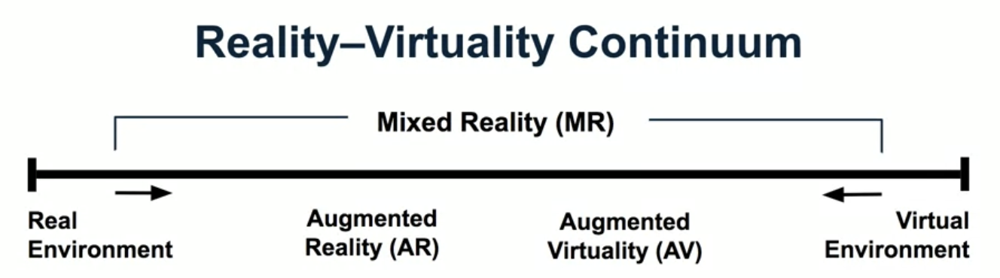

<h1 style="color: #ccc">Extended Reality for Everybody Specialisation</h1>

# XR Terminology

Nov 14, 2024

## Course Overview

1.  This introductory course offers an overview of essential technical terms, enabling technologies, and primary applications in XR. You will develop a clear understanding of the strengths and limitations of various XR technologies and their applications. With this foundation, we will move into critical analysis, examining current trends and major issues in the field. Finally, we will explore the future of XR, discussing its potential opportunities and challenges, including social and ethical implications, accessibility and equity concerns, and privacy and security issues.

## Module Overview

1.  This module will clarify the various concepts related to XR and provide a brief overview of the associated technologies. Understanding the unique characteristics and applications of AR, VR, and MR is essential for grasping their potential and limitations.

2.  In the honours track, you will learn how to explore and evaluate an AR experience, placing it along the reality-virtuality continuum. This continuum is a key concept for categorising applications within the broad spectrum of mixed reality technologies, enhancing our overall understanding of the XR space.

## What is XR?

1.  Virtual Reality vs. Augmented Reality

    **VR**: Replaces Reality

    -   Creates a fully computer-generated virtual environment.
    -   No view of the real world; users only see the virtual environment.
    -   **R** = *synthetic world*

    **AR**: Enhances Reality

    -   Blends virtual elements with the physical world.
    -   Provides a composite view that combines both real and virtual elements.
    -   **R** = *real world*

2.  Virtual Reality

    -   Emphasises **autonomy and agency** 
        Uses head-tracking and the body as input to enhance user control. Agency describes the sense that when you do something, the virtual world responds the way you would expect. Autonomy is about your freedom within the world.
    -   Provides **natural interaction** 
        Supports gestures (through controllers, hands, and fingers) and speech for intuitive interaction.
    -   Gives a **sense of presence** 
        Offers an immersive, multi-sensory experience that includes visual, audio, haptic, and even olfactory (smell) feedback to deepen the sense of realism.

3.  Augmented Reality

    -   **Merges real and virtual objects** 
        Creates a composite view that integrates virtual elements, such as visual and audio overlays, with the physical world.
    -   Enables **real-time interaction** 
        Supports explicit interaction, like gestures and speech (similar to Virtual Reality), as well as implicit interaction, such as head-tracking through the camera to ensure virtual content stays anchored in the real world.
    -   **Aligns real and virtual objects spatially** 
        Ensures that virtual objects are accurately positioned and aligned with real-world objects, so that they appear seamlessly integrated within the physical world.

4.  Mixed Reality

    >   

    The concept of the reality-virtuality continuum, introduced by Milgram et al. in their seminal paper, spans the range from real world (with no digital augmentation) to a fully virtual environment (completely computer-generated content).

    -   **Augmented Reality (AR)** occurs when virtual elements are added into physical world, while the real world remains dominant in the user's perception.
    -   **Augmented Virtuality (AV)**, a less commonly used term, is essentially the reverse of AR. In AV, the experience is primarily virtual, but real-world elements are integrated, creating an environment that is mostly virtual but includes some physical components. This concept moves closer to a fully virtual environment.

    **Mixed Reality (MR)** covers a large portion of this continuum, as it includes both AR and AV. However, Milgrams' original definition of MR does not encompass fully virtual environments (virtual reality). Therefore, mixed reality can be understood as a blend of the physical and virtual worlds, with varying degrees of augmentation.

5.  Terms

    -   **V**R = **Virtual** Reality (computer-generated virtual world)
    -   **A**R = **Augmented** Reality (enhanced physical world)
    -   **M**R = **Mixed** Reality (includes AR + AV, usually not VR)
    -   **X**R = **Extended** Reality (**X** is wildcard for **A**, **V**, or **M**)

## XR Technology Landscape

1.  Four classes of XR technology

    **Devices**

    -   Standalone/Built-in 
        *Quest, HoloLens, ...*
    -   Tethered/Adapter 
        *Cardboard, Rift, Vive, ...*

    **Platforms**

    -   Specific 
        *Oculus, Vive, Magic Leap, ...*
    -   Cross-platform 
        *SteamVR, WMR, WebXR, ...*

    **Applications**

    -   XR apps 
        *Beat Saber, Snapchat, ...*
    -   Apps with XR views/modes 
        *IKEA, Amazon Shopping, ...*

    **Tools**

    -   Design 
        *Tilt Brush, Quill, Aero, Apple Reality Composer, ...*
    -   Development 
        *A-Frame, Unity, Unreal, ...*

2.  VR platforms and devices

    -   StreamVR/WebXR (cross-platform)
    -   Oculus (Oculus Store)
        -   Rift
        -   Go
        -   Quest
    -   HTC (Vive Port)
        -   Vive
        -   Vive Pro
    -   WMR (Windows Store)

3.  AR platforms and devices

    -   WebXR (cross-platform)
    -   ARKit (Apple Store)
        -   iPhone
        -   iPad
    -   ARCore (Play Store)
        -   Android devices
    -   WMR (Windows Store)
        -   HoloLens

## Terminology & App Selection

## Concepts & Tech Selection

## Trends & Issues

## Strategy
